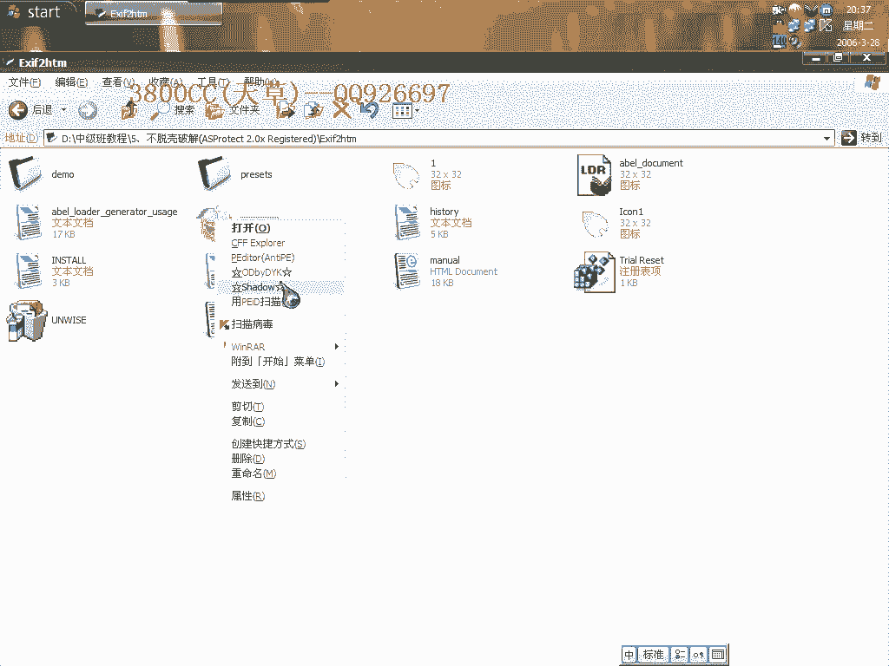
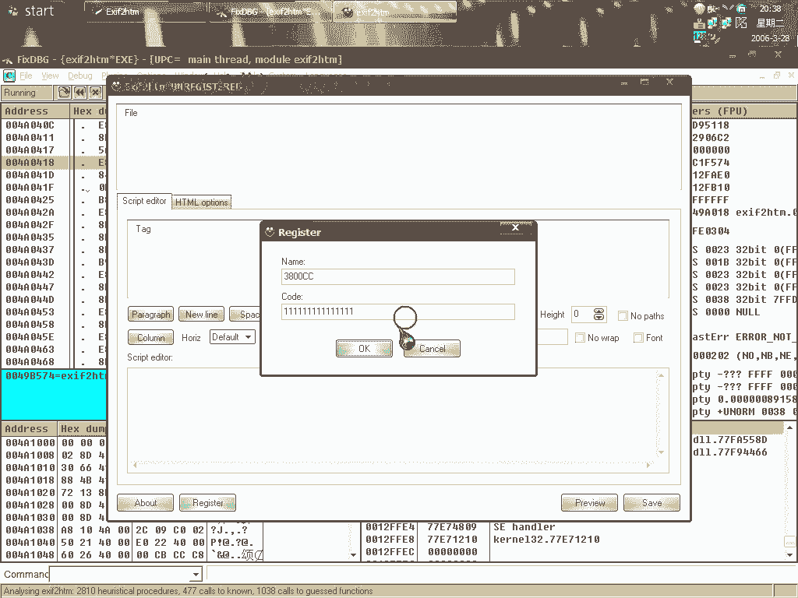
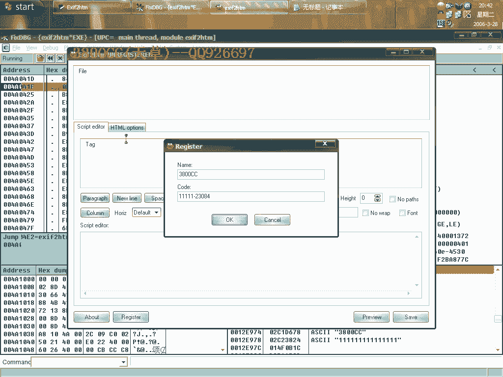
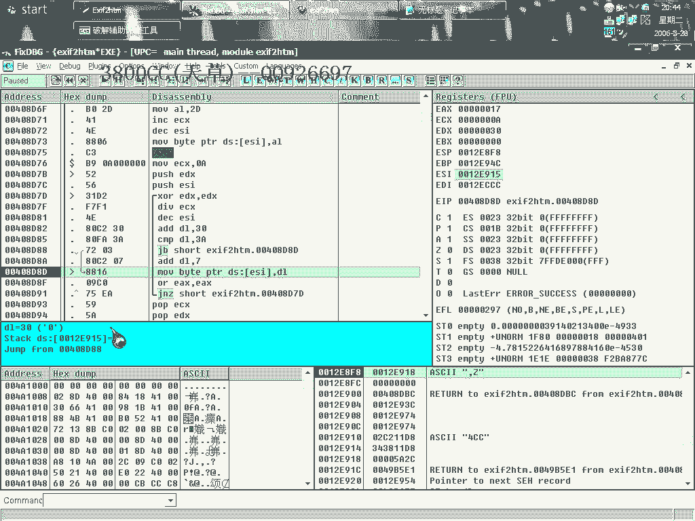
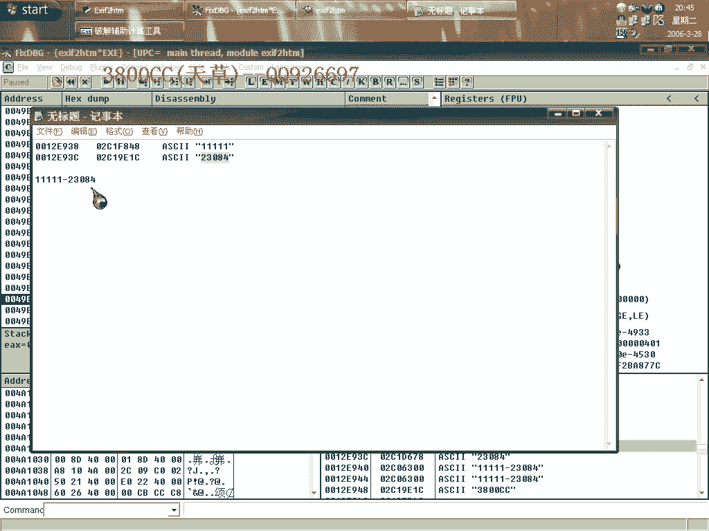
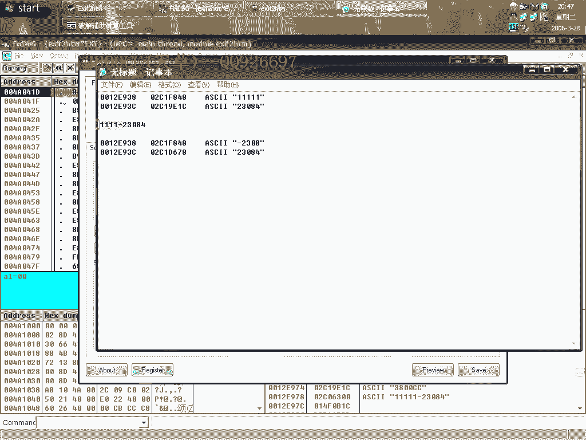
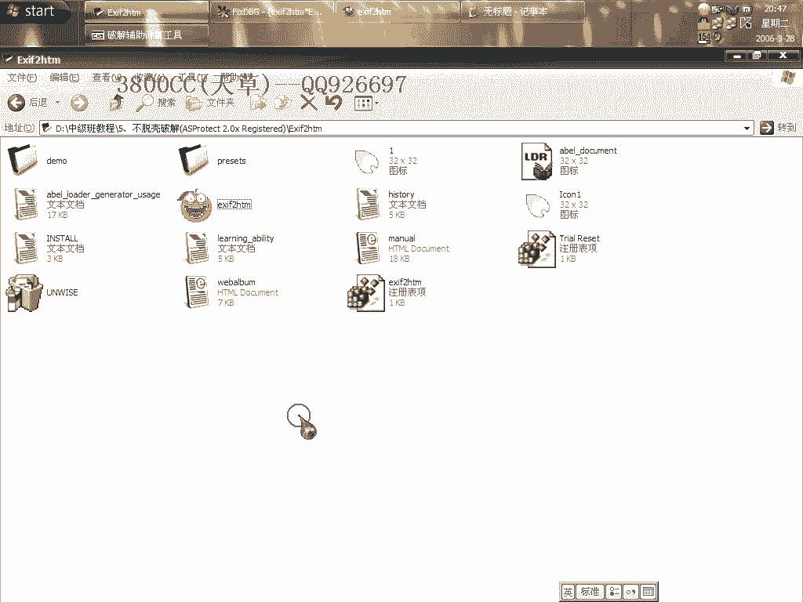
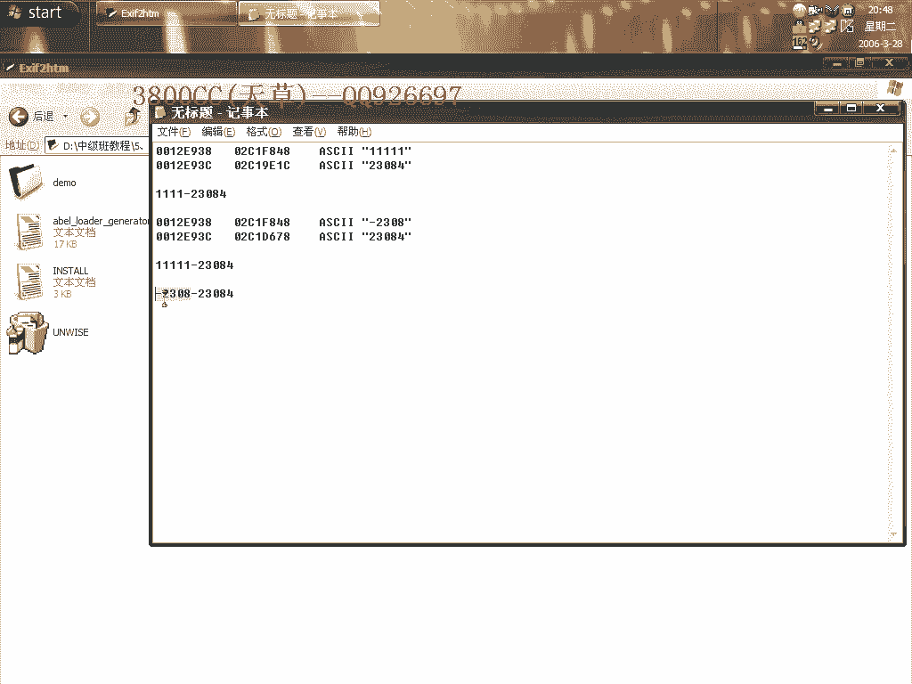
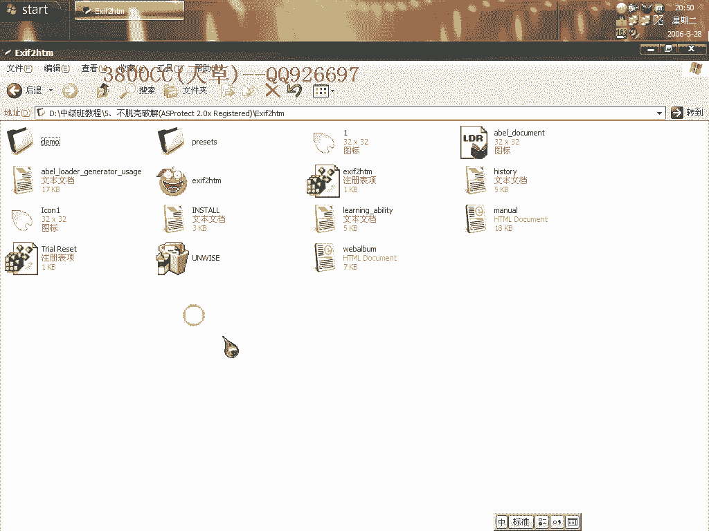

# 天草中级班 - P5：第05课 - 白嫖无双 - BV1qx411k7kd 🔓

在本节课中，我们将要学习如何对一款名为“OSPROC 2.0”的软件进行不脱壳破解。该软件包含多种校验机制，如CRC校验和内存校验，破解过程具有一定的挑战性。我们将通过动态调试，逐步分析其注册算法，并最终找到有效的破解方法。

---

## 软件初步分析 🧐

上一节我们介绍了课程目标，本节中我们来看看目标软件的基本情况。软件启动后，会显示剩余题目数量等信息，并包含3800CC等提示字符串。这表明软件存在功能限制，需要正确的注册码才能解锁。

软件还包含CRC校验和内存校验等保护措施，直接运行会提示剩余题目数量。我们的目标是绕过这些保护。

---

## 定位关键代码与算法 🔍

现在我们需要对软件进行分析。首先，在反汇编工具中搜索参考字符串，例如“seo.dus”，以定位到可能与注册验证相关的代码区域。

在代码中，我们发现了“注册成功”的字符串。在其附近找到一个关键的函数调用（`CALL`），这是验证逻辑的核心。我们在此处下一个硬件执行断点，然后运行程序并输入一个测试注册码，使程序中断在此处。

---

## 分析第一段算法 🔢

进入关键函数后，我们开始分析其算法。以下是算法的主要步骤：

1.  **初始化**：将字符串“3800CC”的地址放入`ECX`寄存器。`EDX`寄存器的初始值设为1（经过一次循环后变为2）。
2.  **循环计算**：算法进入一个循环。在循环中：
    *   计算 `EDX - 1`。
    *   根据结果，从`ECX`指向的字符串中取出特定位置的字符（例如第二位）。
    *   将字符的ASCII码值（十六进制表示，如‘3’变为0x33）进行累加，结果存入`ESI`寄存器。
3.  **循环控制**：`EAX`寄存器控制循环次数，它从字符串的末尾（第六位）开始向左移动。`EDX`则从字符串开头向右移动。两者相向而行，确保每个字符都被处理。
4.  **结果处理**：累加完成后，将累加值（`ESI`）与`EAX`相乘，结果存入`EAX`。例如，计算后`EAX`的值变为`0xB459`（十进制为46169）。

---

## 分析第二段算法与注册码变换 🔄

上一节我们分析了初步的数值计算，本节中我们来看看算法如何生成最终的注册码比对值。程序继续执行，会进入另一段算法。

1.  **数值变换**：程序对之前计算出的数值（如46169）进行进一步处理。例如，通过除以`0xA`（十进制的10）等操作，得到一个新的数值`23084`。
2.  **字符转换**：程序将这个数值（如23084）的每一位数字转换为对应的字符。例如，数字`2`、`3`、`0`、`8`、`4`会被分别处理。
3.  **循环拼接**：在一个循环中，程序依次取出这些数字字符，并与一个基准值（如`0x3A`）进行比较和运算，最终拼接成一个字符串。这个过程在堆栈上进行。

最终，算法生成了用于比对的字符串“23084”。

---

## 验证逻辑与破解关键 🗝️

算法执行完毕返回后，程序开始验证我们输入的假注册码。它计算假注册码的长度和特征，并与算法生成的结果进行比较。

一个关键的发现是：程序将注册码中的“-”减号也当作一位有效字符进行计算。例如，对于假注册码“123-23084”，程序可能将其识别为9位字符进行处理。

如果我们删除假注册码中“-”前面的部分字符（例如，删除第一个“1”），使“-23084”这部分字符串的**长度和特征**与算法生成的“23084”匹配，程序就会判断为注册成功。

注册成功后，软件会在目录下生成一个`K`文件（如`obot 3800cc.k`），其中包含了用户名和注册码信息。

---

## 破解方法总结与实践 ✅

以下是基于以上分析的破解步骤：

1.  **输入任意假注册码**：在软件注册框中，输入一个格式为“任意字符-23084”的假注册码。例如“aaaa-23084”。
2.  **调整长度**：通过删除“-”前面的部分字符，使“-”及其后面的“23084”总长度符合程序的预期。经过测试，保留“-23084”这5位字符即可。
3.  **验证成功**：输入调整后的注册码（如“-23084”），点击注册，软件提示成功并生成`K`文件。

进一步实验发现，`K`文件中的注册码部分其实是**由用户名计算得来**，而我们输入框中的“注册码”只是触发了算法并提供了一个比对基准。我们甚至可以手动创建一个符合格式的`K`文件（例如，内容为`用户名`和`-23084`），将其放入软件目录，也能实现绕过注册验证的效果。

---

## 课程总结 📚

本节课中我们一起学习了针对“OSPROC 2.0”软件的不脱壳破解。我们通过动态调试，逐步分析了其两段式注册验证算法，发现其验证逻辑存在缺陷：程序对注册码中“-”符号的处理方式以及最终的比对逻辑，允许我们通过构造特定格式的字符串（`-23084`）来绕过验证。核心的破解思路是**利用算法生成的固定字符串“23084”作为注册码的后缀，并通过调整前缀长度来满足程序的校验规则**。

