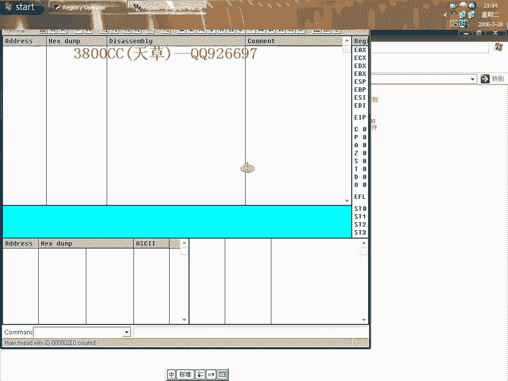
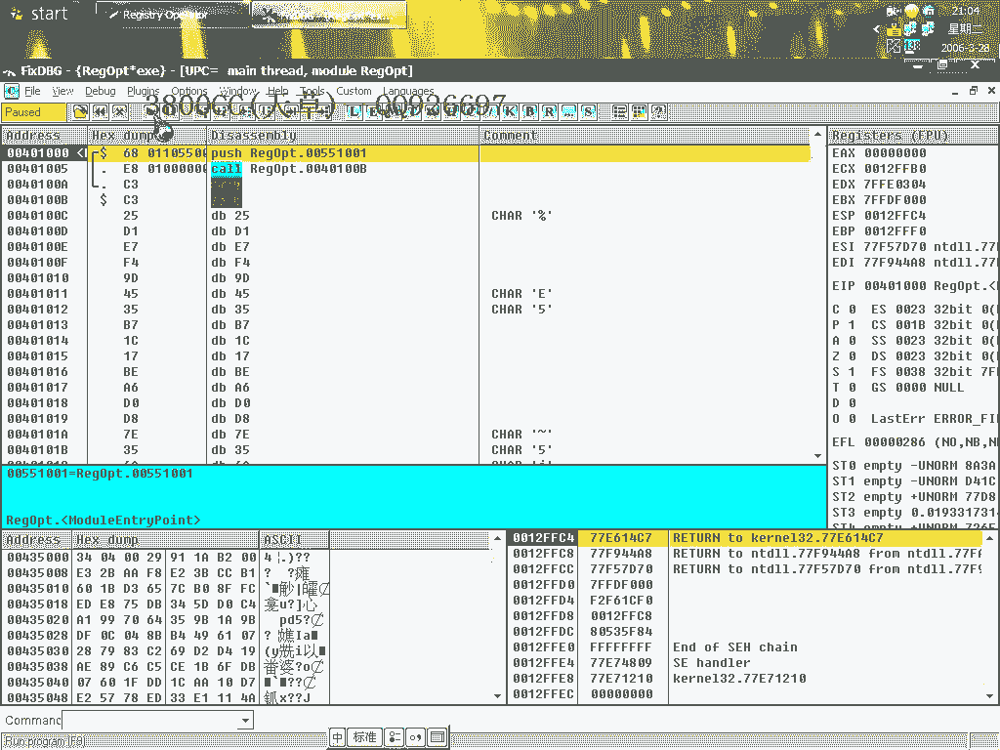
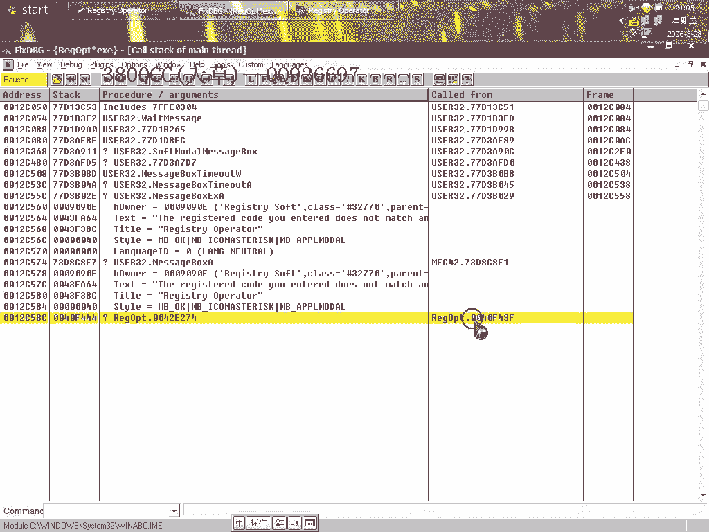
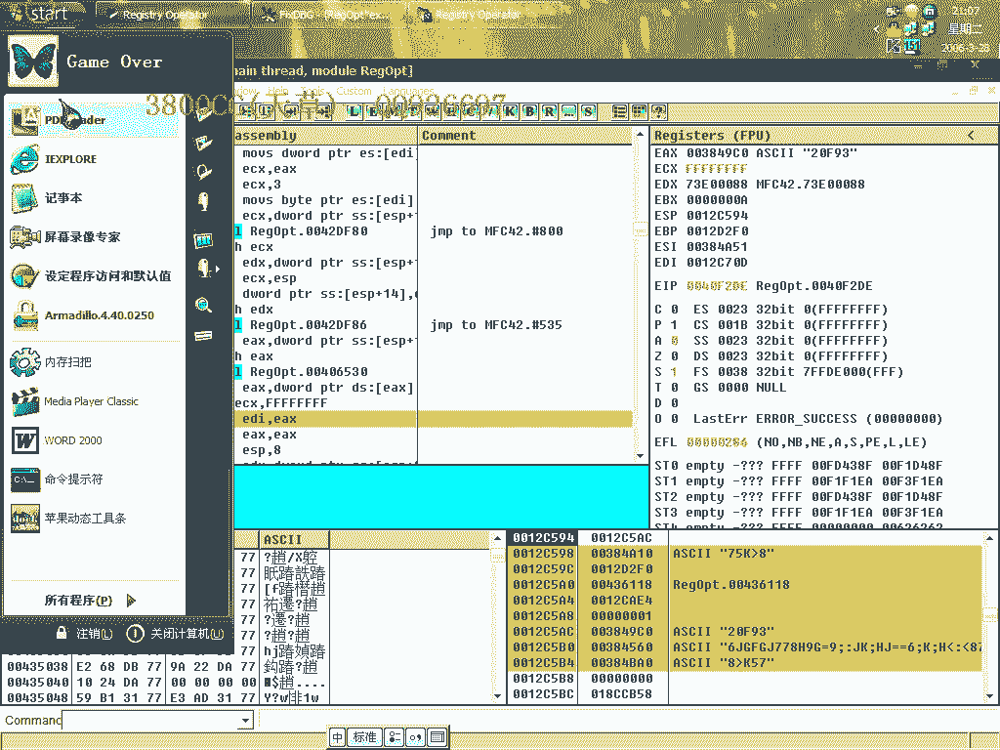
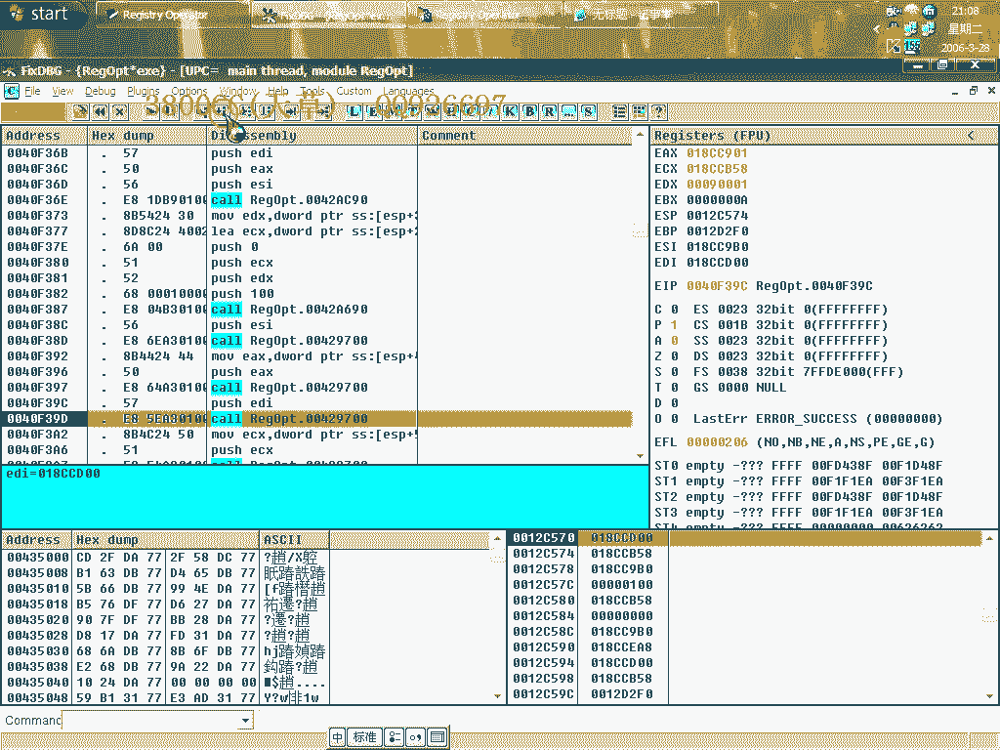
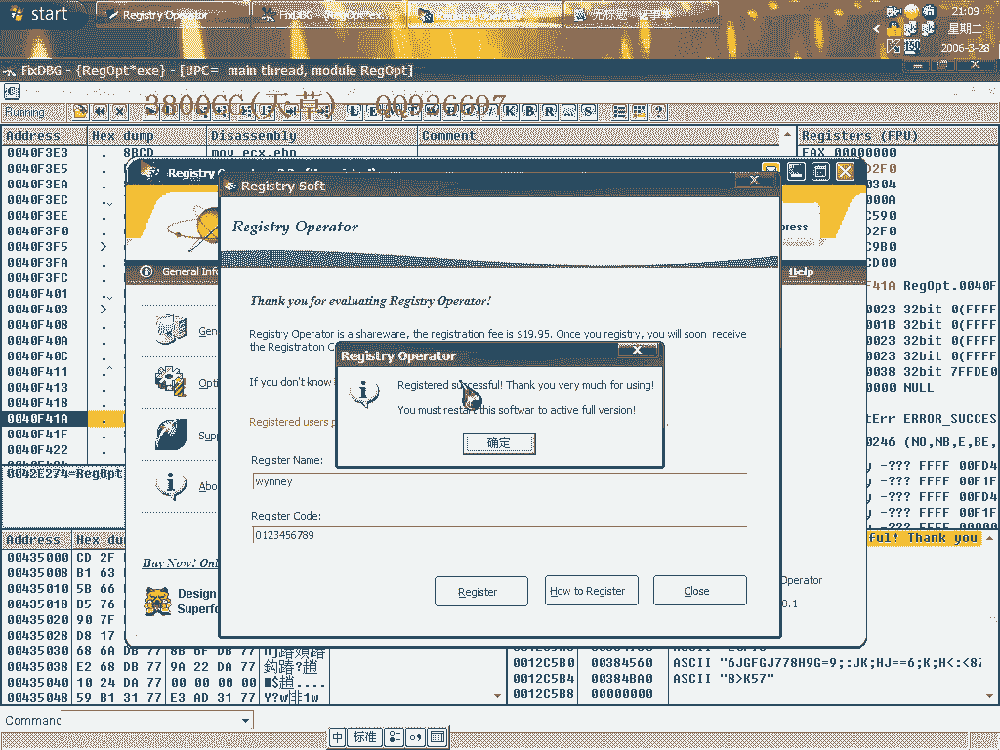
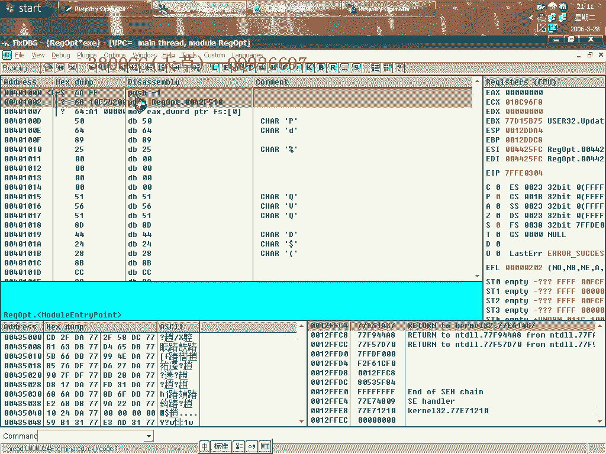
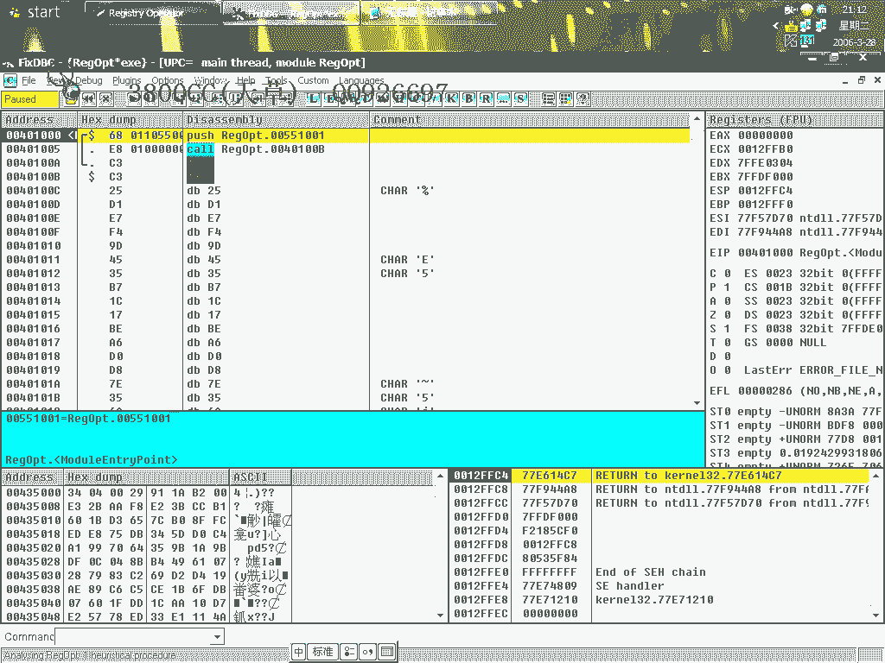
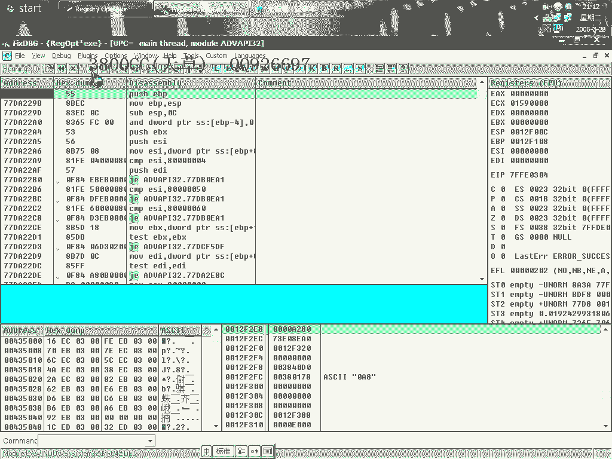

# 天草中级班 - P6：第06课 - 白嫖无双 🛡️

在本节课中，我们将学习如何对一个加壳的程序（OSPRUG2.X）进行不脱壳破解。我们将使用OllyDbg（OD）进行动态调试，分析其重启验证机制，并最终通过制作内存补丁来绕过注册验证。

---

## 概述与程序载入

首先，我们使用OllyDbg直接载入目标程序，并忽略所有异常提示。

载入后，我们隐藏OD窗口，然后直接运行程序。

程序运行后，我们点击“Register”按钮进入注册分析界面。这一步的分析是必不可少的。

---

## 初步分析与关键跳转定位

我们在代码中找到了一个关键位置，并在此处下断点。按F9运行后，程序在此中断。

接着我们单步执行。如果未输入用户名和注册码，程序会提示输入；输入后则跳过提示。程序会计算注册码，但我们直接继续执行。

执行过程中，程序放入了一系列字符串。由于程序带壳，直接查看算法可能不准确。

我们尝试使用这些字符串作为注册码，但后续比较显示它们是无效的。

程序最终显示“You must restart”，然后退出。这表明该软件属于**重启验证型**，直接修改内存提示无法完成注册。

---

## 转换思路：分析字符串与API

由于直接寻找注册码行不通，我们转换思路。在OD中查找字符串，发现与注册表相关的信息。

我们将其添加到分析列表。由于当前位于系统模块，我们需要切换到程序模块。

重新分析后，成功查找到有用字符串，其中包含“注册表”关键词。对于重启验证型软件，通常需要拦截其读写注册表的API。

由于程序加壳，使用`Ctrl+N`查找API可能失败。我们需要使用OD的插件“API Break”来下断点。

设置好插件并隐藏OD后，按F9运行程序，并注意观察与注册表相关的API调用。

---

## 动态调试与关键逻辑分析

程序多次中断后，我们来到了一个关键调用。按`Alt+F9`返回到程序领空。

在返回的代码中，我们看到了程序界面上的一些选项，如“Backup”、“Compression”等。

继续按F9运行并返回，我们最终来到了验证用户名的关键代码段。

以下是关键的分析点：
1.  代码对用户名和注册码进行检测。
2.  一个关键跳转指令`JNZ`决定了BL寄存器的值。
    *   如果跳转发生，则 `BL = 0`
    *   如果跳转不发生，则 `BL = 1`
3.  由于当前未注册，程序会执行跳转，导致`BL=0`，从而走向失败流程。

我们的目标就是**修改这个关键跳转**，使其不跳转，从而让`BL=1`。

修改后继续执行，程序成功显示已注册信息，并写入了注册表。

---

## 制作内存补丁

找到关键地址后，我们需要制作一个持久化的补丁。我们使用一款补丁工具。

1.  新建工程，选择目标程序。
2.  在编辑模式下，选择“Virtual Address”（虚拟地址）模式，因为程序加了壳。
3.  添加需要修改的地址。我们将关键跳转指令`JNZ (操作码 75)`改为`NOP (操作码 90)`。
    *   地址1: `0x5425` 处的 `75` 改为 `90`
    *   地址2: `0x5426` 处的 `04` 改为 `90` (此处的04是跳转偏移的一部分，同样nop掉)
4.  保存修改。

补丁工具提供两种加载器：
*   **普通型Loader**：生成一个.exe文件，运行它即可启动已打补丁的程序。
*   **安装型Loader**：生成一个安装程序，运行后会创建快捷方式，以后通过该快捷方式启动程序。

我们可以通过工具的“Setting”选项自定义补丁程序的图标。

---

## 总结

本节课中，我们一起学习了针对加壳且采用重启验证机制软件的破解方法。

1.  **动态调试**：使用OD载入程序，通过API断点定位关键验证代码。
2.  **逻辑分析**：分析了决定注册状态的**关键跳转** `JNZ` 及其对 `BL` 寄存器的影响。
    *   核心逻辑：`BL = (JNZ不跳转) ? 1 : 0`
3.  **修改与验证**：将关键跳转改为`NOP`，使程序走向注册成功分支。
4.  **制作补丁**：使用补丁工具，将内存修改固化为文件补丁，并生成了两种类型的加载器。

这种方法的核心在于绕过验证逻辑，而非破解算法，适用于许多重启验证型软件。

