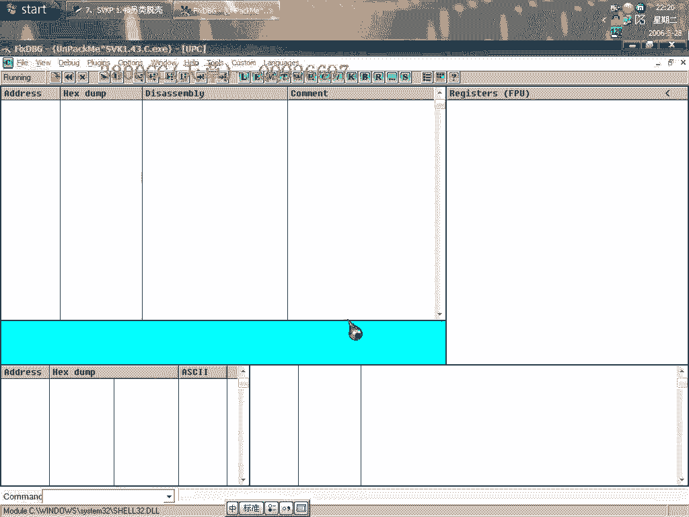
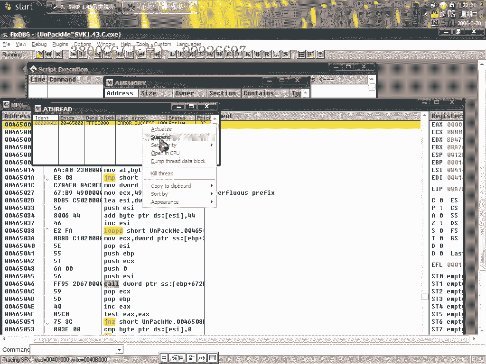
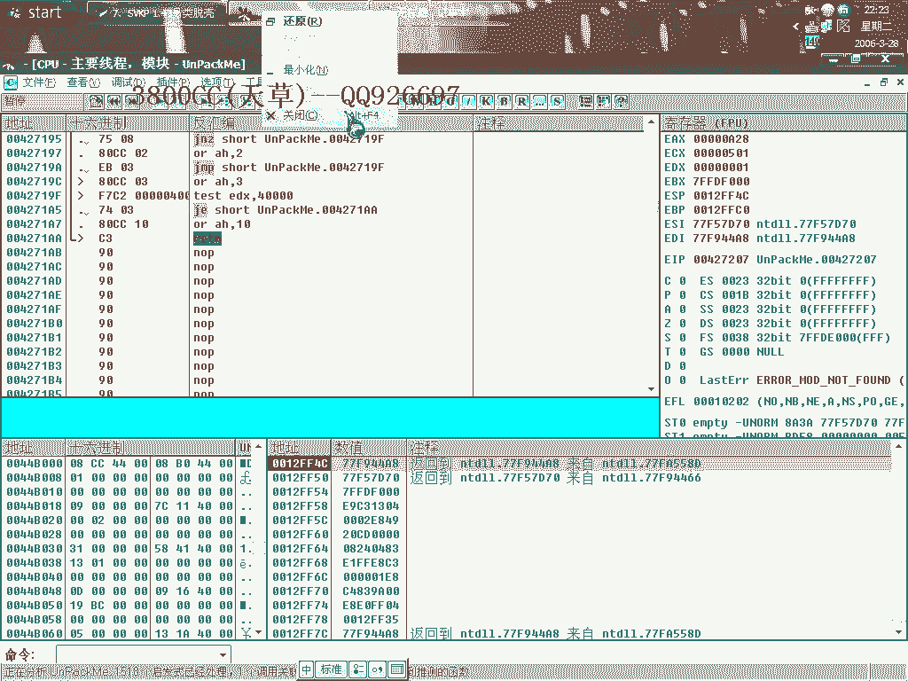
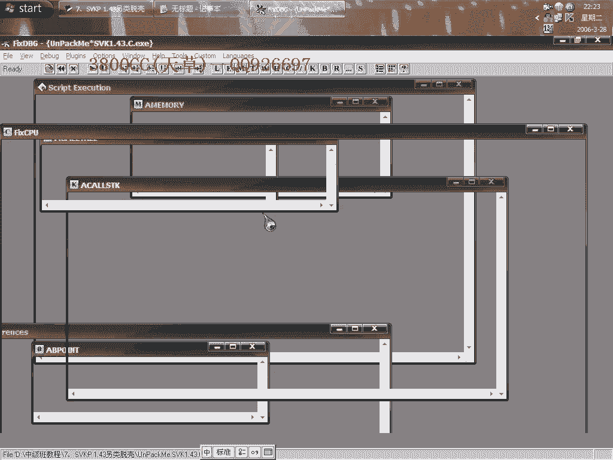
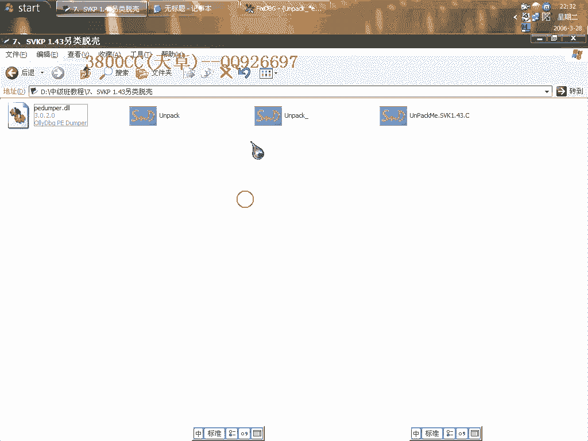
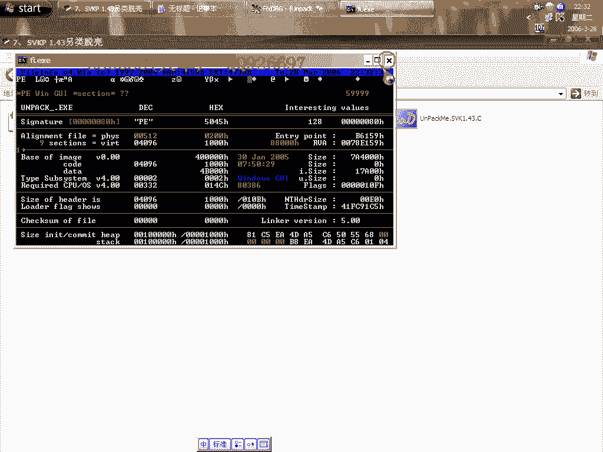
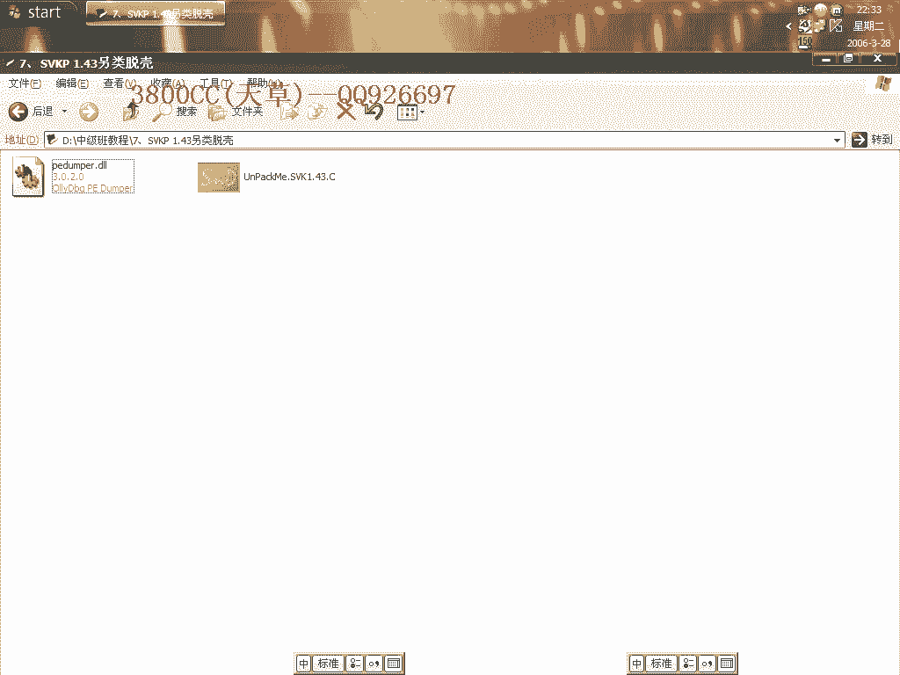

# 天草中级班 - P7：第07课 - 白嫖无双 - BV1qx411k7kd

大家好，现在进行我们的第七课，SVKP 1。43这样的一个托课，这个呢是一个off-commit，然后呢，关于这个课说一下，他算是在抽取StoneCode的时候，就是抽取字节代码的时候。

他是所有的课里面抽得最厉害的，我原先就是说在托他的1。32版本这个课的时候，那个课被抽了106个字节，106个字节是什么概念呢？就是说他把程序头的31行全部抽光了，31行代码，这个呢就稍微稍微好一点点。

这个例子稍微好一点点，但是我们今天呢，用另外一种方法来托他，就叫做另类托课，我们不找StoneCode的，但是呢，我们就是用添加区段的方法，关于这个添加区段，像看学里面的那个，有一个谁啊。

托那个ASprotect2。x的时候，他就用的是这种方法，思路差不多，我们用PID查的是1。3x，但是他其实是1。43，1。43c，算是一个比较新的，最高版本的了，而且呢，我们要用到这个托课插件。

大家把这个插件弄到OD的planes下面，那个插件目录下面，好，我们现在来托课，SVKP的这个课，他在载入的时候都有这么一个错误提示，我们呢，先首先，我们来找他那个OEP，就是偽OEP，就是假OEP。

被抽取了代码后，剩下的一个部分，怎么样呢，我们先忽略，用简单的方法来找吧，先忽略所有的异常，然后，选上这个SFX，里面选上第二个选项，好，再载入，这里呢，咱们重新来吧，大家看到了，一直在运行。

但是我这里是因为添加了，我看一下是哪个异常啊，是哪个异常，24异常吧，我把这个异常删掉，大家再来看一下，可能有的朋友会说，这个也是一样的啊，如果就是说，你的异常里面没有这么全的话，把这个给删掉。

忘记是哪个啊，他就会中途会有一个提示，就是说，ODP无法调试的一个提示啊。

好，重新来过，这个样子吧，我们换另外一个ODP来试一下，换中文版的，免得有的人要问，有那么一个提示怎么办呢，忽略所有的异常啊，然后跟踪这里面，好，就是这个，超出边界，列队边界线，这个时候呢，我们就这样。

先把它添加进去，81的，添加进去之后，然后Shift，大家看到啊，就是这么一个地址，我们把它记录下来，大家再往上面看，上面的loop，全部都是抽取的代码，我们来算一下，他被抽取了多少。

被抽取了多少个字节啊，这里是，1AB，我们来看一下，下面的那个呢，206，5B，那应该是51个啊，51个，被抽取了92个字节啊，92个，这个比我原先拖的那个稍微好一点点。

那我们就是说用另外一种另类的方法吧，不用这种方法了，不用直接找，要直接找的话，大家看一下，这肯定有20多行代码啊，找得我累死了。

这里把这个给设置回去，设置回去。

首先呢，取消内存访问异常和这个指定的，重新载入一下，然后呢，再隐藏一下OD，这个时候啊，单步走，下段点，硬件访问段点啊，DWORD，DWORD，然后SHIFT+F9，好，就终端在这里来了。

终端在这里来了，这个时候我们打开，大家看到有这个phard，咱们下内存访问段点，继续，好，终端在这个地方，我们这个时候呢，错了错了错了，抹错了，好，我们还是单步走吧，单步走，下硬件访问段点，好。

终端下来，咱们继续SHIFT+F9，到最后一次访问异常啊，咱们把这个给添加进去，这个，我已经添加进去了的啊，但是就是没有指定而已，好，这个INT1呢，就是内存访问异常了，最后一次内存访问异常。

这个时候啊，我们打开这里，同样的啊，下内存访问段点，就终端在这里了，这个时候我们取消啊，取消内存访问段点，但是硬件执行段点，硬件访问段点呢，先不要删了，然后继续SHIFT+F9，好，终端在这个地方了啊。

这个地方了，这个时候我们删掉硬件访问段点，好，这个时候呢，这个时候我们到，我们刚才找的那个，Voeb，Voeb里面去，好，这个代码回销了，我们删除一下，删除分析模块，好，就这里了。

我们在这个地方下普通FR段点，大家看清楚了啊，下好了，然后，这个CharacterInt2，这个时候就终端在这里了，终端在这里了，然后呢，我们的点，RunCharles里面的，就是说这个跟踪啊，跟踪。

因为从刚才的那个，我们硬件终端的那个位置，一直到这个位置啊，就是我们那个StoneCode的一个处理部分，一个处理部分，我们现在就是说，在这个地方下好段点了啊，刚才在那个地方停了之后。

在这个地方下好段点，再点这个，再用跟踪的方法啊，跟踪的方法，我们就大概可以看得到了啊，看得到一些StoneCode的一些东西了，好，点它，这个时候出来一个跟踪窗口，我们把这个调整一下啊，调整一下，好。

大家看到了，这是我们刚才收线的一个Project Add啊，一直到一直到，跟踪跟踪，大家看有很多，就是你可以从，就是说可以从这个地方，大家看到一直跟踪到这里嘛。

你可以从这些跟踪的这些数据里面可以分析出来，但是非常非常麻烦啊，大家看到了，它有些地址啊，像这些地址啊，看一下啊，像这个Eax啊，这么一些地址，你要把它分析出，就是说一些分析层，把它分析出来就是。

到底是哪一种地址啊，它这个是一个就是说系统的地址，我们把它分析出程序的地址，就借助上面的来分析，一个一个分析，非常难，非常非常麻烦，好，我们就不这样分析，用另类的方法啊，大家看到这里的Eax是这么多啊。

复制下来，因为要用到，Eax等于这么多啊，大家看到Project Add，然后再Call这一个，它开始处理了啊，最后是Project，Project，Project Eax，然后呢，这里的Eax就是说。

是在处理String Code的第一个地址啊，第一个地址，好，那我们就需要利用到它了，OK，这个时候取消断点吧，我们用插件，就是刚才的那个插件，这个插件啊，点这个啊，点一下，Get Map，大家看到啊。

这个地址是00B8，我们找到00B8，从这里开始，从这里开始的啊，我们点，选上这个B6啊，B6包含了B8嘛，包含了这里开始的啊，好，我们就是把它写成自己3800嘛，3800，OK，这里是添加区段啊。

添加区段，然后呢，再把下面一个区段也添加进去，CC，好，大家看到了，多了两个区段了啊，多了两个区段，这个时候啊，把这两个也选上，大家看到，选上之后这些位置都在变了啊，大家看到了啊，好，最后点。

Get EIP，EOP了，最后，Downport，Unpack，好，现在就是修复了啊，修复，把这个，加为OEP，好，点它，首先呢，用等级1来修复，大家再看一下啊，有19个无效的，这里呢。

有这个SVKP的这个指针，但是这个指针这个插件在我这里不能用啊，在我这里不能用，这有的记忆上可以用，我原先的一个记忆上可以用啊，好，大家可能会说这无效了怎么办呢，减掉？不能减掉的啊，不能减掉。

大家看到了这些指针的地址是B9啊，看一下，B6啊，B6，就是我们刚才那些，刚才就是添加进去的那些区段啊，添加进去的那两个区段，B9是第二个区段，是CC的那么一个区段，然后B8呢，B8，B6呢。

是我们添加的3800那个区段，我们都不要动它，就这样，就这样，点FIX，同时啊，这里要注意，这三个都要去掉啊，好，它虽然提示说IT啊，仍然有无效的，我们不用管它，不用管它，大家来看一下，不能运行啊。

不要着急啊，不要着急，大家看，刚才我们用到了这么一个地址，这是StoneCode的一个处理的开始的地址，我们现在把OEP改成这里的，00401234，OK，我们就打开load PE啊，选上它。

入口点改成这个，点保存，最后呢，要用到重建PE，在用重建PE的时候啊，把这里设置一下，这边只能选上验证PE，其他都不能选，不然验证出来的东西就用不了啊，用不了，这个要注意，只能选这一个，重建PE。

选上脱壳修复后的文件，大家看一下，可以运行的啊，可以运行的，但是我们来用PEID来查一下，显示为这么一个壳，其实它是没有壳的啊，没有壳的，只是就是说入口被我们改了，入口被我们改了。

并不是说真正的一个语言，像我说的那种五种程序语言那样的入口，所以PEID是无包啊，我们可以用那个FI来查一下，这也是查不出来的啊。

查不出来的啊，大家看到这3800啊，就是我刚才那个区段。

就是说程序运行的时候，首先是从这两个区段开始运行的，然后再调用其他的啊，这样我们刚才所说的19个无效指针，它都会自动调用这个里面的一些数据，因为这都没动啊，我们没有动它里面的东西，就是这个样子的东西了。

我们可以来看一下啊，这里面查找不到啊，这个样子就可以查得到了，就是只有这么一些了，只有这么一些东西了，脱口成功，今天这个课程就到这儿啊，就到这儿，大家可能现在感觉有点难啊，有点难。

但是这个是最基本的一个处理方法了，我们后面呢，我后面再给大家讲一下我所说的那个，被抽了106之间的那个啊，那个分析起来是相当相当麻烦的啊，好，再见。

