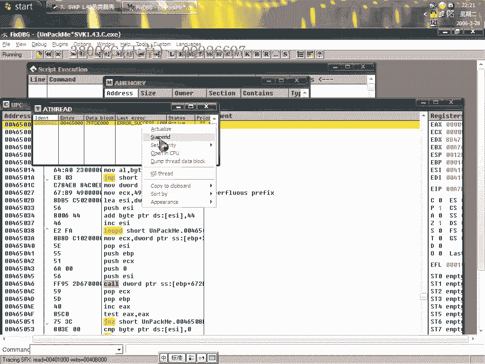
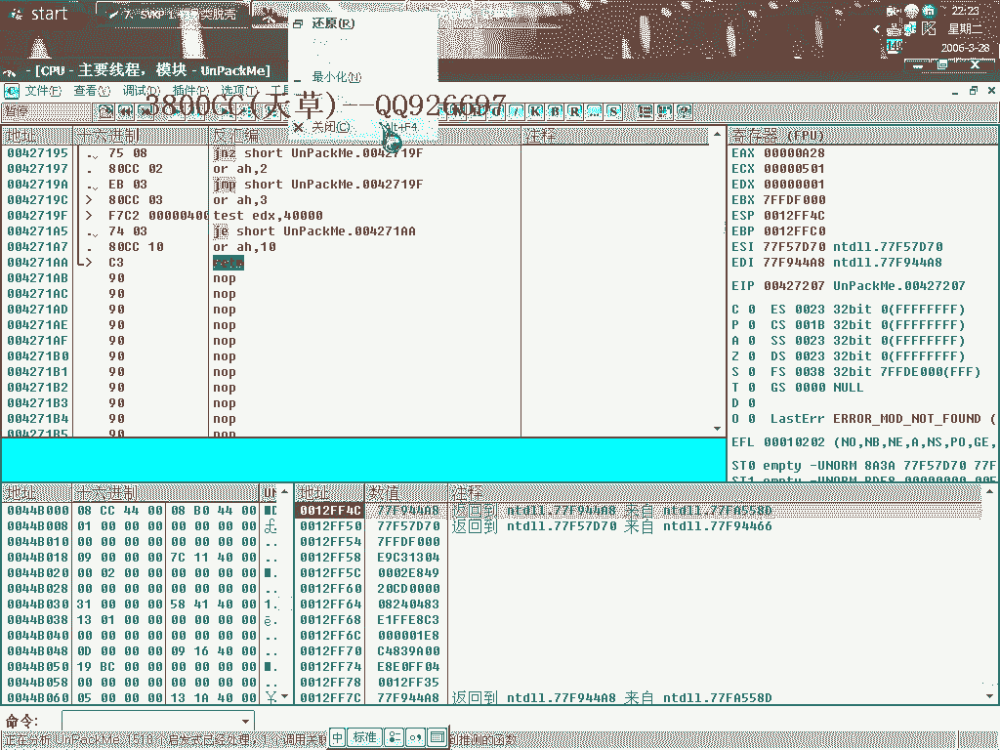
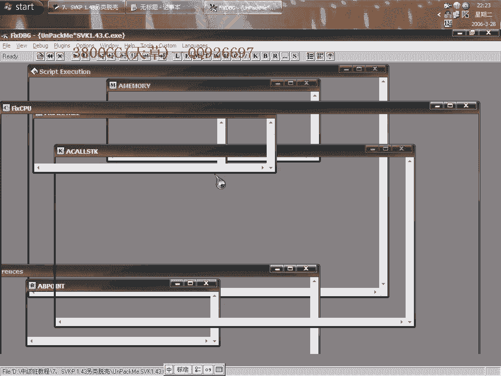
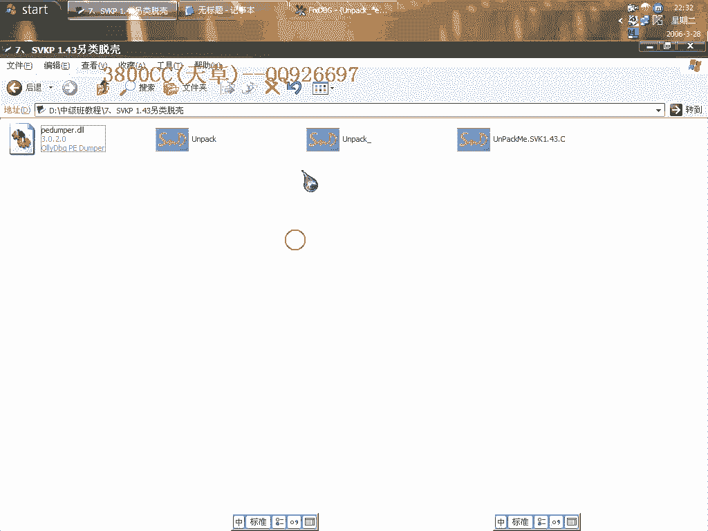

# 天草中级班 - P7：第07课 - 白嫖无双 - BV1qx411k7kd 🛡️

在本节课中，我们将要学习如何对 SVKP 1.43 壳进行脱壳。这是一个使用“另类脱壳”方法的教程，核心思路是通过添加区段来修复被抽取的代码，而不是直接寻找和修复 Stolen Code。我们将使用特定的插件，并详细讲解每一步操作。

---

## 课程概述 📋

SVKP 1.43 是一个在抽取 Stolen Code（字节代码）方面非常激进的壳。本次课程将演示一种不直接处理 Stolen Code 的脱壳方法，即“添加区段法”。我们将使用 OllyDbg（OD）和一个专用脱壳插件来完成此过程。

---

## 准备工作 🛠️

在开始脱壳之前，需要完成以下准备工作。

以下是必要的准备工作列表：
*   将专用的脱壳插件放置到 OllyDbg 的插件目录（`plugins`）下。
*   确保 OllyDbg 的异常设置已根据后续步骤进行调整。

---

## 寻找伪OEP 🔍

上一节我们介绍了准备工作，本节中我们来看看如何定位程序的伪OEP（原始入口点）。

载入目标程序后，通常会遇到错误提示。我们首先需要找到被抽取代码后剩余的伪OEP部分。

以下是寻找伪OEP的步骤：
1.  在 OllyDbg 中设置“忽略所有异常”。
2.  在 `SFX` 选项卡中选择第二个选项。
3.  重新载入程序。程序可能会持续运行或触发异常。
4.  如果遇到“超出边界”等异常，将其地址添加到异常列表并记录。
5.  通过计算异常触发地址附近的代码范围，可以估算出被抽取的字节数。本例中约为92个字节。

直接在此处分析和修复被大量抽取的代码非常繁琐，因此我们将采用另一种方法。

---

## 另类脱壳：添加区段法 🧩

上一节我们尝试了寻找伪OEP，本节中我们来看看核心的“添加区段法”是如何工作的。

此方法的思路是：跟踪壳对 Stolen Code 的处理过程，获取其内存地址，然后通过插件添加新区段来“容纳”这些代码，最后修复导入表并重建程序。

以下是“添加区段法”的详细步骤：

1.  **设置调试环境**：取消“内存访问异常”选项，并隐藏 OllyDbg 调试器。
2.  **下硬件断点**：在代码段下 `硬件访问` 断点（`DWORD` 类型），然后按 `SHIFT+F9` 运行。
3.  **跟踪内存访问**：程序中断后，在数据窗口跟随 `EAX` 或 `EDX` 寄存器指向的地址，并下 `内存访问` 断点。继续按 `SHIFT+F9` 运行，直到触发最后一次内存访问异常。
4.  **定位代码处理循环**：删除硬件断点，在最后一次异常附近单步跟踪。找到一个 `CALL` 指令，该指令通常负责处理 Stolen Code。在此处下普通 `F2` 断点。
5.  **使用跟踪功能**：运行程序至断点处，然后使用 OllyDbg 的“运行跟踪”功能。在跟踪日志中，可以观察到壳正在处理和写入 Stolen Code 的过程。记录下关键的内存地址（例如 `EAX` 中的值），这通常是 Stolen Code 被还原到的起始地址。
6.  **使用插件添加区段**：
    *   打开脱壳插件，点击 `Get Map` 获取内存映射。
    *   根据上一步记录的关键地址，在映射中找到对应的区段。例如，地址 `00B8xxxx` 对应区段 `.00B6`。
    *   使用插件的“添加区段”功能，为关键地址所在的区域（如 `.00B6`）及其后续可能相关的区段（如 `.00CC`）添加新的、空的区段。可以设置区段大小为 `0x3800`。
7.  **修复程序**：
    *   在插件中点击 `Get EIP` 获取当前指令指针，然后点击 `Dump` 或 `Unpack` 脱壳。
    *   在修复窗口中，将 OEP 修改为我们之前找到的、处理完 Stolen Code 后的正确入口地址（例如 `00401234`）。
    *   使用插件的“修复导入表”功能（例如 Level 1）。修复后可能会提示一些“无效指针”，这些指针通常指向我们新添加的区段（如 `.00B6`, `.00B9`），**不要删除它们**，直接点击 `Fix`。
8.  **重建可执行文件**：
    *   使用 `LordPE` 等工具修改脱壳后文件的入口点（Entry Point）为正确的 OEP。
    *   最后，使用 `LordPE` 的“重建 PE”功能。**关键点**：在重建选项中，**只勾选“验证 PE”**，其他选项不要勾选，否则生成的文件可能无法运行。

完成以上步骤后，即可得到一个已脱壳、可运行的程序。虽然部分查壳工具可能仍会显示有壳或识别错误，但这只是因为入口点被修改过，程序本身已成功脱壳。

---

## 课程总结 🎯

本节课中我们一起学习了针对 SVKP 1.43 壳的“另类脱壳法”。

我们首先了解了 SVKP 壳会大量抽取原始代码（Stolen Code）。接着，我们没有采用直接分析并修复这些代码的传统方法，而是通过动态跟踪，定位壳自身修复代码的逻辑和内存位置。然后，利用专用插件添加新的区段来“接收”这些被还原的代码，最后通过修复导入表和重建 PE 文件来完成脱壳。

这种方法的核心优势在于规避了手动分析和修复大量 Stolen Code 的复杂过程。虽然步骤较多，但对于此类激进抽取代码的壳，这是一种非常实用且高效的解决方案。