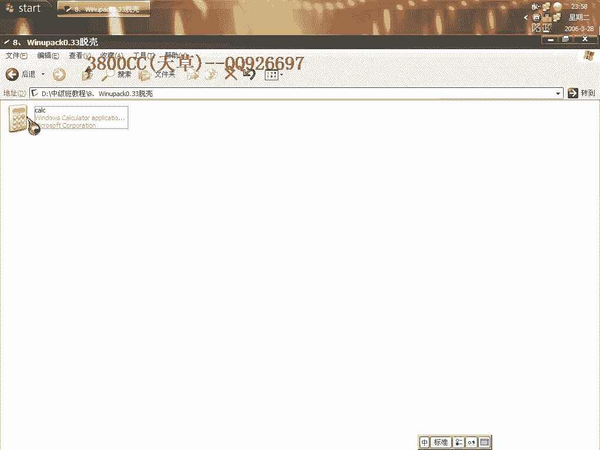
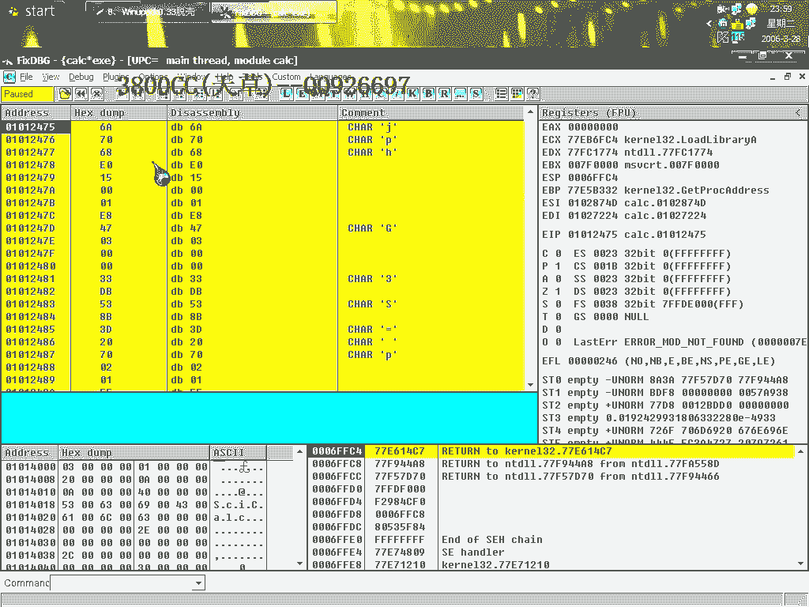
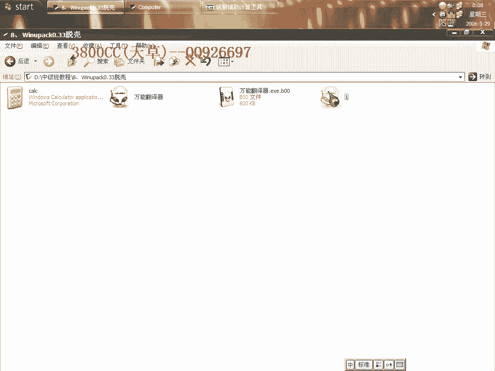
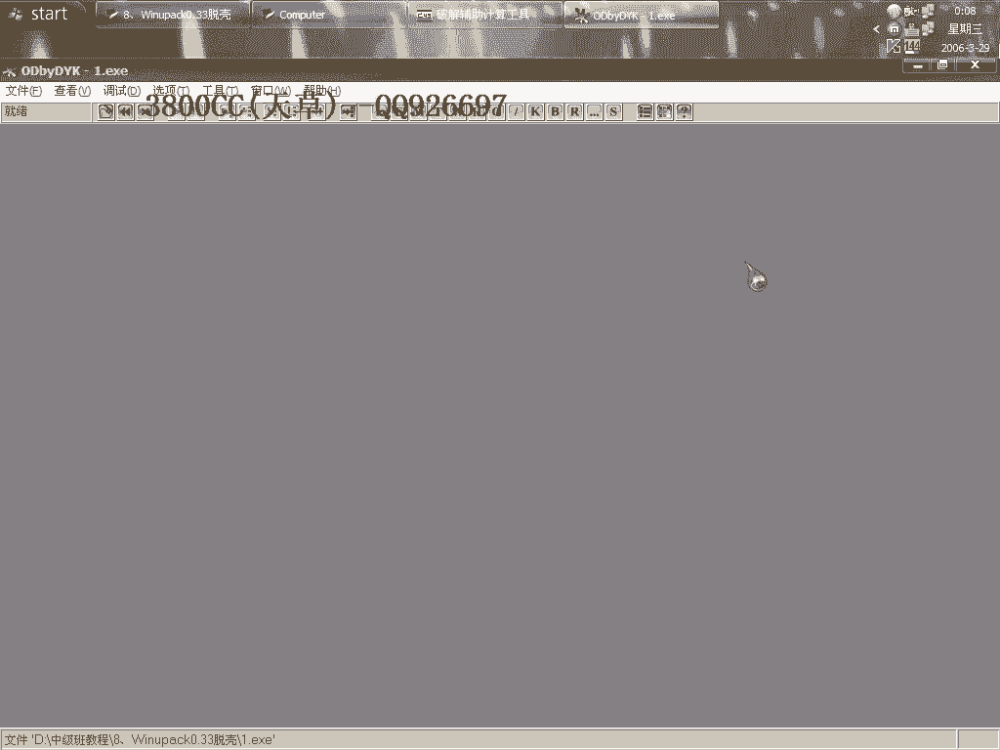
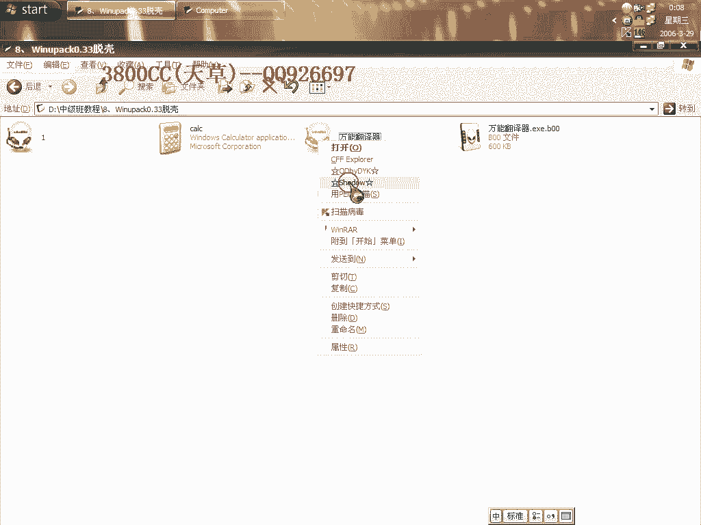
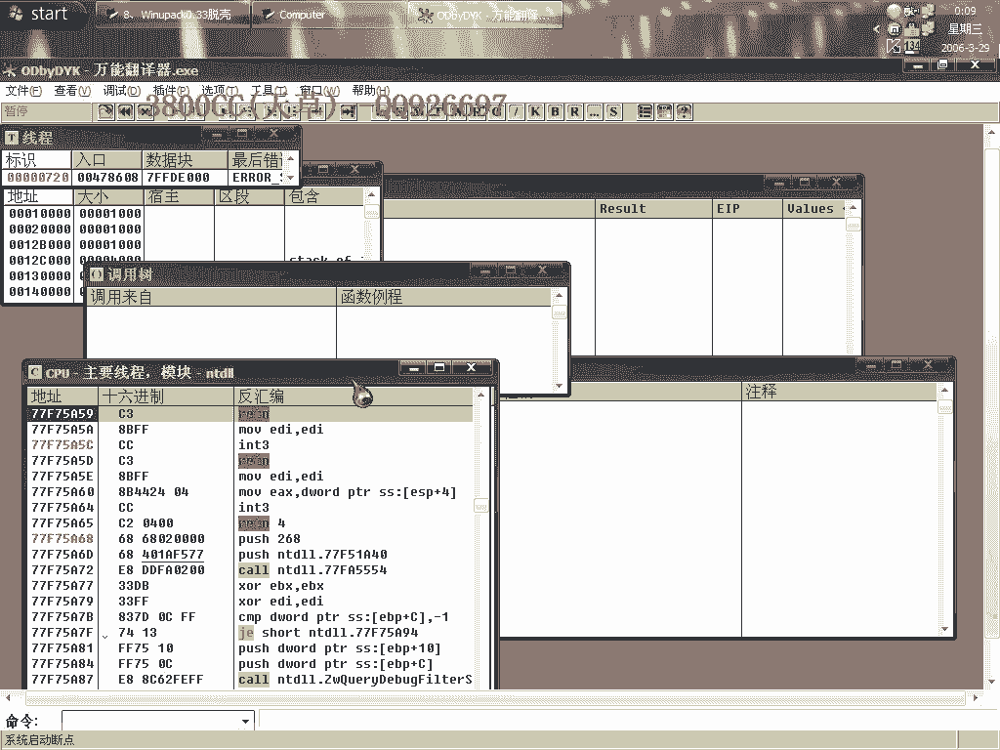
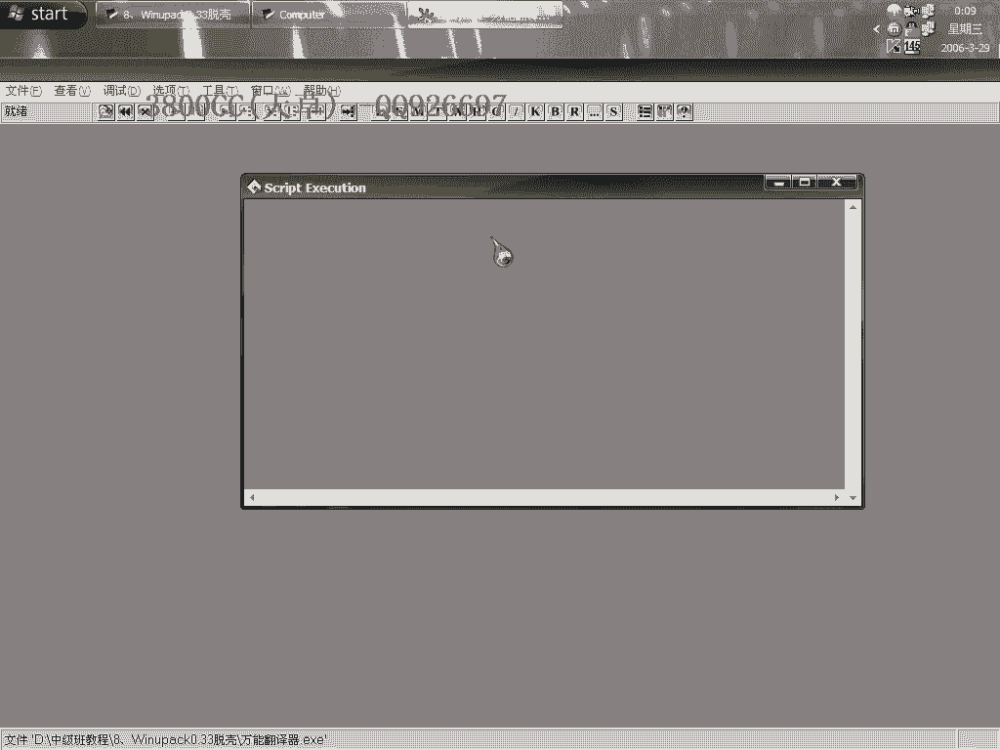
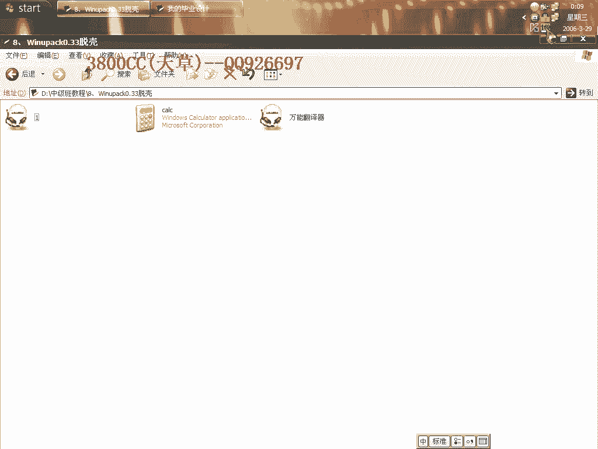

# 天草中级班 - P8：第8课 - 白嫖无双 - BV1qx411k7kd 🔍

在本节课中，我们将学习如何分析一个修改了PE头的加壳程序，并掌握手动修复PE头以及使用调试器到达程序原始入口点（OEP）的方法。课程将涉及使用OllyDbg（OD）和ImportREC等工具。

---

## 课程概述 📖

本节课分析的是一个特定版本的加壳程序。该程序的主要特征是其PE头被修改，导致常规分析工具无法正常识别。我们将学习如何识别这种修改，并利用调试技巧绕过保护，最终完成脱壳。

---

## 分析被修改的PE头

首先，我们查看目标程序。使用十六进制编辑器打开后，可以发现其PE头已被完全篡改。

正常的PE文件头部包含特定的标识字符串，例如 **`This program cannot be run in DOS mode`**。但此加壳程序移除了该字符串，这是其区别于普通加壳软件的一个特点。

由于PE头异常，当使用OllyDbg载入程序时，通常会弹出错误提示。

---

## 使用调试器定位OEP

上一节我们看到了OD载入时的错误。本节中，我们来看看如何忽略异常并继续调试。

在OD中，我们需要先忽略所有异常设置并隐藏OD。接着，通过下断点来追踪程序的执行流程。

一个有效的方法是下断点在 **`LoadLibraryA`** 这个API函数上。操作如下：
1.  在OD的命令行输入：`bp LoadLibraryA`
2.  按F9运行程序，程序会在调用`LoadLibraryA`时中断。
3.  按F7步入（Step Into）函数内部。

步入后，删除当前模块的分析数据，以便更清晰地查看代码。继续单步执行，最终可以到达程序的原始入口点（OEP）。

此时观察OEP的地址，例如可能是 **`012475`**，而非常见的 **`00401000`**。这证实了我们已经成功绕过外壳，到达了程序本身的代码。

---

## 使用工具进行脱壳

找到OEP后，即可使用脱壳工具进行修复。

以下是两种常用的脱壳方法：
*   **使用OD的插件**：许多OD插件内置了脱壳功能，只需填入OEP地址即可完成转储（Dump）。
*   **使用ImportREC**：Import Reconstruction Tool不仅可用于修复导入表，也具备脱壳（Dump）功能。在进程列表中选择目标程序，填入OEP地址，然后执行“转储”操作。

---

## 手动修复PE头的实践

除了动态调试，了解如何手动修复被破坏的PE头也很有价值。这有助于理解PE文件结构，并能作为一种反调试手段。

我们以一个未加壳的程序为例，手动修改其PE头，模拟加壳效果。

操作步骤如下：
1.  使用十六进制编辑器打开目标程序。
2.  定位到PE文件头的起始偏移（通常位于`0x3C`指向的位置）。
3.  计算并修改`SizeOfHeaders`等字段的值，例如将其改为 **`0x8001`**。
4.  在PE头与第一个节区（如`.text`）之间插入一定数量的空字节（例如16个`0x00`）。
5.  保存修改后的文件。

修改后，再用OD载入该文件，会发现它产生了与加壳程序类似的错误提示，证明了手动修改的有效性。

通过对比修改前后的文件，可以更直观地理解PE头结构变化带来的影响。

---

## 课程总结 🎯

本节课我们一起学习了针对修改PE头型加壳程序的分析方法。
我们首先识别了被篡改的PE头特征，然后利用`LoadLibraryA`断点配合OD调试，一步步追踪并找到了程序的原始入口点（OEP）。
接着，我们介绍了使用工具进行脱壳的流程，并实践了手动修改PE头以理解其结构原理。
掌握这些技能，对于分析各类简单的保护壳和增强逆向工程基础能力至关重要。

