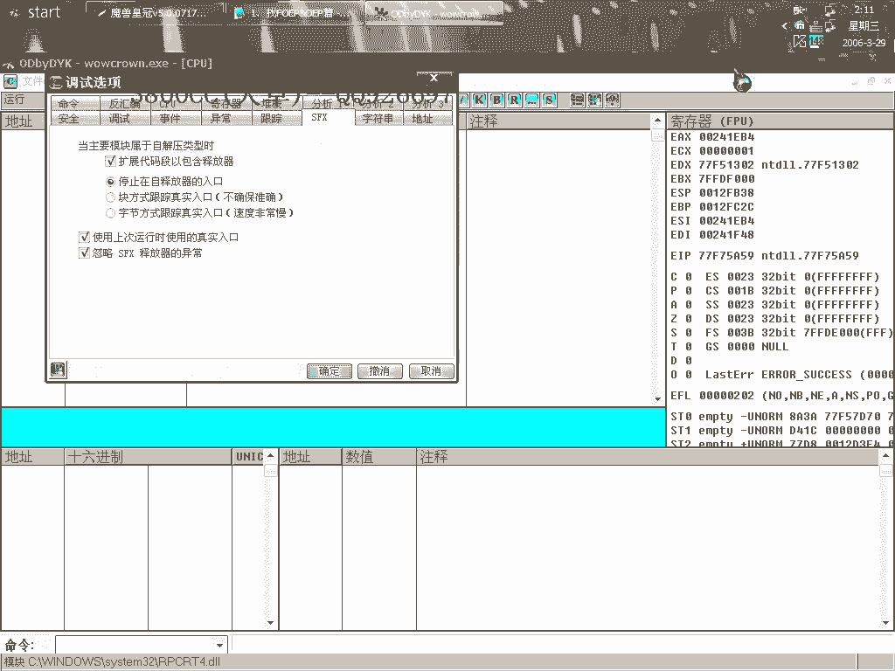
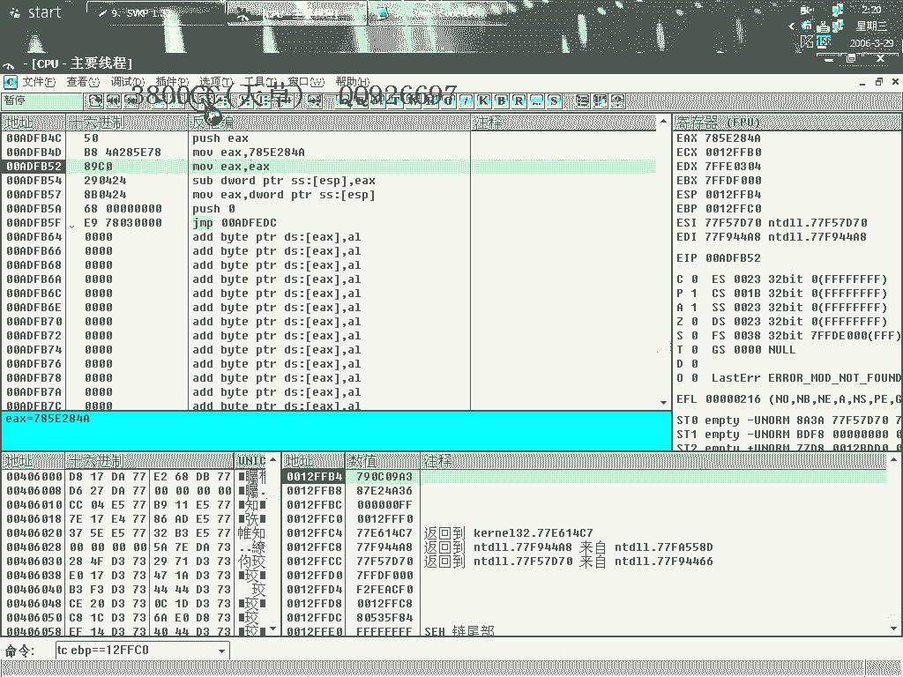

# 天草中级班 - P9：第09课 - 白嫖无双 - BV1qx411k7kd

大家好，這幾課講一下SKP 1。32的，這個版本呢，我說的這個可抽取了個代碼的，抽得非常非常兇，這就是我前面有幾課裡面講的，就是說被抽了106之劫的，這是我以前寫的一個文本，以前寫的一個文本。

現在派上用場了，好，來看一下，首先呢第一步，我們來找一下VOP，啊VOEP。

怎麼樣啊，為了節約時間，我們來用懶的方法來，這樣，好像開著那個屏幕錄像專家。

這個有點影響啊，有個斷點斷不下來好像。

好就這裡了，這就是我們找的VOP，上面的loop loop loop loop，全部都是被抽取了代碼的，是全部被抽取了的，現在我們重新來。

把這個社會源來先的，這裡啊第二步，我們現在要處理IAT。

首先的像這個斷點啊，取消斷點，把他叫F9，這個時候來找找了個特徵碼啊，大家不要問這個特徵碼怎麼來的，這就是分析得來的，分析得來的，就是這裡開始處理IAT了啊，這三個呢是可的一個處理可的驗證函數。

這個是一個特徵啊，這是一個特徵，這裡大家這裡看這全都是八個的啊，八個字母，然後但是是六個的，這就是第三個可的處理特徵，好我們這裡呢，就把它改成，跳到第一個可的處理，第一個可的處理，這是第三個第二個。

第一個就跳到這裡了，然後可的處理處理完了之後呢，這個我們要跳到最末尾的ProPaid，ProPaid的啊，跳到ProPaid的，錯了這裡啊，因為這個是非常非常麻煩啊。

我只有用粘貼複製這樣就有時間了，第二個。

處理了，這裡我們要把它交換一下，因為PID，這個斷點好像開著開著屏幕錄像專家就斷不下來了，不知道為什麼，看一下，好啊，剛才啊剛才這裡他就斷不下來啊，斷不下來，但是我把那個。

把那個屏幕錄像的關鍵專家關掉之後就可以斷下來了，斷下來之後，大家呢試一下就可以試一下啊，這個樣子是沒有錯誤的，斷下來之後啊，取消斷點取消斷點，遠遠啊，不行，這個時候還是取消斷點返回。

這個時候下載一個斷點啊。

這個也是一個特有的啊，一個特有的，大家只要需要記住就可以了。

中斷第一次兩次三次啊，中斷了三次之後取消硬件斷點，這個時候啊，開始下載一個，TC-EBP了啊，這個啊，12FFC0呢，是開始的啊。

我們來看一下，就是OD1載入啊，開著屏幕錄像專家好像就有這麼一些問題啊。

就這一個，ESP開始了ESP-4啊，開始了ESP-4，好，回撤啊，就來了這裡了，這裡呢就開始處理Stormcontent了啊，我們的噩夢也就開始了，來看一下這裡，就是說啊。

如果你發現啊，是SVKP啊，重新被抽去了106字節的話，都可以按這個方法來找啊，這個也是要求我們多多的，這個方法來找啊。

這個也是要求我們對那個程序的入口要非常非常了解。

我們這個時候用F7啊，大家看到第一句，第一句是我們這個啊，程序的特有的一個，典型的一個代碼啊，這是典型的程序代碼，典型的啊，程序代碼，我們繼續啊，單步走，大家可以看這裡，這裡啊。

這都是我這裡都有做了標記的啊，做了標記的，做了標記的啊，單步走啊，因為好像就是說，大家看這裡就可以知道，從開始的話啊，就說Stone Cold的開始就第一句是開始，然後呢，中間隔了很久啊，這裡才開始了。

這裡開始有有那個，有那個就是Stone Cold的出現了，其實Stone Cold的最大一部分啊，最大一部分是在最最後面啊，最最後面，這裡最最後面，等一下我們可以看得到的啊，可以看得到的，好。

好，這裡我們還是同時啊，同時也需要注意看對站，這個要求我們對那個程序的入口特徵要非常非常了解，這個我已經說過不止100遍了啊。

大家看這裡，這個等一下我們要用到啊，這個等一下我們要的，我們先走啊，先走，破解0，這裡呢，破解0啊，啊這裡，一般就是說C的開始都不變了啊，C成C語言的啊，C類的，C++，VCR之類的。

他這些開頭是不變的啊，第二句肯定就是這一句了啊，move啊，就這一句，單步走，大家注意看這一個啊，這個是我們要用到的對站啊，這裡，等一下就知道了。

破解0啊，這裡又是破解0，大家看這兩句。

這兩句是我們要用到的啊，這兩句，破解0啊，往下面看，往下面看，這裡，這句啊，這句是變形的啊，這句是變形的，把這一句記著啊，這一句記著，再繼續往下面走，這裡是有一個破解0啊，大家看著啊，看著，這裡呢。

是變形的，剛才結合上面這一句，上面這一句啊，分析他為這個啊，分析他為這個，繼續往下面走，這裡也就是說，這裡有幾個變形啊，有幾個是變形的地方，但就是說，你要分析不出來的話，這裡啊，這裡看一下。

這個也是sub1sp-68啊，這兩個這一句，也是那個C程序的一個特徵，然後再看這兩句，這裡有，這裡是變形的，Proxyex啊，Proxyex，這句是一個特徵啊。

一句特徵，這也是的，繼續走啊，這個要對那個程序語言，非常非常了解啊，esp啊，move esp，大家可以繼續找啊。

這個要走很久啊，他會自動回到，剛才那個，那個尾OEP那個地方去的，剛才一個Proxyex，也是一個Stone code，我再看一看，move啊，這一句，但我在這個地方給大家講，是就這樣，只能這樣帶過啊。

帶過，就說教大家在哪個地方去找，要是細細的去分析啊，細細分析，是花不少時間的，這個大家一定要知道，記得要用F7啊，F7，這裡啊，這個地方也是的啊，這個要對那個OE，那個程序入口，又非常非常了解。

已經說過很多很多次了，大家看到這裡。

這裡也是的啊，這裡就是最後了啊，最後的，這入口特徵呢，大家自己下去練習的時候啊，自己下去練習的時候，就按著我這個來啊，按著我的這個，這裡有個R，看到了吧，這是第三個位置的，嗯，這裡開始。

Stone code的大部分都在這裡了啊，這兩句也是啊，這一句也是。

這一堆啊，都是的，這一堆都是的啊，這句也是，大部分都在這裡了，這個地方就調到我OEP了啊。

我OEP，這是我們剛才啊，進行處理一下，這個是一個特異結構，這些都是剛才找到了的啊，但是有三個地方是非常非常難找的，一個就是這個，再就是這兩個，這三個有四個，但這個是程序的基本入口特徵啊。

這個當然是-1了，但這兩句呢，這兩句大家看一下，就是這兩句，他首先把這個壓到對戰，所以在對戰的下面，這個在對戰的上面啊，大家其實看這兩句，看這個，加木特Q這個，這個就是一個C程序入口特徵的一個。

典型特徵的啊，就這一句，所以Stone Cold就是這些東西了啊，我們來填補回去啊，填補回去，好。

連貼，剛好啊。

非常非常好，持續興建EIP，大家看一下，這個就是實際的一個特徵，大家看到了吧，這一個，這一個，這，還像這種啊，這都是一些特徵的啊，都是一些特徵，所以我說了，大家一定要對那個非常非常清楚了。

這個時候我們來脫殼，糾正一下景象大小，大家看到舊的是這麼多，新的也是這麼多，因為他抽取了代碼，我們補回去了，好，完整脫殼，這個時候來修復啊，好。

大家看只有一個，只有一個，這裡呢。

我在按著4的思路啊，按著4，按著去4的思路。

先把這個剪掉，看一下，先把這個剪掉，然後再抓去，點錯了，再抓去，是可以運行的。

但是就是說，因為這個SVKP這個東西，他的一個就是對MaxG，我們來把這個寫給大家吧，寫給大家吧，這個他對這個指針進行了處理的，一般按道理來說的話，按道理來說，他是應該有七個，七個指針的。

七個常規的指針，他會處理七個常規的指針，我們就是說，這七個，是三個註冊函數，一個就是這個，一個就是這個，再另外的就是這個，這個函數，這個和這個，這裡你看，一二三，有兩個這個，有兩個這個。

我記得不是有兩個這個，就是有兩個這個，一二三，然後再加上三個，再加上三個註冊函數，就這三個註冊函數，總共就是六個，加上這裡面，這裡面有一個，這個應該是有兩個，這個應該是兩個，所以他應該一般而言的話。

有七個無效的指針，但是1。43的話。

1。43這個可的1。43版本，他好像有十來個吧，他有十來個無效函數，我們把這個修補回來，修補回來，修補回來，能源是可以運行的，能源是可以運行的，這另外，另外我們可以這個樣子來看一下，打開家科的一個程序。

我們來修補家科程序看一下，看一下能不能抓取到一些什麼東西，大家看到有這麼多無效函數，用登記1，大家看到他這裡有五個，這裡有五個，這三個他是處理好了，處理好了，這個呢，就是我們剛才所說的一個，是哪個函數。

這個呢，看一下，找不到，他這都處理了，這個就是我們剛才所說的幾個函數，大家看到了吧，優者，這裡面有一個Meshbox，我們還是來重新抓取，這個修復好了的，最後來對照一下，這個樣子記憶深刻一些。

如果他處理的話，就會處理這麼幾個函數了，這個剪掉吧，我們再來對照一下，最上面的那一個，修復點擊，把其他的修復好，這個呢，就剪掉，還是來保存一下，我們可以來對照一下。

他究竟是處理了哪幾個，這裡呢。

我們把這個拉成一樣。

一樣寬，對照一下，這個也有Copyfire。

然後有一個SAD，這一個，和這個，這兩個大家看到，這兩個他都處理了，他都會處理這兩個的，然後呢，優者裡面，這個6418，看一下他處理的是什麼，6418。

這一個，這個程序有點奇怪，按道理說的話，按道理說他會處理，這三個，然後這一個，這一個，這個應該是有兩個，然後這就是一個MaxBox，這個是規律，大家有時候說在，修復某一種殼的時候，發現修復不成功。

這個可以用拆的方法，可以用拆的方法，今天課程就到這。

謝謝大家收看 下次見。