# 天草中级班 - P9：第09课 - 白嫖无双 - BV1qx411k7kd 🔍

在本节课中，我们将学习如何分析和修复一个被SVKP 1.32壳严重抽取代码的程序。我们将从定位OEP开始，逐步处理IAT，并最终修复被抽取的代码，完成脱壳。

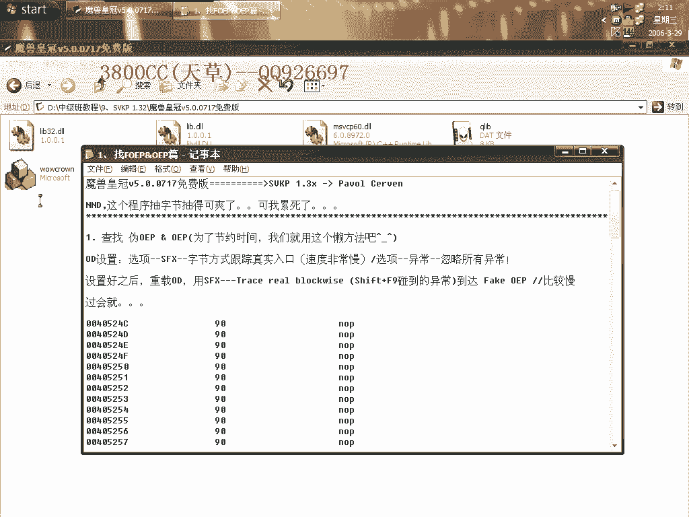

---

## 第一步：定位OEP（原始入口点）📍

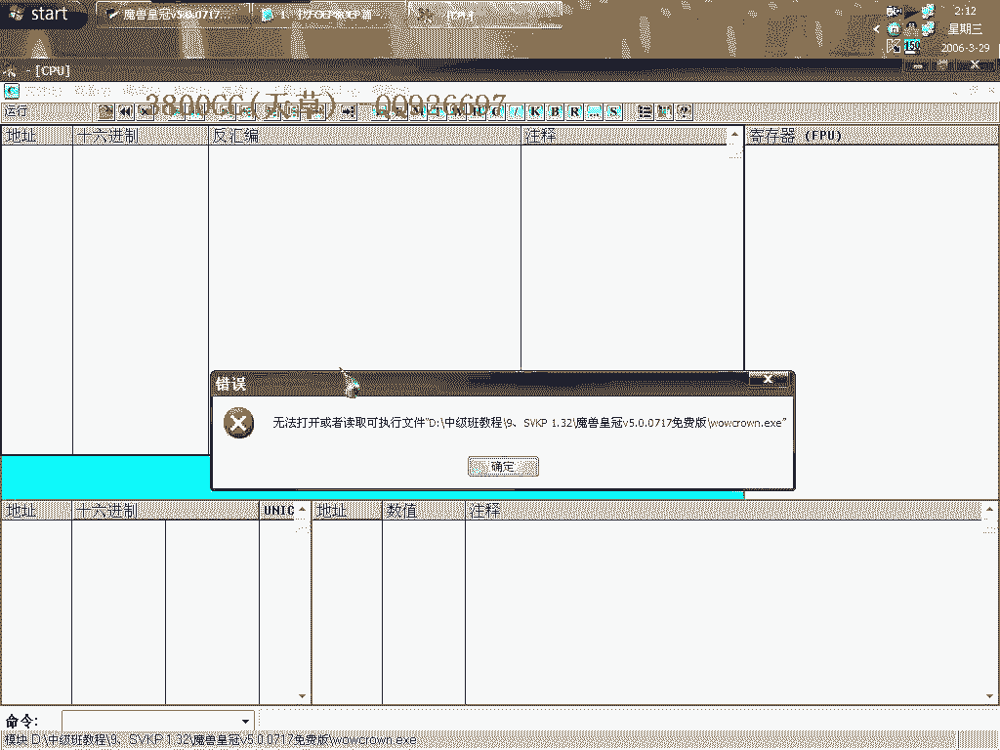

上一节我们介绍了课程目标，本节中我们来看看如何定位程序的原始入口点。

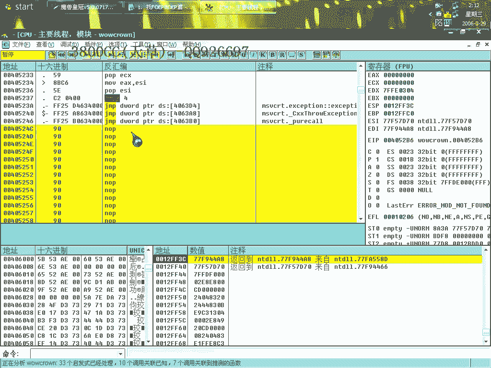

首先，我们需要找到VOP（Virtual OEP）。为了节约时间，我们采用一种快捷的方法。

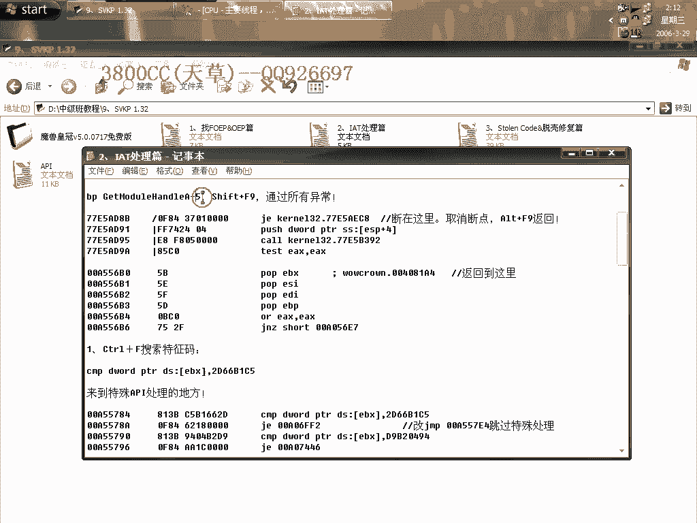

在操作时，开启屏幕录像软件可能会影响调试器的断点功能，导致断点无法正常中断。

最终，我们找到了目标位置。请注意，上方的循环代码（`loop loop loop loop`）全部是被抽取了代码的片段。

这就是我们找到的VOP。现在，我们重新开始。

---

## 第二步：处理IAT（导入地址表）🔧

上一节我们找到了OEP，本节中我们需要处理程序的导入地址表。

首先，取消所有断点，按`F9`让程序运行起来。接着，我们需要找到一个特征码。这个特征码是通过分析得来的，请不要询问其来源。

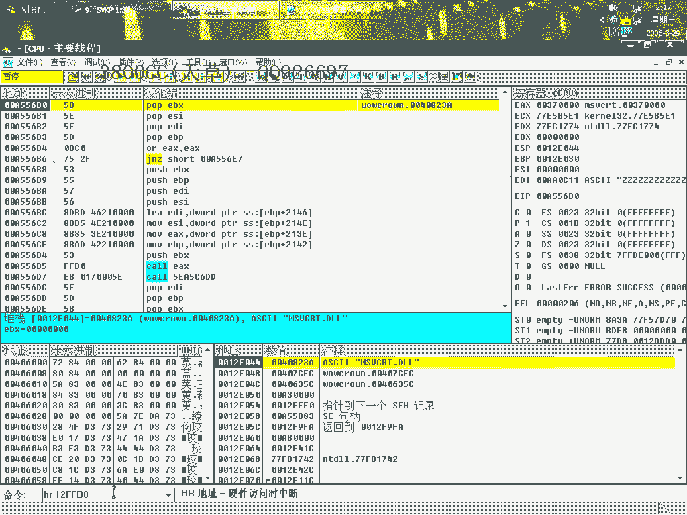

以下是处理IAT的关键步骤：

1.  定位到开始处理IAT的代码位置。
2.  识别三个用于处理代码的验证函数。这是一个特征：通常是八个字母，但实际是六个。
3.  将跳转指令修改为指向第一个代码处理函数，然后是第二个和第三个。
4.  代码处理完毕后，需要跳转到末尾的`ProPaid`函数。

这个过程非常繁琐，因此我们使用复制粘贴来节省时间。

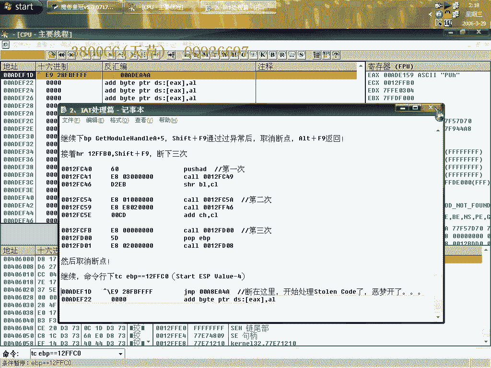

处理第二个函数时，我们需要交换一些指令。同时，请注意，开启屏幕录像专家可能导致硬件断点失效。关闭该软件后，断点功能恢复正常。

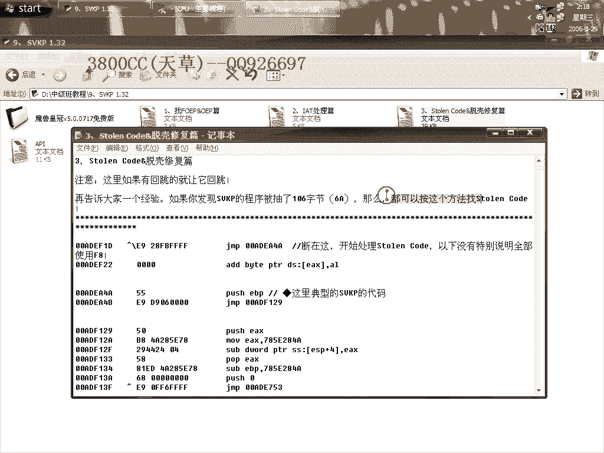

断点成功中断后，取消断点并返回。接着，设置一个新的断点。

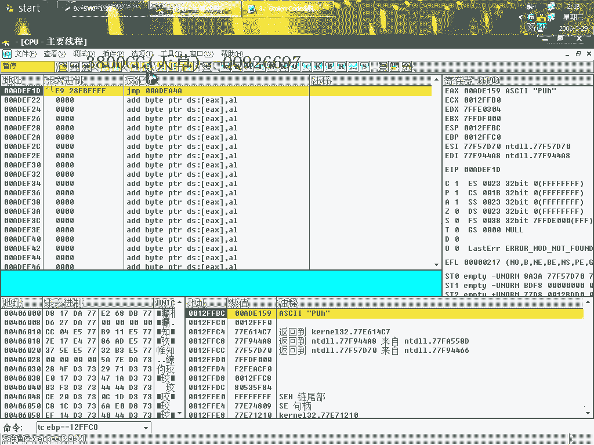

这是一个特有的断点位置，大家只需记住即可。

中断三次后，取消硬件断点。此时，开始设置一个`TC-EBP`断点。地址`12FFC0`是起始点。

---

## 第三步：分析并修复被抽取的代码（Stolen Code）💉

上一节我们处理了IAT，本节我们将面对最复杂的部分：分析并修复被“偷走”的代码。

用OD载入程序，开启屏幕录像专家可能会引发一些问题。

我们定位到`ESP-4`的位置，按回车后来到目标代码处。这里就是开始处理`Stolen Code`的地方，也是我们的“噩梦”开始之处。

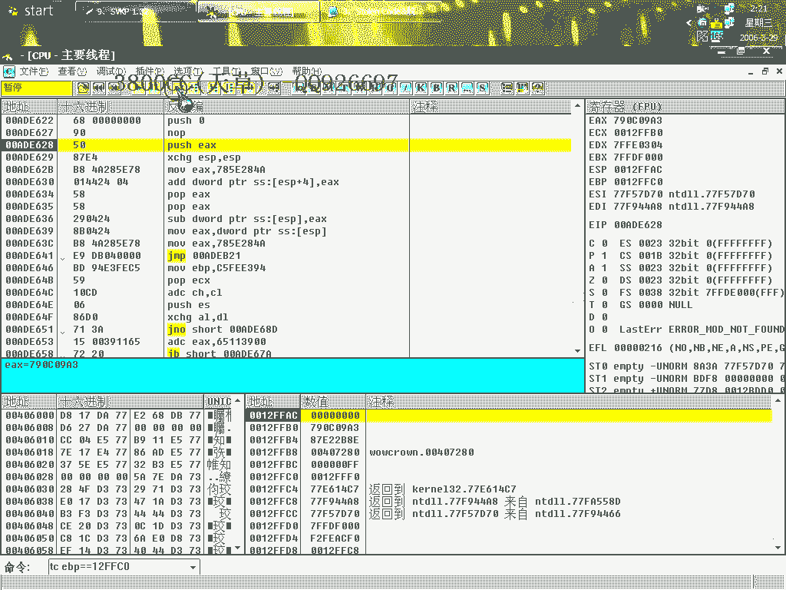

如果你发现是SVKP壳，并且被抽取了106字节的代码，都可以按照此方法来寻找。这要求我们对程序的入口特征非常熟悉。

此时我们使用`F7`进行单步跟踪。第一句是程序特有的典型代码。

继续单步执行。请注意，我已经在关键位置做了标记。从开始到`Stolen Code`真正大量出现，中间间隔了很长一段代码。`Stolen Code`的最大部分实际上在最后面。

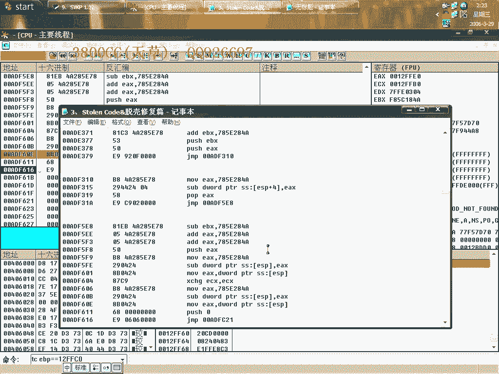

在跟踪过程中，需要同时注意观察堆栈。这要求我们对程序入口特征有极其深入的了解，这一点我已经强调过很多次。

以下是跟踪过程中需要识别和记录的关键代码特征：

*   **C/C++程序入口特征**：这类开头通常不变。例如，`move`指令是典型的第二句。
*   **变形的代码**：有些指令是经过变形的，需要特别记住。例如，`sub esp, 68`是C程序的一个特征。
*   **特定函数调用**：如`Proxyex`，这是一个特征点。
*   **堆栈操作**：某些`push`和`pop`操作是关键，它们将地址压入或弹出堆栈。

跟踪会持续很长时间，程序最终会自动回到之前提到的尾OEP位置。

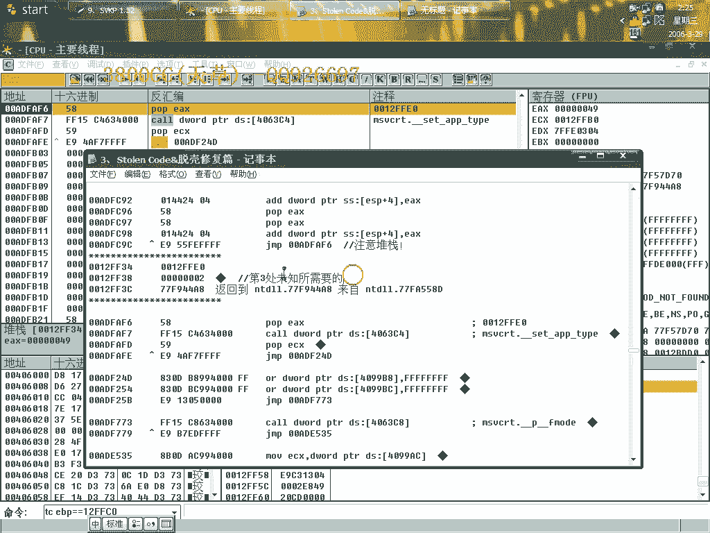

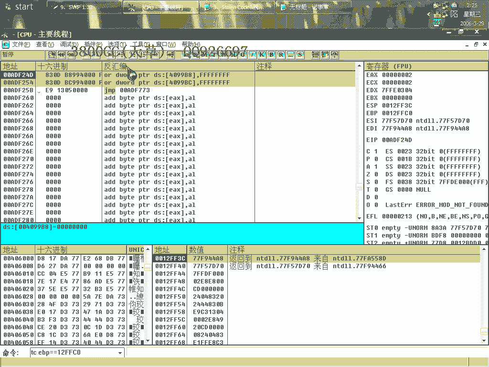

这里就是`Stolen Code`聚集的最后部分。入口特征需要大家在课后按照我的方法进行练习。注意看，这里有一个`R`，表示第三个位置。

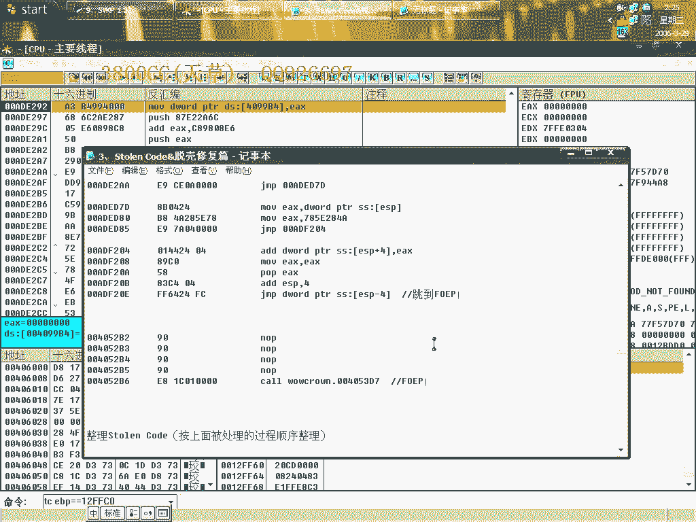

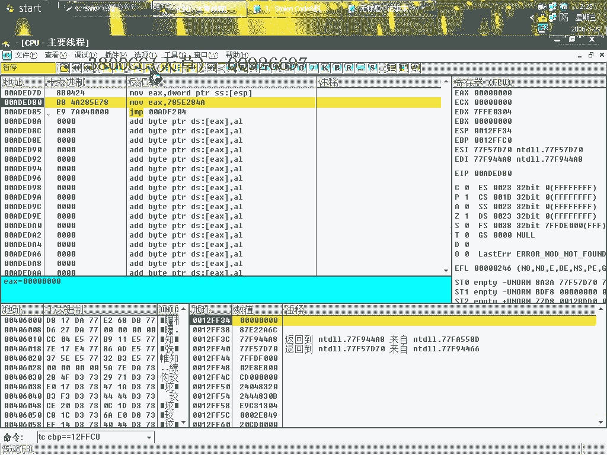

`Stolen Code`的大部分都在这里了。这一堆指令都是。例如，`jmp`指令就是一个跳转到OEP的典型特征。

我们找到了OEP。这里有一个特异结构，这些都是刚才找到的代码。但有三个地方非常难找：一个是程序的基本入口特征（通常是`-1`），另外两个是特定的`push`指令。

大家看这两句`push`指令，它们将地址压入堆栈。其中，`push`后跟`jmp`指令是C程序入口的一个典型特征。

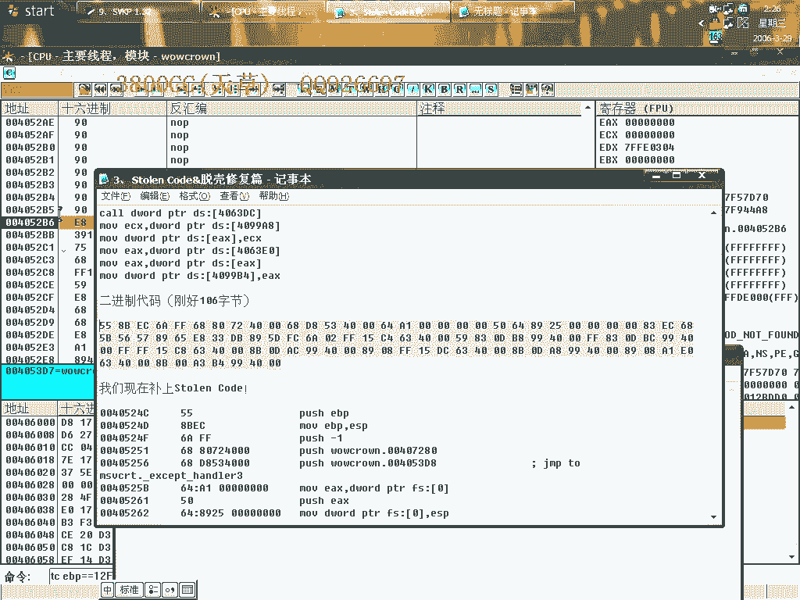

所以，`Stolen Code`就是由这些片段组成的。现在，我们将它们填补回去。

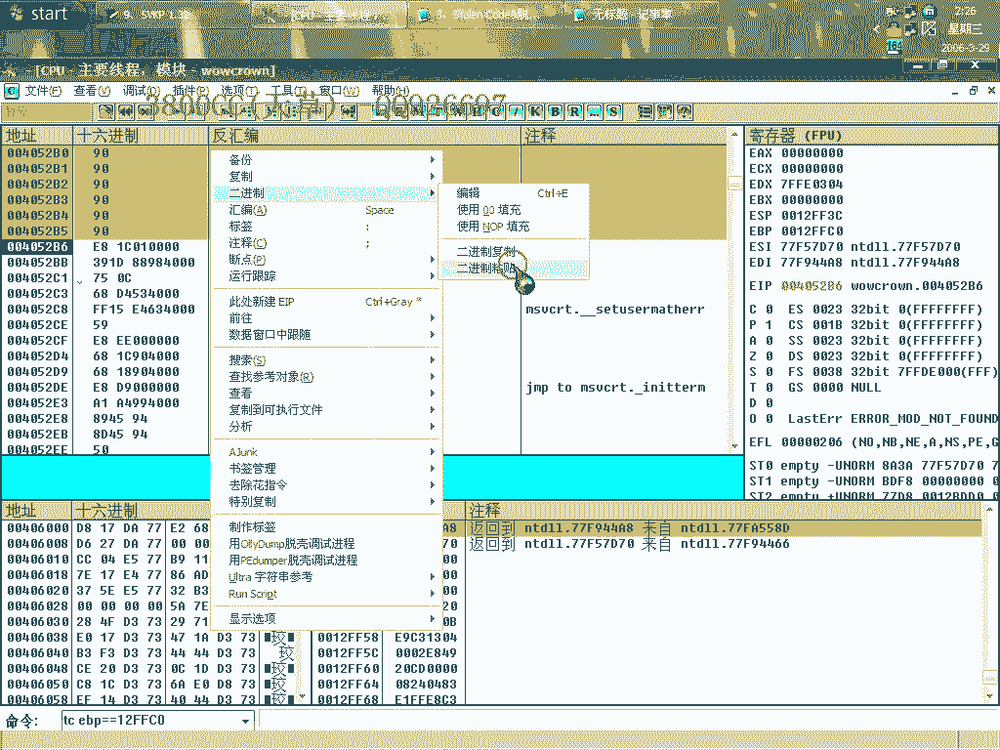

粘贴后，代码刚好对齐。

效果非常好。现在，让EIP指向这里。大家可以看到实际的特征代码，例如`call`、`jmp`等，都是一些特定模式。我再次强调，必须对这些特征非常清楚。

此时，我们可以进行脱壳操作。纠正镜像大小后，可以看到旧的大小和新的相同，因为被抽取的代码已经补回。进行完整脱壳。

---

## 第四步：修复导入表与总结 🛠️

上一节我们修复了代码并完成了脱壳，本节我们来进行最后的导入表修复并总结全课。

现在开始修复导入表。

大家看到只有一个无效指针。我按照常规思路，先将其剪掉。

修复后，程序是可以运行的。但是，因为SVKP壳对一些指针进行了处理，所以我们需要找出所有无效指针。

一般来说，SVKP会处理七个常规指针：三个注册函数，加上`GetModuleHandleA`、`GetProcAddress`等特定函数。在1.43版本中，无效函数可能多达十几个。

我们可以通过对比一个已修复好的程序来加深理解。打开另一个加壳程序进行修复，观察有哪些无效函数。

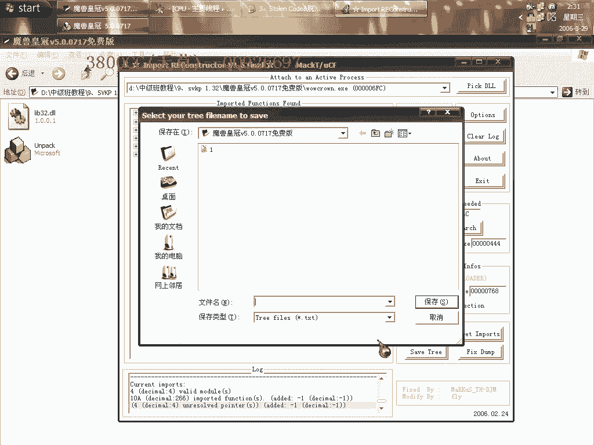

通过对比发现，SVKP通常会处理`GetModuleHandleA`、`GetProcAddress`、`LoadLibraryA`等函数，以及三个注册函数。这是规律。

有时修复不成功，可以采用对比和排除的方法。

---

## 总结 📝

本节课中，我们一起学习了如何对付一个代码被严重抽取的SVKP 1.32壳。

1.  **定位OEP**：使用特征码和断点技巧找到虚拟入口点。
2.  **处理IAT**：修改跳转，引导程序正确执行IAT处理流程。
3.  **分析与修复Stolen Code**：通过单步跟踪，识别C++入口特征、变形代码和关键调用，将“偷走”的代码块填补回正确位置。
4.  **最终修复**：脱壳后，修复导入表，并理解壳处理特定指针的规律。

掌握这些方法需要对程序入口和结构有深刻理解，并通过大量练习来巩固。今天的课程就到这里。

谢谢大家收看，下次见。

