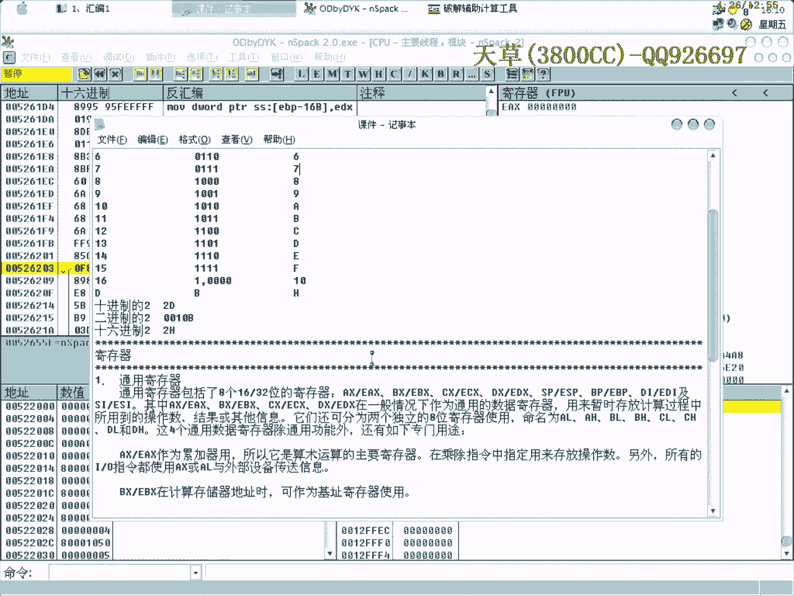

# 天草流初级课程 - P1：汇编基础与寄存器入门 🧠

在本节课中，我们将学习汇编语言的基础知识，特别是与软件破解相关的核心概念。课程将涵盖数制系统、寄存器的基本功能与分类，以及如何利用标志寄存器来辅助分析和修改程序流程。

---

## 数制系统：十进制、二进制与十六进制

上一节我们介绍了课程目标，本节中我们来看看汇编中使用的数制系统。在软件破解领域，我们主要接触三种数制：十进制、二进制和十六进制。

*   **十进制**：用字母 **D** 表示，是我们日常生活中最常用的数制。
*   **二进制**：用字母 **B** 表示，是计算机底层运算的基础。
*   **十六进制**：用字母 **H** 表示，是汇编语言和调试工具中默认显示的数制。

以下是数制表示的例子：
*   十进制的 2 可以表示为 `2D`。
*   二进制的 2 可以表示为 `0010B`。
*   十六进制的 2 表示为 `2H` 或通常直接写作 `2`。

二进制加法的进位规则是核心。例如，`0001B`（1）加 1 后，结果为 `0010B`（2），发生了进位。

在调试器（如OD）中，默认显示的数值是十六进制的。这一点非常重要。例如，在OD中看到数字 `7`，它代表的是十六进制的 `7H`，其值等于十进制的 `7D`。但如果将一个较大的十进制数（如 `40D`）错误地当作十六进制数输入，其实际值会变为十六进制的 `28H`。

---

## 寄存器详解

理解了数制后，我们进入核心硬件概念——寄存器。寄存器是CPU内部的高速存储单元，用于临时存放数据、地址和控制信息。

### 通用寄存器

我们学习的是32位汇编，其通用寄存器在16位（AX, BX, CX, DX）基础上扩展而来。

一个32位寄存器（如EAX）可以划分为两部分：
*   **高16位**：无独立名称。
*   **低16位**：即原来的AX寄存器。
    *   AX寄存器本身又可划分为：
        *   **AH**：高8位（High）。
        *   **AL**：低8位（Low）。

以下是主要通用寄存器及其常见用途：

*   **EAX**：累加器。是算术运算的主要寄存器，在破解算法验证时至关重要。
*   **EBX**：基址寄存器。在计算存储器地址时可作为基址使用。
*   **ECX**：计数器。常在循环操作中用作计数器。
*   **EDX**：数据寄存器。常与EAX配合用于乘除法运算。
*   **ESP**：栈指针寄存器。始终指向当前栈顶。我们熟知的“ESP定律”就是基于此寄存器。它的值会随着栈操作（如PUSH, POP）而动态变化。
*   **EBP**：基址指针寄存器。通常指向当前栈帧的底部，用于访问函数参数和局部变量。

### 标志寄存器

标志寄存器（EFLAGS）用于记录CPU指令执行后的状态信息，如是否产生进位、结果是否为零等。这些标志位直接影响条件跳转指令的执行。

以下是几个关键标志位：

*   **CF（Carry Flag）**：进位标志。记录无符号数运算的进位或借位。
*   **ZF（Zero Flag）**：零标志。记录运算结果是否为0。
*   **SF（Sign Flag）**：符号标志。记录运算结果的符号（正负）。
*   **OF（Overflow Flag）**：溢出标志。记录有符号数运算是否发生溢出。

在调试器（如OD）中，你可以直接双击这些标志位来切换其状态（0或1）。这在破解时非常有用：当你希望改变一个条件跳转（如JZ, JNZ）的路径时，可以直接修改对应的标志位，而无需费力地修改汇编代码本身。

**注意**：`JMP` 是无条件跳转指令，不受任何标志位影响。

### 浮点寄存器

浮点寄存器（FPU）专门用于处理浮点数运算。在破解涉及浮点数验证的软件时，需要关注这些寄存器。相关的高级技巧将在后续课程中结合实例详细讲解。

---

## 实践：利用标志寄存器修改程序流程

了解了理论，我们来看看如何应用。在动态调试时，修改标志位是控制程序流程的便捷方法。

操作步骤如下：
1.  在调试器中找到一条条件跳转指令（如 `JZ`, `JNE`）。
2.  观察其是否跳转，并查看受影响的标志位（如ZF）。
3.  在寄存器窗口，双击对应的标志位（如ZF），将其值置反（0变1或1变0）。
4.  此时，该条件跳转的逻辑即被改变，程序执行流随之变化。

**重要区别**：此技巧主要用于**破解**（修改软件逻辑）。在**脱壳**（解除软件保护）过程中，通常不推荐直接修改标志位，而应采用“在跳转指令下一行设断点并运行（F4）”等标准方法，以避免破坏解压或解密流程导致程序崩溃。

如果不确定某条跳转指令受哪个标志位影响，可以采用试验法：依次尝试修改不同的标志位，观察跳转状态是否改变，无效则还原。

---

## 课程总结

本节课中我们一起学习了汇编的三大基础：
1.  **数制系统**：明确了十进制（D）、二进制（B）、十六进制（H）的区别，以及调试器中默认使用十六进制显示。
2.  **寄存器**：认识了通用寄存器（EAX, ESP等）和标志寄存器（CF, ZF等）的功能与作用。
3.  **实践技巧**：掌握了通过修改标志寄存器来控制程序条件跳转的实用破解方法，并区分了其在破解与脱壳中的不同应用场景。

掌握这些基础知识是后续深入学习逆向工程与软件破解的坚实第一步。