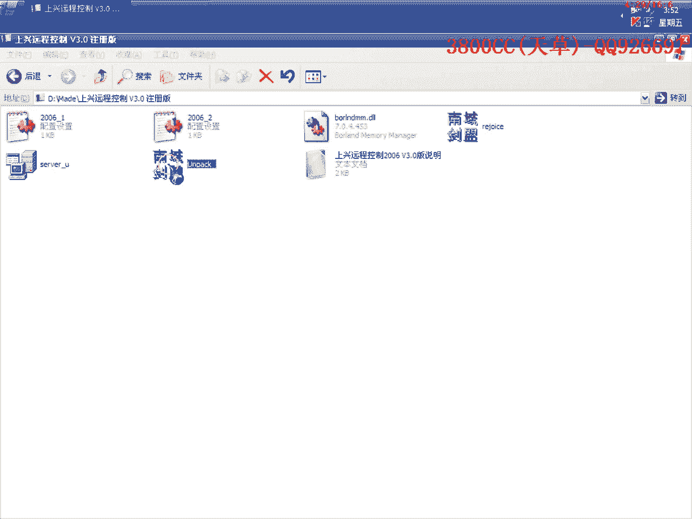
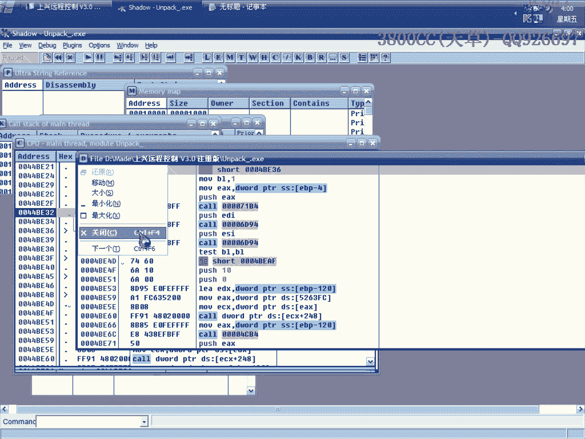
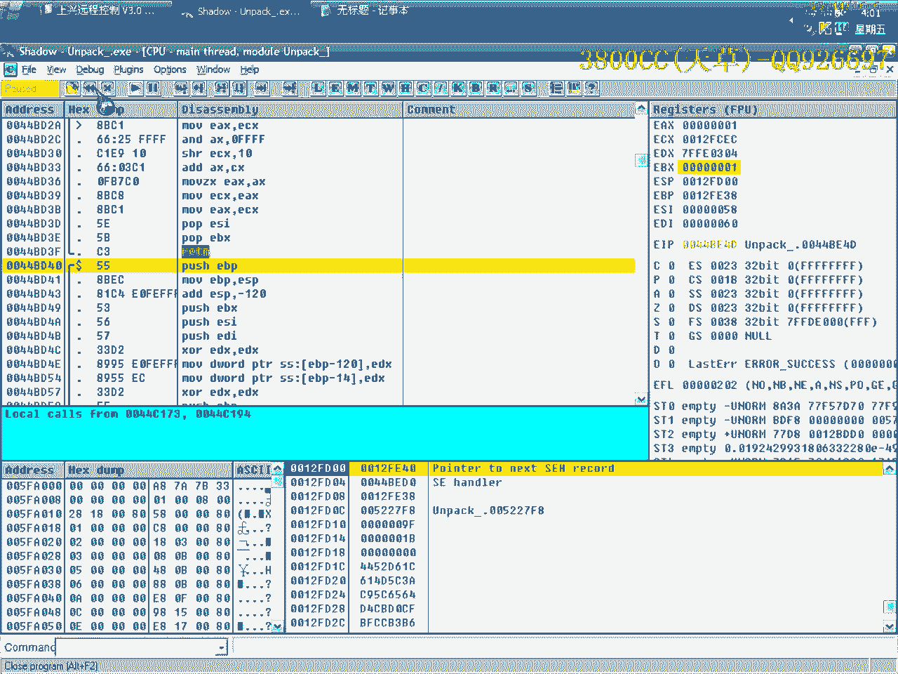

# 天草流初级逆向教程 - P10：脱壳与修复实战 🛡️

在本节课中，我们将学习软件逆向工程中的一项基础技能——脱壳。我们将以一个名为“商行远程控制3.0”的软件为例，演示如何定位并脱去其外壳，并对脱壳后的程序进行修复与关键代码分析。


## 课程概述


本节课的目标程序是“商行远程控制3.0”的免费注册版。我们的任务是分析其保护机制，使用工具进行脱壳，并理解脱壳后程序的关键校验逻辑。


## 一、 初步分析与脱壳方法尝试




首先，我们尝试使用常见的脱壳方法对目标程序进行分析。

以下是几种常见的脱壳方法及其在本例中的尝试结果：

1.  **ESP定律法**：观察程序入口点附近的堆栈平衡，可以快速定位到原始程序入口点（OEP）。在本例中，此方法有效。
2.  **两次内存断点法**：通过设置内存访问断点来追踪代码执行流程。但本例中程序区段过少，此方法不适用。
3.  **模拟跟踪法**：使用OD的跟踪功能。同样因为程序结构简单，未能成功定位到有效代码。


经过尝试，我们确定使用**ESP定律**是定位该程序OEP的有效方法。

## 二、 脱壳与修复


成功定位到OEP后，下一步是进行脱壳和修复导入表。

1.  使用OllyDbg插件（如OllyDump）的脱壳功能，从内存中将程序转储到文件。
2.  使用导入表修复工具（如ImportREC）对脱壳后的文件进行修复。修复时，需要确保所有函数指针都有效。
3.  修复完成后，脱壳的程序应能正常运行。

## 三、 关键代码分析与绕过


程序脱壳后，我们发现了其内部的一个校验机制。接下来，我们将分析并绕过它。

程序运行后，会弹出一个提示窗口。通过分析，我们发现关键跳转位于一处文件大小校验代码之后。

以下是分析过程的核心步骤：

1.  **定位关键调用**：在代码中，我们找到了一个`GetFileSize`的API调用，用于获取程序自身的大小。
2.  **对比分析**：我们同时载入原版程序（未脱壳）和脱壳后的程序进行对比。发现原版程序在获取文件大小后，有一个条件跳转被执行，从而绕过了弹窗。
3.  **逻辑分析**：该跳转依赖于一个寄存器（BL）的值。在原版程序中，BL被设置为1，导致跳转发生。而在我们的脱壳版中，BL为0，程序没有跳转，从而触发了弹窗。
4.  **寻找赋值点**：我们向上追溯代码，找到了将BL设置为1的关键指令位置。
5.  **实施修改**：在脱壳后的程序中，修改该处指令，将BL的值设置为1。修改后，关键跳转被触发，弹窗消失。


核心修改可以用以下伪代码表示：
```
// 修改前
mov bl, 0
// 修改后
mov bl, 1
```
或者直接修改跳转指令：
```
// 将条件跳转改为无条件跳转
jne xxxxxxxx -> jmp xxxxxxxx
```




## 四、 区段信息修改（可选）


为了使脱壳修改后的程序更具“个性化”，我们可以修改其区段名称。



以下是修改步骤：


1.  使用区段编辑工具（如PEditor或CFF Explorer）打开脱壳后的程序。
2.  找到程序的第一个区段，将其名称修改为自定义内容。
3.  保存修改。

修改后，使用查壳工具再次检查，程序将显示新的区段信息。

## 课程总结

本节课我们一起学习了软件脱壳的完整流程：

1.  我们首先尝试了多种脱壳方法，并确定了适用于本例的**ESP定律法**。
2.  接着，我们使用工具成功**脱壳并修复**了程序，使其能够运行。
3.  然后，我们通过**对比分析法**，定位了程序中的一个关键校验逻辑，并理解了其通过`BL`寄存器控制跳转的原理。
4.  最后，我们通过**修改关键代码**，绕过了该校验，并介绍了修改程序区段信息的可选操作。


通过本课实践，你不仅掌握了脱壳的基本操作，更学会了如何通过静态分析与动态调试相结合的方式，分析和处理脱壳后程序的保护机制。