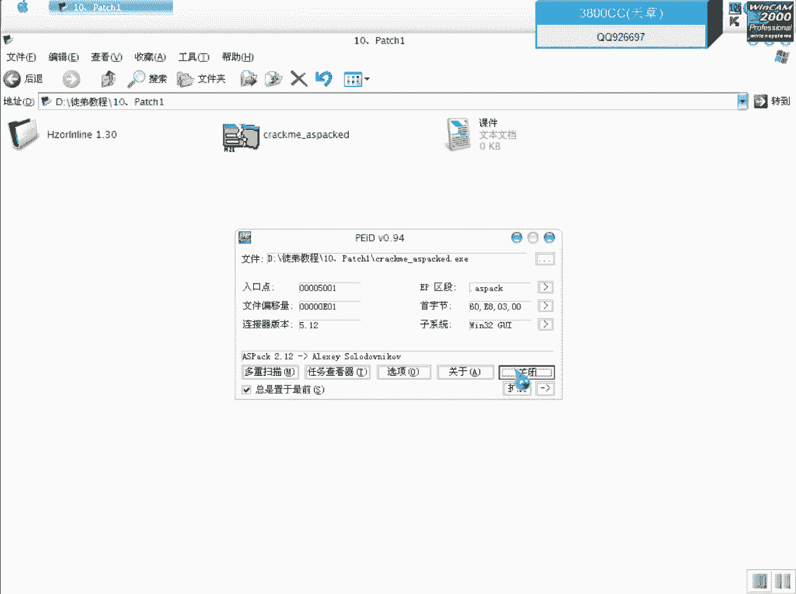
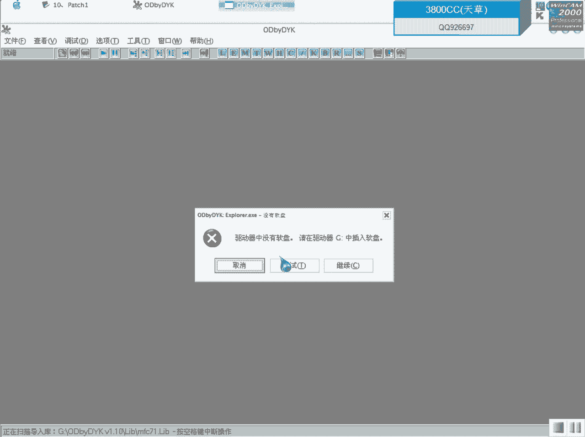
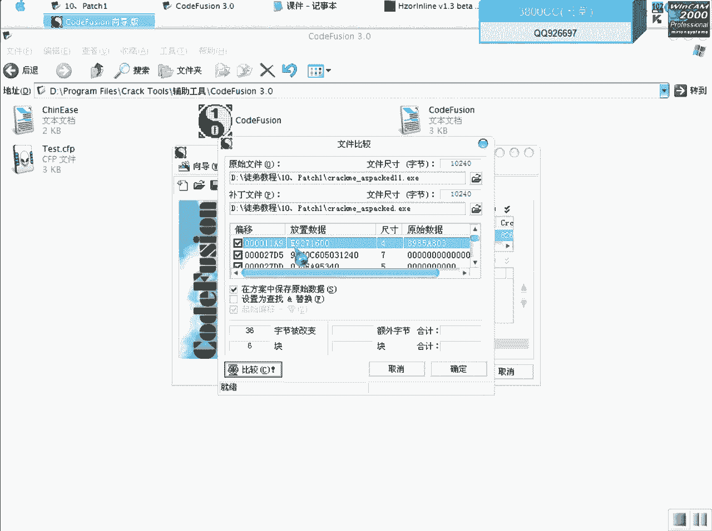
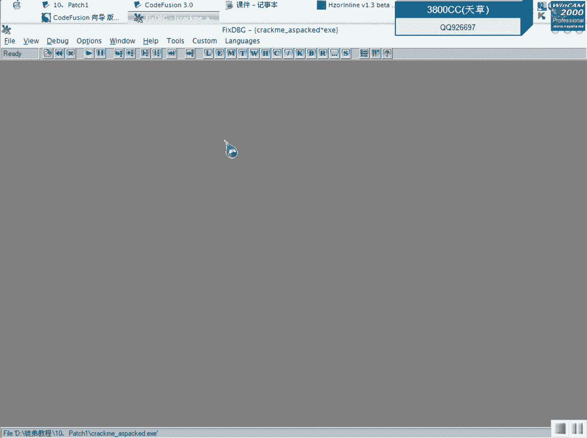
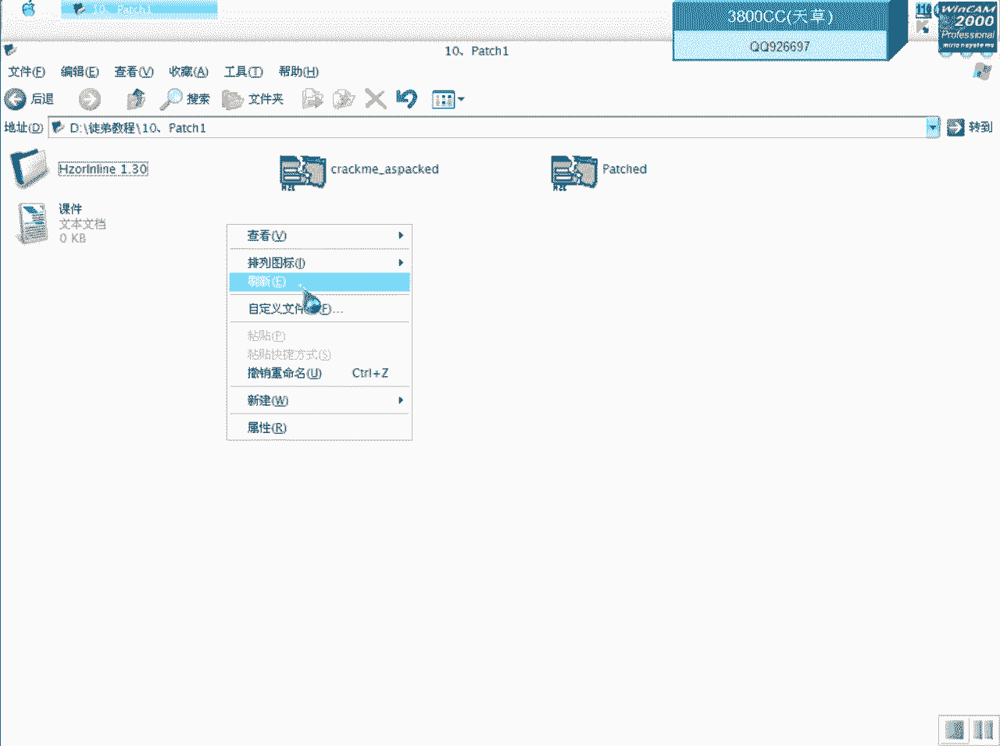
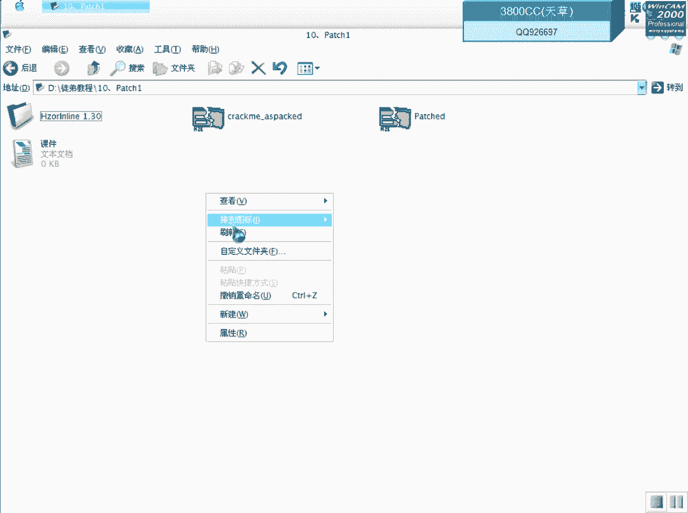

# 天草流初级 - P11：10、Patch1 - 白嫖无双 - BV1qx411k7qA

大家好，现在来进行我们的第十课。

第十课是初步让大家来了解一下，不脱壳破解的最简单的一种途径，今天我们要使用到一个工具，大家看一下这个Kerami，这有个错误提示，这个很简单的一个Kerami，我在这里就把它加了一个Aspac的一个壳。

这是为了达到我们今天教学的一种效果，再来再来再来再来看一下。

再来看一下OD载入。

我们首先要做的，首先做的就是直接首先到达OEP，这个呢当然就是用ESP定律了，下硬件端点，有个朋友会说我在这个计算器里这样操作是干嘛，这也是下硬件端点的一种方法，删除硬件端点，这个时候呢到达OEP之后。

我们就可以查到这份算了，大家看一下这是刚才我们的一个错误提示，双击进去就可以来到这里了，下面的对应的就是一个正确的提示，双击进去，在这里我们大家应该就可以知道。

里面肯定有一个关键的call和一个上面肯定有一个关键的call和一个关键的跳，这个呢虽然就是一个关键的跳了，在这里只有这一个跳，这个就是关键call，我们直接运行，好，直接运行，点一下就可以了。

断下来了，我们进去啊，这里呢大家看一下，有个get drive type a啊，这个系统函数呢，就是说获取系统器的一个类型，获取系统器的类型，我们f7进去啊进去，在弹幕走一下，看一下大家看一下。

过了这里之后啊，他肯定就是说把这个，获取的值放到EX里面去啊，这里它是3，这里呢，他就是把3和5进行比较啊，3和5，在你们那我就不知道是多少了，应该都是3吧，这里就没有跳了，没有跳就出现我们的错误提示。

我们可以把这里改成3，可以把这里改成3，来试一下啊，这些现在已经过去了，过去的试不了了，还是重新来运行一下，这让它断下来吧，再把这个改成3，在运行，一个正确提示了，这里呢，我们也可以把它改成1B。

改成1B，就jump，再来运行一下，看一下结果，也是正确的，正确的提示，所以呢，我们这里可以改两个地方啊，大家看一下这个05呢，是00啊，83是0012，01F8是02啊，05呢就是0040。

1203啊，把03的05改成一个03，它这个05呢，那个数字是05啊，或者啊，或者是把00401204改成74，这里看一下是74，版本是74，改成1B啊改成1B，大家可以看一下，有的朋友可能会说啊。

直接复制命中为不行吗，因为加了可的哈，你看这有错误提示啊，加了可的啊，数据无法定位了，所以我们就要用到这个工具啊，这个工具，大家可以看一下，它可以对这些加可的程序进行直接push啊，直接push。

关掉ODP吧，现在用不上了啊，它已经给我们分析了，这个是加可的一个加可程序啊，分析了它的这个属性了，点一下一个chart，就是分析的意思，大家可以看一下这行代码，out004053A1A9。

就是说OEP就在这个地址附近，可以来看一下，相应人段点，大家看到啊，就这么一个地址，这里呢，就是说push完之后啊，它会在程序里面加入这些代码，汇编代码，汇编代码，这些是汇编代码。

当然就是说我们ODE返汇编出来看到的，当然就不是这一些了啊，这个是结尾，这个引号呢，就是分号后面啊，注释的意思，就是注释，然后呢，这里也是一样的，就是结尾，然后这里就是push的数据，and here。

就这一行，and here，your patch string，就是说这里就是放入我们需要patch的一个数据了，它格式是这样p，然后这就是一个地址，需要patch的地址。

后面是需要patch的一个字节啊，就是说有的朋友可能会说啊，要是几种要需要patch几个字节怎么办呢，就是说再加一个分号，再加一个分号就可以了，不好意思点错了，这里有一个错误提示啊，提示我们格式。

大家可以看一下，格式可能我们格式刚才写错了啊，它这里p，然后是地址，然后这就是字节啊，我们来看一下我们刚才写的这个地址，或者是字节有没有错误啊，一般是地址会写错，这里呢，少一个零啊，前面少一个零。

这里它就是说保存ASM，就是汇编代码啊，汇编的代码，你就可以把它就是说保存位啊，然后再用一个汇编的那个编译器，把它编译出一个，出一个就patch，那个那个什么编译出来啊，编译出来一个一个exe程序。

刚才我把那个holder名改错了，这个就是代码，点这个patch。py，然后就自动它生成一个备份，自动生成一个备份，看了这个就正确了，另外哈，大家可以看一下，就是说到底patch完之后。

是哪些数据改变了，改动了哪些数据，可以通过这个，通过这个来进行两个文件进行比较一下，这个也是需要学习的一种方法，这个是原先的，原本的一个文件，我们只需要比较一下数据，这些都可以不要。

然后再点选择文件比较，大家可以看到啊，这些这些地方，放置了数据和原始数据，原始是什么，然后这边再改成一个放置了的，放置了之后的。

我们来看一下这些地址，看一下这些地址，大概来看一下。

就是教大家怎么样去辨认，这个方法可以学到啊，可以学到，就是说，然后我们就可以不需要通过借用这个工具了，这里是004011A9，它那个偏移加上那个机子，因为就是说程序还没有到OEP，这里还没有解码完毕。

所以不行，我们就先到OEP去，抗旧家居啊，看到了哈，就是说这些啊，被改成原始的8985A803，被改成了1927啊，就被改成这么一些东西，然后下面的是004027D5，大家也可以看一下。

大家可以对比一下，学一下方法，这个在免杀里面啊，有有的时候需要对一些可啊，加可做一些免杀的可啊，这个也是一种学习的方法，大家可以学一下，咱们今天这个课程哈。

就是说给大家介绍一下最基本的最基本的用工具通过就借用工具来直接达到不脱口破解的目的，后面啊会给大家介绍一些其他的啊，就是说我们直接用那个什么，直接啊直接用就是在加格程序里面加格程序里面写代码。

来看一下我们用第二种开始第二种看一下，看一下就是说写入写入两个两个字节看一下，看一下，错误啊错误，为什么会错误啊，看一下我们开始的代码就知道了，因为原本啊是7417，现在是1B17啊，就是说程序呢。

呃原本呢，本来就是17，我们在这开始就没有意义了，没有意义了，这个样子肯定就不行了，这样就可以了啊，我们原本也是17的哈，不给大家主这个例举这个例子呢，就是说加上这个要求这个例子。

就是说给大家讲一下格式，就是两个字节之间啊，用逗号就可以了，这里他有七种七种可啊，可以对七种可进行分析啊，您放您放了就是一些信息，大家大家可以点开看一下啊，看一下就是说那些信息啊。

今天的课程啊就这么多啊，关键是要看大家怎么去吸收了啊，当然这是不脱口破解一个初级，接用了是过接用了工具啊，后面会给大家介绍一些不用不需要借用工具，直接在随行里面拍了。

当然这个需要非常好的基础，有可能是要事先解码的啊。

这个对大家就可以有一些了解。

今天课程就到这啊。