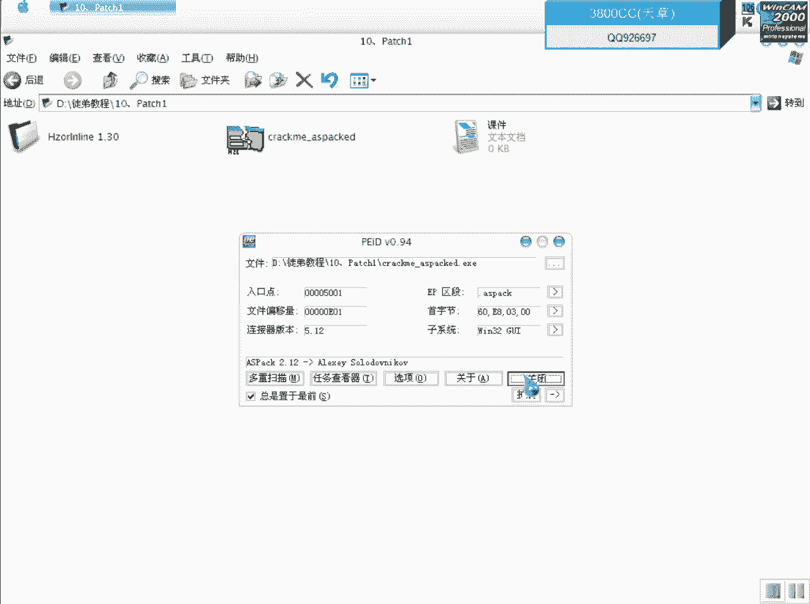
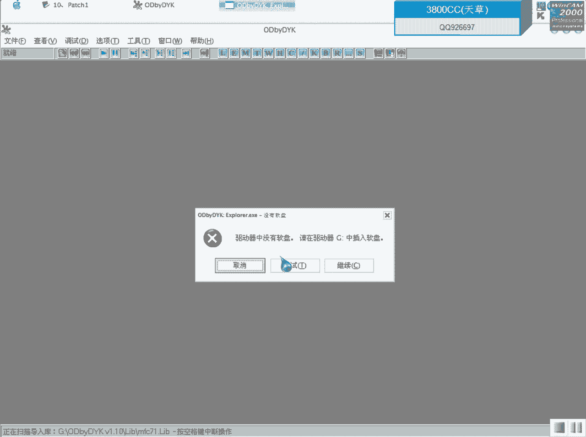
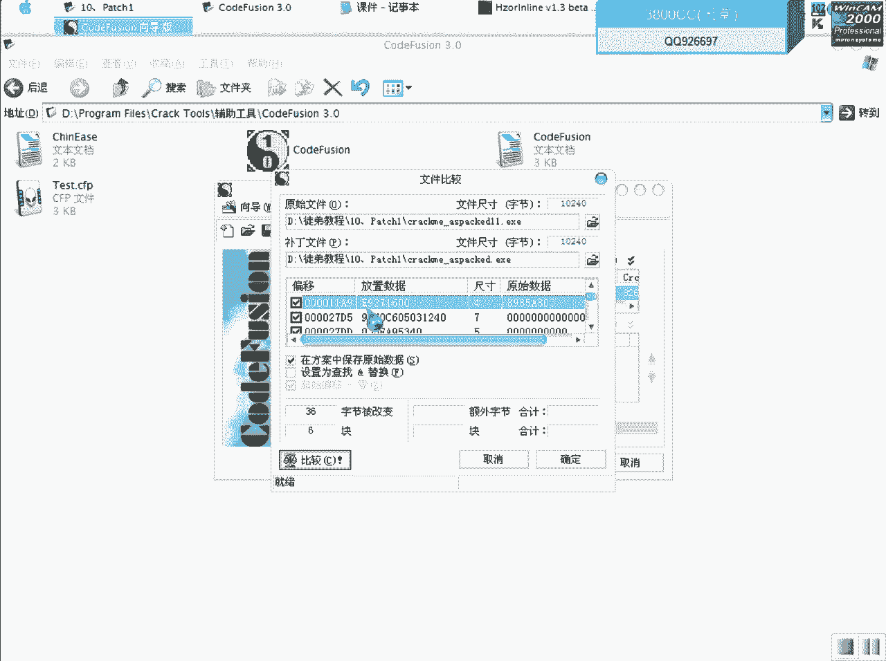
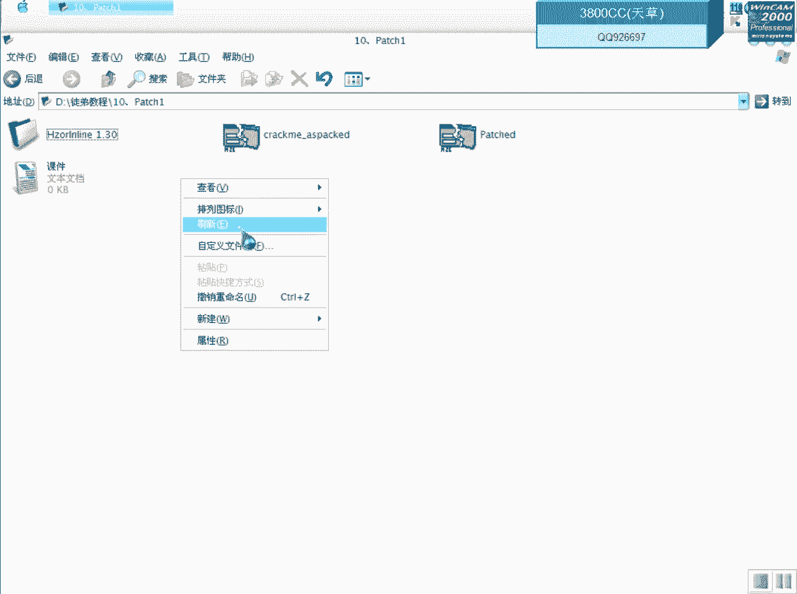
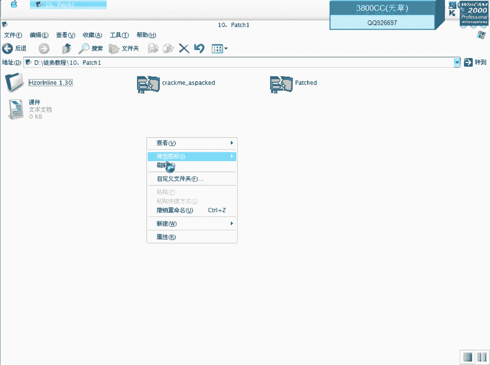

# 天草流初级破解教程 - P11：不脱壳破解入门 🛡️➡️🔓

在本节课中，我们将学习不脱壳破解的最简单途径。我们将使用一个特定工具，对一个加了ASPack壳的程序进行关键跳转的定位与修改，从而实现破解。整个过程无需完全脱壳，适合初学者理解基础的内存补丁原理。

---



## 课程概述 📋



本节课的目标是了解并实践一种不脱壳的破解方法。我们将分析一个带有ASPack壳的示例程序，使用OllyDbg（OD）定位关键代码，并借助一款专用工具直接对加壳程序打补丁。

---

## 工具与目标程序 🛠️

首先，我们使用一个名为“Kerami”的简单程序作为目标。该程序被特意加上了ASPack壳，并包含一个错误提示框。我们的目标是将其修改，使其显示正确的提示。

程序运行时的错误提示如下：


---

## 第一步：使用OD定位关键代码 🔍

上一节我们介绍了课程目标，本节中我们来看看如何使用OD进行分析。

将目标程序载入OllyDbg（OD）。


首先，我们需要到达程序的原始入口点（OEP）。这里采用ESP定律：在栈地址下硬件访问断点。

**操作**：在OD的命令行或寄存器窗口的ESP值上右键，选择“HW break[Access]”下断点。按F9运行程序，程序会中断在OEP附近。

删除硬件断点后，我们便可以在代码区进行分析。通过搜索字符串，可以找到错误提示和正确提示对应的代码位置。

双击错误提示字符串，OD会跳转到引用该字符串的代码处。其下方通常是显示正确提示的代码。在这两段代码之间，必然存在一个关键的判断跳转。

---

## 第二步：分析并修改关键判断 🧠

以下是找到的关键代码区域分析：

1.  在关键跳转之前，通常有一个`CALL`指令用于执行判断函数。
2.  紧随其后的便是一个条件跳转指令（如`JNZ`, `JE`），它决定了程序走向错误提示还是正确提示。

在本次示例中，我们找到了一个关键`CALL`和一个关键的`JZ`跳转。`JZ`跳转就是我们需要修改的目标。

按F8单步执行，会进入一个系统函数`GetDriveTypeA`，该函数用于获取驱动器类型。

**函数逻辑**：
*   函数返回值（通常放在`EAX`寄存器中）会与一个固定值（本例中是5）进行比较。
*   如果相等（`EAX == 5`），则跳转不发生，程序走向错误分支。
*   如果不相等（`EAX != 5`），则跳转发生，程序走向正确分支。

在调试器中，我们看到`EAX`的值是3，因此跳转发生，显示了错误提示。

**修改方法**：
我们可以修改两处中的任意一处来改变程序逻辑：
1.  修改比较的数值，将`CMP EAX, 5`中的`5`改为`3`。
2.  修改跳转指令本身，将条件跳转`JZ`（机器码`74`）改为无条件跳转`JMP`（机器码`EB`）。

在OD中直接修改后运行，程序即可显示正确提示。

---

## 第三步：使用补丁工具进行持久化修改 🧰

上一节我们在OD中完成了临时修改，本节中我们来看看如何使修改永久生效。由于程序加了壳，直接保存修改或复制修改后的代码到可执行文件会失败。

这时我们需要使用一个专门的补丁工具。该工具可以直接对加壳的程序文件进行补丁。



以下是使用该工具的核心步骤：


1.  **分析程序**：将目标程序拖入工具，点击“Chart”或分析按钮。工具会分析出加壳类型，并定位到OEP附近可用于注入代码的地址。
    *   输出信息类似：`OEP is around 004053A1A9`。

2.  **编写补丁脚本**：工具允许我们写入汇编代码和补丁数据。补丁数据的格式如下：
    ```asm
    p[地址] [字节1], [字节2], ...
    ```
    *   `p` 是补丁指令前缀。
    *   `[地址]` 是要修改的内存地址（虚拟地址VA）。
    *   `[字节]` 是要写入的机器码，多个字节用逗号分隔。

    例如，要将地址`00401204`处的`74 17`（`JZ`跳转）改为`EB 17`（`JMP`跳转），应写入：
    ```asm
    p00401204 EB, 17
    ```

3.  **生成补丁**：编写好补丁脚本后，点击工具的“Patch”或类似按钮。工具会自动备份原文件，并生成一个已打补丁的新程序。

---

## 第四步：验证与深入学习 ✅

补丁完成后，我们可以验证修改是否成功，并学习如何检查文件变化。

**验证**：运行新生成的程序，此时应直接显示正确提示。

**文件对比**：使用十六进制比较工具（如WinHex的“文件比较”功能）对比原文件和补丁后的文件。通过对比，可以清晰地看到在特定偏移地址处，字节数据发生了改变（例如`74`变成了`EB`）。

这种方法不仅用于破解，在软件安全领域（如免杀技术中修改壳的特征）也是一种重要的学习手段。

---

## 总结与展望 🎯

本节课中我们一起学习了不脱壳破解的初级流程：



1.  **定位**：使用OD配合ESP定律到达OEP，并找到程序的关键判断逻辑。
2.  **分析**：理解关键`CALL`和跳转指令的作用，确定需要修改的位点（比较值或跳转指令）。
3.  **工具补丁**：利用专用补丁工具，将修改以脚本形式持久化到加壳的程序文件中。

本节课介绍的是借助工具的初级方法。在后续课程中，我们将探讨更高级的技术，例如不依赖特定工具，直接编写Shellcode在内存中解码并修改程序，这对逆向工程的基础能力有更高的要求。





今天的课程到此结束，关键在于大家如何消化吸收这些基础概念，并为学习更复杂的技术做好准备。