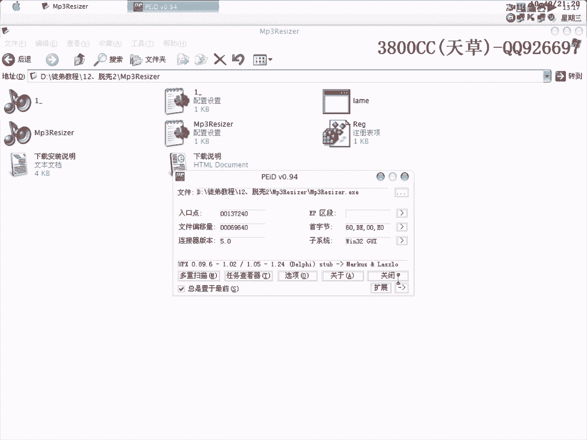

# 天草流初级课程 - P13：脱壳实战（二）🛡️

在本节课中，我们将学习针对三种不同加壳程序的脱壳实战技巧。课程将涵盖处理被修改的PE头、修复附加数据（Overlay）以及手动查找IAT（导入地址表）等核心内容。

## 处理被修改PE头的程序

上一节我们介绍了基础的脱壳概念，本节中我们来看看一个PE头被修改的程序如何处理。

用OD载入目标程序时，会出现错误提示。这是因为程序的PE头已被修改。正常的PE头以“MZ”和“PE”标识开头，而此程序的相关部分被完全改掉，这是加壳程序的一种反调试手段。

以下是处理步骤：

1.  设置OD，在系统断点处中断（选项 -> 调试设置 -> 事件 -> 系统断点）。
2.  打开内存窗口，在PE头所在的段（通常是00401000）下F2断点。
3.  按Shift+F9运行，程序将中断在系统领空。
4.  单步（F8）执行，配合F4（运行到选定位置）跳过循环，最终到达程序的原始入口点（OEP）。
5.  此程序由VB编写，OEP特征明显。使用脱壳插件（如OllyDump）进行转储（Dump）。
6.  由于壳被报毒，脱壳后可自行处理免杀。

## 修复带有附加数据（Overlay）的程序

接下来，我们处理一个带有附加数据（Overlay）的NSPack壳程序。

成功到达OEP并转储程序后，使用导入表修复工具（如Import REConstructor）进行修复时，发现指针很少，提示存在无效指针。这通常意味着程序有附加数据未被正确复制。

以下是定位和修复附加数据的步骤：

1.  使用查壳工具（如PEiD）确认程序存在Overlay。
2.  使用十六进制编辑器（如WinHex或010 Editor）打开加壳的原程序。
3.  找到最后一个区段（Section）的末尾。计算公式为：**区段起始地址（RVA） + 区段大小（Size） = Overlay起始文件偏移**。
4.  记录下这个偏移地址（例如 0x28400）。
5.  在十六进制编辑器中，从该偏移地址开始，选中直到文件末尾的所有数据，并复制。
6.  打开之前脱壳并修复的（不完整的）程序，跳转到文件末尾，将复制的Overlay数据粘贴进去。
7.  保存新文件，程序即可正常运行。

## 手动查找IAT及处理异常程序

最后，我们分析一个行为特殊的UPX壳程序，并学习手动查找IAT的技巧。

用OD载入程序后，利用ESP定律可以快速到达OEP。程序由BC++编写。但脱壳后的程序运行异常，需要手动修复IAT。

以下是手动查找IAT的步骤：

1.  在OEP附近的代码中，找到一个明显的系统API调用（例如 `call dword ptr [xxxxxxxx]`）。
2.  在该调用语句上按回车键（或右键 -> 反汇编窗口中跟随），跳转到该地址所在的内存区域。
3.  这片充满函数地址的区域就是IAT。向上滚动找到第一个函数地址，此处即为IAT的起始地址（RVA，例如 0x1010C）。
4.  向下滚动找到IAT的结束地址。计算IAT的大小：**结束地址 - 起始地址**。
5.  在导入表修复工具中，填入OEP、IAT的RVA和计算出的Size，然后点击“获取导入表”。
6.  如果发现无效指针，可以尝试将Size适当改大（例如取整为0x1000），或手动剪裁掉无效部分。

这个特定程序奇怪之处在于：脱壳后需要修复两次才能成功；其注册机制异常，注册信息似乎与输入无关且保存在特定注册表键值中。这需要后续进行专门的逆向分析来理解其逻辑。

---

本节课中我们一起学习了三种脱壳实战场景：修复被破坏的PE头、为脱壳程序追加Overlay数据，以及手动定位并修复IAT。掌握这些技巧能帮助你应对更多复杂的加壳保护。