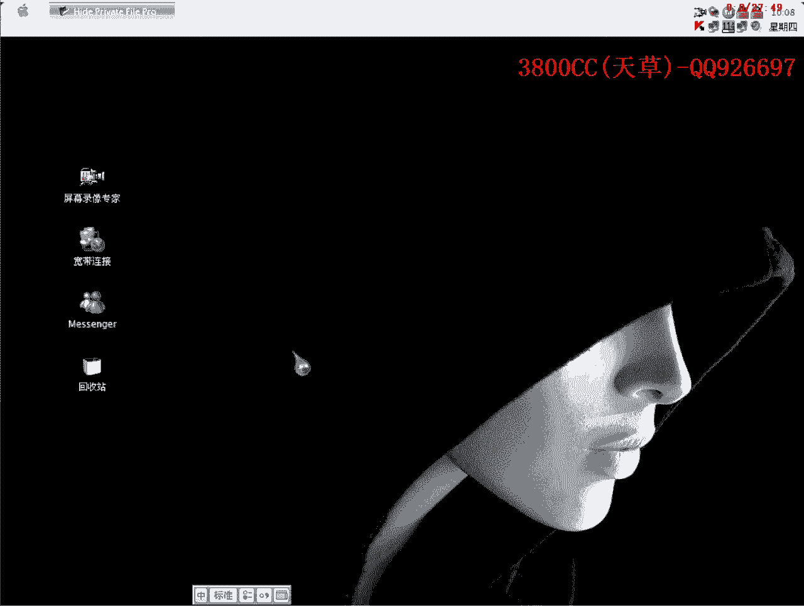
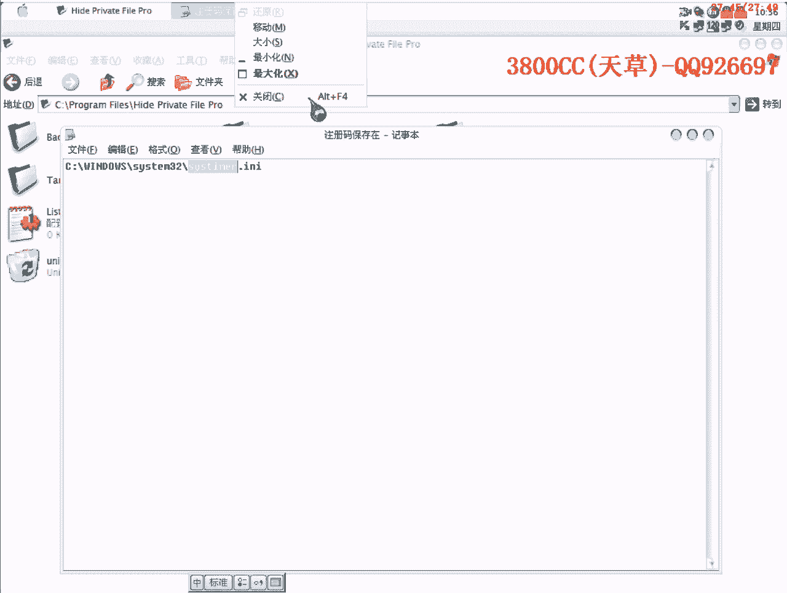

# 天草流初级 - P14：13、破解4 - 白嫖无双 - BV1qx411k7qA

大家好，現在來進行我們的第十三課。

第十三課教大家破解，其中當然這個是有可的程序，我們找的程序是pyramid的可，我教大家兩種方法吧，兩種方法都是不脫可破解，大家要掌握，先Od載入，咱們用第一種方法。

第一種方法就是我們在前面七八幾節課講的那種方法，載入之後直接f9運行，輸入3800cc，出現了一個錯誤提示框，f12暫停，找到最後面一個小卡，這個樣子我們其實可以在這個地方下斷點。

因為它這裡就是一個關鍵的跳轉，但是為了就是方便，為了就是我們分析的一種思路，要掌握好那種思路，咱們找到這個路口的頭，在這個地方下硬件執行斷點，因為它帶了可的，有時候下f2或者其他的斷點有時候會被消掉。

在f9運行起來，再點register，這樣就斷下來了，這個時候我跟大家說過，在破解的時候要時時刻刻注意這個框，一個返回邊框，然後這是一個注視框，再就是計存機框，還有一個對戰窗。

當然轉成窗口就是數據窗口也是要注意的，這個在後面會給大家講，在哪些算法哪些程序裡面，要特別要注意這些，注意這個轉成窗口，好，大家看到了，這樣就直接出現了我們的一個註冊碼了，這樣就直接出現我們註冊碼了。

它這裡是明碼比較，明碼比較，好，我們把它給複製下來，好，我們把它給複製下來，咱們還是照樣走一下，照樣走一下，這裡都不用管它，看這些系統API就知道，就知道不是一些重要的，不重要了，關鍵的地方。

我們要找的是找關鍵的地方，這裡開始，Santa Marcia Box，就是開始準備了，準備要，要開始，是錯誤提示還是正確提示了，這裡開始在循環，循環，相當於就是算法部分了，大家可以進去看一下。

進去看一下，看看有沒有什麼重要的地方，沒有，這個呢，因為是破解，它這有一個回跳，回跳大家不要用F4來打斷的，這裡是在算註冊碼，在算法過程，一個算法過程，大家不要耐心，要有耐心，有的朋友會說，跳來跳去的。

跳暈了，這個是必要的，嗯，直接按上鍵盤上的F8，因為我們現在是，不去分析它的一個算法，我就直接把這裡給飛過去吧，看一下，看一下後面的這個，為了節約時間，我把這個跳轉改掉，為了節約時間，這個。

這樣我們這個，這裡，這裡，這裡，這個結束還是有點長的，嗯，嗯，可能就是我剛才把那個跳轉打斷了，跳轉打斷了之後，現在就是一直都沒什麼結果，也沒出現錯誤的，也沒出現正確的，它又回到這裡來了，又回到這裡來了。

大家自己下去再跟一下吧，跟一下吧，這個跳轉不要打斷了，像這樣走下去要蠻久的時間的，這是我們的一個註冊碼，我就先不註冊了，免得再，進行第二種方法的時候，無法進行下去，這個呢，第二種方法，仍然是用那個，用。

不脫口破解，有的朋友可能會說，我在這裡不脫口破解，我就先到OEP去，先到OEP去，然後呢，再找，再找了一個錯誤的字符串，這個也是一種方法，也是一種方法，可以來先搜索一下字符串，這個也是一種方法。

剛才那個錯誤提示是register，這樣也可以找得到，也可以找得到，當然我現在不是按這樣來的，不是按這個樣子來，大家看清楚，我首先直接運行，直接運行，運行了之後，然後再點，這裡面的開玩笑CPU，然後呢。

再點模塊，因為這個程序大家看到了，ART+1，ART+1有很多模塊，因為這個程序運行起來，需要這些模塊，這個是主程序模塊，這些都是一些系統的一個，系統的一個一些一些，庫涵數，好，我們雙擊。

雙擊這個主模塊，好，這個樣子就可以來查找了，這樣就可以來查找字符串了，這樣就可以查找到了吧，那有的朋友可能會說，我就說我不按那些方法，不按前面那些操作來找，直接運行，運行了之後再查找，不行嗎。

好可以來看一下，大家看到了，這個樣子查找到的是沒有任何的，沒有任何的字符串，因為是加了可的，可以來試一下，找不到，找不到，我們還是按剛才那個方法來，ART+1，再來查找，這樣就可以查找到了。

然後register field，找到這裡，我們雙擊它，大家看到了，這裡是register success，就是註冊成功，這裡是一個錯誤提示，這裡是正確提示，那我們就回溯，怎麼回溯呢，那就是找上面的。

找這個程序入口，因為加了可的，所以這些都被這個可給混淆掉了，我們就找最清晰的一段，這就是Push EBP，最清晰的這一段就可以了，找這個也可以，找這個也可以，找這個吧，我們仍然是在這個地方下，一鍵斷點。

好輸入，好register，這個人斷下來了，斷下來了，我們走，彈幕走，這裡它是開始取我們的註冊名，這裡就是我們的註冊碼了，它把註冊碼取了之後，和這個相比較，這裡是相比較了，看到了吧，大家看到了。

這是把EX和EDX，一個錯誤的註冊碼，和一個正確的註冊碼相比較，大家看一下，跟我們剛才對應的註冊碼是一樣的，K5，沒錯是一樣的，大家這裡就可以知道了，也可以做一個，內存註冊機，大家看到了，是在這個地址。

0041，D412，0041，中斷次數就填1，D字節，就是這個18，長度，長度就是189975F1FF，每兩個字母是一個字節，18是一個，99是一個，75是一個，F1FF，這總共是五個，這裡填5。

這個我在黑鷹的課程裡面也有講，怎麼樣做，怎麼樣做，這裡呢，剛才大家看到了，這裡不要選，不要選這一塊，因為這個1。73的這個版本的，這個註冊機，這個東西，它有那麼一點缺陷，有那麼一點缺陷。

這一塊是多餘的了，你要是把這裡也選了之後，將會出現兩段相同的註冊碼重複了的，好，咱們選這裡，計算機方式呢，計算機方式就是EDX，就是我們出現出現我們真正的註冊碼的時候，那個計算機，EDX。

這裡面是十進制還是十六進制，大家都可以來試一下，這裡是十六進制，來試一下吧，還有用戶信息啊，什麼之類的，都可以試一下，生存，因為我這個，它在生存出了之後，那個卡巴會爆病毒啊，我先把卡巴給關掉，好生存。

它這裡有模式啊，模式，Key Gate啊，好，可以來看一下，可以來看一下，好，我們在這裡面是這個樣子，3200CC，輸入假的，它這裡出現是真的，出現是真的，但是這個真的是不對的，不對的，不對的，不對的。

我們來檢查檢查一下，到底是哪裡出了問題，這裡是ASCAM值，好，生存，EDX，十進制吧，計算機方式啊，估計計算機方式是不行的啊，計算機方式不行的，那麼它這出現的是註冊，出現的是字母，可以來試一下。

仍然是不行的啊，不行的計算機方式，不行啊，那我們這裡就需要把它改成，改成內存方式，EDX，這裡寬字節呢，因為現在啊，現在這裡是ASCAM，ASCAM並不是寬字節，如果這裡是，Unicode的話。

就選上寬字節啊，好，再來看一下啊，這樣才對的啊，為什麼啊，我就是說，故意做這幾種，做這幾種就是錯誤的一種，現象給大家看就是，1啊，來把這個打開看一下，1呢就是這裡面，這裡面大家不要，不要把這個也勾上。

好我們可以來試一下，把這個也勾上啊，計算機方式，計算機方式也勾上，這裡面也打上勾，我們來看一下，結果是怎麼樣子的，大家看到了吧，出現了同樣的兩個，兩個同樣的註冊碼，這就是說是這一個，註冊機生成器啊。

辨寫器的一個漏洞吧，把這個地方也改一下，然後我們來看一下，這個註冊機的註冊碼，這個註冊機的註冊碼，這個註冊機的註冊碼，這個註冊機的註冊碼，這個註冊機的註冊碼，把這個地方也改一下，這裡要去掉，好。

一就是這個地方，第二個呢，到底是選內存方式，還是計算機方式，有這樣幾種標準，第一個就是啊，如果就是說我們的註冊碼，是字母啊，字母組成的，含有字母組成的話，是要用內存方式，如果是，就是說像我們這樣的。

ASCII 1 2 3 4 5 6 7 8 9 0，這樣的，那就是計算機方式了，計算機方式了，這個大家要記著，還有一點，就是說，如果這裡是UNICODE寫的，ASCII這個註冊碼。

還是前面寫的是UNICODE的話，我們就必須選上這一個，選上這一個，就這幾點需要注意的了，好，這就是我們的內存註冊機了，內存註冊機，他這裡就是把那兩個進行比較，你看比較不對，不對了之後。

然後就跳過了這個註冊成功了，跳過這個註冊成功了，我們可以再來看一下吧，再來看一下，就是說看一下具體的算法，走，走慢一點啊，走慢一點，這裡啊，開始去，開始取用戶名，把用戶名給EX，放放入計算機裡面了。

這裡面啊，這個就不用管了，33，他這裡開始吧，就說取第一個，3嘛，3800CC的3，3的那個ASCII碼，就是ASCII碼是33，是33，這個我靠我們進去看一下，進去看一下，他這裡開始取了。

EX裡面只是我們的用戶名，有些地方不需要，不需要我就不說了，大家看了因為代碼太多，大家要是一句一句去看的話，分析一個軟件需要很長很長時間，3800CC，這個地方還不是算法的關鍵，還不是算法的關鍵。

他這裡開始有這些鬼東西了，這開始算出來了，從這個地方開始就是算法的關鍵了，今天我就不講算法了，因為這個樣子講的話，大家感覺肯定是非常吃不消的，吃不消的，這裡開始就比較出來了，比較出來了，這取加碼。

這個是去增碼，當然就是說大家要爆破的話，把這個改掉就可以了，把這個陸服掉就可以了，爆破的話把這個陸服掉就OK了，好那麼今天這個課程就這麼多，就這麼多講了兩種方法，大家要好好吸收一下。

我們來看一下這個註冊碼是正確的，註冊碼是正確的，FullHR，Registered User Name 3800CC，這個軟件，國外的一些軟件，我發現一些問題就是國外的一些軟件，做的都比較精緻。

他現在這個軟件用的一個介面，用的介面是蘋果的介面，我這裡也有，註冊碼他保存在哪些地方了，保存在哪些地方了，大家可以找一下，看一下他這個原先的目錄裡面，再看一下，要是這原先目錄裡面，一些文件裡面沒有的話。

那就是，那就是那個註冊表裡面了，註冊表裡面了，好我們在註冊表裡面來找一下，搜搜我們剛才的註冊碼，在前面也給大家說過，有的程序啊，他是把那個用戶名和註冊碼進行某種，運算加密之後再存註冊表裡面。

我們來試一下，看一下這個是不是這個樣子的，到底是直接存入還是怎麼樣，找不到啊，找不到我們就找這個，可以來看一下，看一下程序裡面會不會有什麼線索，直接運行吧，直接運行了之後，我們來找裡面的字符串。

看一下字符串裡面有沒有什麼線索啊，找註冊表，這個裡面在，在，估計是存到這些文件裡面去了，咱們來搜索一下，看一下，搜索這個呢，搜索這個吧，SYSTU，SYSTU，user，user，user，IMER。

非常高級啊，咱們來看一下，再不就是在這個文件裡面，可以來看一下，26，26，把他刪掉看一下，再找，SYSTIMER，這個也是，也是在這裡面，在這個裡面，大家看到了吧，這個，那個。

數字碼數字碼是保存在這個裡面的，SYSTIMER，這個裡面，我們把它刪掉，刪掉來看一下，大家看到了吧，把它刪掉之後，就這個就就沒有註冊了，那我們用另外一種思路啊，另外一種思路，我們來試一下，試一下。

讓他生成一個這個文件看一下，我們偽造一個文件看一下吧，偽造一下，好，偽造一個，然後再放到這個目錄裡面去，看一下會有什麼情況，不行的，偽造是不行的，他肯定是重啟的時候，啟動的時候還會進行一種運算。

大家就下去啊，下去再好好練習一下，練習完了之後呢，註冊了之後就把這個刪掉就可以了，或者把裡面清空也就可以了，好了今天課程就到這啊。

