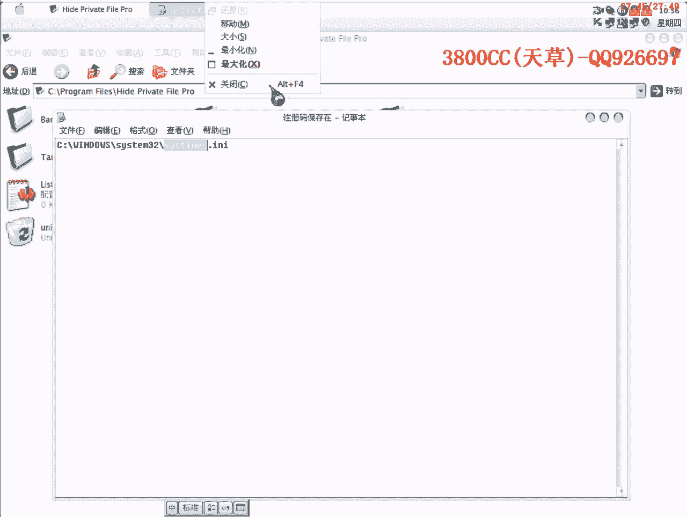

# 天草流初级破解教程 - P14：第13课 - 不脱壳破解实战 🛡️💻

在本节课中，我们将学习两种不脱壳破解加壳程序的方法。我们将以一个名为“pyramid”的加壳程序为例，通过实践掌握查找关键跳转、定位注册码以及制作内存注册机的核心技巧。

---

## 方法一：动态调试定位法

上一节我们介绍了课程目标，本节中我们来看看第一种破解方法：通过动态调试直接定位注册码。

首先，使用OllyDbg载入目标程序，直接按F9运行程序。

在程序界面输入假注册码“3800cc”，此时会弹出一个错误提示框。

按F12暂停程序执行，在调用堆栈中找到最顶层（最后面）的一个调用。

虽然可以直接在该处下断点，但为了掌握通用的分析思路，我们选择找到该调用入口的头部。

由于程序带壳，普通断点（F2）可能被清除，因此我们在该入口处下一个硬件执行断点。

按F9继续运行程序，然后在程序界面点击“Register”按钮，程序将在所下断点处中断。

在破解过程中，需要时刻关注几个关键窗口：
*   返回边框（调用堆栈）
*   注释框
*   寄存器窗口
*   堆栈窗口

此外，数据窗口（可通过右键转成窗口查看）在后续分析某些算法时也至关重要。

中断后，在寄存器或数据窗口中可以直接看到明码比较的注册码。将其复制保存即可。

为了理解程序流程，我们可以继续单步（F8）跟踪。程序会进入一个循环，这是其算法部分。

以下是跟踪时需要注意的要点：
*   算法部分可能较长，需要耐心。
*   遇到循环回跳时，不要使用F4（运行到选定位置）跳过，以免破坏流程。
*   如果只求注册码而非分析算法，可以尝试修改关键跳转来快速到达结果判断部分。

我们成功获取了注册码，但暂时不进行注册，以便演示第二种方法。

---

## 方法二：内存注册机制作法

上一节我们通过调试找到了注册码，本节我们学习第二种方法：制作内存注册机，以自动获取注册码。

首先，让程序运行起来，然后按`Alt+E`打开模块列表。

在模块列表中找到程序的主模块（通常是.exe文件本身），双击进入其代码空间。

此时，即可在该模块中搜索字符串。搜索“register”找到相关提示信息。

双击“Register success”或错误提示字符串，反汇编窗口会跳转到相应代码附近。

在加壳程序中，代码可能被混淆。我们需要向上查找一段清晰的代码起点（通常是`PUSH EBP`）。

在该清晰代码段的起始处下硬件执行断点。

在程序界面输入假注册码并点击注册，程序将中断。

单步跟踪，程序会读取我们输入的注册名和注册码。

关键指令出现在比较环节：`CMP EDX, EAX`。其中一方是输入的假码，另一方即是正确的注册码。

确认EDX或EAX中的值与我们方法一找到的注册码（例如`K5...`）一致。

接下来，基于此地址制作内存注册机。关键中断地址是`0041D412`。

内存注册机设置如下：
*   **中断次数**：1
*   **指令字节**：`18 99 75 F1 FF`（即比较指令机器码）
*   **长度**：5
*   **寄存器方式**：选择`EDX`（存储真注册码的寄存器）
*   **内存方式**：如果注册码包含字母，应选择“内存方式”；如果仅为数字，可选择“寄存器方式”。
*   **宽字节**：如果注册信息是Unicode编码，需勾选此项；本例为ASCII码，无需勾选。

**注意**：某些注册机生成器版本（如演示所用的）存在界面显示瑕疵，避免勾选无关的选项，否则会导致生成的注册码重复。

生成注册机后，运行它。在目标程序中输入任意注册码，注册机将自动弹出正确的注册码。

---

## 知识总结与要点回顾 🎯

本节课我们一起学习了两种不脱壳破解加壳程序的技术。

**核心要点总结：**
1.  **动态断点**：在加壳程序中，硬件执行断点比普通内存断点更可靠。
2.  **关键比较**：明码比较的指令（如`CMP`、`TEST`）附近是破解的突破口，真注册码通常存放在某个寄存器或内存地址中。
3.  **内存注册机原理**：通过拦截程序在特定地址、特定时刻的比较操作，直接读取存放正确结果的寄存器（如`EDX`）或内存地址的值。
4.  **注册机设置**：
    *   地址和中断次数来自调试器。
    *   **寄存器/内存方式选择**：`字母注册码 -> 内存方式`；`纯数字注册码 -> 寄存器方式`。
    *   **宽字节**：根据程序字符串编码（Unicode/ASCII）决定是否勾选。

**额外发现**：目标程序将注册信息加密后保存在其目录下的一个特定文件（如`SYSTIMER`）中，而非注册表。删除该文件即取消注册。手动伪造该文件无效，因为程序启动时会重新校验。

请结合实操练习以巩固本课内容。熟练掌握这些基础方法，是理解更复杂逆向工程技术的基石。