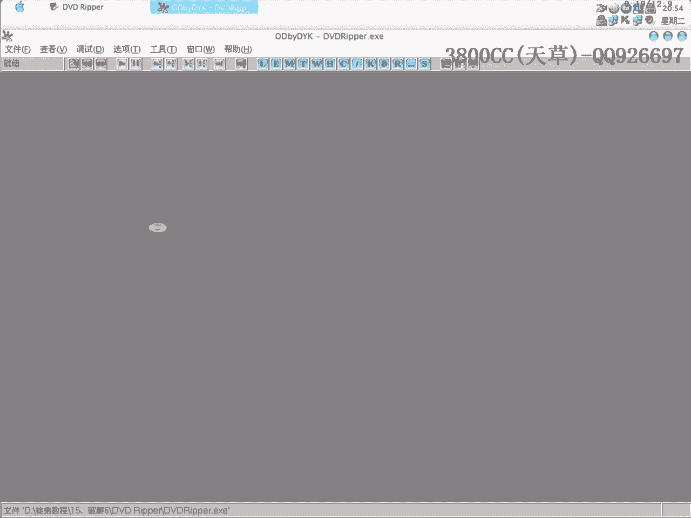

# 天草流初级破解教程 - P16：第15课 - 实战破解“PDF转Word”程序 🔓

在本节课中，我们将学习如何对一个名为“PDF转Word”的软件进行破解实战。我们将通过分析其注册验证流程，找到关键跳转或算法，并演示几种常见的破解思路与方法。

---

## 概述

本次破解的目标是一个PDF转Word文档的程序（版本3.4.0）。程序运行后需要注册，输入任意邮箱和序列号会提示“序列号错误”。我们将使用调试工具，通过分析字符串、关键比较和堆栈调用，来绕过或理解其注册机制。

---

## 第一种方法：字符串查找与关键跳转修改

上一节我们概述了目标程序。本节中，我们来看看第一种破解思路：通过程序提示的错误信息字符串来定位关键代码。

程序弹出“序列号错误”的提示框。我们可以在反汇编工具中搜索这个字符串。




以下是搜索和定位的步骤：

1.  在反汇编工具中搜索字符串“序列号错误”或“Invalid”。
2.  找到引用该字符串的代码位置，通常在附近会有条件判断跳转。
3.  分析该处的跳转逻辑，判断是跳过成功流程还是失败流程。
4.  通过修改跳转指令（例如将`JNZ`改为`JZ`，或直接`NOP`填充），使程序执行注册成功的分支。

在本次实战中，搜索字符串后，我们找到了两处关键跳转。经过分析，其中一个跳转负责在比较失败（序列号错误）时跳过成功提示。我们修改了这个跳转，使其失效。修改后，程序不再弹出错误提示，而是显示“感谢您注册”。

**关键修改点伪代码表示：**
```assembly
CMP ESI, EDI        ; 比较用户输入的序列号与正确序列号
JNZ SHORT FAIL_LABEL ; 如果不相等，则跳转到失败处理
... (成功注册的代码) ...
FAIL_LABEL:
... (弹出错误提示的代码) ...
```
**修改思路：** 将 `JNZ` (不相等则跳转) 修改为 `JZ` (相等则跳转) 或直接`NOP`掉，使程序无论对错都继续执行成功流程。

---

## 第二种方法：堆栈调用回溯法

如果字符串查找不直接，我们可以尝试另一种通用方法：当程序弹出错误提示框时暂停，然后查看堆栈调用链。

以下是此方法的操作流程：

1.  运行程序，输入假的用户名和注册码，点击“注册”按钮。
2.  当错误提示框出现时，立即切换到调试器，按`F12`暂停程序执行。
3.  查看调试器的“堆栈”窗口，这里显示了程序执行到当前状态所经过的函数调用序列。
4.  从堆栈调用链的底层（即最早被调用的、靠近系统API的函数）向上层查找，找到属于程序自身模块的、最接近弹出对话框的那个`CALL`指令。
5.  在这个`CALL`指令的上下文中进行分析，通常就能找到进行序列号验证的关键比较代码。

这种方法不依赖于特定字符串，是从程序行为（弹出对话框）反向追踪代码的通用技巧。

---

## 第三种方法：API断点法

除了暂停法，我们还可以主动在可能被调用的关键API函数上设置断点。这对于有注册信息保存行为的程序尤其有效。

以下是设置API断点的步骤：

1.  在调试器中，对诸如`MessageBox`（弹窗）、`RegQueryValue`（查询注册表）、`GetDlgItemText`（获取文本框内容）等函数设置断点。
2.  `F9`运行程序，输入注册信息并点击注册按钮。
3.  程序在调用这些API时会被断下。例如，在`MessageBox`断下时，我们就能回溯到是哪个验证函数调用了错误提示。
4.  同样，通过分析该函数上下文，定位核心验证代码。

在本次示例中，我们曾尝试在注册表相关API下断点以寻找注册信息存储位置，但未在该程序中发现。这提示我们，该程序的注册验证可能仅是内存验证，未将状态写入系统。

---

## 总结

本节课中，我们一起学习了针对一个具体软件的三种破解实战思路：


1.  **字符串查找法**：直接搜索程序界面显示的字符串，快速定位关键代码，适合有明确提示信息的程序。
2.  **堆栈回溯法**：在程序发生特定行为（如弹窗）时暂停，通过调用堆栈反向追踪至验证逻辑，是一种通用性强的动态分析方法。
3.  **API断点法**：对关键系统函数下断点，拦截程序行为并分析上下文，常用于分析程序与系统的交互。


通过修改关键跳转，我们成功绕过了该PDF转换工具的注册验证。需要注意的是，本教程仅用于学习逆向工程技术与软件保护原理，请勿将此类技术用于破坏合法软件的授权机制。