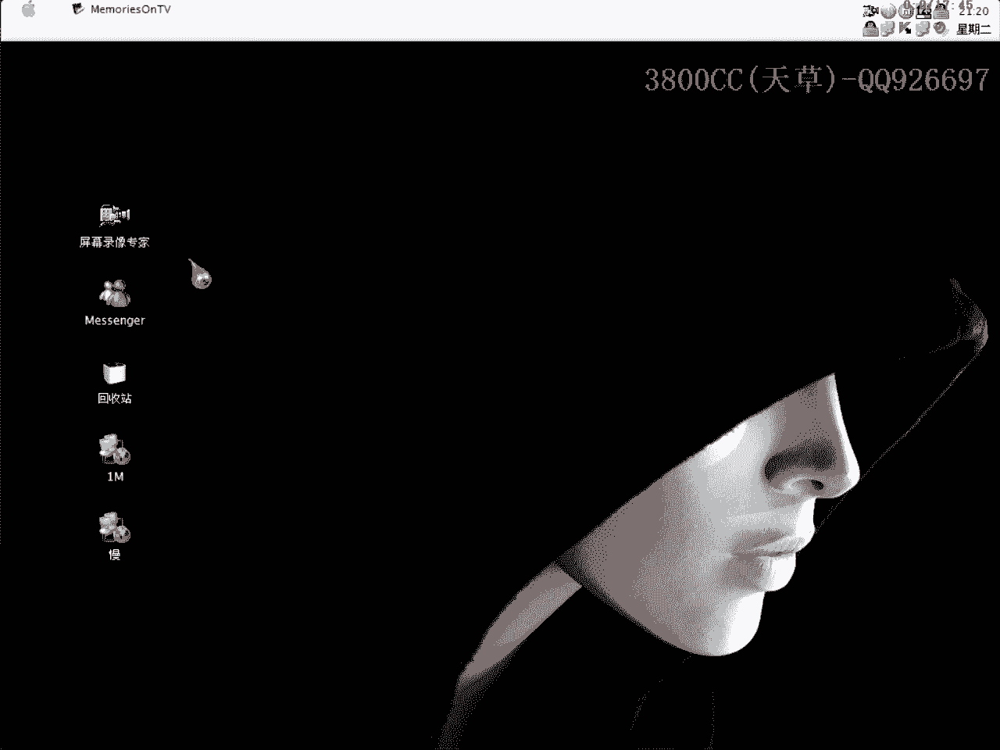
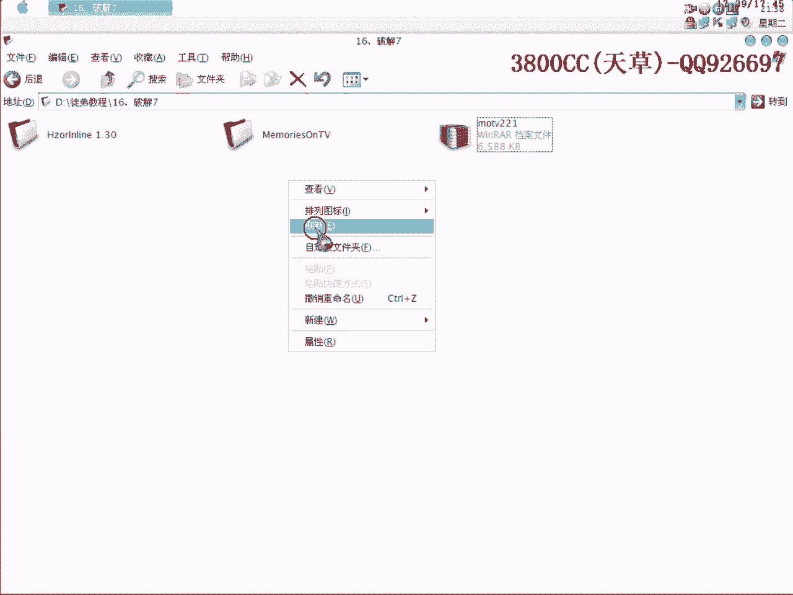
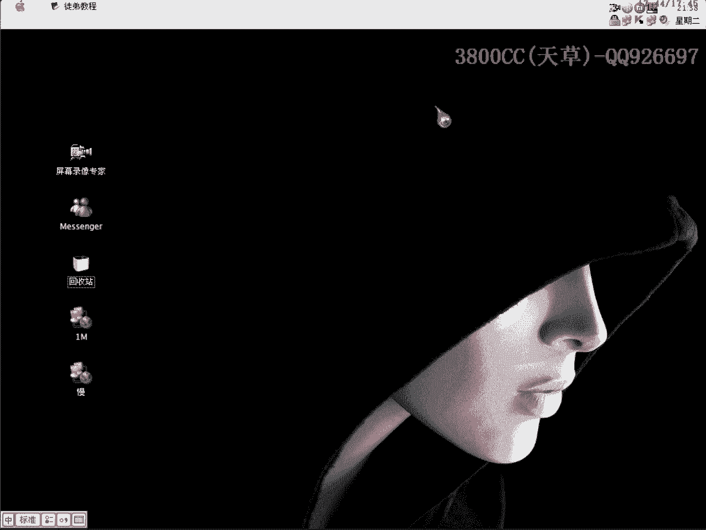

# 天草流初级 - P17：16、破解7 - 白嫖无双 - BV1qx411k7qA

大家好，現在進行第16課，破解這麼一個程序。

這個程序是有一點怪的，怪在哪裡等一下再說，先來查一下，Upx的，大家可能看到Upx就覺得應該是非常簡單，但是這個可能是需要有一點注意的，有點奇怪，它這個函數是相當相當多，我們就來看一下。

直接用ESP定律，刪除斷點，這個要記得，因為這個脫口文件我已經脫好了，那我就來演示給大家看一下，怪在哪個地方，大家看一下，相當相當多的指針，看到了吧，這個import iec開始有點卡了，大家看到了。

7885個是無效的，那怎麼辦，用剪切，我剛才試了一下，因為指針太多了，用剪切要等好久的，直接用刪除，這樣就可以了，直接用刪除，你要是用剪切也可以，要是機器配置好一點也可以，就是需要這裡注意一點，好。

我這裡就用不脫口來找一下關鍵地方，繼續吧，直接運行起來，大家在下面用脫口的文件試一下，不脫口的文件也自己找一下，在這裡，invalid就是失用的意思，這裡呢，sorry，記不記得了，好，把這個記下來。

每次輸入都很煩，好，我們點OK，錯誤的，暫停，進去這個也行，大家看到了，這個是錯誤的，這個就是正確的了，那這個呢，就是我們的一個跳轉了，在這裡，直接再運行一下，這裡開始對照了，我們加碼，8位的吧，加碼。

看一下這裡，看有沒有可疑的，這裡我們進去看一下，這裡呢，大家也來走一下吧，大家看到了，從這裡走過來之後，就完全沒有任何信息了，那我們要怎麼樣來走呢？看清楚啊，這裡是跳轉了，沒有讓他返回去。

這個跳轉是一定要讓他跳的，要是不跳的話，返回去我們就改不了啊，我們還是單步走，這個跳轉呢，我們也是要讓他跳的，改成jump，我們做一下記錄吧，原先是這個樣子吧，改jump，我這裡就不用改了。

直接改標示位，大家看到了，這裡對戰這裡面，有一堆什麼東西啊，其實這一段就是算法了，大家可以自己看，自己的仔細看一下，這一串數字呢，大家可能會說這一串數字是註冊碼，這一串好像不是的，可以拿來記錄一下。

可以看一下，大家看到了，這裡有個567890，就是我們剛才說的錄音夾，取了後面幾位，再看一下這個，CMP，大家應該知道這個就是跳轉了，就是比較了，我們再單步走，剛才那個跳轉，我們是要讓他不要跳。

也就是說讓EX為1，我們再走一下，到這裡來，大家看清楚啊，下面就用分析了啊，在這個地方啊，因為我們需要註冊成功的話，就需要EX等於1，好，我們看一下，這裡其實啊，開始的時候EX是為1啊，到這裡來。

EBX就為0了，EBX就為0，好，我們慢慢走，注意這裡啊，大家再看這一行啊，這裡呢，EX為0了啊，那他這裡呢，是Move EBX啊，那麼EX也就為0了，也就是說我們實現了這個跳轉的話，就不行了啊。

把這個複製下來啊，那我們就是說，讓他不實現的話，來看一下，單步走，就是以1給EX，這裡呢，他就把1給EX了啊，這樣我們就註冊成功了，大家看到了吧，也就是說這個跳轉不能跳啊，不能跳，改成9090。

就是loop掉啊，那好，我們現在就說來做一個類似註冊機啊，就是類似補丁來看一下，(補丁)，我這裡就填兩個，這裡是743，誒，37，7437，一個吧，就一個吧，要把它改成jump就是EB了啊，EB了啊。

大家不行可以看一下，看一下，我改這個地方看一下，就是EB了啊，EB了，這裡呢，是7507啊，兩個，7507，咱們把它改成，就是說讓他不要跳了，9090，好，這個樣子咱們來生成一個load啊，看一下。

有沒有好看的load啊，好，咱們呢，現在就從這個裡面退出來啊，因為將來可能啊，將來可能你再重新那個的話，他這個斷點就失效了，也就是說如果我們要啟用斷點的話，必須首先在這個裡面啊，右鍵把它激活啊，好。

我們來看一下效果吧，誒，是這個嗎？是不是這個，看一下，哦，錯了錯了，大家看一下，大家看到了，Win126啊，126，但是還有一個非常奇怪的問題就是說，如果我用load的話，load的話。

他就自動給Tumblr為註冊了啊，就是說我註冊那個名字嘛，這個因為我是原先破解的啊，原先我是用Win126那個郵箱啊，大家看到了，Win126啊，但這個程序怪就怪在一個地方啊，怪就怪在一個地方。

就是說在使用load的情況下啊，他才註冊啊，我們來直接運行原程序，這就沒有啊，沒有註冊了，而且我們還可以就是說，通過直接parch的方法啊，我們來試一下啊，看一下能不能，這個我們在上面parch這個。

用這個來試一下啊，upx的，這個時候我們需要在這個地址，忘記格式了啊，是p啊，沒錯，是給eb啊，這個地址呢，我們為了方便啊，就給9090吧，load open啊，開的od了啊，也不對啊。

我們來看一下情況啊，這不是嗎，不對啊，conload放了，這什麼意思呢，無法打開文件，出了一點問題啊，其實打不開文件，又可以了，好奇怪啊，這個樣子，好像軟件剛才出了一點問題啊，我們再來單獨看一下。

這個樣也可以，也可以的啊，大家看到直接parch也可以的啊，刪掉，就是加上這麼兩行啊，就加上這麼兩行，這另外啊，另外大家可以就是說，直接把這個托克的文件啊，直接改了一個地方，包括就可以了。

關於他這個顯示的註冊信息啊，就是那個地方啊，如果就是說，他這個地方顯示一個註冊信息，就是你在第一次收錄那個假的一個註冊信息啊，大家看到這是我第一次收錄的假的信息，他就存到某個地方出來，這個也不深究了啊。

那大家可能就會，大家還有一個問題啊，就是說我每次，每次啊，每次就是說，都會放一個安裝文件和一個壓縮包啊，這個是需要安裝的一個，這個需要安裝的，都是一樣的東西，就是說我給這個呢，大家就是說。

就我個人的習慣啊，我不太喜歡多裝一些軟件這個樣子，你們要是有不喜歡裝軟件的話，先運行一下這個裡面，看一下能不能運行啊，要是能夠運行，就說明他是一個綠色的軟件啊，綠色軟件，就可以直接用他了，不需要安裝。

如果不能運行的話，就安裝了嘛，這是為了大家方便嘛。

好，那今天課程就到這，再見。

