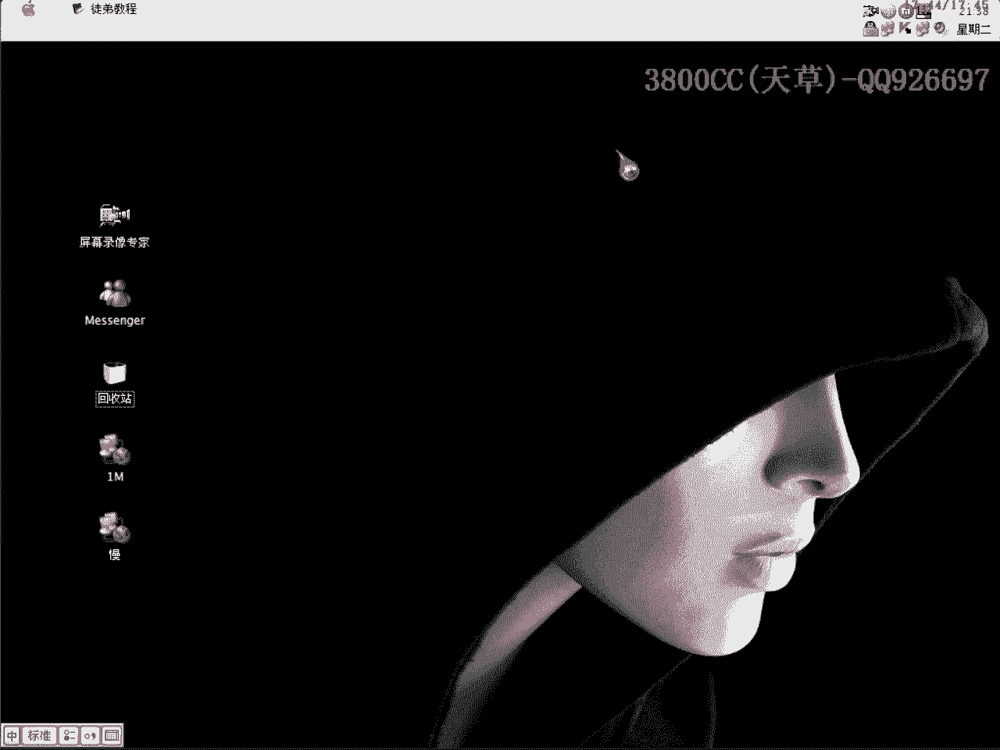

# 天草流初级破解教程 - P17：第16课 - 破解实战7 🔓


在本节课中，我们将学习如何破解一个使用UPX加壳的程序。这个程序有其特殊之处，我们将通过分析其注册验证逻辑，找到关键跳转并制作补丁，最终实现软件的“白嫖”。

---

## 概述

本节课的目标程序是一个经过UPX加壳的软件。虽然UPX壳通常很容易脱掉，但这个程序在脱壳后存在大量无效指针，需要特殊处理。我们将学习如何在OD（OllyDbg）中定位关键的注册验证代码，分析其算法，并通过修改关键跳转来实现破解。

---

## 第一步：查壳与脱壳处理

首先，我们检查目标程序，确认它使用了UPX加壳。


使用ESP定律可以快速定位到程序的原始入口点（OEP）。成功到达OEP后，我们可以使用OD的插件进行脱壳。

然而，这个程序脱壳后存在一个奇怪的现象：导入表中有大量无效的指针。

以下是处理无效指针的步骤：
*   在OD的导入表修复窗口中，你会看到大量标记为“无效”的指针。
*   不要使用“剪切”功能，因为指针数量过多会导致等待时间很长。
*   直接使用“删除无效指针”功能即可快速清理。

处理完毕后，保存脱壳后的文件。

---

## 第二步：定位关键验证代码

上一节我们处理了程序的壳。本节中，我们来看看如何找到验证注册码的关键代码。

我们可以直接运行未脱壳的程序，在OD中尝试触发注册错误。当弹出错误提示框时，暂停程序，在调用栈中寻找可疑的调用。

另一种方法是，在脱壳后的程序中直接搜索字符串，例如“invalid”、“sorry”或错误提示信息，从而定位到验证函数。

找到关键函数后，开始分析代码。在输入假注册码并点击确定后，程序会进行一系列比较和计算。

---

## 第三步：分析算法与关键跳转

我们找到了验证函数，现在来深入分析其逻辑。

通过单步跟踪（F8），我们观察寄存器和跳转的变化。程序的核心验证逻辑通常围绕一个最终决定成功与否的比较指令（如 **`CMP`**）和条件跳转指令（如 **`JZ`** 或 **`JNZ`**）。

在本次分析中，我们跟踪到一个关键点：
1.  程序将我们输入的用户名或注册码进行某种运算。
2.  运算结果会影响 **`EAX`** 或 **`EBX`** 等寄存器的值。
3.  随后，一个 **`CMP`** 指令会比较某个值（可能是计算出的结果与正确结果）。
4.  根据比较结果，一个条件跳转指令（例如 **`JNZ 0045XXXX`**）会决定程序是走向“注册成功”还是“注册失败”的流程。

我们的目标是让程序走向成功分支。分析发现，当 **`EAX`** 寄存器值为1时，后续流程会判定为成功。因此，我们需要让那个关键的条件跳转**不执行**（即实现“不跳转”）。

---

## 第四步：修改程序与制作补丁

上一节我们确定了关键跳转。本节我们将通过修改二进制代码来绕过验证。

找到关键跳转指令的地址，例如：**`0045XXXX: 75 07 JNZ SHORT 0045XXXX`**。
*   **`75`** 是 **`JNZ`** 的操作码。
*   我们的目标是将它改为无条件跳转（**`EB`**）或直接空操作（**`NOP`**）。
*   在OD中，右键该行代码，选择“二进制”->“编辑”，将 **`75 07`** 修改为 **`EB 07`**（跳转）或 **`90 90`**（两个NOP指令，相当于什么都不做）。

修改后，保存更改到可执行文件，或制作一个补丁（Loader）。

以下是制作补丁（Loader）时需要写入的修改内容示例：
```
地址: 0045XXXX
原始字节: 75 07
修改为: 90 90
```

运行修改后的程序或加载补丁，输入任意注册码，验证是否显示注册成功。

---

## 第五步：程序的特殊行为与总结

我们成功破解了程序，但它表现出一个特殊现象：只有在运行我们制作的补丁（Loader）时，才会显示为已注册状态；直接运行修改后的主程序，注册信息可能不生效或需要重新输入。

这可能是因为程序将注册信息（如我们第一次输入的假用户名）加密存储在了某个特定位置（如注册表或文件），而补丁直接模拟了已注册的状态。对于这个行为，我们本节课不做深入探究。

最后，提供给大家的软件包通常包含安装程序和绿色压缩包。这是个人习惯，为了方便不喜欢安装软件的用户。你可以先尝试运行绿色版，如果无法运行，再使用安装程序。


---

## 总结

在本节课中，我们一起学习了：
1.  处理UPX脱壳后产生的海量无效指针。
2.  通过错误提示定位软件验证函数。
3.  动态跟踪分析注册验证的算法逻辑，并找到决定成败的**关键跳转**。
4.  通过修改二进制代码（将条件跳转 **`JNZ`** 改为 **`NOP`**）来绕过验证。
5.  制作补丁并理解了目标程序可能存在的特殊注册信息存储机制。


破解的核心思路始终是：**定位关键判断，并改变其执行流程**。希望本课能帮助你更好地理解这一过程。



