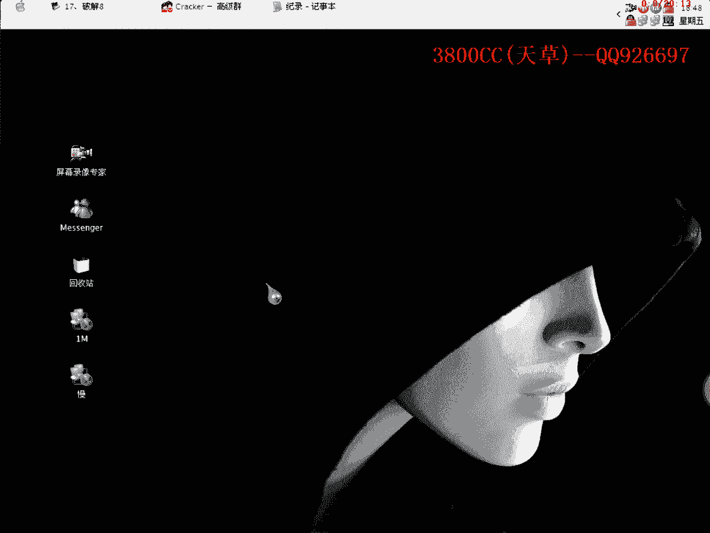
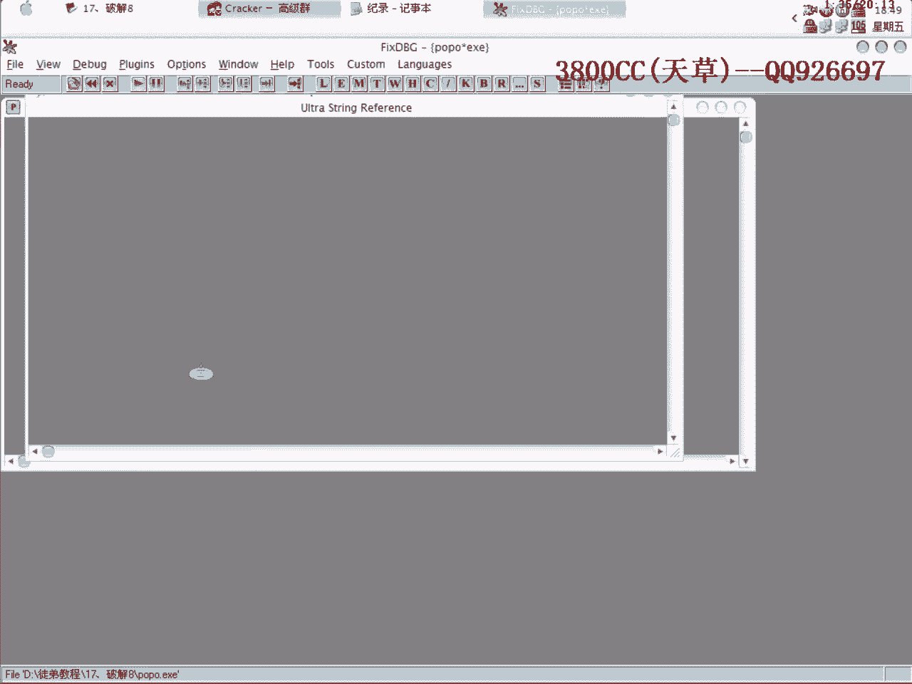

# 天草流初级破解教程 - P18：第17课 - 破解次数限制与重启验证 🔓



在本节课中，我们将学习如何分析并破解一个具有“重启验证”机制和次数限制的软件。我们将通过分析程序行为、定位关键模块、修改关键数据，最终达到去除使用次数限制的目的。

---

## 课程概述 📖




本节课的目标是破解一个名为“KK糖”的外挂程序。该程序只能使用100次，我们的目标是找到并修改其计数机制，使其不再减少。我们将重点分析其重启验证方式，并定位存储次数的关键文件或代码。

上一节我们介绍了基本的破解思路，本节中我们来看看如何具体分析一个具有复杂验证机制的程序。

---

## 第一步：分析程序注册与验证机制 🔍

首先需要弄清楚外挂的注册机制。运行程序并尝试注册，点击确定后程序直接退出，且无任何提示。下次启动时，注册状态并未改变。这表明这是一个**重启验证**程序。

重启验证通常通过以下几种方式实现：
*   注册表
*   独立的DLL文件
*   INI配置文件

我们需要逐一排查。

---

## 第二步：排查重启验证的存储位置 🗺️

程序具有反调试机制。我们首先排查注册表方式。

以下是排查注册表的关键步骤：
1.  在调试器中尝试对注册表相关API（如 `OpenKey`）下断点。
2.  发现程序并未调用相关模块，因此排除了通过注册表进行重启验证的可能。

接下来，我们排查文件方式。使用调试器监视文件创建和读取操作（API如 `CreateFile`）。

以下是监视文件操作时观察到的关键点：
1.  程序加载了多个DLL文件。
2.  通过分析，发现其中两个DLL文件可能包含关键信息：一个与**次数**相关，另一个与**注册**相关。
3.  程序并未直接写入DLL文件，因此次数可能记录在其他地方。

我们尝试查找INI配置文件。在程序字符串中搜索“.ini”，虽然找到了相关API调用，但无法确定具体的文件名和路径，这条线索暂时中断。

---

## 第三步：下断点并动态跟踪 🎯

由于重启验证的关键可能在INI文件操作上，我们在调试器中对 `GetPrivateProfileString`（读取INI）和 `WritePrivateProfileString`（写入INI）等API下断点。

在程序启动前下好断点，然后运行程序。程序很快在读取INI文件的地方中断。

以下是跟踪过程中的关键发现：
1.  从堆栈和寄存器中可以看到程序正在读取一个数据，其值为“10”，这很可能代表剩余使用次数。
2.  继续执行，程序会进行判断。如果验证失败，则会向INI文件**写入错误信息**。
3.  整个计数和验证逻辑都发生在我们之前怀疑的那个关键DLL模块中，证实了我们的分析。

跟踪发现，程序将使用次数通过某种运算（比如 `次数 = 100 - 已用次数`）转换成一个数值进行存储和判断。

---

## 第四步：定位并修改关键代码 ⚙️

通过跟踪，我们找到了负责减少次数和进行验证判断的关键代码位置。

核心的验证逻辑通常是一个**条件跳转**。例如：
```assembly
cmp eax, edx          ; 比较两个值（如当前次数和阈值）
jz  label_valid       ; 如果相等（次数有效），则跳转到有效流程
; 否则，继续执行无效流程（如退出、报错）
```

我们的修改思路是**强制让程序跳转到“有效”或“无限”的流程**。在这个案例中，我们找到减少次数的代码，将其修改为 **`nop`（空操作）** 或直接赋一个固定值（如0），使其不再变化。

修改DLL后，需要将文件名改回原始名称，因为主程序按固定名称加载它。测试发现，修改后程序次数显示为0，且不再减少，达到了去除次数限制的目的。

---

## 第五步：优化与界面修改 🛠️

成功破解核心功能后，我们可以进一步优化，例如去除界面上的“未注册”或广告信息。

以下是修改程序界面字符串的通用方法：
1.  使用十六进制编辑器或资源修改工具（如ResHacker）打开主程序或DLL文件。
2.  在字符串或资源段中搜索需要修改的文字（如“未注册”）。
3.  将其替换为想要的文字（如“已破解”），注意长度不应超过原字符串。
4.  保存文件并测试。

在本例中，我们在主程序文件中将“未注册”的字符串成功替换为了其他文本。

---

## 总结与回顾 🎓

本节课中我们一起学习了如何破解一个具有重启验证和次数限制的程序。关键步骤包括：
1.  **分析验证类型**：确认为重启验证。
2.  **定位关键点**：通过API断点（注册表、文件、INI）排查，找到负责计数和验证的DLL模块。
3.  **动态跟踪**：在程序运行时跟踪数据流，理解其计数和判断逻辑。
4.  **修改代码**：找到关键判断或计数指令，通过修改汇编代码（如`jmp`或`nop`）或数据来绕过限制。
5.  **辅助修改**：使用工具修改程序界面字符串，完善破解效果。


破解的核心在于耐心分析程序的行为，并准确定位到承载验证逻辑的那一小段代码。希望本课能帮助你理解这个过程。