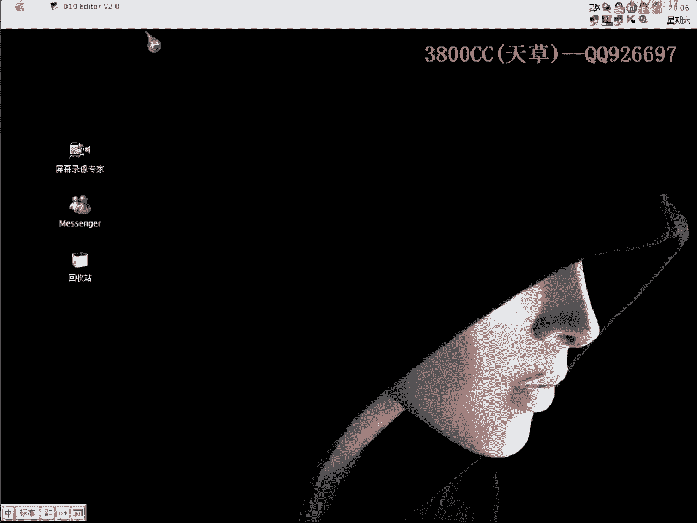
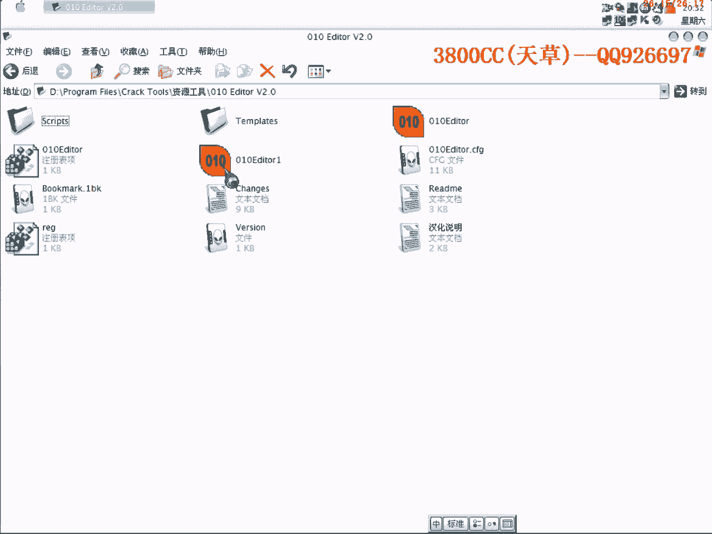

# 天草流初级 - P19：18、破解9 - 白嫖无双 - BV1qx411k7qA

大家好，现在来进行我们第18课，第18课一个目标程序呢，就是我给大家的一个工具。

工具里面的一个这么一个软件，虽然说这个里面带有了一个注册表，但是呢，我们就今天来教大家怎么样来破解了，我们首先来运行看一下吧，这里已经说什么使用期已满了，如果大家那里使用期没有满的话。

把那个系统时间调一下，往前面调啊，调到2007年2006年，只要是4月18号以后都可以的，都可以的，好，我们现在查一下课啊，查一下课，BC++写的啊，一看到BC++写的呢。

大家就说有一个条件反射可以用第一第一，好，那我们就说按常规的思维啊，就说第一步想的就是第一第一，好，OK，我们就第一第一吧，先来看一下吧，先来看一下，OK，这里提示啊，错误的，OK，我们来第一第一吧。

这里版本号是BCB4的，这个加载有点慢，稍微等一下，抽支烟啊，我们直接看那个，看过程啊，看过程，找一下啊，看这个模块名啊，看模块名，看模块名比较就是说方便一点，这个Page，Page。

Register啊，这里有一个Register，好，这里呢，好，那我们来看一下，它这里有几个按钮，一个，两个，三个啊，四个按钮，好，那我们来用这个，用这个来看一下是哪个按钮式的啊，这个啊，注册，这个。

看一下现在购买啊，Button register是购买的意思啊，对应的是购买，然后呢，再看一下其他的，这里啊，确定，是确定，就是Button OK了啊，Button OK就是我们那个按钮时间。

要找到按钮时间，Button OK，这个，好，复制下来啊，复制下来，就是做一下大概的记录吧，现在我们来Od載入它，好，好，我们直接看下家居啊，来到这个地方，在这个地方下段啊，下段，要不就运行。

要不就运行，现在输入啊，好，这样就断下来了，好了，我们慢慢走一下啊，走一下，看一下，这个样子啊，就是说，昨天那个辉煌，他就是说，在这个地方看不到一些东西，就分析一下啊，分析一下，可以在Comet。

就是内容，这里面注释，这里面可以看到一些东西啊，有助于我们那个调试啊，有助于我们调试，好，他这个地方开始取加码，取加码，这个，还是写一下吧，这也是，读我们的加码啊，好，我们就按他这个规格来走。

就是我们先不要改掉任何调转，看一下，到哪个地方是错误的提示啊，这个地方是错误提示了，注册码无效，刚才我们说的是，他说注册码错误啊，怎么有点不一样了，我们来单独打开看一下，这个地方是注册码无效啊。

有点不对啊，有点不对啊，我们来看一下啊，单独打开看一下，刚才提示是什么来着，提示不一样，有点奇怪了，是注册码无效啊，现在时刻19点整，现在我们还重新来一下，可能是刚才我在第一次试填的时候啊。

他的一些数字，就是没有填满啊，要从这个地方开始填满，都是四个啊，直接单独把他走啊，去加码，就先不要管了，看一下，来到我们那个注册码无效，看一下有没有什么，这里是注册码无效，那这个调转，这个调转，调了啊。

这个调转，做一个记录，等一下我们弹幕到这里来看一下情况，看一下情况啊，好，这里跳了啊，这里，我们不让他跳啊，不让他跳，看一下，这里跳了，这里呢，注册码正确，但是过期了，这个。

这也不是我们要找的一个关键了，那也就是说上面关键啊，关键的地方还是在上面，还是在上面，我们这里呢，让这个调转实现一下啊，让这个调转实现一下，我们让他，不要跳，看一下啊，让他不要跳，试一下，好了。

我们现在就是说去把这个，首先下的这个断点呢，disable掉啊，无效掉，我们在这个地方下断点，确定，这样就可以了，我们让他不要跳啊，让他不要跳，好，在弹幕走一下，看一下，注册码正确啊，这里是注册码正确。

也就是说这个地方是我们的一个关键，我们把这个地方录不掉啊，看一下结果，然后呢，把这个地方记录一下，记录一下，我们现在重新来载入，因为就是说这个程序好像就是说只允许一个实例运行。

就是说只允许他同时一个运行，因为现在刚才运行了啊，刚才我们在OD里面运行了，他就检测到了，我们再重新想重新来单独运行程序就打不开了，好，我们来填一下，这里呢，他是注册正确，可以进去啊，这个样子可以进去。

但是我们再来关掉，再来打开看一下，人员事故已满了，那也就是说啊，也就是说这个并不是一个我们要找的一个关键地方，另外一种说法就是说这个程序有重启验证的，有重启验证的，那我们现在怎么办呢，好。

来查找一下支付串，看一下能不能找到一些相关的信息啊，好，咱们走，咱们走，其实我们刚才就是说，因为已经确认程序有那个，重启验证啊重启验证，我们当时刚才让他成成功跳转之后，成功跳转之后。

这个基本上可以再继续往下面走，因为他成功之后啊注册成功之后，肯定会像一个文件或者是注册表里面写录制的，这个这样的话我们就可以，找到一些东西啊，找到一些东西，大家看一下这个地方啊，这个地方soft啊。

这里swift，这个也就是说，他把这个注册表纸现在就是说给拆开了，注册表相给拆开了，继续找一下，看一下有没有一个完整的信息啊，这些都是无关紧要的一些东西，看来好像是找不到一个完整的信息啊。

这个样子是找不到了，找不到了我们就这个样子啊，再重新来一遍，把这个给，或者是直接到这个地方去下段吧，因为因为前面那都是无关紧要的，我们就不要下段了吧，免得多走一些路啊，大家看到了啊，一起动啊。

他这个里面就有就说明他读取了一个什么文件啊，注册表呢还是文件，现在我们还不太清楚，一起动我们什么都没填啊，我刚才什么都没填，他就他就那个啊，就说明做显示注册成功之后。

他会像一个某一个东西里面写入我们刚才的一个信息，我们现在就是来找啊，把这个给，跳转不要让他跳了，我们继续往下面走，看一下能不能找到一些什么信息啊，这个样子我们没有跟到啊，没有跟到一些什么信息。

刚才反过去看一下，大家看到了，看到这些这个都没什么用了，好，大家看到了，看到这些这个都没什么用了，看不到一些什么信息啊，这个看不到什么信息啊，看不到，那我们就就说一一来试一下吧，一一来试一下。

也可以就是说也可以像我前面给大家讲到的啊，讲到的就是在注册表注册表里面搜索啊，这表里面搜索，我们可以来先来搜索一下，这样就是说程序啊，我们在调试的时候，他没给我们一个什么信息，没给我们可用的。

就是说完全可用的信息，我们就输入注册码，因为3800cc在我这个电脑里面还是蛮多的啊，看下能不能找得到，他这里一些东西啊，这些东西没什么信息可用啊，这个是模板的文件啊，这个是脚本的一个文件啊。

大家也可以仔细看一下，我们现在查找一下看一下有什么样的结果没有，大家看到了啊，这么一个字注册表像在这个里面啊，咱们导出来，很明显了，他是通过那个注册表啊，我注册表来的，嗯，很明显的哈，那好。

我们就是说对他进行下断点，我们也可以就是说直接下这个断点下这个断点，但是这个样子因为他也读取了非常非常多东西啊，就说跟系统相关的一些东西都会读取的，就比较麻烦了，我就今天教大家一个新的方法，好，搜索。

抗体加恩，直接按键盘上的R啊，这个中英文要换过来啊，啊，一句啊，还一句，好找到这一个，我们右键，Fluke，就是查看参考的意思啊，这个你们在那个什么中文的下面可以就这样。

下面的一个命令你们可以仔细看一下，大家可以看到啊，可以看到有这么一些在读取这么一些地址，好，全部都下断，直接运行，运行了之后啊，大家看到这红色啊，这个红色带蓝色的红色带来的就是代表中断的这个地方。

我们再看对战，看对战里面的词，对战里面的就是说是当当前啊，读取了一个注册表，这个并不是我们需要的，我们F2取消这一个再继续运行，再看一下这个，这个也不是我们需要的啊，取消掉啊，好。

大家看到了这里才是我们需要的啊，这里才是我们需要的，好，咱们单步走啊，单步走，大家看到了啊，开始读取注册表里面的3800CC，这一个了，就是说这一段啊，这一段他是对进行操作了，读取操作。

这个我们就不用管他了啊，嗯，他又在读取了，我们还是，还是单步走啊，现在是读取注册码，现在是读取注册码，刚才读取了用户名，现在读取注册码，那说明基本上下面读取了这两样之后呢，那下面是需要干嘛呢。

就非常清楚了，非常清楚了，我们再来看一下，我们刚才就是说不是关键的地方，但是可以显示我们注册成功，是这么一个结构啊，这么一个结构，大家看清楚，好，咱们单步走啊，单步走，嗯，大家看清楚啊，看清楚，这里面。

咱们等一下看一下，看一下这个跳转跳没跳啊，这个结构是非常相似的啊，非常相似的，这个20呢，20是什么，我们刚才输入的一啊，总共是20个长度，他有两个，大家可以来看一下，是20个长度吧，看一下是几个。

19个长度，这19个长度，这个20是什么就不太清楚了，好单步走，这里他跳转了，这里他跳转了，我们不让他跳转看一下，开始装入了，装入我们的这个用户名了，用户名了，这里就直接让他跳吧，直接让他跳。

直接运行看一下，好大家看到了啊，已经收藏给我了，收藏给我了，那也就是说这个地方的确是我们的一个关键跳转了，这个大家，大家看一下，跟我们刚才改的那个，结构是非常相似的，结构是非常相似的。

Compare 0db，0db，他是9c70，但是结构是差不多的，这个也是一个提示了，也是一个提示，我们直接把它录不掉吧，好，再来运行看一下，0用户授权，0用户授权，他这个是什么意思啊。

那我们现在把这个注册表给删掉看一下，删掉，注册给没有显示名字，因为里面没有，因为注册表里面没有啊，没有值了，但是还是0用户啊，0用户授权，那我们这个样子来投机取巧一下，不用这一个，不用这一个。

我们把名字改一下，这样改了之后，改了之后，再导入的话，我们来看一下，原版的，使用期还是满的，因为一个注册码，一个注册码对应的是一个用户名码，我们再来看一下这个，诶，这是变成站点授权了，站点授权了。

就这样啊，非常简单的，这方法还是就是说要当前养后的那种，我们就是说通首先通过一个，常规的思维，要用的第一第一去反悔，反悔别人一下，反调试一下，找到一个按钮事件，然后再找他一个提示。

我们做成功的一个地方啊，先把这个地方记下来，然后发现就是说有是重启验证型的，是重启验证型的，这个时候我们就需要对他进行，发现和研究了，到底是什么类型的重新验证的呢，我们刚才就是说通过查找注册表。

发现是通过注册表，通过注册表里面的，那我们就说用下断点啊，用下断点的方法，当然我刚才教的，教给大家的方法并不是下断点，是直接直接查查看那个断点的参考数啊，参考数，我们再这样来看一下吧，先把这些都删掉。

这是我刚才下的一些断点啊，通过下断点来查，大家看到了啊，他这是读取一些无关的很多的，我们要按很多次F9的，这个样子就是说，比较慢了比较慢了，但是通过我们刚才刚才那种方法的话，就是说非常非常快的了。

直接这样查找啊，直接这样查找，REG open，这样直接这样查找，然后这样中断下来也快啊，中断下来也快，也免了我们像刚才要那样的话，就需要用到，ART+F9了，这样就非常快了啊，不是的我们就取消掉啊。

是的我们就单步跟踪，这个也不是的，看到了吧，取消掉啊，FR取消掉，好这是的呢，我们就开始单步跟踪，就这么简单，就这么简单，节约了我们不少时间啊，那好了今天这个课程就到这啊，再见啊，这个文件大家来都有吧。

算了还是先。

