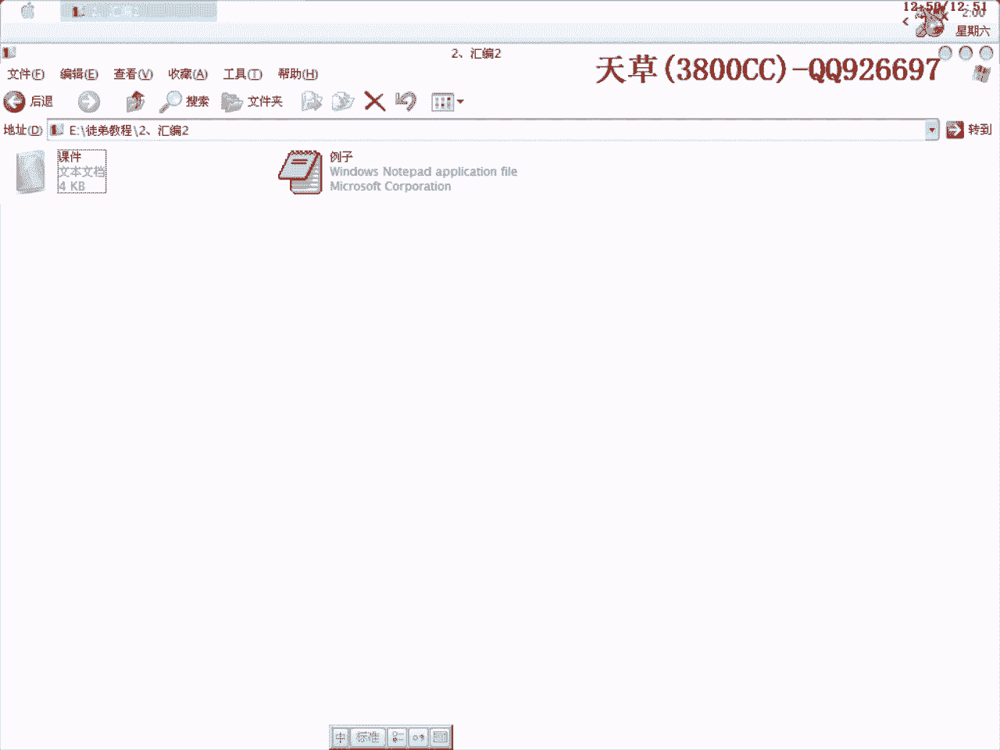

# 天草流初级汇编教程 - P2：数据传送与栈操作指令 🧱

在本节课中，我们将学习汇编语言中两类基础且重要的指令：数据传送指令与栈操作指令。它们是理解程序数据流动和函数调用的基石。

上一节我们初步接触了汇编语言，本节中我们来看看具体的数据操作是如何实现的。

## 数据传送指令 (Move)

数据传送指令 `MOV` 是汇编中最常用的指令之一，其作用相当于高级语言中的赋值语句，用于在寄存器、内存和立即数之间传送数据。

指令的基本格式为：**`MOV 目标操作数, 源操作数`**。
其中，操作数可以是寄存器(`reg`)、内存地址(`memory`)或立即数(`imm`)。

例如：
```assembly
MOV EAX, 1234H  ; 将十六进制数1234传送（赋值）给EAX寄存器
```

## 传送填充指令 (Move with Sign/Zero Extension)

传送填充指令用于将位数较短的操作数传送到位数较长的目标操作数中，并根据规则对高位进行填充。这主要分为符号填充和零填充。

以下是两种格式：
*   **`MOVSX 目标操作数, 源操作数`**：符号填充。用源操作数的符号位（最高位）填充目标操作数的高位。
*   **`MOVZX 目标操作数, 源操作数`**：零填充。用0填充目标操作数的高位。

**示例解析**：
假设 `AL = 87H`（二进制为10000111，最高位为1，是负数）。
*   执行 `MOVSX CX, AL` 后，`CX` 的高8位会用 `AL` 的符号位（1）填充，因此 `CX = FF87H`。
*   执行 `MOVZX DX, AL` 后，`DX` 的高8位会用0填充，因此 `DX = 0087H`。

**关于汇编书写规范**：在汇编中，若一个十六进制数以字母（A-F）开头，为与标识符区分，通常在前面加一个0。例如，`0B134H`。

## 交换指令 (Exchange)

交换指令 `XCHG` 用于交换两个操作数的内容。操作数可以是两个寄存器，或一个寄存器与一个内存变量。

指令格式非常简单：**`XCHG 操作数1, 操作数2`**。

## 取有效地址指令 (Load Effective Address)

取有效地址指令 `LEA` 用于将源操作数的有效地址（偏移地址）加载到目标寄存器中，而不是加载该地址处的数据。可以将其理解为高级语言中的“取地址”操作。

指令格式：**`LEA 目标寄存器, 源内存操作数`**。

例如，`LEA EAX, [EBX+ECX*4+10H]` 会计算 `EBX+ECX*4+10H` 这个地址值，并将其存入 `EAX`，而不是去读该地址的内存内容。

理解了数据的传送与交换，接下来我们看看程序运行时一个至关重要的数据结构——栈。

## 栈操作指令

栈是一种“后进先出”(LIFO)的数据结构，在汇编中主要用于保存函数返回地址、传递参数和保存寄存器现场。对栈的操作主要分为两类：进栈（压栈）和出栈（弹栈）。

### 进栈操作 (PUSH)

`PUSH` 指令用于将操作数压入栈顶。系统会自动完成两步操作：
1.  栈顶指针 `ESP` 的值减4（在32位系统中）。
2.  将操作数存入新的 `ESP` 所指向的内存地址。

以下是常见的进栈指令：
*   `PUSH reg/mem/imm`：将寄存器、内存数据或立即数压栈。
*   `PUSHA` / `PUSHAD`：将所有通用寄存器的值压栈（`PUSHA`用于16位，`PUSHAD`用于32位）。

**操作演示**：
执行 `PUSH EDI` 前，假设 `ESP = 0012FFA4H`，`EDI = 00401000H`。
执行该指令后：
1.  `ESP` 先减4，变为 `0012FFA0H`。
2.  然后将 `EDI` 的值 `00401000H` 存入内存地址 `0012FFA0H` 处。

### 出栈操作 (POP)

`POP` 指令用于从栈顶弹出一个数据到目标操作数。其操作与 `PUSH` 相反：
1.  将当前 `ESP` 所指向的内存地址中的数据弹出到目标操作数。
2.  栈顶指针 `ESP` 的值加4。

以下是常见的出栈指令：
*   `POP reg/mem`：将栈顶数据弹出到寄存器或内存。
*   `POPA` / `POPAD`：将栈中数据依次弹出到所有通用寄存器（恢复 `PUSHA/D` 保存的现场）。

**重要原则——栈平衡**：在程序段中，通常有几次 `PUSH` 操作，就需要对应几次 `POP` 操作，以确保函数调用前后栈指针 `ESP` 恢复到相同位置，这称为栈平衡。脱壳技术中的“ESP定律”正是利用了这一原理。

---



本节课中我们一起学习了汇编语言的核心数据操作指令。我们掌握了如何使用 `MOV` 指令传送数据，了解了 `MOVSX`/`MOVZX` 进行带填充的传送，以及使用 `XCHG` 交换数据。更重要的是，我们深入探讨了栈的结构与 `PUSH`/`POP` 操作指令，理解了栈在程序运行中的关键作用及栈平衡原则。这些是分析程序流程和进行软件调试与破解的基础。