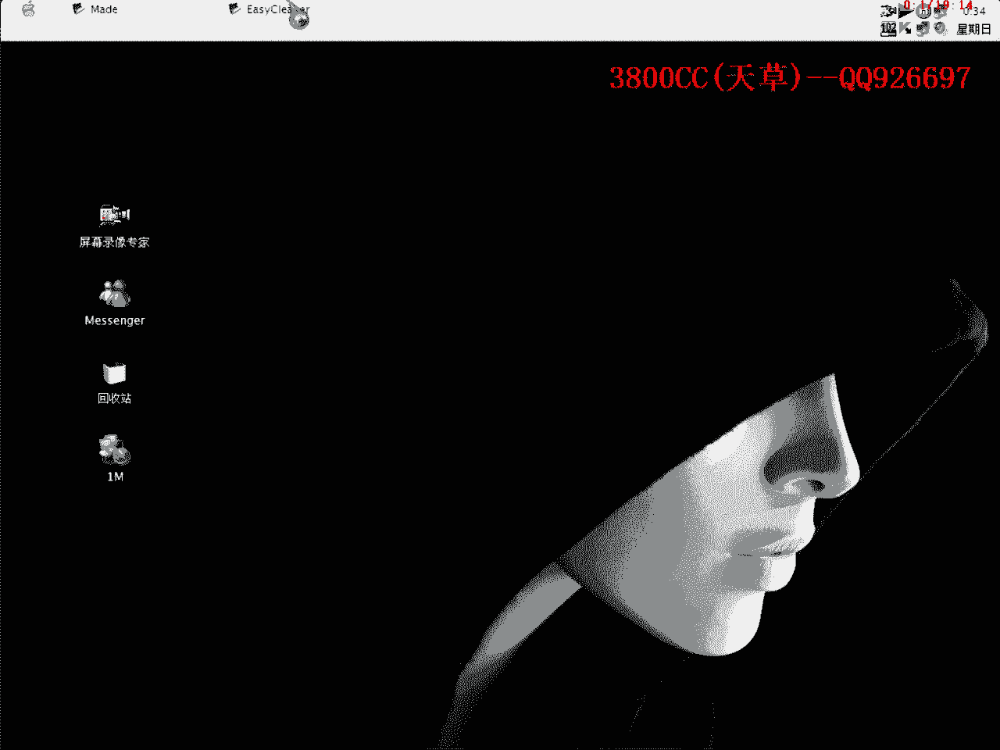
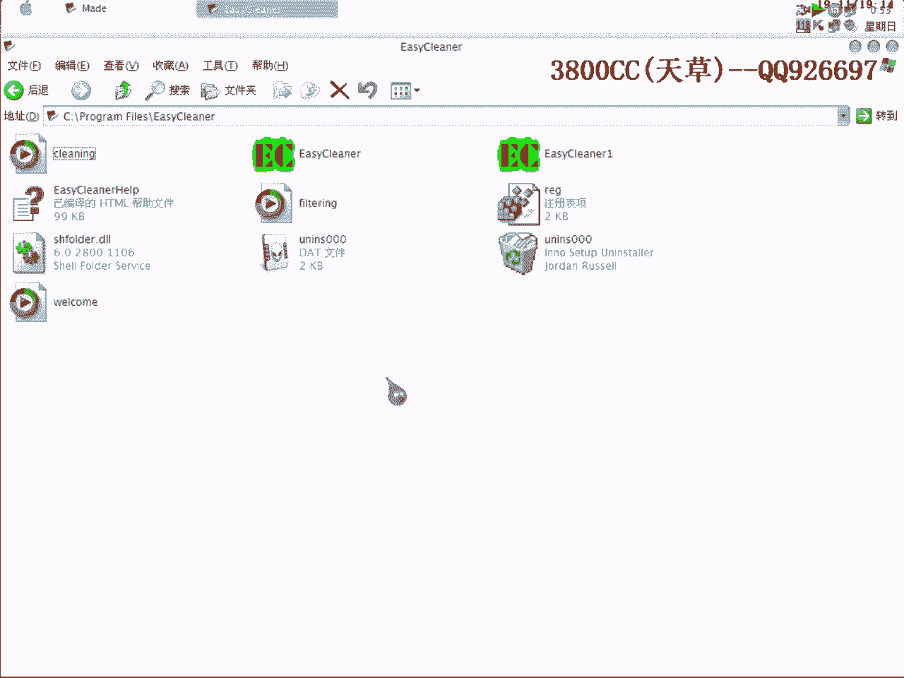

# 天草流初级破解教程 - P20：第19课 - 软件注册机制分析与漏洞利用 🛠️

在本节课中，我们将学习如何分析一个简单软件的注册验证机制，并利用其存在的注册表验证漏洞来实现“破解”。我们将使用动态调试工具，观察程序流程，并最终通过修改注册表数据来绕过注册验证。

---

## 软件初步分析

首先，我们载入目标程序。这是一个使用VC++编写的软件，没有加壳，也没有复杂的加密算法，非常适合初学者进行分析。

载入程序后，我们直接运行。在未注册状态下，软件界面会明确显示“unregistered”和“000”等信息。


我们的目标是观察注册成功与失败时，程序行为和数据的差异，从而找到验证逻辑的突破口。

---

## 动态调试与关键跳转定位

我们使用调试器附加到运行中的程序。在输入假注册码并点击注册后，程序会弹出提示框。我们在此处暂停，开始单步跟踪。

很快，我们找到了一个关键的函数调用（`messagebox`）和其附近的判断逻辑。上方存在一个跳转指令，它直接决定了程序是走向“注册成功”还是“注册失败”的流程。

> **核心观察**：`JZ` 或 `JNZ` 等条件跳转指令是破解中常需要修改的目标。

我们跟进这个跳转，发现它源自一个循环比较的过程。程序将我们输入的假码与通过某种计算得到的值进行比较。

---

## 算法循环分析

在循环内部，程序执行了以下大致操作：
1.  将我们输入的字符（假码）放入寄存器 `DL`。
2.  将程序内部计算出的一个字符放入寄存器 `BL`。
3.  对 `DL` 中的值进行一个运算（例如 `ADD DL, 0x23`），结果放入 `CL`。
4.  比较 `DL`（或 `CL`）与 `BL` 的值。
5.  如果**不相等**，则跳出循环，走向失败流程；如果**相等**，则继续循环，比较下一个字符。

用伪代码描述这个核心比较逻辑：
```assembly
MOV DL, [用户输入+索引]   ; 取用户输入的一个字符
MOV BL, [内部计算值+索引] ; 取内部计算的一个字符
ADD DL, 0x23            ; 对用户输入字符进行变换
CMP DL, BL              ; 比较变换后的字符与内部值
JNZ 失败流程            ; 如果不相等，则跳转到注册失败
```

我们跟随循环多次，记录下每次内部计算出的 `BL` 值。一个有趣的现象出现了：**很多组不同的输入，在循环中都能通过每一次的字符比较**。

---

## 发现漏洞与爆破

通过多次测试，我们发现这个软件的验证机制存在逻辑漏洞：它似乎没有对最终比较结果进行**全局性**或**唯一性**的最终判断。许多不同的字符串都能通过那个循环检查，导致程序误认为注册成功。

因此，最简单的“爆破”方法就是修改那个关键的跳转指令，让它**无论如何都跳向成功流程**。在汇编层面，这通常是将 `JNZ`（不相等则跳）改为 `JMP`（无条件跳），或者将 `JNZ` 改为 `JZ`（相等则跳，逻辑反转）。

> **爆破修改示例**：
> 将 `75 15`（对应汇编 `JNZ SHORT 失败地址`）修改为 `EB 15`（对应汇编 `JMP SHORT 成功地址`）。

修改后，无论输入什么内容，软件都会显示注册成功。

---

## 深入漏洞：注册表验证缺陷

上一节我们介绍了通过修改代码逻辑来爆破软件。本节中我们来看看这个软件更深层次的漏洞——注册表验证机制。

我们关闭软件，检查注册表。发现该软件将注册信息明文保存在注册表中特定位置，例如：
- `RegName`: 注册名
- `RegCode`: 注册码（或状态）
- `Registered`: 注册标志（`0`为未注册，`1`为已注册）

我们手动修改注册表：
1.  将 `Registered` 的值从 `0` 改为 `1`。
2.  在 `RegName` 中填入任意名字。

以下是修改注册表的关键操作概念：
```reg
Windows Registry Editor Version 5.00

[HKEY_CURRENT_USER\Software\目标软件]
"RegName"="任意用户名"
"Registered"="1"
```

修改完成后，重新启动软件。软件读取注册表后，直接显示为已注册状态，不再要求输入注册码。

这暴露了该软件的安全隐患：**其注册验证完全依赖于客户端注册表中易于篡改的明文标志**，没有进行任何校验或加密。

---

## 漏洞利用总结与编程启示

本节课中我们一起学习了如何分析一个简单的软件注册流程，并发现了其两处关键漏洞：
1.  **验证逻辑漏洞**：循环比较逻辑不严谨，可通过爆破关键跳转绕过。
2.  **数据存储漏洞**：注册状态明文存储于注册表，可直接篡改。

对于软件开发者而言，这提供了重要的安全启示：
- **避免弱验证**：注册验证算法应具备足够的复杂度，避免简单的单字符顺序比较。
- **加强数据保护**：存储在客户端的敏感数据（如注册标志、试用次数）应进行加密或混淆处理。
- **增加服务器验证**：对于重要软件，核心验证逻辑应放在服务器端。

学习破解的目的，不仅是掌握技术，更是为了理解软件保护的薄弱环节，从而在自身开发时能构建更健壮的安全体系。

---




*课程结束*