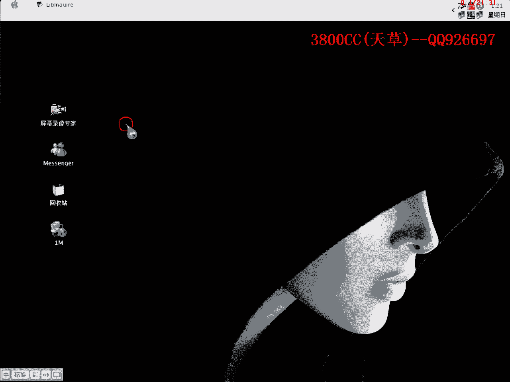
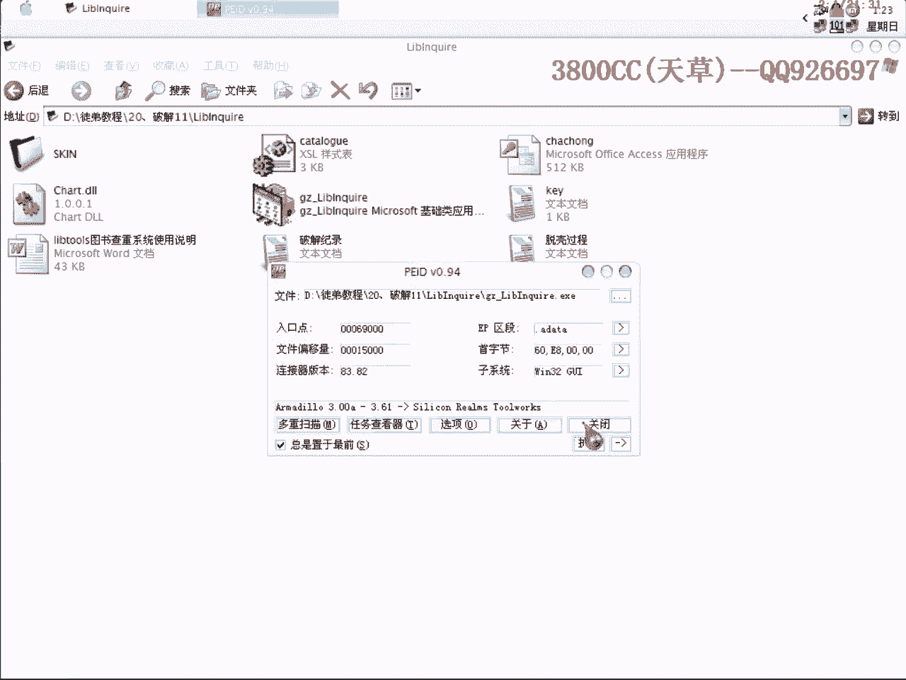
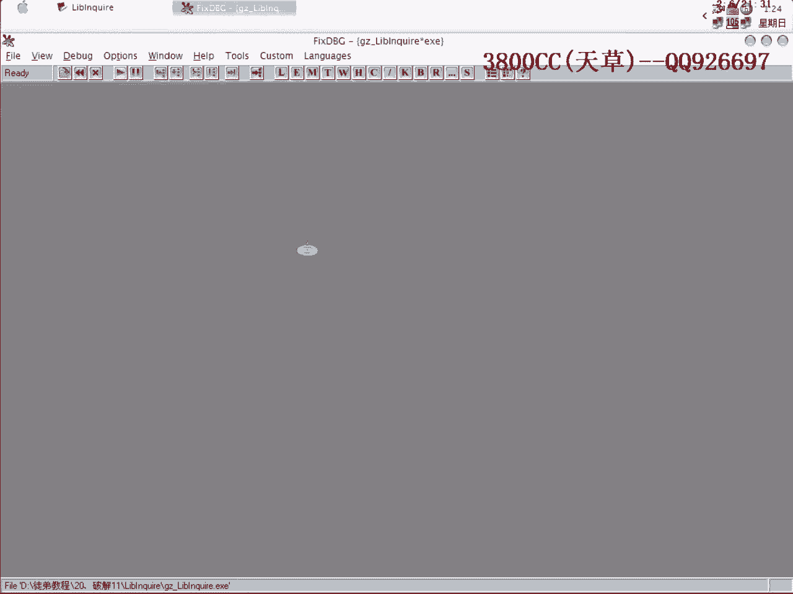
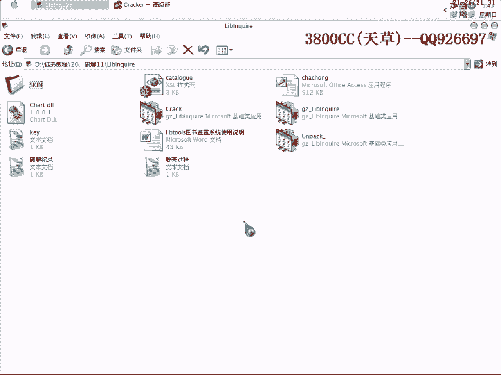

# 天草流初级 - P21：20、脱壳+破解11 - 白嫖无双 - BV1qx411k7qA

大家好。

这一期课呢，我们就讲一下一个中高级一点的内容，中高级一点的内容，这个软件，先大家看一下，这个软件是一个什么，软件重查的一个什么，不知道什么一个东西，反正是网上一个朋友，给我的，然后呢，先来查一下壳。

穿山甲的一个壳，穿山甲的一个壳，这个壳，3。PID查的是3。0到3。6A，一个不确定的，那我们再用FI来查一下，3。05的，那我们首先，因为穿山甲的壳它分那个，双线程和单线程的，双线程和单线程的。

我们来运行，这个呢我在，黑鹰的课程里面也有讲过，讲过两课，就是说，大家看了肯定会有帮助，但今天我就再讲一课，今天再讲一课，因为我们现在上的是初级班，我在讲这一课之前，在考虑要不要讲，可能让大家感觉有点。

不舒服的感觉，大家看到只有一个精神，就说明是单精神的，穿山甲的壳又分，标准和非标准的，至于标准和非标准的，就是区分的方法，就是区分的方法，这个后面会讲到，因为穿山甲的壳，很多学问，它也算四大金刚之一。

它也算四大金刚之一，四大金刚之一，我们今天就是说，已经就是说，现在告诉大家它是一个标准课，我们先OD载入。

首先呢，互联锁也一常。

然后再隐藏一下OD，首先我们要找的一个Magic Card，就是说这个Magic Jump，这个Magic Jump是对，IT，就是我们所说的API进行处理的，如果我们没有处理这里的话。

我们到时候用import REC修复的时候，会出现非常非常多的无效函数，那怎么样通过它来，怎么样来处理这个Magic Jump呢，就需要用到这么一个段点，好，BP，这里我要把它加上一个5，因为就是说。

脱山甲的壳，经常经常用到这么一个段点，为什么用到这么一个段点，现在告诉大家，大家也迷糊，后面大家会知道的，通过这么一个段点，简单的说就是说，可以通过这么一个段点。

非常容易找到我们需要的Magic Jump，也就是说，这个段点跟Magic Jump，隔得非常近的，这个当然也是根据，单步慢慢调试调试，才发现的这么一个经验和总结，这里的+5，就是因为从脱山甲的壳。

从第一版本到现在，这个段点用得非常多，所以作者在一些版本升级的时候，会考虑到对这个段点的检测，所以我们+5，就是为了避开，对它的检测，+5大家看一下是什么意思，我们先不+5，看一下，大家看到了。

首先是不+5的时候，是端在这里面的，好，我们现在重新来过，让它+5，大家看到了，是端在这里面的，这个地方，非常清楚了，就是把这个内存地址+5，内存地址+5，这样就可以非常容易的逃过去。

当然大家也可以+7，+6，+11，这里我们用这个段点，可以加上看一下加多少，当然加到这个J1，这个地方是比较方便一点的，我们看一下，如果我们要让它，中断在这个地方，会加多少，减去，+16。

我们也可以+16，可以来试一下吧，shift+F9，大家看到了，加到这个地方来了，还需要，指出一个问题，如果你的系统是2000，这2003我就不清楚了，用这个+，不管是加多少，+N或者是多少，都无效。

断点断不下来，不能+，不能+一个常数，有的朋友，系统是2000，断不下来，不要问我这个问题，跟大家已经说过，如果是2000的话，2003我就不知道了，估计服务器版都是差不多，如果用+5，是断不下来的。

我们就首先+5，这还有另外一个问题，也是需要注意的，穿着夹口，不要用BP，用HE，HE是什么，大家看一下，硬件执行断点，这样就中断下来了，OD下面会提示中断，我这个地方现在看不到，中断下来了。

这还有一个问题，返回时机的问题，大家等一下会给大家，一而再二再而三，至少演示两遍，给大家看一下，怎么样才是返回时机，好，继续shift+F就运行，注意看对战，注意看对战，好，这个已经过去了，已经过去了。

重新来过，现在看不到什么效果，这样直接就到了，这个程序有点怪，一下子就可以返回了，用BP吧，还是有硬件断点吗，没有啊，谁在群里面吵，烦不烦，好，再继续运行，大家看到了，用BP，效果不太一样。

效果不太一样，大家看一下，这个，这个，这个，效果不太一样，我们现在就用BP来讲，怎么样来找返回时机，穿上甲的可有几种，有两种办法，找返回时机，对不同的而言，这个我都会讲到的，我们今天就讲第一种情况。

下段点，注意看对战，就是说你shift+F久之后，对战马上就出现一些什么东西，就是说OD马上停下来，就不是我们要找到的返回时机，大家看清楚，非常快的就停下来了，非常快就停下来了，非常快就停下来了。

这个非常慢了，大家看清楚，再来一次，大家看清楚，这个都非常快停下来了，看这一次，很慢，很慢，另外还有一个方法，就是说，返回到是系统的领空，返回到是系统的领空，这个就是我们要找的，返回时机了。

article F9，在另外，Muji Jump，Muji跳是哪一个呢，就是这么一个Nord Library，这个是加载酷寒素的意思，下面的一个，下面的一个，非常大的一个跳转，大家看到了J1，然后呢。

它有两个J1，跳转最大的一个就是，改好了之后，我们接着下这个断点，REATTHREAD，这个大家也要看清楚，C和T是大写的，这样就断下来了，断下来就可以取消断点，直接走，咱们看到这个Core EDI。

就直接进去，这就是OEP了，现在我们把它脱壳，(咳)，这就是说大家平时，还是要多找一些文章看，不要仅仅限于我这些教程，大家看到有11个无效，就是说穿墙甲的壳，你脱壳之后，如果发现有16个，20个。

20个以内的无效指针的话，那就不用看了，直接剪切掉，当然这当然是取决于你，这个Muji Jump，有没有处理好，我这个已经处理好了，非常自信，20个以内指针，全部剪掉，再另外，我刚才第二个断点。

用了这个断点，我们来看看用另外一种方法行不行，大家再看清楚，这样非常快就断下来了，这一次就很慢了，(咳)，这样吧，直接到，这里面，0040这一段下断点，这样也可以，这样也可以，当然有，当然第二种方法。

直接在这一段下断点，对有的架构程序不行的，这个大家要记清楚了，我们来看一下，可不可以运行，可以运行的，这还有另外需要说明的，就是说，33甲可3点，3点级的，开头的，脱壳之后用PID，查的仍然是1点xx。

1点xx的2点xx，这个就是因为，1点xx2点xx，这种可，非常像VC++，一个路口，那咱们怎么办呢，大家不要以为是两层33甲可，咱们用FI来辨认一下就OK了，这里用FI辨认，就是VC++的。

这个大家不要怀疑了，好，我们现在就是说，要对它进行破解了，直接运行，这个注册码，这个注册码是保存在这个里面的，K里面的，这个你可以随便填，填长一点，最好填长一点，好，我这个就不用管了，直接点注册。

注册失败，咱们暂停下来，大家看到这里，好，上级进去，咱们找到断尾，REND，下断点，再继续运行一下，点一下它，就断下来了，大家看到这样就返回到我们的一个，系统程序的领空了，删除刚才的断点，这样呢。

这个就说明，这个跳转，这个call是错误提示的，是错误提示的一个跳转，好，我们现在回溯，找到这一段的开头，找到断首，放下，这样就断下来了，我们这样就可以跟了，大家看到了，它在读取我们的一个，机系码。

因为这个大家可以用这个看一下，看一下它的算法，这个算法是非常繁琐的一个算法，大家看到了，非常繁琐的一个算法，我这里有两个插件，看一下，这个2。82的插的是这一个，2。3的插的是这一个，当然就是说。

不准确，但是能够说明它一个比较麻烦，好，咱们不走，这个就是我们的一个注册码了，用湖民注册码，它都在读取了，继续找，大家看到了，这个跳转要是跳了的话会是怎么样的情况呢，直接跳到错误提示了。

也就是说这个跳转还是一个关键的跳转，咱们再往上面找一个关键的call，大家看一下这里是直接跳到一个，下好断点，看一下，这个都是跳到一个，这个VC++的一个库涵数里面去了，大家可以进去看一下，大家看到了。

这是跳到库涵数去了，这样就回来了，我们在这个地方下好断点免得要重来，这个就是关键的call了，我们进去，走，看一下结尾，这个跳转很烦，去掉它，我就不循环了，大家看到了，这个是，这个算法，一个。

可以这样看一下，一个标志，可以把它当成一个标志，这里这里，这里，算法的一个标志了，有这么两个字符串，算法的标志，大家看清楚这里，此时的EX为1，一获之后EX为0，一获之后EX为0，那我们可以来看一下。

那我们可以来看一下，大家看到了，也就是说这个EX为0，控制我们刚才这个跳了，我们现在进去，重来吧，重来，重来，F7进去，F7进去，按错了，F7进去，F7进去，这个跟大家已经教过大家了，教过大家了。

把这个给取消掉，大家这个时候就应该想到怎么样去修改了，应该想到了，改成相反的，保存一份，EX保持为1，保持为1，跳载没有跳，大家看到，恭喜你注册成功，我们再来看一下，先关掉，有点卡了。

直接就显示Win使用了，直接就显示Win使用了，也就是说，从某种程度上来讲，这个程序还是带那么一点重新，重新，一个效果，带那么一点效果，大家看到了，这个是，没有破解的话，未注册版。

所以说刚才就是我们的一个关键了，所以说刚才就是我们的一个关键了，今天这个课程就到这，今天这个课程就到这，这还有一个问题就是，因为穿甲的壳有时候脱壳了之后，脱壳了之后，程序会有跨平台运行。

我这个脱壳文件你们看一下，在你们那里可不可以运行，这还有另外一个问题，再来说一下，刚才在修复的时候，修复的时候，我们需要把import IC设置一下，这里面，去掉这三个，这三个框框全部都去掉。

这样可以大大的减少跨平台运行，这样可以大大的减少跨平台运行，的这么一个情况发生，的这么一个情况发生。

今天课程就到这，再见。