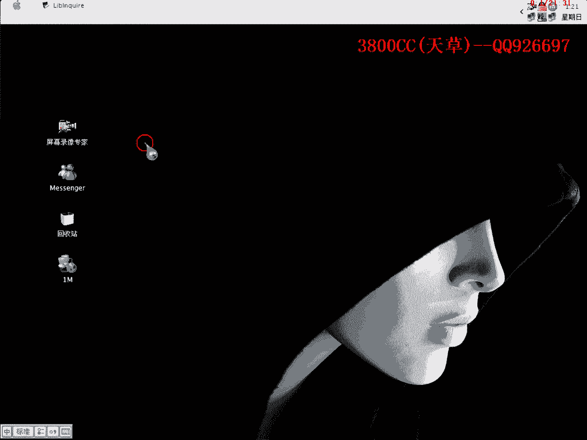
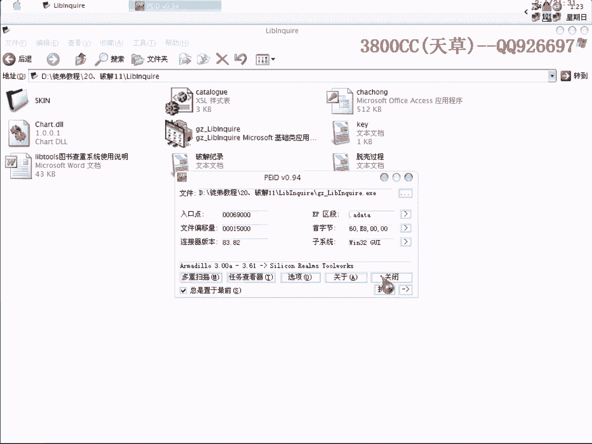
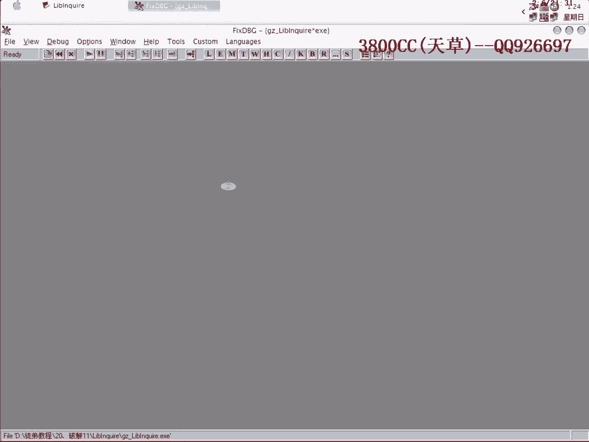
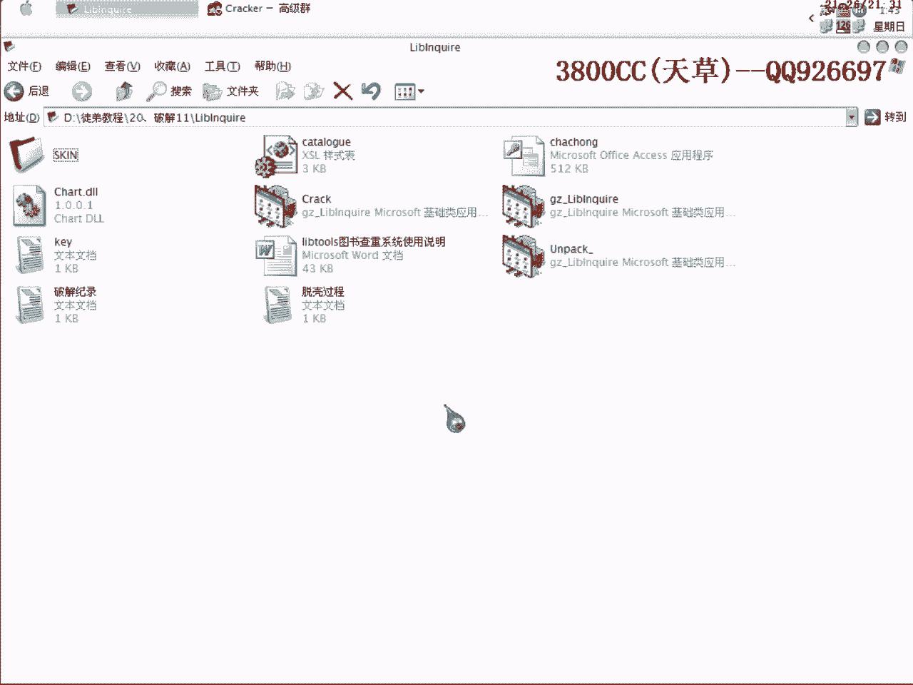

# 天草流初级课程 - P21：脱壳与破解实战 🛡️➡️🔓



在本节课中，我们将学习如何对一个加壳程序进行脱壳，并分析其注册验证逻辑以实现破解。课程将涉及穿山甲壳的识别、特定断点的使用、寻找程序原始入口点以及关键的算法分析。

---

## 课程概述 📋

本节课将演示一个使用穿山甲壳保护的程序的分析过程。我们将首先识别壳的类型和版本，然后使用OllyDbg配合特定技巧进行脱壳。脱壳成功后，我们将分析程序的注册验证流程，定位关键判断点，并修改其逻辑以实现破解。

---



## 第一步：查壳与识别 🔍



首先，我们需要确定目标程序使用了何种保护。使用查壳工具进行检测。

以下是查壳步骤：

1.  使用PEiD工具进行初步扫描。结果显示为“穿山甲 3.0 到 3.6A”，版本范围较广。
2.  使用FI（FileInfo）工具进行二次确认。FI报告为“穿山甲 3.05”。

通过运行程序观察，发现其只有一个运行线程，这属于穿山甲壳的“单线程”版本。穿山甲壳还分“标准”与“非标准”模式，本案例属于标准壳。

**核心概念：** 查壳是逆向分析的第一步，用于确定保护类型和版本，从而选择合适的脱壳方法。

---

## 第二步：使用OD载入与初步分析 ⚙️

我们将使用OllyDbg载入程序，并开始寻找脱壳的突破口。

上一节我们识别了壳的类型，本节中我们来看看如何在调试器中定位关键点。

首先，隐藏OllyDbg的调试器特征，以避免壳的检测。然后，我们需要找到一个名为 **Magic Jump** 的关键跳转。这个跳转负责处理API（应用程序编程接口），如果处理不当，后续使用Import REC修复导入表时会产生大量无效指针。

为了找到这个跳转，我们需要使用一个特定的断点。这个断点经验证，与Magic Jump的位置非常接近。

**核心代码（断点设置）：**
```assembly
BP GetModuleHandleA + 5
```
这里的`+5`是一个偏移量，目的是绕过壳可能设置的针对这个常用断点的检测。你也可以尝试`+6`、`+7`或`+16`等值。在某些系统（如Windows 2000）上，使用这种带偏移的断点可能无效，此时应直接使用硬件执行断点（HE）。

---

## 第三步：寻找返回时机与OEP 🎯

设置好断点后，我们通过多次运行程序来捕捉正确的“返回时机”。所谓返回时机，是指程序执行从壳的代码区域返回到其原始代码区域（即OEP，原始入口点）的关键时刻。

以下是判断返回时机的两种方法：

1.  **观察堆栈变化**：当按下`Shift+F9`运行后，如果程序很快中断，且堆栈没有出现预期的系统返回地址，则不是正确时机。我们需要等待一个“很慢”的中断，此时堆栈会出现系统领空的返回地址。
2.  **观察代码领空**：中断后，查看代码是否位于系统领空（如`kernel32`或`ntdll`模块内）。如果是，则可能是正确的返回时机。

找到正确的返回点后，在其附近寻找一个非常大的跳转（JMP指令），这很可能就是**Magic Jump**。将其修改为不跳转（NOP填充），以确保后续修复的准确性。

接着，我们下第二个关键断点：
```assembly
BP GetCurrentThreadId
```
中断后，跟随代码执行，通常会看到一个`CALL EDI`或类似的指令，执行后即可到达程序的**OEP**。

---

## 第四步：脱壳与修复 🧰

到达OEP后，使用OllyDbg的脱壳插件进行内存转储。

然后使用Import REC工具修复导入表。修复时，如果无效指针的数量在20个以内（前提是Magic Jump已正确处理），可以直接剪切掉。为了增加脱壳后程序在其他电脑上运行的兼容性，建议在Import REC的设置中取消勾选“使用有效化”、“使用新的安全模式”和“追踪注册表项”这三个选项。

**核心概念：** OEP是程序原始代码的起点，成功到达此处并修复导入表是脱壳成功的关键。

---

## 第五步：分析注册验证逻辑 🔐

脱壳完成后，我们开始分析程序的注册验证机制。

首先运行程序，随意输入用户名和注册码，点击注册按钮。程序提示注册失败时，在OllyDbg中暂停。

以下是定位验证代码的步骤：

1.  在`GetWindowTextA`或类似的API上下断点，以捕获程序读取我们输入的注册码的时刻。
2.  中断后，返回到程序领空，向上查找验证函数的开始位置（函数头）。
3.  单步跟踪代码，观察程序如何计算和比对注册码。通常会看到复杂的算法循环和字符串比较。
4.  寻找决定注册成功与否的关键跳转（`JNZ`或`JE`）或关键调用（`CALL`）。这个跳转通常直接指向成功或失败的提示信息。

在本案例中，我们找到了一个关键`CALL`，其返回值（EAX寄存器）决定了后续的跳转。当EAX为0时跳向失败，为1时则成功。

---

## 第六步：修改代码实现破解 ✏️

分析清楚逻辑后，破解就变得简单了。

我们进入关键`CALL`内部，找到影响EAX返回值的指令。通常是一处比较或测试指令后的条件设置（如`SETZ AL`）。

**核心修改：**
将导致EAX为0的指令（例如`SETZ AL`）修改为导致EAX为1的指令（例如`SETNZ AL`或`MOV AL, 1`）。
```assembly
; 修改前
SETZ AL   ; 如果相等则AL=1，否则AL=0

; 修改后
MOV AL, 1 ; 强制AL=1
```
保存修改到可执行文件。再次运行程序，输入任意注册码，发现注册成功提示。程序界面也可能从“未注册版”变为“已注册版”或类似状态。

---

## 总结 📝

本节课中我们一起学习了针对穿山甲壳程序的完整分析流程：

1.  **查壳识别**：使用工具确定保护类型和版本。
2.  **动态脱壳**：利用特定断点技巧，在OllyDbg中寻找Magic Jump和OEP，最终完成脱壳与修复。
3.  **静态分析**：在脱壳后的程序中，通过API断点定位注册验证函数。
4.  **逻辑破解**：分析算法关键点，修改条件判断指令，实现软件破解。



这个案例融合了脱壳与破解的常见技术，关键在于耐心调试、观察细节并理解程序的执行流程。掌握这些基础方法后，可以应对更多类似的保护方案。