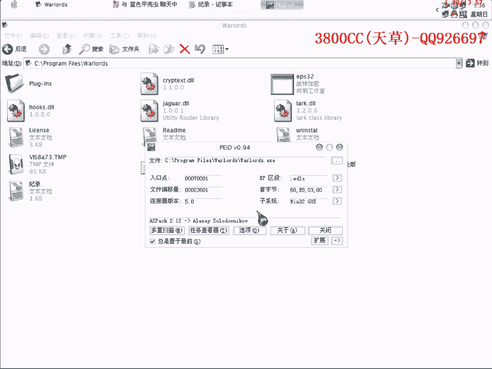
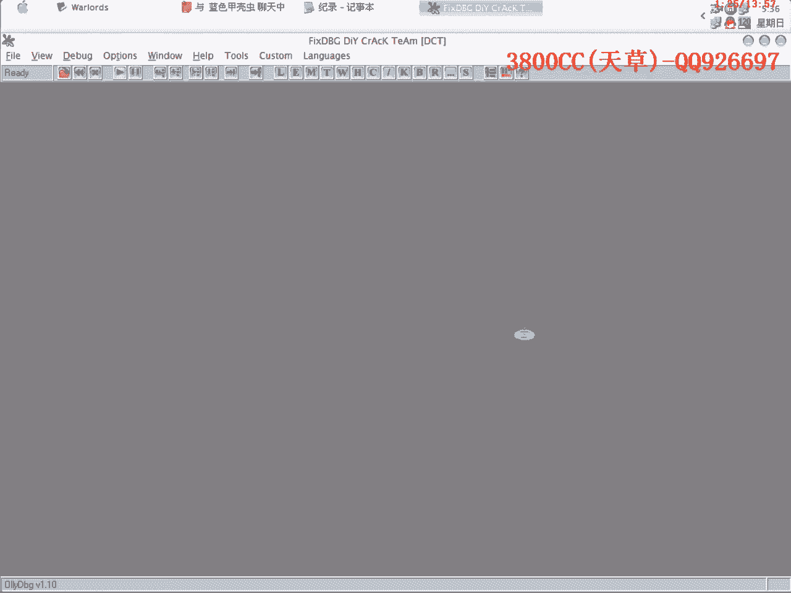
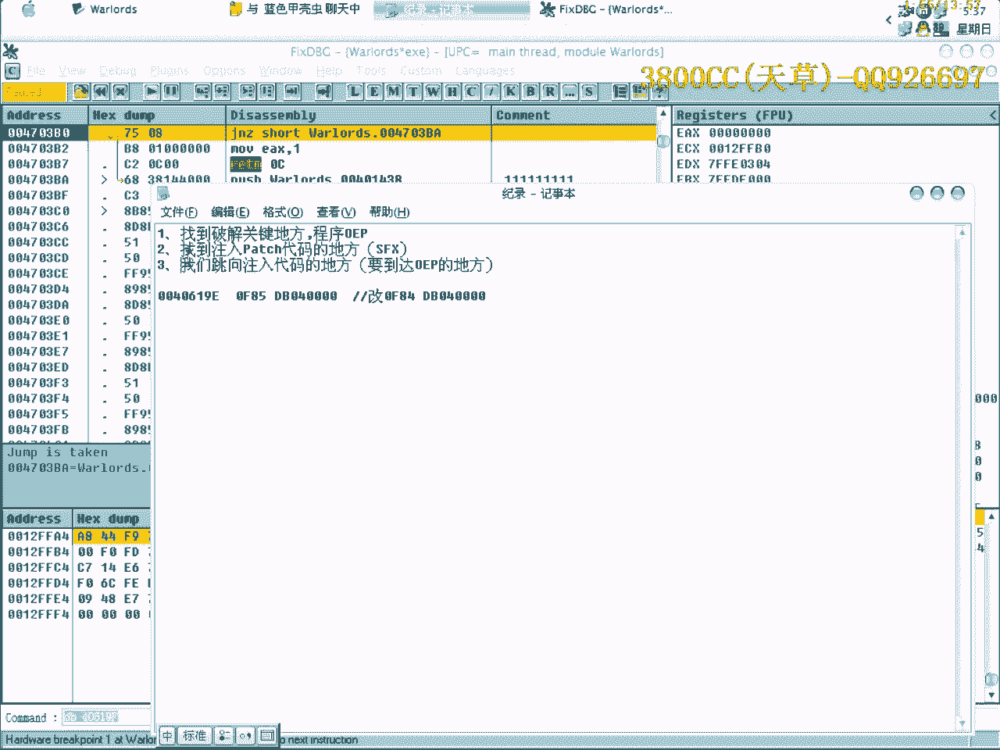
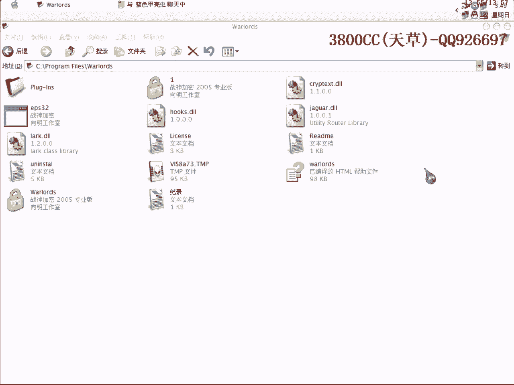

# 天草流初级 - P22：21、手动Patch1 - 白嫖无双 - BV1qx411k7qA

大家好，我们还是用前面课程里面用到的一个目标程序，但今天呢，就是说，咱们来手动来不投可破解，因为我们上面用的就是那种一个派系工具，当然方便很方便，但是这个我们手动还是需要掌握的，好，看一下，第一个呢。

首先要找到破解的关键地方，就是这个地方，然后还有程序的OEP，然后呢，第二个，找到注入代码的地方，注入代码的地方，因为我们要写自己的代码，写自己的代码在哪个地方去找呢？是找SFX这个区段里面的。

您数据的那些地方，第三个呢，我们要找到跳向注入代码的地方，就是要到达OEP的地方，我们现在载入它，这个是OSPROG的。

咱们单步走。

这里，我们要跳向OEP的地方，这个就是我们要跳向注入代码的地方，把这个地方改一下就可以了。

这还有另外，我们首先要找到SFX这个区段。

这个区段是从哪里开始的？对这个程序而言是2017，123，这个地方开始的，那么程序的OEP呢，这个就是OEP了，关键的地方呢，就是这个，跳向注入代码的地方呢，就是这个，也就是说我们现在已经找全了。

我们现在要找到这个地方的具体的位置，具体的位置，我们往下面找，大家可能会说，这些也可以用啊，但是大家要看到，这些都是紧跟上面的，有些不太安全，这里呢，一直往下面都是空数据，那咱们就选一个地方吧。

就选这个地方，好，只要这个地方不超过SFX段就可以了，大家可以看一下，怎么样才会超过，加起来，两个加起来，如果超过了0047，50000的话，这算是超过了，我们找的这个地方没有超过，好。

我们还是回到那里去，这里，我们直接，把它改到，跳向我们的这个地方，好，咱们弹幕走，到这里来，咱们开始写入代码了，先呢，我们这样写，move byte，因为我们现在只需要改一个就可以了，只需要改一个。

那这个就是F了，然后呢，就让它直接跳到OEP，直接让它跳到OEP，我们就写这个代码，就是说，如果你的那个，看一下，PTR，写反了，这里呢，直接让它跳到OEP，大家看清楚，我们现在改的只是改一个字节而已。

改一个字节，所以要用的byte，我们等一下来看一下，如果改多个字节的话，要用的dword，要用的dword的话，有些东西就又变了，这里改成1，这里呢，我们就需要用到这么四个字节，04，倒着写，db84。

0f，这个大家看清楚，等一下我们来这样来弄一下，这样来写一下，好，我们先来复制它，先来复制它，我们先覆盖，不覆盖吧，第一次覆盖，这样就保险一点，再来到这里面去，另外存一份，咱们来看一下，大家看到。

这样就直接patch成功了，大家看到了吧，这个现在删不掉了，那我们现在就是说，到这里面来，改成这样的，大家要注意看清楚，看清楚有什么区别，move dword，这又写错了，好，这样覆盖一下。

要重新命一个名字，再来一下，这样也可以的，大家要看清楚一点，从这个地方开始改，改到跳向我们注入代码的地方，这里呢，咱们这样来看一下吧，咱们来载入1吧，载入1，这样看得清楚一些，这个就删掉。

这个和免刷里面有很大关系，这个大家相信免刷老师也有讲过，我又不多说了，如果没有讲的话，大家再说一下吧，大家看一下，从这里开始跳到我们注入代码的地方，那咱们现在来仔细看一下这个地方。

看这个地方会有什么变化，00401619F，db，以双字节形式来查看，原先是85，这个地方的85，大家看清楚，85，是85，这个地方是85，咱们弹幕走过，变成84，马上就跳向OEP。

这个就是我们的原理了，直接运行就可以看到，这个84一直都没变，一直都没变，咱们再来看一下，这个要下断点，我们把这个地方改成这样，好，大家看清楚，看清楚这里，原先是85，db，迷失，弹幕走过。

只有84变了，因为等一下我们可以这个样子看一下，大家可能会说，我用dual的，然后这里只填84行不行，我们可以来演示一下，只填84，咱们可以来演示一下，看下效果，有对比才有进步，有对比大家才知道为什么。

大家看清楚，这里原先是85，85，db，迷失，咱们这个样子，大家看到了吧，然后这个是84，他把这个E改成84了，再来走一下吧，这里改成E，大家看到了，85，大家看了，他只改了一个191，其他的全部。

以0来填充了，这个就是为什么，Dual是以4个字节，以4个字节一次填充的，如果你这里只填一个数据的话，其他的全部都以0，他默认为0来填充，这就是为什么我们在这个地方要填4个字节了，这就是我们的原因了。

大家再可以来对比一下，来看一下这里，大家看清楚，只有84变了，这个是非常清楚的，他这里默认顺序是这样，0F是给191，84是给19F，然后db呢，db是给19，1A0，再补一个0，给191。

这个顺序是反着来的，就这么简单，这个跟免删没有关系，免删老师肯定有讲的，这个大家再自己下去琢磨一下，不問我，好，再見啊。

