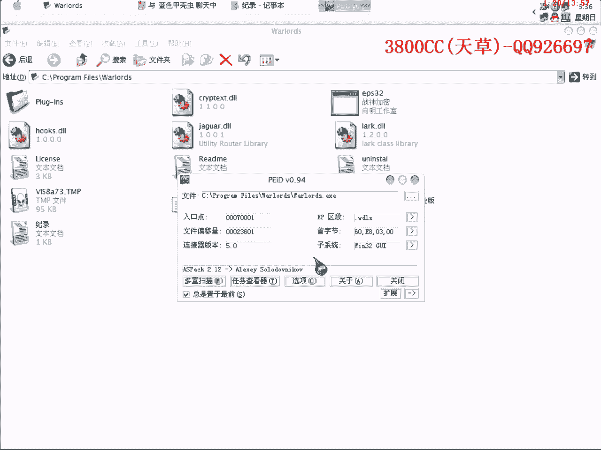
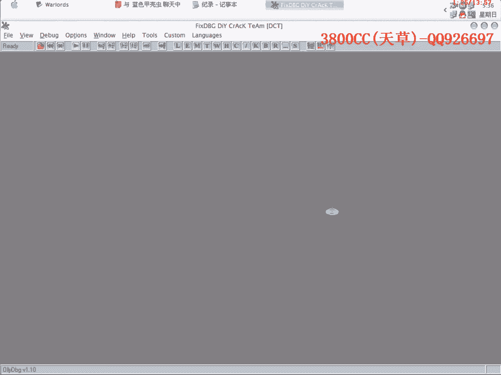
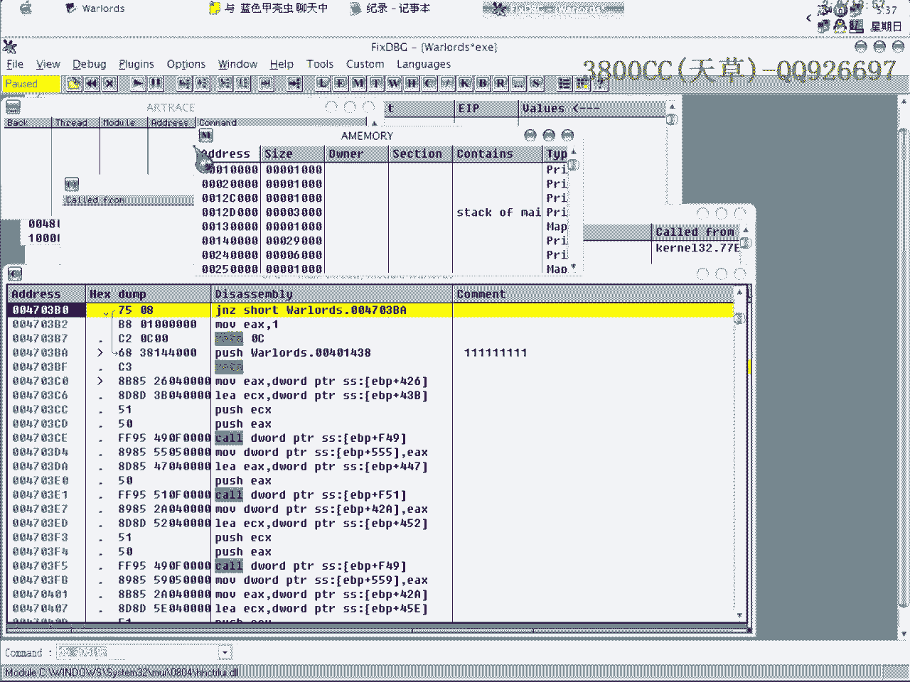

# 天草流初级课程 - P22：手动Patch教程 🛠️

在本节课中，我们将学习如何手动对程序进行Patch（补丁），以实现破解目的。我们将使用一个之前课程中接触过的目标程序作为示例，但这次不使用现成的Patch工具，而是手动完成整个过程。通过本教程，你将掌握手动定位关键代码、注入自定义代码以及修改程序流程的核心方法。

## 概述

手动Patch的核心步骤分为三部分：首先，找到程序破解的关键位置和原始入口点（OEP）；其次，在程序中找到一个安全区域来注入我们自己的代码；最后，修改程序的执行流程，使其跳转到我们注入的代码处，执行后再返回OEP。下面我们将分步详细讲解。



## 第一步：定位关键点与OEP



上一节我们概述了手动Patch的三个核心步骤。本节中，我们来看看第一步的具体操作：定位关键点与程序的原始入口点（OEP）。

首先，我们需要使用调试器载入目标程序。载入后，通过单步执行，观察程序的运行流程。




在单步执行的过程中，我们需要找到两个关键位置：
1.  **程序破解的关键判断点**：通常是决定程序是否注册成功的一个条件跳转指令。
2.  **程序的原始入口点（OEP）**：这是程序原本开始执行的地方。

以下是定位过程的关键截图：


如图所示，图中指示的位置就是我们需要修改的、跳向OEP的关键跳转指令。我们的目标就是修改这里，让它先跳转到我们注入的代码。

## 第二步：寻找代码注入区

在找到了需要修改的关键跳转后，我们需要为自定义代码找一个“家”。本节我们将学习如何在程序中找到一个安全的区域来存放我们的代码。

理想的注入区域是程序内未被使用的空白数据区。通常，我们可以查看程序的区段（Section），寻找一个名为 **SFX** 或包含大量空值（00）的区段。


对于当前示例程序，**SFX** 区段从地址 `00401234` 开始。我们可以在该区段内，寻找一段连续的空白区域（显示为 `00` 的字节）。选择时需确保我们注入的代码长度不会超出该区段的边界。

例如，我们选择了地址 `00401500` 作为注入点。只要 `00401500` 加上我们代码的长度不超过 **SFX** 区段的结束地址，这个位置就是安全的。

## 第三步：修改流程与注入代码

现在，我们已经拥有了所有“零件”：关键跳转地址、OEP地址和安全的代码注入地址。本节我们将动手修改程序流程并写入破解代码。

首先，修改第一步中找到的关键跳转指令，使其跳转到我们选定的注入地址（例如 `00401500`）。

然后，在注入地址 `00401500` 处，开始写入我们的破解代码。代码需要完成两项任务：
1.  修改内存中某个关键字节的值（例如，将决定注册状态的 `85` 改为 `84`）。
2.  执行完毕后，跳转回程序的原始入口点（OEP）。

以下是两种写入代码的方式：

**方法一：修改单个字节**
如果只需要修改一个字节，可以使用 `mov byte ptr` 指令。
```assembly
mov byte ptr [目标地址], 84h  ; 将目标地址处的字节改为84（十六进制）
jmp OEP地址                   ; 跳回程序原始入口点
```

**方法二：修改多个字节（以双字为例）**
如果需要修改多个字节（例如4个字节），则需要使用 `mov dword ptr` 指令，并注意数据在内存中的存储顺序是反的（小端序）。
```assembly
mov dword ptr [目标地址], 840FDB84h  ; 写入4个字节的数据
jmp OEP地址                           ; 跳回程序原始入口点
```
**注意**：数据 `840FDB84h` 在内存中会以 `84 DB 0F 84` 的顺序存储。

写入代码后，保存对程序的修改。运行修改后的程序，如果破解成功，程序将顺利运行，注册限制已被解除。

## 原理与细节分析

为了加深理解，让我们分析一下代码的工作原理。我们以修改单个字节为例。

在关键跳转处，程序原本的指令可能是一个条件判断。我们将其改为无条件跳转（`jmp`）到我们的代码区。

在我们的注入代码中，`mov byte ptr [xxxx], 84h` 这一行直接改变了内存中某个标志位的值。这个值可能就是程序检查注册状态的关键。将其从 `85` 改为 `84`，相当于让程序“认为”注册已经成功。

执行完修改后，`jmp OEP` 让程序无缝地回到原本的执行流程，就像什么都没发生过一样，但程序的状态已经被我们改变了。

**一个重要提示**：在使用 `mov dword ptr` 写入数据时，如果你只想修改一个字节，但只提供了一个字节的数据（例如 `84h`），那么指令会默认用 `00` 填充其余3个字节。这可能会意外地破坏周围的数据，导致程序崩溃。因此，务必确保提供的数据长度与指令操作长度匹配。

## 总结

本节课中，我们一起学习了手动Patch程序的完整流程：
1.  **定位**：使用调试器找到关键的破解点和程序的OEP。
2.  **找位置**：在程序的空白区段（如SFX）中寻找安全的代码注入地址。
3.  **修改与注入**：修改关键跳转指向注入地址，并在该地址写入自定义的破解代码（修改内存值并跳回OEP）。


通过这个实践，我们不仅掌握了一种具体的破解技术，更重要的是理解了程序在内存中的运行和修改机制。这为后续学习更复杂的逆向工程知识打下了坚实的基础。