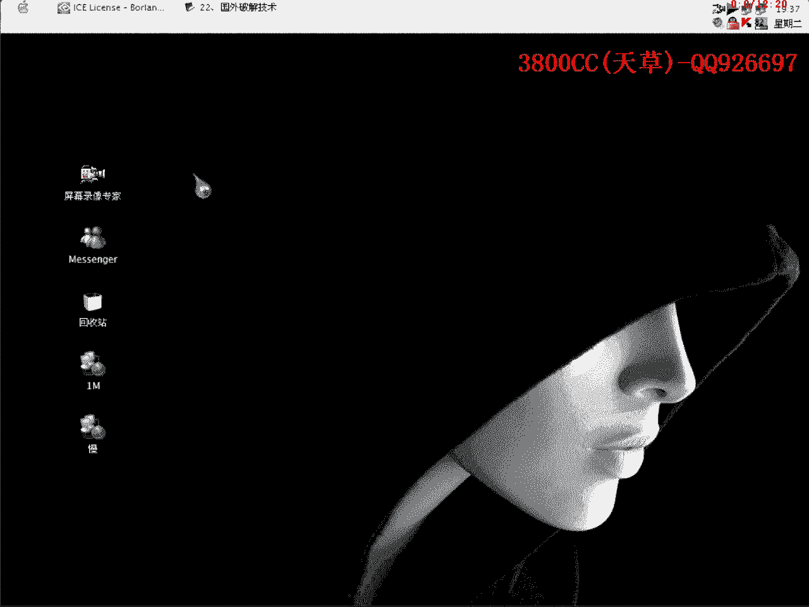
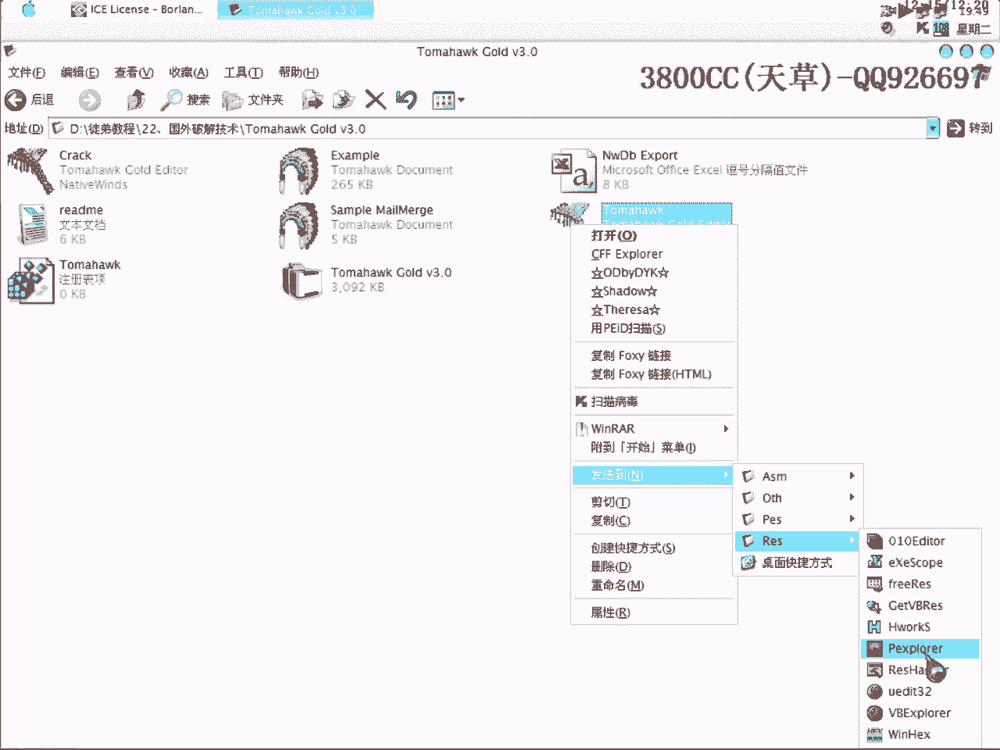

# 天草流初级破解教程 - P23：第22课、国外破解技术 - 白嫖无双 🧠💻



在本节课中，我们将学习一种源自国外的软件破解技术。这种技术主要针对使用特定加密算法保护的Delphi程序，其核心思路并非直接调试，而是通过分析并修改程序的资源文件来达到破解目的。我们将通过一个具体的实例来演示整个过程。

---

## 概述与背景 🌍

纵观软件加密与破解领域，国外的技术水平通常领先于国内。这一点从加壳软件的开发上就可见一斑。例如，国内有“北斗”加壳，而国外（尤其是俄罗斯）则有高手编写的 **AS Protect**、**AC Protect** 等强壳。

本节课介绍的技术并非针对加壳软件，而是针对一种**算法加密软件**。这种软件本身用于保护其他程序，我们今天的目标就是破解一个被它处理过的程序。

我们先来看一下这个加密软件的官方网站。网站上提供了试用版、标准版、专业版和白金版等不同版本。我们今天的目标程序是一个用Delphi编写的、并经过该软件加密的试用版程序。

> 注：该软件为试用版，功能受限，但破解思路具有通用性。

---

## 目标程序分析 🔍

上一节我们介绍了技术背景，本节中我们来看看目标程序的具体情况。

我已经将目标程序脱壳，得到一个可执行文件。运行程序，可以看到界面显示为“试用版”，用户名为“Unregistered User”，并有30天的使用期限。

这个程序是使用Delphi编写的。通过资源编辑工具（如ResHacker）查看其资源，可以找到一个名为 **`TForm3`** 的窗体资源。其内容中包含大量与软件状态相关的字符串，例如：
*   `IC-News` （软件名称）
*   `Trial` （试用）
*   `Unregistered User` （未注册用户）
*   `30 days` （30天）
*   `Registered` （已注册）

这些字符串清晰地表明了程序的不同状态。

---

## 破解思路与操作 🛠️

了解了程序结构后，本节我们来看看具体的破解思路和操作步骤。

核心思路是：直接修改资源文件中表示程序状态的字符串，将其从“试用”状态改为“已注册”状态。

以下是具体操作步骤：

1.  **定位关键资源**：使用资源编辑工具打开目标程序，找到包含状态字符串的窗体资源（本例中为 `TForm3`）。
2.  **修改状态字符串**：将 `Trial`、`Unregistered` 等相关字符串全部替换为 `Registered` 或 `ICNX Registered`。
3.  **保存并测试**：保存修改后的程序并运行。此时程序可能会闪退，这提示我们还有其他的验证机制。

程序闪退的原因在于，它可能依赖外部文件或资源段内的特定数据来运行。检查程序目录，发现存在一个额外的数据文件或资源段。在 `TForm1` 的资源中，我们也发现了与 `TForm3` 中类似的一堆数据。

4.  **清除验证数据**：将 `TForm1` 资源中那堆类似的数据**全部删除（清零）**。
5.  **最终验证**：再次运行修改后的程序。此时程序成功启动，并显示为“已注册”状态，所有试用限制均已解除。

**核心操作总结为代码/命令描述**：
```plaintext
1. 用资源编辑器打开 Program.exe
2. 在 TForm3 资源中，将 “Trial” 替换为 “Registered”
3. 在 TForm1 资源中，找到并清空可疑的数据段
4. 保存修改，运行破解后的程序
```

---

## 技术要点与拓展 💡

上一节我们完成了破解操作，本节中我们来总结一下其中的技术要点和拓展思路。

这种方法的关键在于识别程序的特征：
1.  **编程语言**：目标程序由 **Delphi** 编写。
2.  **加密标志**：程序中包含特定加密软件的标志，例如字符串 **“Trial License”**。
3.  **资源特征**：在资源文件中存在大量明文的、描述软件状态（试用、注册、天数）的字符串。

当遇到同时具备这些特征的程序时，就可以尝试使用本课介绍的方法：直接用资源编辑工具打开分析，修改关键字符串和清理验证数据，从而实现快速破解。

从技术发展趋势看，国外在Delphi编程和相应保护技术的应用上起步更早、更广泛。因此，学习和掌握这类国外流行的破解思路，对于应对国内未来可能出现的同类保护软件具有重要意义。

---

## 总结 📚

本节课中我们一起学习了一种针对特定加密软件的Delphi程序破解技术。

我们首先了解了国外在软件保护技术上的领先地位。然后，我们分析了一个目标程序，发现其通过资源文件明文存储状态信息。接着，我们通过**修改资源字符串**和**清理验证数据**两步操作，成功将试用版程序转变为已注册版。最后，我们总结了该技术的识别特征和应用场景。



这种方法的优势在于简单直接，无需复杂的动态调试，适合初学者理解和实践。希望你能掌握这种思路，并灵活运用到未来的学习中去。