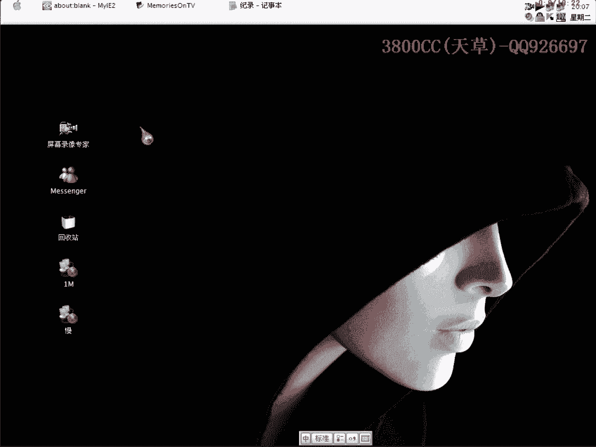
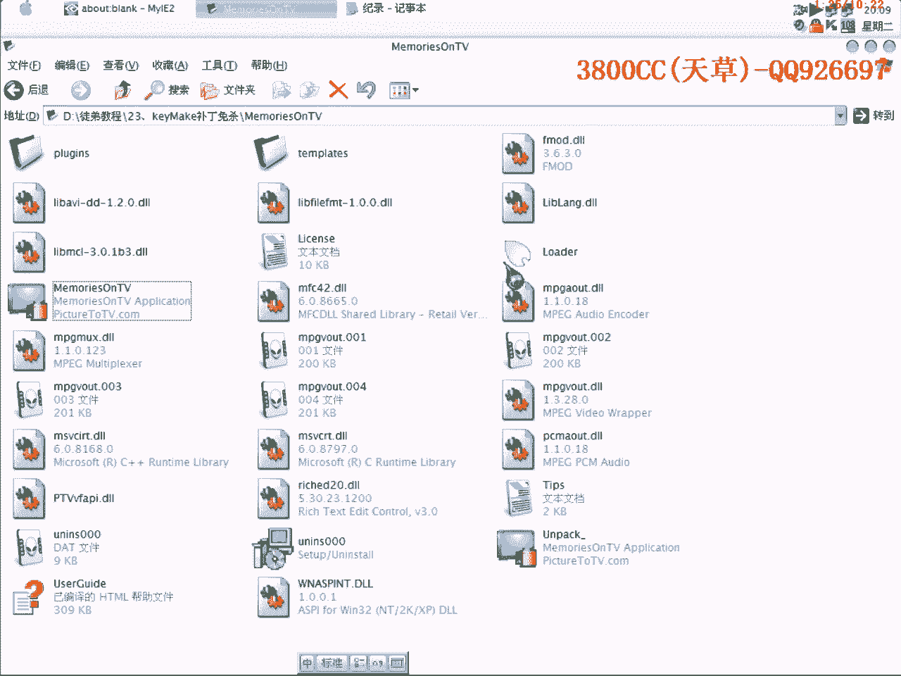
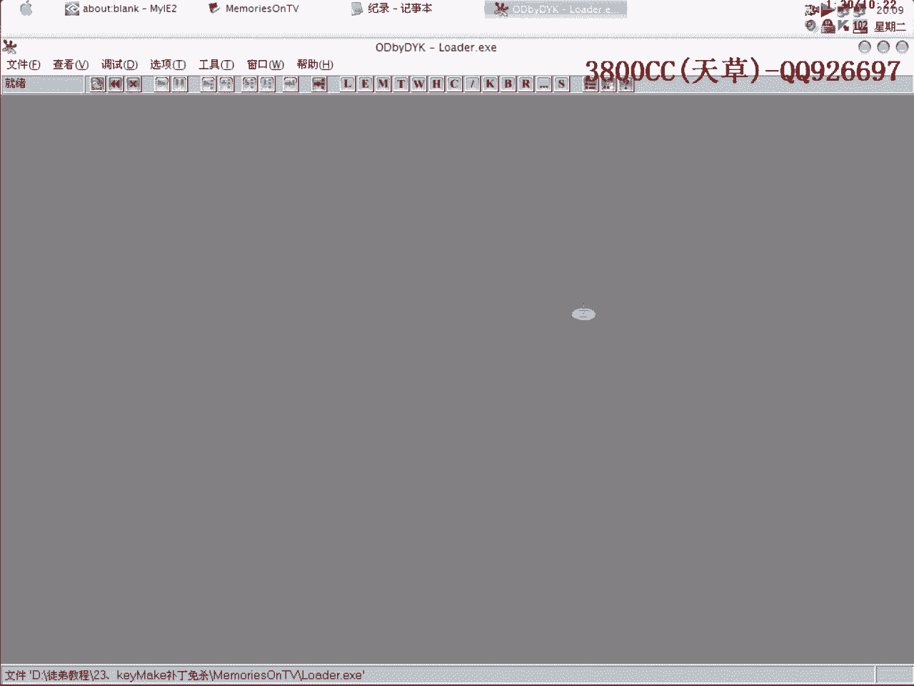
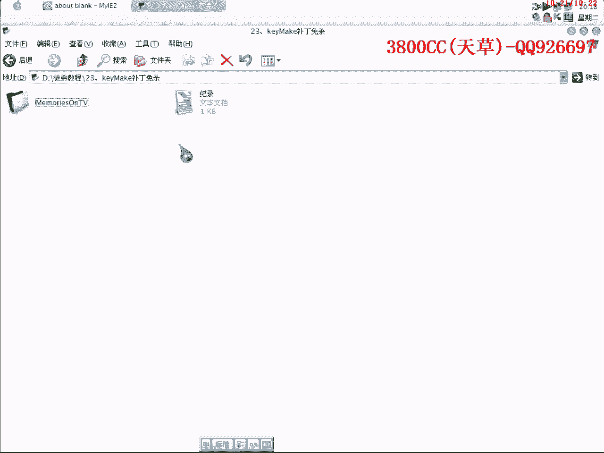

# 天草流初级教程 - P24：第23课，keyMake补丁免杀 🛡️

在本节课中，我们将学习一种针对特定程序（如游戏外挂补丁）的免杀技术。核心思路是通过修改程序入口点（OEP）附近的代码，以绕过杀毒软件（如卡巴斯基）的静态特征检测。我们将使用两种方法：一种是不加花指令的直接修改，另一种是加入花指令的修改。

---

## 课程概述

本节课的目标是让一个原本会被杀毒软件查杀的程序，通过修改其入口点附近的代码逻辑，实现免杀效果，并且保证程序功能正常。我们将以两个程序为例进行演示。



---

## 演示程序对比



以下是两个程序在卡巴斯基扫描下的结果对比：

*   **原始补丁程序**：被卡巴斯基检测为“QQ密码病毒”并查杀。
*   **修改后的免杀程序**：成功绕过卡巴斯基的检测。

我们接下来的任务就是将第一个程序修改为第二个程序的状态。

---

## 核心思路与准备工作

上一节课我们介绍了手动脱壳，本节课的方法与之有相似之处。核心在于修改程序快要跳转到原始入口点（OEP）的代码路径。

首先，我们需要定位到程序的OEP附近。使用调试器（如OD）载入程序，找到跳转到OEP的指令。例如，在演示中，OEP的地址是 `0040100C`。

---

## 方法一：直接修改法（无花指令）

这种方法直接替换入口点附近的代码逻辑，欺骗杀毒软件。

以下是操作步骤：

1.  **定位关键跳转**：在调试器中，找到程序运行时最终跳向OEP的那条指令（例如 `JMP 0040100C`）。
2.  **修改代码**：将原有的跳转指令修改为一段新的代码片段。这段代码的功能是将OEP地址压入栈中，然后通过 `RETN` 指令返回，从而跳转到OEP。
3.  **代码示例**：
    ```assembly
    PUSH 0040100C  ; 将OEP地址压栈
    RETN           ; 返回，跳转到OEP
    ```
4.  **保存修改**：在调试器中应用修改，并保存为新文件。
5.  **验证**：使用杀毒软件扫描新文件，并运行测试功能是否正常。

**关键点**：这种方法利用了VC++程序常见的入口点特征进行替换，修改简单直接。

---

## 方法二：添加花指令法

为了增加反分析的难度，我们可以在方法一的基础上加入一些无实际作用的花指令。

以下是操作步骤：

1.  **准备花指令代码**：在OEP附近找到有足够空余空间（例如全是00的区域）的位置。
2.  **写入混合代码**：写入一段结合了花指令和核心跳转逻辑的代码。例如，先将OEP地址存入寄存器（如EAX），再执行一些无意义的操作，最后压栈并返回。
3.  **代码示例**：
    ```assembly
    MOV EAX, 0040100C  ; 将OEP地址存入EAX
    NOP                ; 无意义指令（花指令）
    NOP                ; 无意义指令（花指令）
    PUSH EAX           ; 将EAX（即OEP地址）压栈
    RETN               ; 返回，跳转到OEP
    ```
4.  **修改跳转**：将原程序跳转到OEP的指令，改为跳转到我们刚写入的这段新代码的起始地址。
5.  **栈平衡**：务必注意，在修改代码时，要保证堆栈的平衡。如果使用了 `PUSH EAX`，通常需要在之前或之后有对应的操作来平衡堆栈。

**关键点**：花指令能干扰简单的静态分析，但核心跳转逻辑（压栈+返回）与方法一相同。

---

## 其他思路与注意事项

除了 `PUSH + RETN`，还可以尝试其他跳转方式，例如直接使用 `JMP` 指令跳转到一段新的代码区域，再在该区域执行跳转到OEP的操作。方法多种多样，核心是改变杀毒软件识别的固定模式。

需要注意以下几点：

*   **程序兼容性**：对于某些带有校验或特殊数据（如本例中的“LOAD”数据）的程序，直接在原始代码上加壳可能导致程序损坏。我们的方法是在入口点“做手脚”，不影响程序主体，兼容性更好。
*   **杀毒软件适应性**：此方法主要针对特定杀毒软件（如卡巴斯基）的静态特征检测。对于其他杀毒软件或动态行为检测，效果可能不同。
*   **头部替换**：也可以尝试用其他编译器（如Delphi）生成程序的PE头部特征来替换原程序头部，有时也能起到免杀效果。

---

## 课程总结

本节课我们一起学习了针对“keyMake”补丁程序的免杀技术。

我们掌握了两种核心方法：
1.  **直接修改法**：通过 `PUSH OEP_ADDRESS` 和 `RETN` 指令组合，直接修改入口跳转。
2.  **添加花指令法**：在核心跳转逻辑中加入干扰指令，增强免杀效果。



这两种方法的共同思路都是**修改程序快要跳转到原始入口点（OEP）的代码**，从而改变程序的静态特征，绕过杀毒软件的查杀。请务必在理解原理的基础上进行实践，并注意保持修改后程序的正常运行。