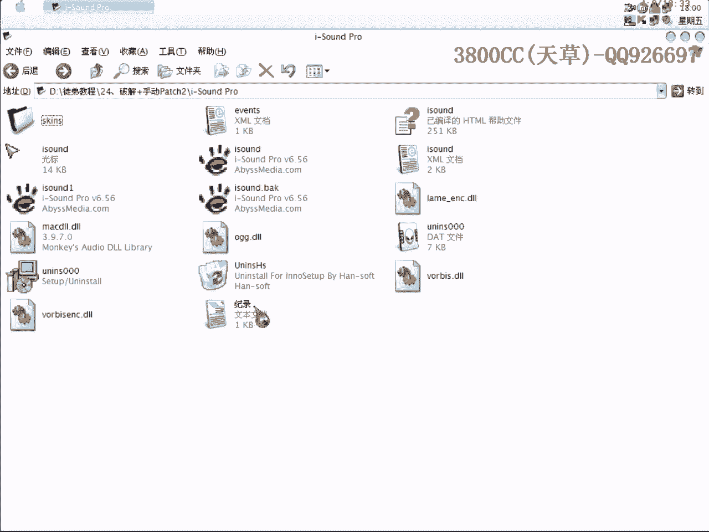
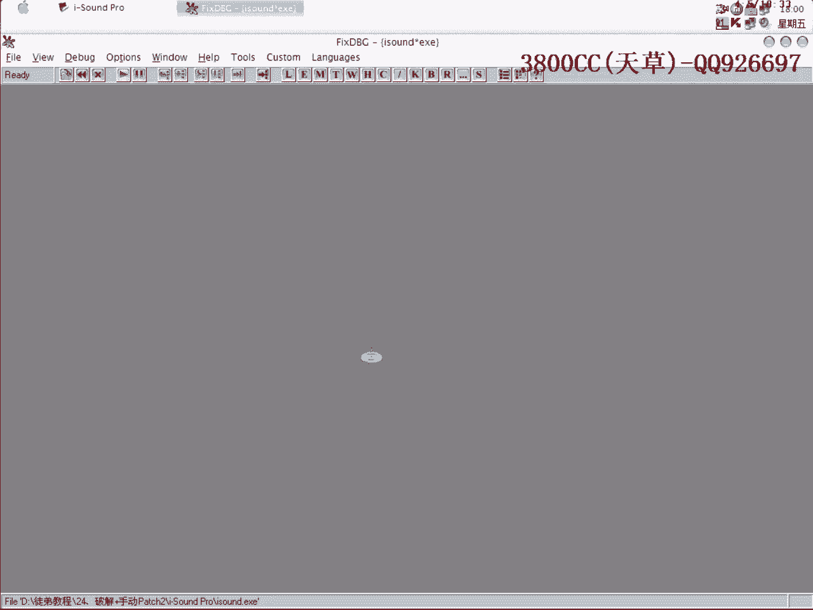
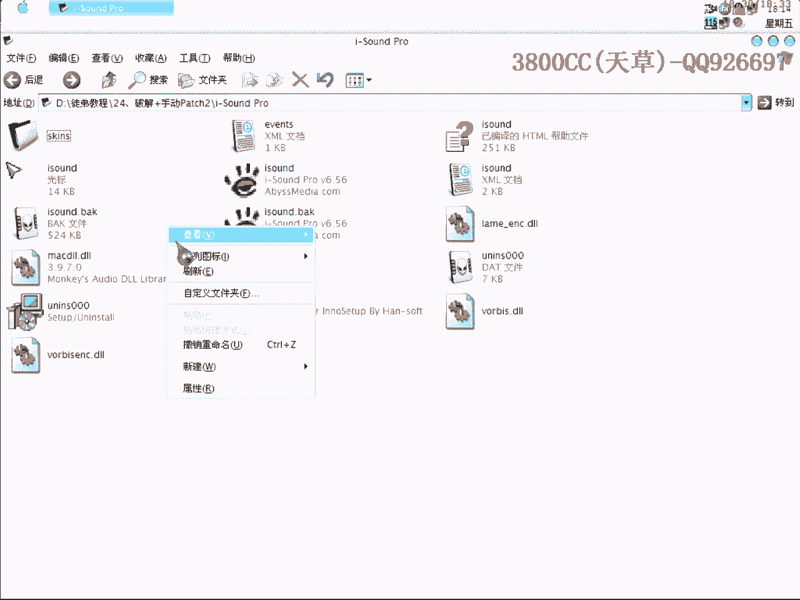

# 天草流初级课程 - P25：破解与手动Patch实例2 🔧


在本节课中，我们将学习如何对一个加壳程序进行手动Patch，以实现软件破解。我们将通过一个具体实例，详细讲解定位关键跳转、修改汇编指令以及如何在加壳程序中写入补丁代码的完整流程。

---

## 课程概述 📖

本节课是“破解与手动Patch”系列的第二讲。我们将对一个使用UPX加壳的软件进行破解。核心目标是找到控制软件注册状态的关键跳转，并通过修改最少的字节（本例中为一个字节），使软件显示为已注册版本。

上一节我们介绍了手动Patch的基本概念，本节中我们来看看如何在一个实际的加壳程序中应用这些技巧。

---

## 准备工作 🛠️





首先，我们有两个相同的软件文件，其中一个为原始加壳版本，另一个为已脱壳版本用于分析。

运行原始加壳程序时，可能会提示缺少相关文件（如XML）。为了方便调试，可以临时修改文件名以避免此错误。

软件界面中显示“This copy is unregistered”，这表明当前为未注册版本。我们的目标就是改变这个状态。

---

## 定位关键代码 🔍

我们将使用调试器载入已脱壳的程序进行分析。

1.  在反汇编窗口中搜索字符串“This copy is unregistered”。
2.  在搜索结果附近，可以找到“registered version”等相关字符串。双击进入该代码区域。
3.  在此区域，通常会存在一个关键的条件跳转指令（如`JZ`, `JNZ`），它决定了程序显示注册还是未注册信息。

以下是定位过程的要点：
*   该跳转指令很可能依赖于某个寄存器的值（例如`AL`）。
*   在调试时，可以在该跳转指令处设置断点。
*   为了触发断点，可以事先在软件中输入一个假的注册码，这样程序运行时就会读取并处理这个信息，从而执行到我们的断点处。

---

## 分析并修改关键跳转 ⚙️

当程序在关键跳转处断下后，我们需要观察是哪个条件导致了跳转。

*   例如，发现`AL`寄存器的值为`00`时，程序跳向未注册流程。
*   我们的目标就是让程序不执行这个跳转，或者让`AL`的值变为非零（如`01`）。

通过分析上下文代码，我们发现有一条指令`MOV AL, [EBX]`。`EBX`指向一个可能由算法生成的字符串。
*   深入分析这个字符串生成算法（看起来类似MD5）对初学者而言较为复杂。
*   更简单的方法是：我们注意到`ECX`寄存器在此处持有一个唯一且非零的值。


因此，我们可以将指令修改为`MOV AL, [ECX]`，这样`AL`就能获得一个非零值，从而使关键跳转失效。修改汇编指令对应的机器码，可能仅需改变一个字节（例如将`8B03`改为`8B01`）。

在脱壳文件中完成此修改并保存后，运行程序，界面应显示为“registered to winning”，表示破解成功。

---

## 在加壳程序中手动Patch 🧩

现在，我们需要将上述修改应用到原始的加壳程序上。由于程序被压缩，我们不能直接修改原始代码段。

以下是操作步骤：

1.  **寻找代码位置**：在调试器中载入加壳程序，使用ESP定律等方法找到程序的原始入口点（OEP）附近。定位到与脱壳文件中相同功能的关键指令位置（例如地址`0045D2D3`处的指令`MOV AL, [EBX]`）。
2.  **寻找空闲空间**：我们需要在加壳程序的某个区段（如UPX1）中找到一段未被使用的“空闲区域”来写入我们的补丁代码。在内存映射中，通常可以看到大量以`00`填充的区域。
3.  **编写补丁代码**：在选定的空闲地址（例如`0065BDC0`）编写补丁。补丁需要完成两件事：
    *   执行我们需要的修改（例如`MOV AL, 01`）。
    *   跳转回原始流程中被我们“覆盖”掉的原指令之后的位置继续执行。
    补丁代码示例如下：
    ```assembly
    0065BDC0    B0 01          MOV AL, 1          ; 将AL设置为1
    0065BDC2    EB 0E          JMP 0045D2E3       ; 跳回原流程的下一句指令
    ```
4.  **修改原指令**：将原关键指令（`0045D2D3`处的`8B03`）修改为一个跳转指令，让其跳转到我们刚刚编写的补丁地址。
    ```assembly
    0045D2D3    E9 E8EA77FF    JMP 0065BDC0       ; 跳转到我们的补丁代码
    ```
5.  **执行验证**：运行修改后的加壳程序。程序执行到`0045D2D3`时会跳转到我们的补丁，将`AL`设为1，然后跳回原流程，从而实现与修改脱壳文件相同的破解效果。

---

## 核心要点总结 ✨

本节课中我们一起学习了手动Patch的完整实战流程：

1.  **分析定位**：在脱壳版本中搜索关键字符串，找到决定注册状态的关键跳转指令。
2.  **策略修改**：分析上下文，找到用最少字节修改（通常是一字节）改变程序逻辑的方法（如修改数据来源寄存器）。
3.  **加壳程序Patch**：在加壳程序中寻找空闲空间写入补丁代码，并通过修改原指令跳转到补丁，最终实现破解。

手动Patch的关键在于**理解程序逻辑**和**灵活运用跳转**。这种方法尤其适用于一些压缩壳，对于有强校验的加密壳则会复杂得多。打好汇编和调试基础是掌握更高级破解技术的前提。

---



**注意**：本教程仅用于安全技术学习与研究，请勿用于非法用途。