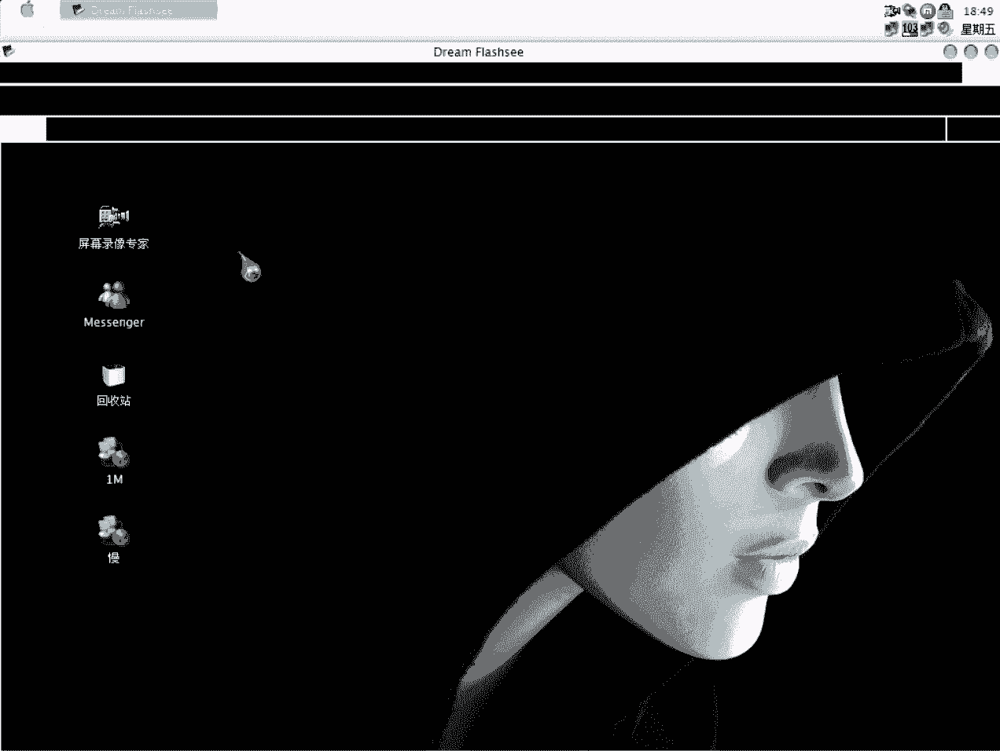

# 天草流初级破解教程 - P26：第25课 - 破解重启验证与内存注册机制作 🔍



在本节课中，我们将学习如何分析一个采用“重启验证”方式的程序，并利用OD（OllyDbg）动态调试，最终通过制作内存注册机来获取有效的注册码。整个过程将涉及对程序文件的分析、关键字符串的定位、算法逻辑的追踪以及注册机的配置。

---

## 概述与程序行为分析

首先运行目标程序，尝试输入假码并点击注册按钮。程序无任何即时反馈，这通常表明其采用了**重启验证**机制。程序会在关闭或重启后，读取存储在系统某处（如配置文件、注册表）的注册信息进行验证。

因此，我们的首要任务是定位程序用于存储注册信息的文件。

---

## 定位与分析配置文件

在程序目录下进行查找，发现一个可疑的配置文件（例如 `.ini`、`.dat` 或特定名称文件）。这通常是重启验证程序存储注册信息的位置。

使用OD载入目标程序并运行。程序会读取该配置文件。通过OD的字符串参考功能，或在其读取文件内容的API函数（如 `GetPrivateProfileString`）上设置断点，可以拦截到程序对文件的操作。

程序首先读取文件中存储的**用户名**，接着读取**注册码**。我们关注读取注册码后的程序逻辑。

---

## 追踪注册码验证算法

当程序读取我们输入的假注册码后，会进入验证流程。在OD中，可以看到程序将用户名通过某种算法转换成一个字符串。

例如，代码中可能出现如下逻辑：
```assembly
; 假设将用户名转换
CALL 算法函数
MOV 转换后字符串, EAX
```
随后，程序会将这个转换后的字符串与从配置文件中读取的注册码进行比较。

进一步分析发现，该程序对用户名应用了**两套不同的算法**，分别生成两个不同的字符串，并据此生成两个可能的有效注册码。这意味着每个用户名可能对应两个有效的注册码。

字符串的生成规则可能涉及**截取**和**拼接**。例如：
*   **规则1**：从转换后的字符串中，以特定间隔截取固定长度的子串。
    *   例如：取前5位，跳过4位，再取5位，跳过2位，再取5位。
    *   伪代码表示：`S1 = Mid(原始字符串, 1, 5) + Mid(原始字符串, 10, 5) + Mid(原始字符串, 17, 5)`
*   **规则2**：将字符串转为大写后，按“3-5-3”结构，间隔特定位置进行截取。
    *   伪代码表示：`S2 = UCase(Mid(原始字符串, 1, 3)) + "-" + UCase(Mid(原始字符串, 5, 5)) + "-" + UCase(Mid(原始字符串, 11, 3))`

最终，程序会用“-”将截取出的各部分连接，形成完整的注册码字符串，再与我们输入的假码进行比较。

---

## 获取与验证注册码

在OD中跟踪到比较指令（通常是 `CMP` 或 `TEST`）时，可以在寄存器或堆栈中看到程序计算出的**真实验证码**。

将OD中找到的两个潜在注册码记录下来。退出OD，在原始程序中，将配置文件内的假注册码替换为找到的真注册码。重启程序验证，确认注册成功。

这证明了我们的分析是正确的：程序使用两套算法，为用户名生成两个有效注册码。

---

## 制作内存注册机

由于我们已找到生成注册码的关键代码地址，可以制作内存注册机，使其自动为任意用户名计算注册码。

以下是制作步骤：

1.  **定位关键指令**：在OD中找到生成第一个注册码并将结果放入 `EAX` 寄存器的指令地址。再找到生成第二个注册码的指令地址。
2.  **配置注册机**：
    *   打开内存注册机制作工具（例如 `Keymake`）。
    *   添加第一个中断地址。
    *   **中断次数**：1
    *   **第一字节**：该地址处指令的第一个字节（例如 `0x18`）。
    *   **指令长度**：需复制的指令长度。注册码以Unicode字符串形式存在于 `EAX` 中，每个字符占2字节。例如，10字符的注册码，长度为 `10 * 2 = 20` 字节，但通常工具按“字节数”输入，这里填 `20`。注意，有些工具可能自动计算，需根据实际情况调整。
    *   **内存方式**：选择 `EAX` 寄存器。
    *   重复以上步骤，添加第二个中断地址以获取第二个注册码。
3.  **测试注册机**：运行目标程序和内存注册机。在程序界面输入任意用户名，内存注册机会自动弹出计算出的两个注册码。使用任一注册码均可完成注册。

**注意**：内存注册机生成的注册码与运行注册机时程序界面中填写的用户名严格对应。

---

## 总结

本节课我们一起学习了破解重启验证程序的标准流程。

1.  **分析行为**：通过程序无即时反馈判断其为重启验证。
2.  **定位数据**：查找并分析程序存储注册信息的配置文件。
3.  **动态调试**：使用OD跟踪程序启动时读取配置文件和验证注册码的过程。
4.  **分析算法**：理解程序将用户名通过特定算法（截取、拼接、大小写转换）转换为验证码的逻辑。本例中发现了**两套并行的算法**。
5.  **获取密钥**：直接从内存中提取算法计算出的有效注册码。
6.  **制作工具**：基于关键代码地址，制作内存注册机，实现对该程序注册码的自动计算。


掌握此流程和OD的基本调试技巧，是理解更复杂加密算法的基础。请务必扎实练习，尝试用不同的用户名进行测试，以加深对算法规则的理解。