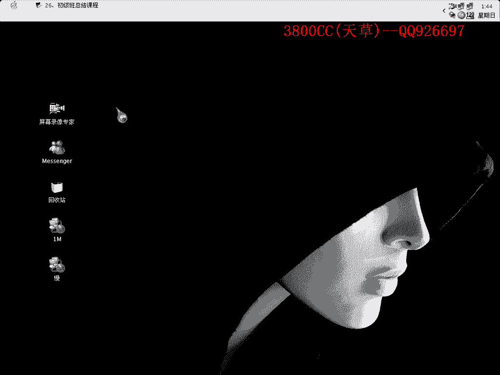
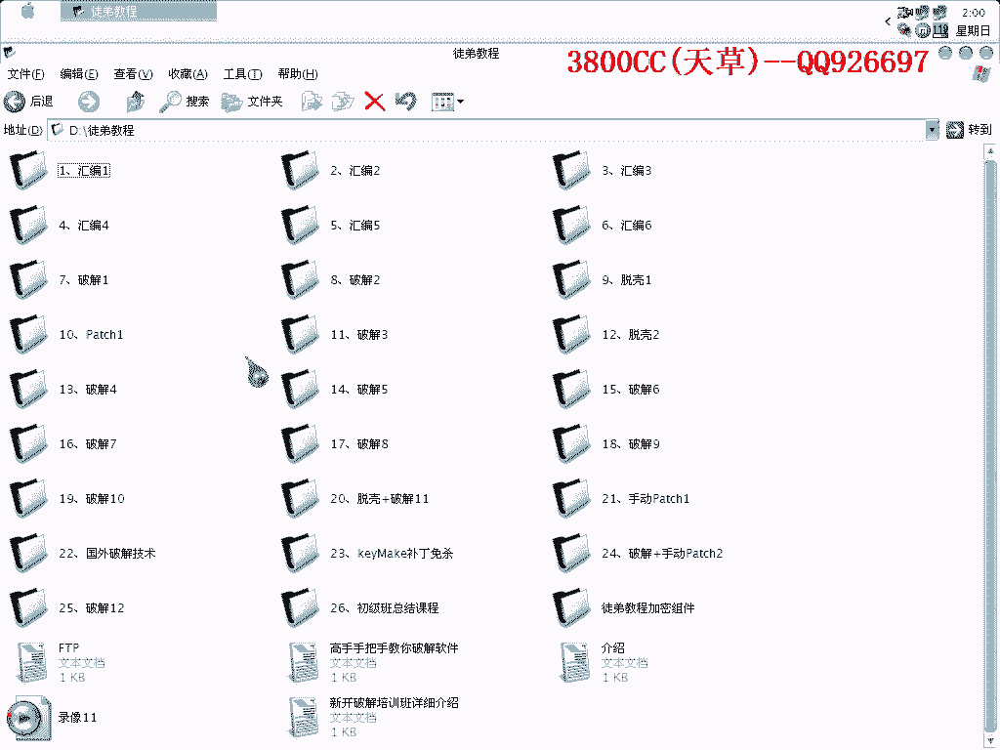

# 天草流初级 - P27：26、初级班总结课程 - 白嫖无双 - BV1qx411k7qA

大家好。

现在是我们初级版，初级版最后一节课，总结课，我就是说把初级的一些内容，再加上一些思路，思路总结一下，总结起来，咱们先来看这个课件，首先呢，我们的前面几节课里面有几节会边，后来说中间就差两节，其实我觉得。

大家在，就是说现在啊没有会边的基础，先上几节会边的基础课，然后呢，在课节里面，再慢慢吸收一下，这个样子比较好一点，因为单独讲会边课，非常枯燥啊，大家又不知道怎么样去运用，所以就没有加了。

这个大家在下面呢，要下一点功夫了，会边，这就是脱课啊，脱课呢脱课课，我这个里面，就讲了三节吧，三节脱课课，就是专门的脱课，在这里啊脱课，第一个五种常见的语言特征，这个啊我不想替大家做事啊。

这个大家要自己去手动去去找一下，自己去找，这个样子印象深刻一些，我找给大家，大家看一下就忘记了啊，这个不好意思，我已经说过很多很多遍了，我不想再重复了啊，大家去自己去找，五种就是说用常见语言。

会边C还有啊Delphi VB，还有一个什么，Delphi VB会边C，就这五种，还有BC++，大家自己去找，第二个呢，就是附加数据的处理啊，附加数据处理，这个在前面说的是，找最后一个区段的啊。

R offset和R size压起来，就是附加数据的一个类别，用到的工具有OneHex或者是H，WalkSensor，这就是自教验的处理啊，自教验的处理，那这里有两种方法，就是说如果是调用错误提示的话。

就是说那个错误提示是调用错误的话，就用F12对战法，F12调用对战法，这个呢是我取的一个名字啊，F12对战调用法，就是我所说的，首先运行起来，然后等错误提示出现，在中在F12暂停，然后再调用对战。

就是这个方法，简称F12对战调用法，像这个调用错误提示呢，就是在我们的这个TALK啊，这个TALK1里面啊，这个是我们的TALK后的，TALK后有那么一个提示，那种提示啊，是一种比较非的。

就是一种非常普遍，普通的啊，普通的调用错误提示，然后呢再就是说，如果是文件啊，或者数据损坏错误提示的话，比如说什么，Invalid data in file啊，或者是什么之类的，那就用了两个OD对比法。

用到这个断点，用到这个断点，分别啊，两个OD同时打开，分别下这个断点，然后等读取，你载入的文件的时候再返回，慢慢跟，TALK还有一个重要的就是，BC++程序手动查找IAT法，这个哈，并不是BC++程序。

就是说现在一些比较强一些的课，都要啊，都要自己，涉及到自己手动查找IAT，这个大家必须要掌握，不然后面就跟不上了，说的里一头雾水，这就是破解了，我们在初级班里面破解课不少，不少的破解课，大家看一下。

有12节破解课，有12节，然后这个呢，也算是破解课了，13节啊，这个也是啊，基本上除了汇编，浙江破课都是破解了，一般的程序的破解的话，就是说并不是重启验证啊，网络验证啊，什么之类的啊。

目标的我们的目标是找按钮事件，找注册的相关按钮事件啊，这个我给大家也说过很多次了，很多次了，这个大家要非常清楚了，方法，第一个方法是查找字幕创作的方法，查找字幕创作的方法，这个也不用我多说了。

我也不用我多说了，我已经说过很多遍了，因为在破解里面啊，都有说过的，都有说过的，然后就是L4R对单调用法，我一再一再强调这个方法，一再一再，已经非常多的多次强调这个方法，这个大家一定要掌握。

因为因为它的确很重要，在破解外挂的时候也经常经常的，频繁的使用到，然后呢，如果有那个什么错误提示的话，也可以用Maxbox，Maxbox断点法断点法，因为就是说在首先下好这个断点。

然后再点那个你的那个目标按钮，然后再就会提示啊，就会中断下来，中断下来，然后返回了，返回之后，我们再回溯，回溯往上面找找到断属，重启验证重启验证，目标就是首先要找验证类型，首先呢。

第一种类型是注册表类型啊，他就是分这两种大类啊，这两种大类，第二个就是文件类型，文件类型里面有一个特别的就是，IL文件类型，这就是其他的文件类型，像我在有的有些课程里面说过什么DLL啊。

DLL就是像DLL是非常非常少见的，因为他设计在编程方面啊，设计到一个比较难处理的，就是说本身DLL是，比如说是多少K，比如说是8K，然后呢是没有注册的吗，8K的时候是没有注册的，然后注册之后呢。

他就写入一些数据，写入我们的一个注册信息就变成8。1K，但他这个像DLL写入数据的话，这编程上面非常难处理，所以比较少见了，比较少见，方法啊，方法啊，方法一呢，就是说访问注册表类型的常用API。

有这么一些，大家自己看，自己看，我们在常用的常用的就是这两个啊，并且这两个里面常用到的是这个，这个相关API的一些意思，大家也可以再去找一下，再去找一下其他的，长一些，那个API速查表啊，什么之类。

这个大家必须自己去收到，不要老是依赖我，这个样子不太好啊，就是说我现在带大家，大家依赖我，以后不带大家了，大家依赖谁，对吧，这就是访问文件的常用API，Create File，Create File。

这个是我们在破解里面也经常使用到的，还有其他的几个，这个是常用的，一般用这个就够了，像这个呢，用这个就够了，这就是安安文件内型的，这个用的，这个啊，我们在破解课里面好像接触到两次吧，两次三次。

就下这么一个断节，它是专门针对安安文件的，因为在delphi编写的程序的时候啊，他就要调用这个，调用这个调用这个函数，他的意思是获取啊，get获取，get获取，然后呢，他接着啊，接着获取之后。

还有一些操作就是读取和写录了啊，还有这两种操作，然后对于重启验证类型的软件有这样的一个思路啊，第一个首先呢，试运行程序，然后输入亚马，首先啊，首先现在程序的安装目录里面找啊，看有没有什么可疑的啊。

可疑的文件，可疑的文件可以写录的，比如说安安文件或者配置文件，或者是其他的一些文件啊，data文件之类的，然后呢，再可以通过直接查找那个注册表的，这个我也大家说过了，运行里面啊。

i g d i c 了啊，这个大家应该是知道的，或者啊，或者就是用o d 查找字符串，o d 那个查找字符串来找，看有没有可疑的一些信息，这个我在过去课里面也示范了啊，也示范，当然这个也需要直觉啊。

更确切的说啊，是需要经验，但是请记住啊，有怀疑才有进步嘛，这个大家要清楚，这就是接下来是一个不脱口破的啊，不脱口破的，第一步啊，先是到达 OEP，即可我们可以达到啊，查找那个字符串的目的，然后呢。

或者是直接用F12来调用对战，注意啊，在可调试的时候啊，当我们找到相关的按钮事件之后啊，最好下硬件执行端借，同时呢，最好也可以下一个BP，就是F2啊，下两个，在那个地址上，这两个都会下的啊。

比较保险一点，因为我们下BP普通断电的时候，当我们重新载入程序之后呢，BP断电可能会失效啊，可能会失效，好，第四个就是Patch了啊，补丁的意思，打补丁的意思，手段啊，有第一个是接触相关的一个代客的啊。

相关代客的，代客Patch的啊，代客Patch就是我们在，这个里面用到的这个工具，当然还有一些其他的工具，我们也稍微给大家啊，好，第二个呢，手动Patch啊，手动Patch需要注意这么几点，第一个。

尽量以改动最少直接来达到破解的目的，这个我在前面啊，在开始破解的时候就已经说过啊，尽量以改动最少的直接来达到破解的目的，好，第二个呢，就是找到注入代码的地方啊，注入代码的地方有这么几个NG点啊。

第一个是SFX区段啊，像OSPAC的这个，就是找这个，然后呢，如果在跳向OEP的地方有空闲的啊，跳向OEP的地方有空闲的空间可以使用的话，那么此这个地方啊，这个地方是首选，就选这个地方，UPX的啊。

这跳向OEP的地方，有很多空余的空间啊，然后像鱼环有这两种，这个是推荐的啊，这是对应一个字节的，所以我们在修改代码达到破解的地方，那个时候呢，尽量啊，只是修改一个字节，尽量只修改一个字节，Batch。

字节啊，Batch字节，然后双字呢，双字就是，大家看，四个啊，一个字节，两个字节，三个字节，四个字节，就是如果你在这个地方填上，比如说填上三个字节或两个字节，那另外两个字节就已经填充。

这样导致我们在课程里面出现过这种错误啊，大家要注意，好，或者要使用的相关辅助工具啊，第一个就是DEDE了，它对应，对应那个DeFi程序语言和那个VC++的啊，然后这个是PE，这个什么，这个软件啊。

它也可以用到这个，当然它可以也可以用到其他的VV啊，什么之类的一些语言，但是我们在破解DeFi的时候，经常会使用到它，经常会使用到它，然后第三个，就是这个程序了，这个我们好像在破解课里面没有说过啊。

没有说过，会给大家讲的，再另外就是一个KMAK啊，注射，注射机那个内存注射机内存补丁啊，破解补丁之后的一个工序，现在最新版是2。0，它注射那个补丁啊，会被卡巴伤啊，我也给大家讲了啊，大家讲了一个免伤的。

怎么做免伤，好，这几个工具啊，要求非常非常熟练的操作啊，因为后面也经常用到，再另外留意啊，DeFi程序，就是这么一种技术，就这个技术啊，我们在，22课国外破解技术里面也有讲过了，强调啊，强调再强调。

一个是学习的习惯啊，这就是学习的方法啊，学习习惯啊，就是说大家，有什么问题啊，有什么问题的话，尽量先自己去思考怎么样解决啊，尽量自己去思考，如果实在不行的话，大家可以问我，因为这个样子自己有思考啊。

然后解决了之后啊，大家可以积累不少经验，然后这学习的方法啊，我看那个非常走实的一个方法非常不错，就是把每一课的内容总结一下啊，这个呀，就是说我讲的东西，然后他总结，就是成了他自己的。

如果就是说你只是单单的竖着耳朵在这里听的话啊，呃，我想可能会是从这个耳朵进那个耳朵出了，然后第三第三个啊，不要泄露教程，不要泄露教程，如果被我发现一拍两散啊，也不多说了啊，好，好了今天这个课程就到这啊。

这是我们最后一节课，那至于啊，中级版啊，中级版什么时候开啊，什么时候开课，我看了一下啊，看了一下今天26号啊，26号，可能就是说在，呃，什么时候呢，2829或者是，4月初这个时候开中级版的课啊。

28号吧，28号2728，有可能接着吧，中间隔一天那就28号，28号开中级版的啊，就是说要继续学中级版的啊，请，不学啊就是说，不学中级版的请现在给我打个招呼啊，就这样，记得给我打个招呼啊，好再见。

