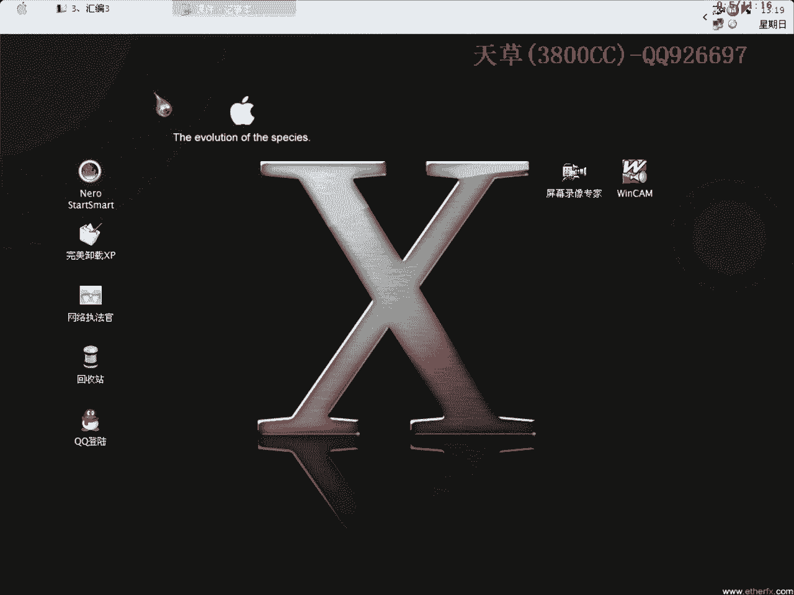
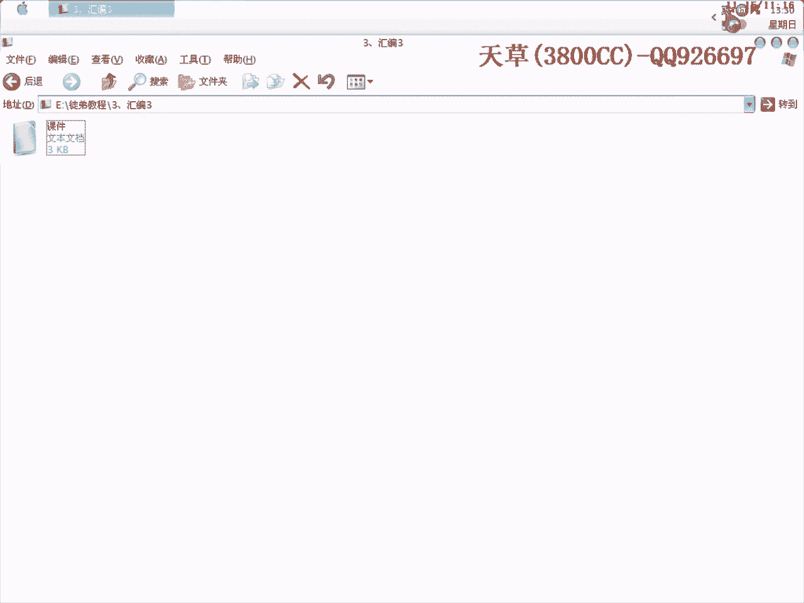

# 天草流初级 - P3：3、汇编3 - 白嫖无双 - BV1qx411k7qA

大家好，现在来进行我们的第三课。

第三课也是讲汇编的，因为昨天是讲了一个转移指令，今天讲的就是一个算术运算的，这个在分析算法的时候要经常经常的用到，当然我们也可以通过工具，计算的工具来进行操作，首先来说一下。

算法运算指令是反映CPU计算能力的一组指令，也是汇编时经常用到的，我们在写算法注册记忆，还有就是分析算法的时候会经常的经常的遇到，算法除了对一些字符串进行剪切、连接或截取之类的操作之外。

还有可能对一些数据，因为机器码不一定全部都是字母，还有一些机器码是数字，所以它要进行一些运算，它包括加减、乘除，还有一些其他的相关辅助指令，该主指令的操作数可以是8位，操作数我给大家在第一节课里提过。

可以是8位，16位或者32位，当存储的单元是该指令的操作数的时候，该操作数的寻指方式可以是任意一种存储单元寻指的方式，寻指方式这里后面再给大家加一节课，因为寻指方式在会编里面是比较难一点的。

因为它要涉及到计算器操作、对单操作，加法指令有add2的英文字母缩写，它还有其他的，第一个是带进位的加法指令，这里要说明一点，用OD返会编出来的会编代码，在某种程度上来讲。

语法结构用会编相对于标准会编而言，也不是非常非常规范，像我们上一节课提到的J1和J1G是一样的，就是说它在某些方面还不是非常的规范，但这已经非常足够了，所以在加法指令方面。

带进位的ADC我们是比较少见的，很少出现这一个指令，另外呢，加1指令是int C，当我们在分析算法的时候，它要循环操作，对机器码进行逐位取取，对某一位进行某种运算，就用到加法指令。

还有可能会用到我们后面会讲的减1指令，这也是比较重要的，知道它是加1就可以了，就比如说int C，举一个例子吧，int C Eax，比如说Eax首先的指是1的话，就说初指是1。

然后经过这一条指令之后就变为2了，然后它后面一般会接一个JN1或者是JG，就是一个跳转，会接一个跳转，并不一定是J1也并不是一定是J1G，要看它是哪个软件是什么样子，会接一个跳转向上又跳。

取第二位机器码，对第二位机器码进行某种操作，一般是对它进行取ASCII码操作，取了ASCII码操作之后，然后再怎么样存到一个计算器里面去，然后再又加1，又循环，直到全部循环完了之后。

当然这里还会有一个compare，就是说机器码的一个长度，长度保存在Eax里面去，和现在的Eax相比，比如说现在我取了第二位，但是它长度有14位，当然不够了，不够就跳，就这样。

到时候现在这样说有比较抽象一点，到时分析算法的时候再仔细说一下吧，然后交换指令，交换加指令，XADD，这个也是比较少见的，我们不用去管它，只需要了解。

这个在就是说我们OD访货边出来一个货币边代码里面比较少见了，然后再就是减法指令，substance，也是英文单词的缩写，这个和ADD是相对应的，相反的，SBB和ADC也是相反的，这个比较少见。

这就是减异指令，也是一样的，我们这上面的刚才给大家仔细说了一下，就是说大概抽象的，说了一下int C会在什么样的情况下出现，这里呢，DEC也是一样的，它有的就是说对机器码。

刚才int C是对机器码从第一位开始取，这种情况呢，可能就是说对机器码从最后面最高位，就是说1234从第四位开始取，反着取就会用到DEC，当然还有其他情况，具体情况具体分析，再就是求补指令，就是相反。

比如说EX为1，EX初值是1，那么通过AG呢，之后EX变为-1了，这个非常好理解，也不多说，再就是惩罚指令，这上面的一些文字，大家就自己看一下，作为参考，无符号指令，无符号的一个惩罚指令，MUL。

这是有符号的，有符号相称，是IMUL，在浮点计算当中，它是FMUL，这个也就是说是，无符号的浮点惩罚指令，F嘛，你可以把这个浮点，然后这里呢，也是一样的，FIMUL，也是一样的，就把它理解为。

有符号的浮点惩罚指令，有符号的，这个我在惩罚按表，对应惩罚，这个倒是没有，我这个地方没有画图，处罚指令呢，处罚指令也是一样的，处罚指令也是一样的，也是DIV，无符号的是DIV，无符号的是IDIV。

浮点呢是FDIV，这个好像，指针移不过来啊，关掉，这里呢是FIDIV，当然后面呢，要是看黑银的一个情况吧，看黑银的具体一个情况，因为我在黑银的课程里面，有具体讲浮点的一节课，不管怎么样呢。

那一节课大家还是看得到的，但是要看我这个课程安排的进度，要是说比如说，黑银呢，不管知道黑银具体的消息，在此之前呢，我要是讲到浮点的话，我还是会重新讲一遍的，要是之后呢，当然大家就先看黑银的。

那我这个也可以省下来了，给大家讲一下其他的，再说一下，再说一下，这里有说到受影响的标志位这些，在实际操作当中，可以不用去管，因为这个，大家要是想把会变学得更好的话，大家还是要去学一下，另外一种会变。

就是说比较标准的那种，Windows底下编写的会变，当然他们有很多相似的地方，也不是说相似，基本相同，至于有些地方不相同的地方呢，就是因为，刚才也给大家说了，因为OD可以反馈变很多很多种语言。

它要做到兼容是不太可能的，做到相当相当的兼容是很难的，能做到现在这种地步的话，已经说明，那个作者的技术已经相当相当不错了，今天这节课程就到这儿，再见。

