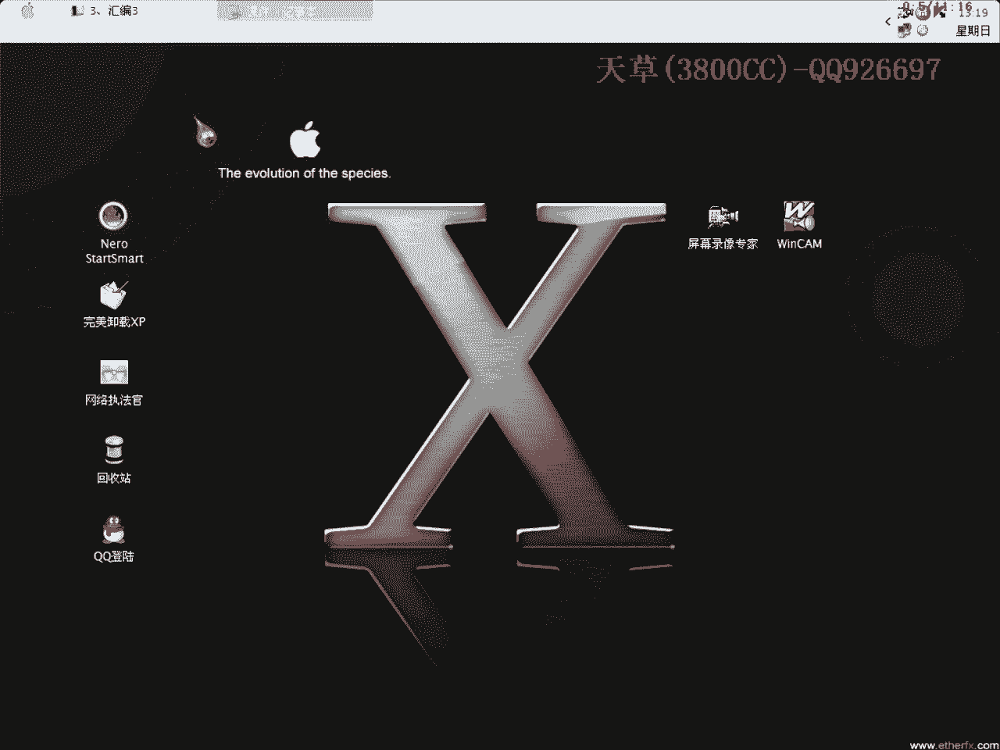
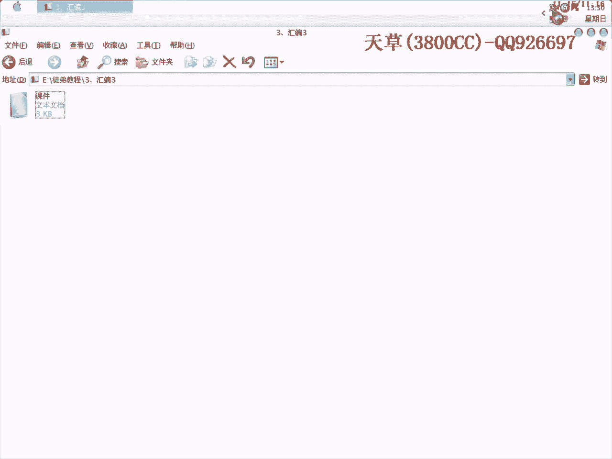

# 天草流初级课程 - P3：汇编指令（三）算术运算指令 🧮

在本节课中，我们将学习汇编语言中的算术运算指令。这些指令是CPU进行数学计算的基础，在分析软件算法、编写注册机或理解程序逻辑时至关重要。我们将逐一介绍加法、减法、乘法、除法等核心指令及其应用场景。

---

## 概述

算术运算指令是反映CPU计算能力的一组指令，在汇编程序中被频繁使用。无论是分析算法、编写注册机，还是处理数据，都会经常遇到它们。这些指令不仅用于处理字符串操作，也用于处理数字数据，因为机器码中既包含字母也包含数字。运算类型包括加、减、乘、除以及其他辅助指令。

## 操作数与寻址方式

该组指令的操作数可以是8位、16位或32位。当操作数是存储单元时，可以使用任意一种存储单元寻址方式。寻址方式本身是一个较为复杂的话题，我们将在后续课程中专门讲解，因为它涉及到寄存器操作和对内存的直接操作。

## 加法指令

加法指令用于执行加法运算。在OD（OllyDbg）反汇编出来的代码中，其语法结构与标准汇编相比可能不完全规范，但这通常不影响分析。以下是常见的加法指令：

*   **ADD**：基本的加法指令。
*   **ADC**：带进位的加法指令。在实际分析中，这条指令比较少见。
*   **INC**：加1指令。这条指令非常重要，常用于循环计数。

### INC指令的应用场景

当分析算法时，程序常需要对机器码进行逐位处理。例如，从第一位开始，对每一位进行某种运算（如取ASCII码），这时就会用到`INC`指令来递增计数器。

**示例代码：**
```assembly
INC EAX    ; 将EAX寄存器中的值加1
```
假设`EAX`的初始值是1，执行上述指令后，`EAX`的值将变为2。这条指令后面通常会跟随一个条件跳转指令（如`JNZ`或`JG`），用于控制循环，直到处理完所有位。循环过程中，程序会与一个保存了总长度的值（例如也保存在`EAX`或其他寄存器中）进行比较（`CMP`），以判断是否继续循环。

## 减法指令

减法指令与加法指令相对应，用于执行减法运算。

*   **SUB**：基本的减法指令，与`ADD`相对应。
*   **SBB**：带借位的减法指令，与`ADC`相对应，同样比较少见。
*   **DEC**：减1指令。

### DEC指令的应用场景

`DEC`指令与`INC`原理相似但方向相反。例如，如果需要从机器码的最后一位（最高位）开始向前处理，就可能使用`DEC`指令来递减计数器。具体情况需要根据实际代码逻辑进行分析。

*   **NEG**：求补指令（取负数）。例如，如果`EAX`的初值是1，执行`NEG EAX`后，`EAX`的值将变为-1。

## 乘法指令

乘法指令用于执行乘法运算，主要分为无符号乘法和有符号乘法。

*   **MUL**：无符号数乘法指令。
*   **IMUL**：有符号数乘法指令。
*   **FMUL**：浮点数乘法指令（无符号）。
*   **FIMUL**：有符号浮点数乘法指令。

可以将`FIMUL`理解为“有符号的浮点乘法指令”。

## 除法指令

除法指令用于执行除法运算，分类与乘法指令类似。

*   **DIV**：无符号数除法指令。
*   **IDIV**：有符号数除法指令。
*   **FDIV**：浮点数除法指令。
*   **FIDIV**：有符号浮点数除法指令。

关于浮点运算的更详细内容，可能会在后续课程中根据安排进行讲解。

## 标志位影响

各种算术运算指令执行后，会影响CPU中的状态标志位（如零标志ZF、进位标志CF等）。在实际的逆向分析中，初学者可以暂时不用深入关注每一个标志位的具体变化。但如果你想更深入地学习汇编语言，建议系统学习标准的Windows环境下的汇编编程，其原理与我们在OD中看到的大体相同。

需要说明的是，OD反汇编引擎需要兼容多种编译器生成的代码，因此其显示的汇编语法可能与教科书上的“标准”汇编略有不同，但这已足够用于软件逆向分析，也体现了OD作者高超的技术水平。

---

## 总结



本节课我们一起学习了汇编语言中的核心算术运算指令。我们介绍了加法（ADD, INC）、减法（SUB, DEC, NEG）、乘法（MUL, IMUL）和除法（DIV, IDIV）指令的基本用途和典型应用场景，特别是在算法分析循环中`INC`和`DEC`指令的关键作用。理解这些指令是逆向工程中分析程序计算逻辑的基础。下节课我们将探讨其他重要的汇编指令集。