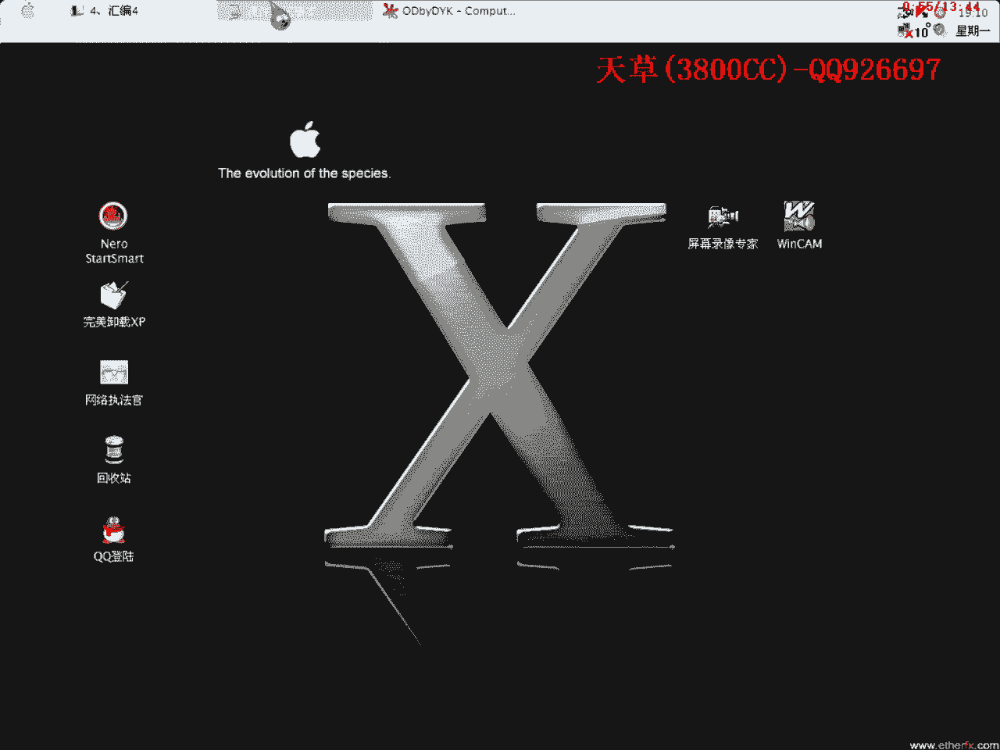
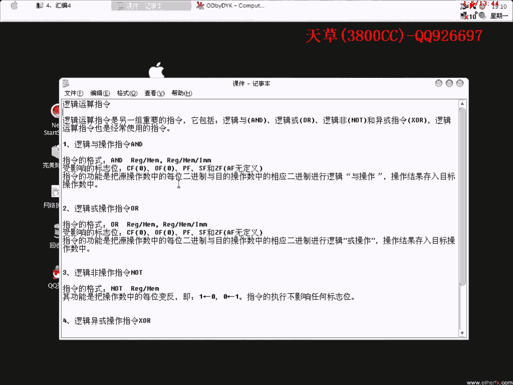
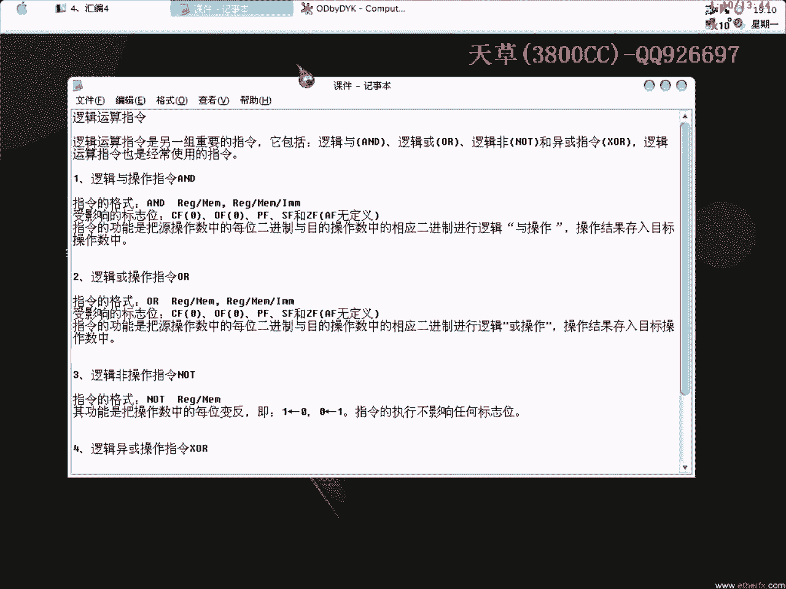
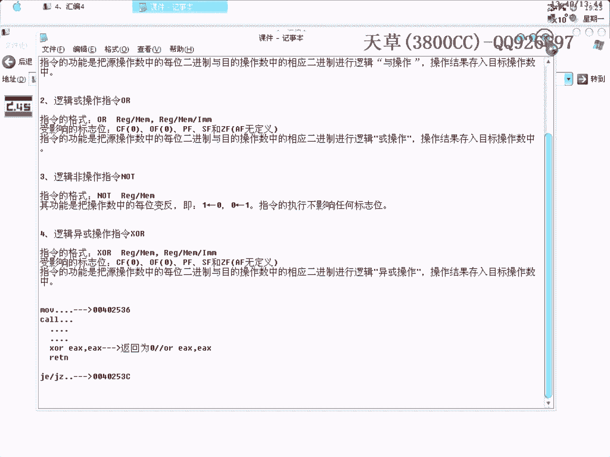

# 天草流初级课程 - P4：汇编4 - 逻辑运算指令 🧮

在本节课中，我们将要学习汇编语言中的逻辑运算指令。这些指令是进行二进制位操作的基础，在软件逆向和算法分析中至关重要。



---



上一节我们介绍了算术和转移指令，本节中我们来看看另一组重要的指令：逻辑运算指令。



逻辑运算指令主要包括以下几种：
*   **AND**：逻辑与
*   **OR**：逻辑或
*   **NOT**：逻辑非
*   **XOR**：逻辑异或

这些指令经常被使用，其操作对象是操作数的每一位二进制位。

以下是逻辑运算的基本规则：

1.  **逻辑与 (AND)**：将源操作数与目的操作数对应的每一位二进制进行“与”运算。规则是：**两位都为1时，结果才为1**。
    *   公式：`1 AND 1 = 1`；`1 AND 0 = 0`；`0 AND 1 = 0`；`0 AND 0 = 0`
    *   示例：`1111 AND 1000 = 1000`


2.  **逻辑或 (OR)**：将对应的二进制位进行“或”运算。规则是：**两位中有一位为1，结果就为1**。
    *   公式：`1 OR 1 = 1`；`1 OR 0 = 1`；`0 OR 1 = 1`；`0 OR 0 = 0`

3.  **逻辑非 (NOT)**：对操作数的每一位二进制取反。
    *   示例：`NOT 0100 = 1011`

4.  **逻辑异或 (XOR)**：将对应的二进制位进行“异或”运算。规则是：**两位不同时，结果为1；相同时，结果为0**。
    *   公式：`1 XOR 1 = 0`；`1 XOR 0 = 1`；`0 XOR 1 = 1`；`0 XOR 0 = 0`
    *   一个关键特性：**任何数与其自身进行异或，结果都为0**。即 `A XOR A = 0`。

---

理解了基本概念后，我们来看看这些指令在实践中的意义。在分析软件算法时，我们常会用到计算器。需要注意的是，在调试器（如OD）中，数字默认是十六进制显示的。

这里有几个值得注意的现象：
*   `5 XOR 5 = 0`
*   `5 AND 5 = 5`

在算法分析中，经常能看到类似 `EAX XOR EAX` 这样的指令，其目的就是将寄存器清零（结果为0），并设置相应的标志位（如ZF零标志位）。这个零标志位会直接影响后续的条件跳转指令（如 `JZ`/`JE` 或 `JNZ`/`JNE`）。

考虑以下典型代码片段：
```
MOV EAX, [参数]
CALL 子程序
... （子程序内执行一系列操作）
XOR EAX, EAX  ; 将EAX清零，ZF置1
RETN
... （返回到调用处）
TEST EAX, EAX
JZ 正确流程   ; 因为ZF=1，所以跳转
JMP 错误流程
```
通过修改逻辑（例如将 `XOR EAX, EAX` 改为 `MOV EAX, 1`），可以改变程序的执行流程，这在破解中常被用于“爆破”。

---

除了使用计算器，我们还可以直接在调试器（OD）中观察逻辑运算的结果。在分析时，应同时关注**反汇编窗口**、**寄存器窗口**和**数据窗口**。

例如，在OD中单步执行一条 `XOR EDX, EDX` 指令，可以立即在寄存器窗口中看到EDX的值变为0。执行 `AND ECX, 0xFF` 指令，可以快速看出该操作是取ECX的最低一个字节。

养成记录的习惯很重要。将分析过程中遇到的特定指令效果记录下来，在后续的二次或三次分析时，就能大大提高效率，无需每次都重新计算。

---



本节课中我们一起学习了汇编语言的核心逻辑运算指令：AND、OR、NOT和XOR。我们了解了它们的基本运算规则，探讨了`XOR A, A`用于清零和设置标志位的常见用法，并学习了如何在调试环境中观察和应用这些指令。掌握这些指令是理解程序底层逻辑和控制流的关键一步。