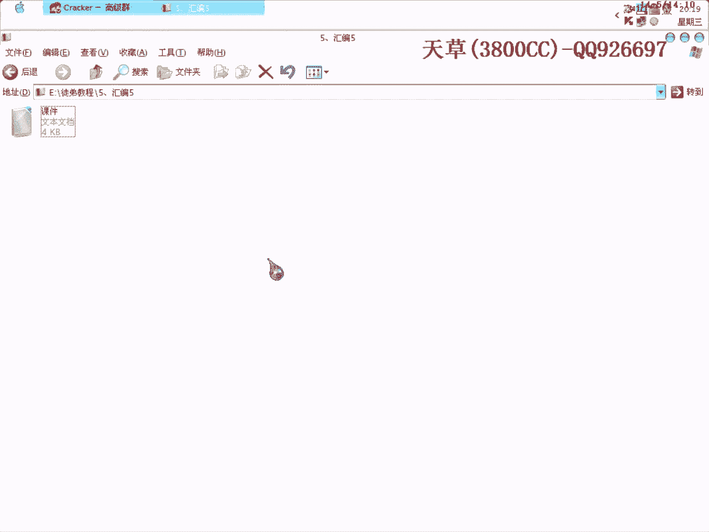

# 天草流初级 - P5：5、汇编5 - 白嫖无双 - BV1qx411k7qA

大家好，我们现在来进行第五课，今天刚做这个教程，做这几个教程的时候，电脑就不行了，废话不多说吧，首先我们今天要讲的是三个小部分，一个是检测为text，这个是比较常见的，在分析算法的时候。

还有另外一个就是一个循环指令，也是在分析算法的时候要用到，这就是一个跳转，一个跳转，转移指令。

检测为指令是把两个操作，操作数进行逻辑与操作，并根据运算结果设置相应的标志位，但是并不保存这个运算结果，所以不会改变指令中的操作数，在该指令后通常是有歼一歼一之类的转移指令。

这个我在上一节课里面也举过例子，这里也说一下这个例子，Core是调用一个子程序或者是算法程序或者是怎么样的一个程序，这个当然是具体程序具体分析了，我们在下节课会给大家介绍一个子程序调用子程序了。

因为子程序是非常重要的，它一般是通过Core来调用的，或者还有就是通过一个Jump，无条件跳转，一般是通过Core来调用的，然后呢，Taxal，Eax，或者，这个呢，当然这个子程序返回是什么就是什么。

我这只是一个例子，然后根据接一个跳转，这样当然跳转呢，它是跳的正确的或者是跳的不正确的。

这个大概的模式大家要知道，循环指令本身的执行不影响任何操作位。

循环指令，loop，这个当然也可以用的比较少，loop用loop来循环的，因为在算法分析的时候，当然这是会编里面的一个要求了。

在我们用ODE编出来的一个会编的内容。

一般是通过，就是说通过比较啊，比如说了啊，比如写一下吧，就前面一些，然后呢，int c， eax，或者，dec， ebx，然后在compare，eax， ebx，最后呢，接一个jng，跳转。

跳转到哪里去呢，是往上面跳，这个是往上面跳的，这个向上的箭头怎么打，打不了啊，再给大家说一下，这样吧，表示向上，往上面跳，跳了之后呢，然后在又循环，又循环再根据这个来比较，来决定是否继续往下执行。

这个在会编里面是用loop，loop我遇到的比较少，遇到的比较少，一般是这种情况。

通过j1或者jng，这样来进行循环，下面举一个例子。

求1到1000的这个和，并把结果保存在ax里面去。

这里有两个方法，有两个方法，这里呢，方法一是因为技术器，技术器cex只能d减，只能d减，这个是一个属性，大家要知道，所以可以把式子，求和式子反过来，这样反过来，结果不变，好看一下。

前面啊，这个神灵号是前面和后面，这个不用说了，这个主要的看一下主要的，啊，ax和axe，这个我在上一课说了啊，两个相同的efore就为0了啊，这相当于就是说把ax清零，ax清零，啊，最后呢，在move。

1000d，1000d，这里呢，当然就是说是石精制了，石精制，啊，1000d，把把1000d送给cex，送给cex，然后呢，add，ax的初值是0，cx的初值呢，是1000，两个相加。

ax就等于1000了，等于1000，然后，dccx呢，cx是1000吗，相减，减了1，减了1就变为999了，然后loop，again，again呢是一个子程序，就在循环啊，循环循环循环。

好方法二呢，是不用循环计数器进行累加的，这里呢，是也是的，首先把ax给清零，清零，然后呢1000呢，给cx，1呢，给bx啊，最后。

1000啊，1和，1和这个这个这个ax相加就变为ax就为1了，ax就为1，bx呢，在循环相加，循环相加，在loop，也是loop，从程序段的效果来看哈。

方法一比方法二要好，为什么哈，因为。

写程序，要求简洁啊，如果你那个代码多了的话，代码越多，写出的程序，就是说，效率就越低，而且体积越多，而且体积也是越大的，越大的，这个是。

想象一下就知道啊，好，转移指令。

转移指令的会员程序中经常用到的一种指令啊，时常有尽，尽量不要使用啊，时常有在高级语言当中哈，时常有尽量不要使用转移语句的圈告啊，但如果在会员程序中呢，也尽量不用啊，转移啊，转移转移语句，那么该程序。

要么无法编写啊，要么就没有多少功能，所以在会编当中，不但要使用转移语句，而且要灵活运用啊。

灵活运用，好，转移指令分为无条件和有条件，两个大类啊。

两个大类，好，先来说一下，无条件的，无条件的，无条件jump啊，这个也在前面也说过，我就不说了啊。

条件转移指令，条件转移指令，就是说，分为三大类，第一个，基于无符号的条件转移指令，这是基于有符号的啊，这就是基于特殊算数标志位的。

好，看一下第一类啊，无符号的，指令的注记符啊。

这里呢，基本上就写出了他的这个英文缩写啊，你看，J1呢是J1块，J1，J1是zero，这个大家自己可以看得出来，看得出来，他的，影响他的标志位是J标志位啊，是J标志位，然后呢，J1呢。

J1是加了一个not，not，n，所以就有一个n了啊，这里也是一样的，J1，J1，J1，J1，above，above，above是高于的意思啊，高于的意思，也可以理解为大于的意思啊，below呢是低于。

低于，不低于或等于啊，这个的意思就是说，不低于或不等于啊，不低于或不等于啊，这个也是一样的，above，above，above，below，below是低于的意思啊，below是低于的意思，然后这个。

这个不用我写了吧，不用我写了吧，我这个说一下，大家记一下就知道，这个呢，这个单词是，等于的意思啊，等于的意思，这个是0，这个呢是高于，below呢是低于，看一下，有条件的，有符号的，有符号的。

这个也是一样的，也是一样的，great，great，great是大于，多于的意思，多于啊，这个是多于，所以说这个。

JG呢，JG和JA呢，这一组，就是这一组，其实没有多大的，没有多大的区别，只不过就是一个是有符号，一个是无符号的，这个呢是多于啊，这个呢是高于，其实差不多，意思差不多，然后呢，这个是少于啊，那是少于。

这个是低于。

就是说一个是有符号的，一个是无符号的，再看一下特殊的，特殊的，great，是近位的意思嘛，JC嘛，great，近位的，不近位啊，就是说，如果有近位的话，有近位的，就跳，没近位的，这个是没有近位的。

就跳啊，这个呢是一出嘛，over low，over low，是一出的意思，就是说，有一出就跳，没有一出的，这个是没有一出就跳，JP呢，parallel，也就是基友啊，基友的意思，基友交中位，交中位嘛。

这个就是说，JP呢是，如果基友标准位唯一的话，基友标准位唯一，就跳，不唯一就不跳了啊，这里也是相反的嘛，也是相反，也是相反，JN1嘛，JS呢，是符号标准位，符号标准位，single，single。

就是符号标准位唯一的话就跳嘛，好，这里是助纪符啊，助纪符，这个我帮不了大家，助纪符呢，我也只能就是说写出来，然后大家去理解，去理解，这都是一些英文单词的缩写嘛，英文单词缩写，要是学过英语的。

学过英语的话，这个就很容易了，不用记了，直接理解就可以了，好，再看一下，一直有一个字符编的chart，是编写一段程序吧，所有的，把所存的大写字母，编为小写字母，这个我们在学校里面经常的，遇到的。

经常遇到的，好，首先呢，next，next，next，他就是说，这里是生命一个，程序，一个子程序，然后呢，chart呢，是dbf，是dbf，就是说，他是一个双字节的，double byte。

double byte，双字节的，f，然后首先，move chart，就是说，把f，move chart，把f给，al，放到al里面去，放到al里面去，这是compare呢，是余大写的，就是说把f。

就是说把f，以至一个字符变量，我这里，他这里就是声明，是chart变量是为f，你可以为b，可以c，这个一样的，大家自己去变换，但我这里举这个f呢，是给大家好理解，就是一个具体的，好，把f和a进行比较。

进行比较，b呢，below嘛，如果是小于的话，就跳，跳到next去，跳到next，然后呢，最后呢，又跟那个j进行比较，又跟j进行比较，如果是大，高于的话，如果是高于的话，这里好像，应该是20，少了。

少了，next，好，这里呢，注意啊，字符是无符号数，不要使用jl，不要使用jl，字符是无符号的，这个要注意了，就是说，如果是高于的话，也是跳到next去，就跳到next去，当然这里呢，是什么呢。

这里是一个子程序，没写出来，没写出来，没写出来，最后呢，是add char，加20，是什么意思啊，就是说，大家可以查找一下，阿斯卡曼的字符对应表，大写的a，比小写的a，那个阿斯卡曼，小于20，小于20。

也就是说，小写的a，大写的a是65，大写的a是65，小写的a是75，75，对，75，然后你要把它变为小写的字母，就需要把它的字符，阿斯卡曼相加，加到20，加到20，然后再右转后回字母，就是这个样子。

然后就是省略了，主要就是让大家看一下这个，这个跳，实际运用一下这个跳转。

今天的内容。

三个部分，三个部分，这里给大家说的比较详细了。

好，明天呢，明天的大概课程，应该就是说子程序了，大家自己这个呢，回去再，自己练习一下。

再见，(歡迎訂閱鬼鬼和音你而來)。