# 天草流初级汇编教程 - P5：汇编指令详解（三）🔍

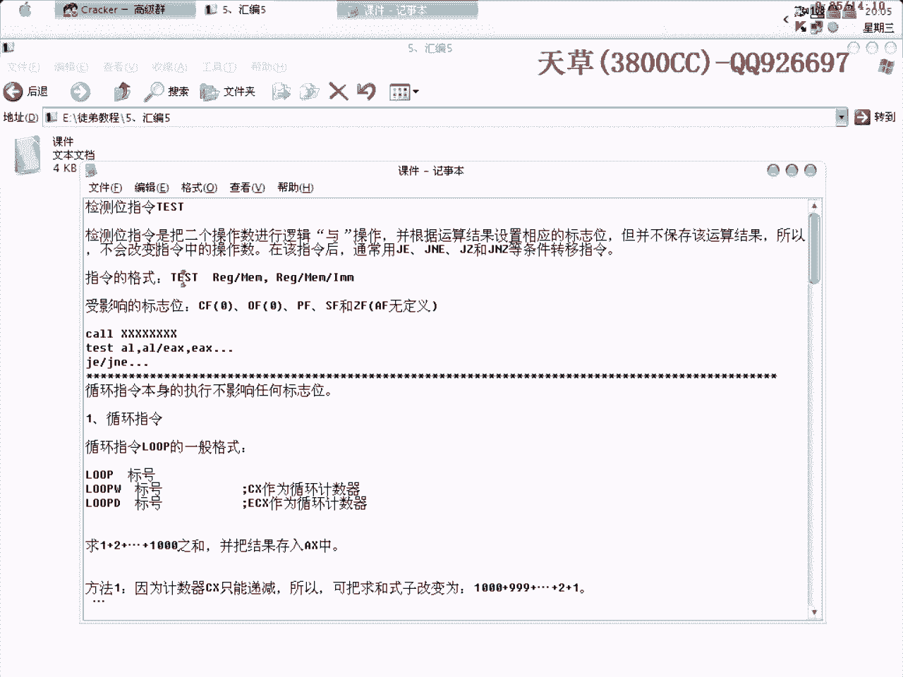

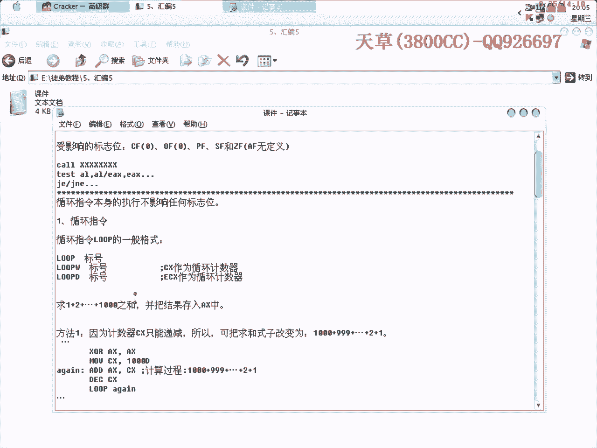

在本节课中，我们将要学习汇编语言中三个重要的概念：`TEST`指令、循环指令以及条件转移指令。这些指令在程序流程控制和算法分析中扮演着核心角色。

---

## 1. TEST指令 🧪

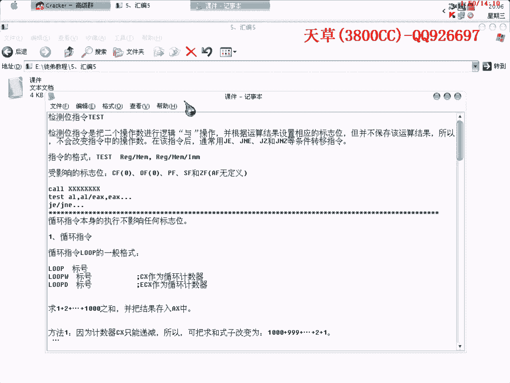

上一节我们介绍了逻辑运算指令，本节中我们来看看`TEST`指令。`TEST`指令用于对两个操作数执行逻辑与（AND）操作，并根据运算结果设置相应的标志位（如零标志位ZF）。**关键点在于，它不保存运算结果，因此不会改变原操作数**。


该指令通常后跟条件转移指令（如`JZ`、`JNZ`），用于根据测试结果决定程序流向。一个常见的模式如下：


```assembly
CALL  某个子程序    ; 调用一个算法或功能子程序
TEST  EAX, EAX     ; 测试EAX寄存器的值
JZ    标签名        ; 如果结果为0（EAX=0），则跳转
```

在这个模式中，程序根据子程序的返回值（通常放在`EAX`中）进行条件判断，从而跳转到不同的分支。

---

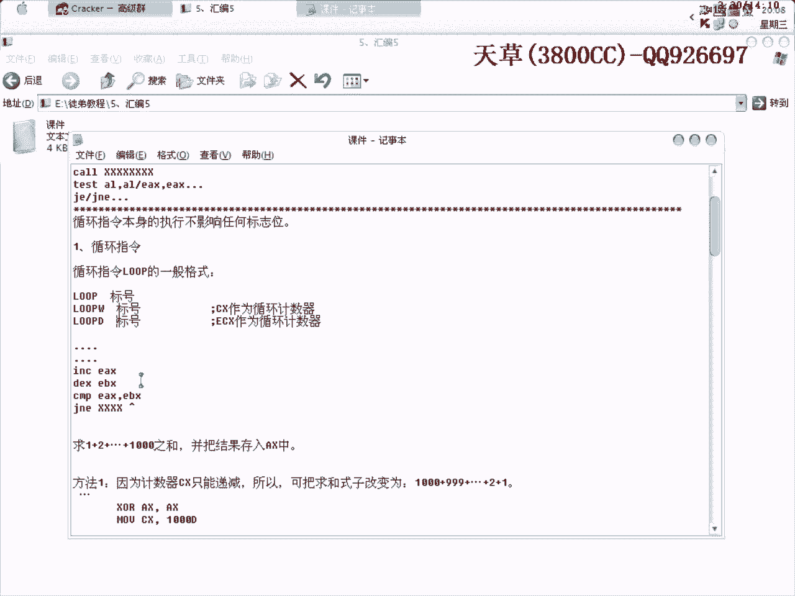

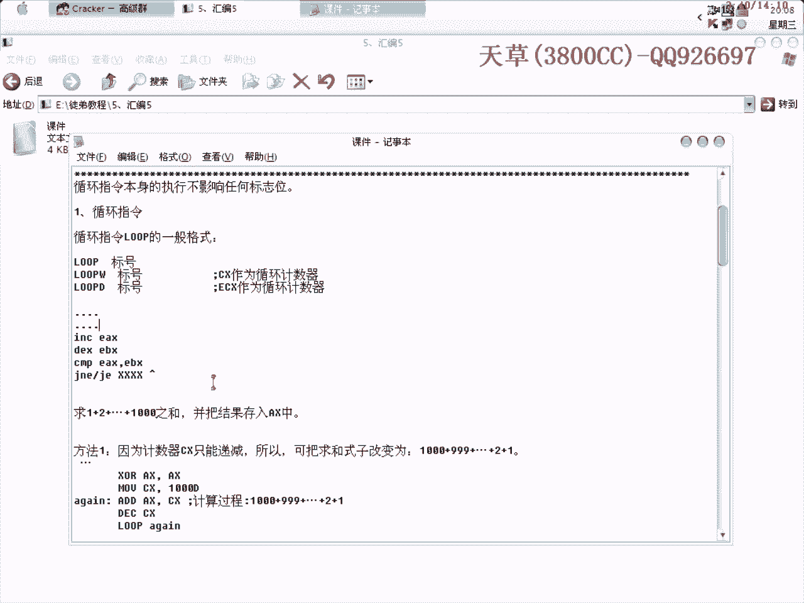

## 2. 循环指令 🔄

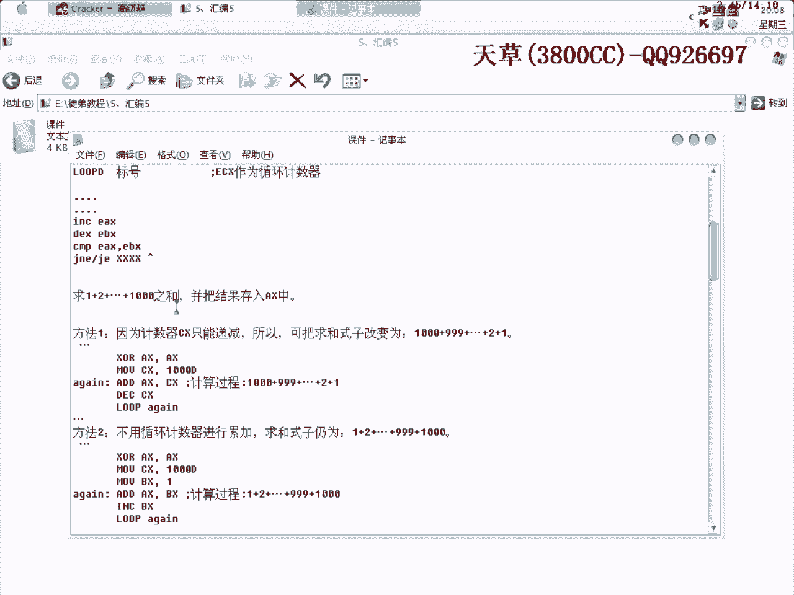

在编程中，循环是重复执行某段代码的结构。在汇编层面，除了专用的`LOOP`指令外，更常见的是利用比较和条件跳转指令来构建循环。


以下是构建循环的一种通用模式：

```assembly
MOV ECX, 循环次数     ; 初始化计数器
标签_开始:
    ...               ; 循环体代码
    DEC ECX           ; 计数器减1
    CMP ECX, 0        ; 比较计数器是否为零
    JNE 标签_开始      ; 如果不为零，则跳回开始处继续循环
```


`LOOP`指令虽然存在，但在实际分析中遇到较少。上述利用`CMP`和`JNE`（或`JG`、`JNG`等）构建循环的方式更为灵活和常见。


为了加深理解，我们来看一个计算1到1000之和的例子，并比较两种实现方法。


**示例：求1到1000的和，结果存入AX**


以下是两种实现方法：

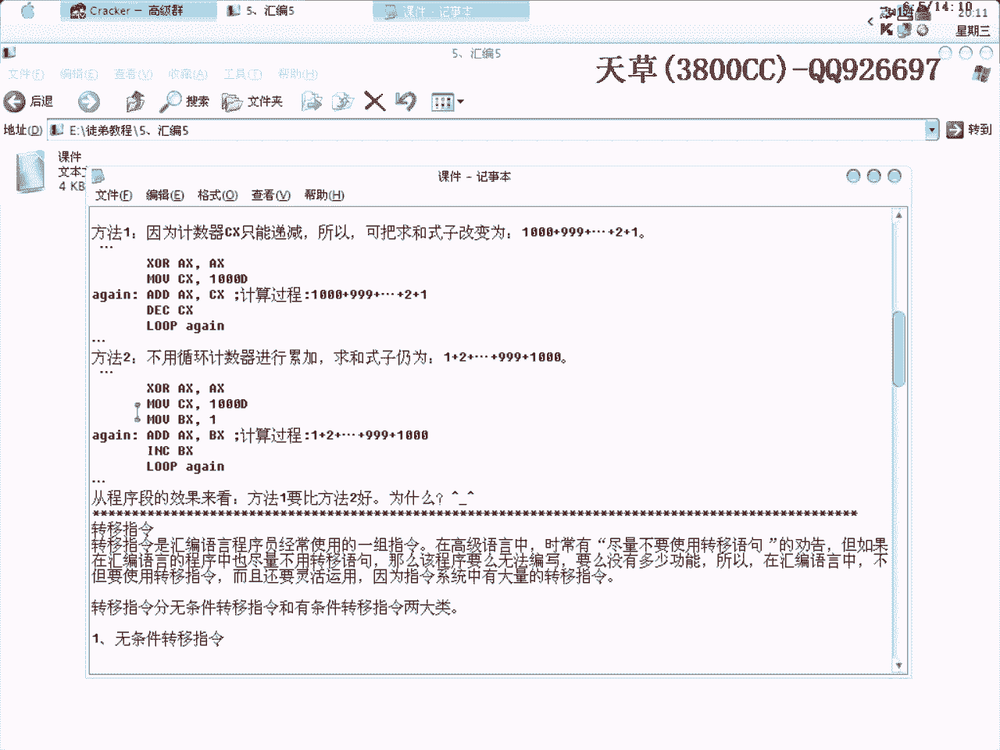

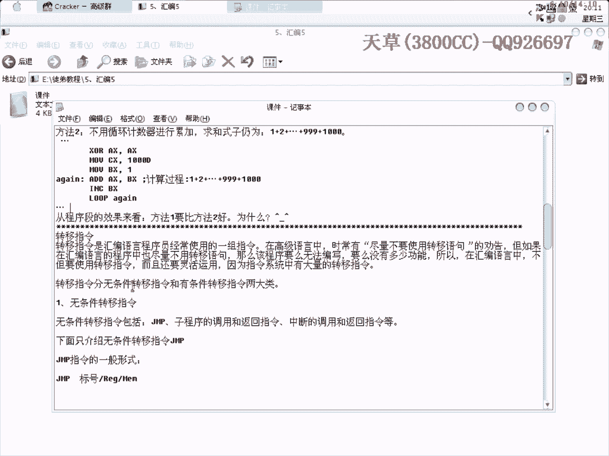

**方法一：使用循环计数器递减**
```assembly
XOR AX, AX      ; 将AX清零 (AX ^ AX = 0)
MOV CX, 1000D   ; 将十进制数1000送入CX
标签_AGAIN:
ADD AX, CX      ; AX = AX + CX
DEC CX          ; CX = CX - 1
LOOP 标签_AGAIN   ; 若CX不为0，则跳回AGAIN继续循环
```
此方法利用了`LOOP`指令和计数器`CX`。


**方法二：使用额外寄存器累加**
```assembly
XOR AX, AX      ; AX清零
MOV CX, 1000D   ; CX=1000
MOV BX, 1       ; BX=1
标签_AGAIN:
ADD AX, BX      ; AX = AX + BX
INC BX          ; BX = BX + 1
LOOP 标签_AGAIN   ; 循环
```
此方法使用`BX`寄存器从1累加到1000。

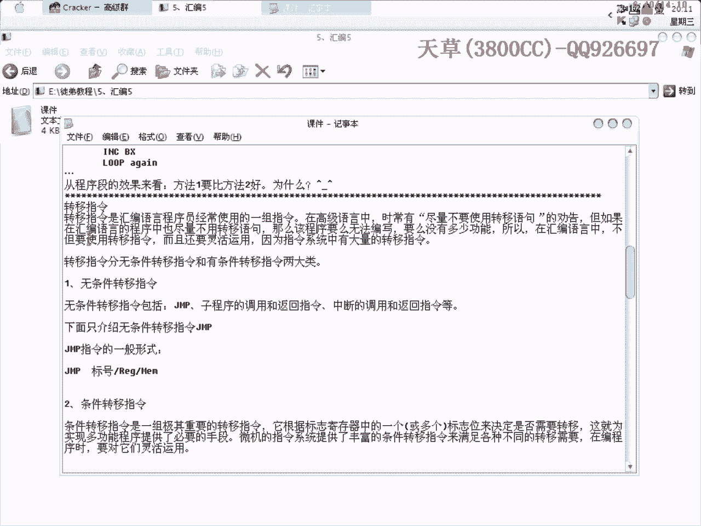

从程序效率角度看，**方法一比方法二更优**。因为代码更简洁，使用的指令和寄存器更少，这通常意味着更高的执行效率和更小的程序体积。

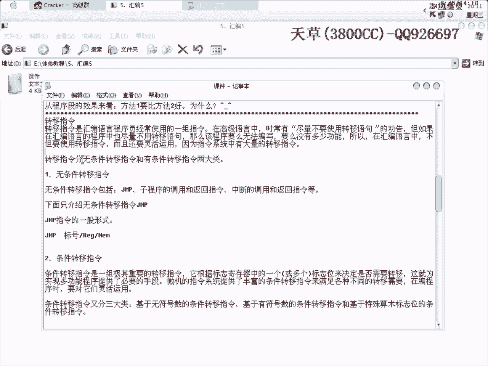

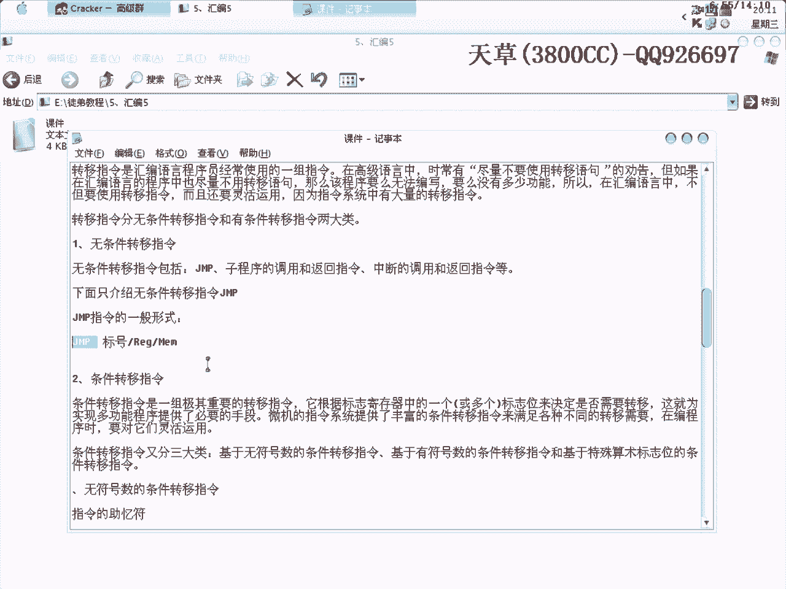

---


## 3. 转移指令 🚦


转移指令用于改变程序的执行流程，是汇编程序中不可或缺的部分。高级语言中常建议慎用`goto`（转移语句），但在汇编语言中，灵活运用转移指令是实现复杂逻辑的基础。

转移指令主要分为两大类：**无条件转移**和**条件转移**。

**无条件转移**指令`JMP`非常简单，它使程序无条件跳转到指定地址，前面课程已介绍过。

**条件转移**指令则根据标志寄存器的状态决定是否跳转。它们可分为以下三类：

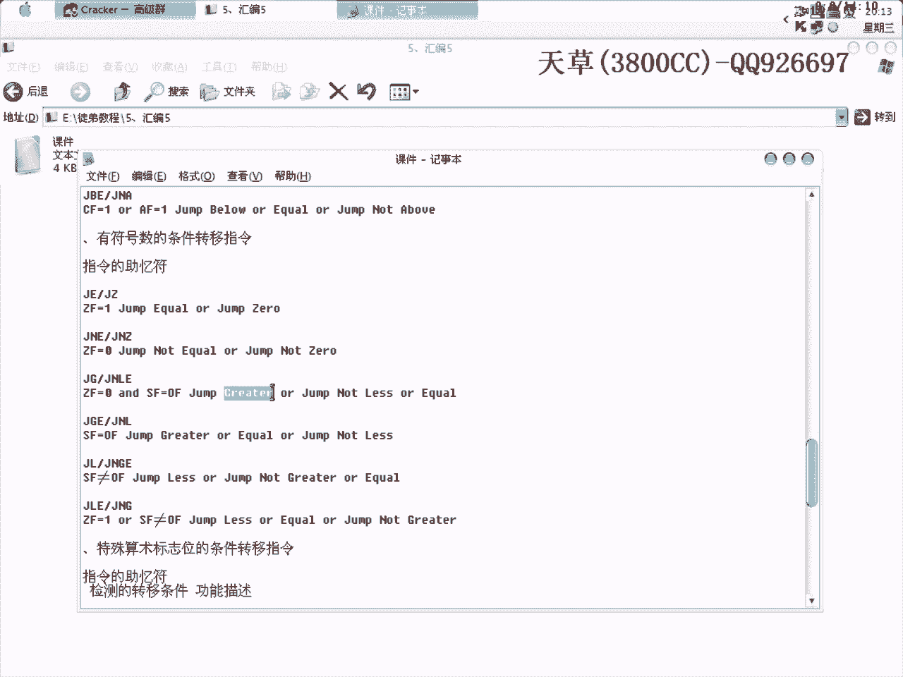

以下是基于不同标志位的条件转移指令分类：

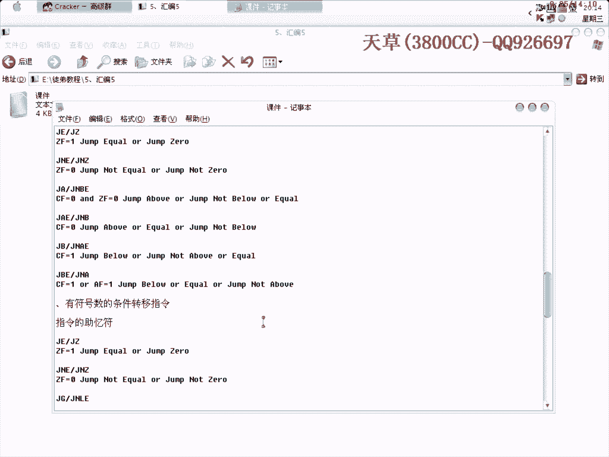

**第一类：基于无符号数比较的条件转移**
*   `JE/JZ`：相等/为零则跳转。 `(ZF=1)`
*   `JNE/JNZ`：不相等/不为零则跳转。 `(ZF=0)`
*   `JA/JNBE`：高于/不低于且不等于则跳转（用于无符号数）。 `(CF=0且ZF=0)`
*   `JAE/JNB`：高于或等于/不低于则跳转。 `(CF=0)`
*   `JB/JNAE`：低于/不高于且不等于则跳转。 `(CF=1)`
*   `JBE/JNA`：低于或等于/不高于则跳转。 `(CF=1或ZF=1)`

**第二类：基于有符号数比较的条件转移**
*   `JE/JZ`：相等/为零则跳转。 `(ZF=1)`
*   `JNE/JNZ`：不相等/不为零则跳转。 `(ZF=0)`
*   `JG/JNLE`：大于/不小于且不等于则跳转（用于有符号数）。 `(SF=OF且ZF=0)`
*   `JGE/JNL`：大于或等于/不小于则跳转。 `(SF=OF)`
*   `JL/JNGE`：小于/不大于且不等于则跳转。 `(SF≠OF)`
*   `JLE/JNG`：小于或等于/不大于则跳转。 `(SF≠OF或ZF=1)`

**第三类：基于特殊算术标志位的条件转移**
*   `JC`：有进位则跳转。 `(CF=1)`
*   `JNC`：无进位则跳转。 `(CF=0)`
*   `JO`：溢出则跳转。 `(OF=1)`
*   `JNO`：无溢出则跳转。 `(OF=0)`
*   `JP/JPE`：奇偶标志为1（偶数个1）则跳转。 `(PF=1)`
*   `JNP/JPO`：奇偶标志为0（奇数个1）则跳转。 `(PF=0)`
*   `JS`：符号标志为1（结果为负）则跳转。 `(SF=1)`
*   `JNS`：符号标志为0（结果为非负）则跳转。 `(SF=0)`

助记符多为英文单词缩写，理解其含义有助于记忆，例如：`A`(Above), `B`(Below), `E`(Equal), `G`(Greater), `L`(Less), `C`(Carry), `O`(Overflow), `S`(Sign)。

**实际应用示例：将大写字母转换为小写字母**

假设有一个字符变量`char`，以下程序段判断它是否为大写字母（A-Z），若是则转换为小写。

```assembly
    CMP char, 'A'    ; 比较字符是否小于‘A’
    JB   NEXT         ; 若小于，则不是大写字母，跳转到NEXT
    CMP char, 'Z'    ; 比较字符是否大于‘Z’
    JA   NEXT         ; 若大于，则不是大写字母，跳转到NEXT
    ADD char, 20H    ; 是大写字母，加上20H转换为小写（ASCII码差值）
NEXT:
    ...              ; 后续处理
```
**注意**：字符在比较时被视为无符号数，因此应使用`JB`（低于）、`JA`（高于）等无符号条件跳转指令，而非`JL`、`JG`等有符号跳转指令。大写字母转小写只需将其ASCII码值加上`20H`（十进制32）。

---

## 总结 📚


本节课中我们一起学习了汇编语言的三个核心指令：
1.  **`TEST`指令**：用于测试操作数，设置标志位但不改变原值，常为条件跳转做准备。
2.  **循环结构**：掌握了通过`CMP`与条件跳转指令（如`JNE`）构建循环的通用方法，并通过求和案例对比了不同实现方式的优劣。
3.  **条件转移指令**：系统学习了基于无符号数、有符号数及特殊标志位的各类条件跳转指令及其应用场景，并通过大小写转换示例巩固了理解。


这些指令是控制程序流程的基石，请务必结合实践加以掌握。下一节课，我们将重点讲解**子程序**的调用与返回机制。


---
再见。