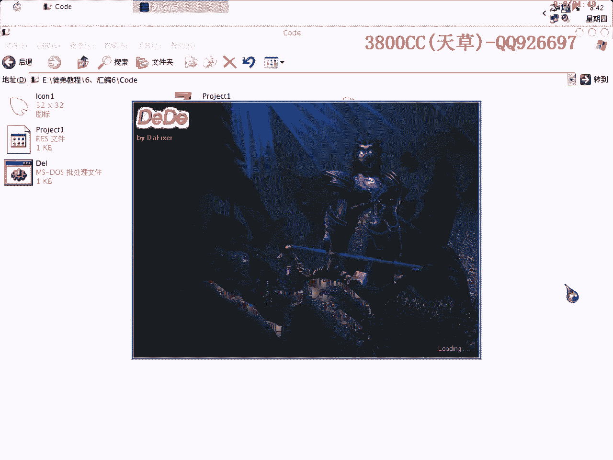
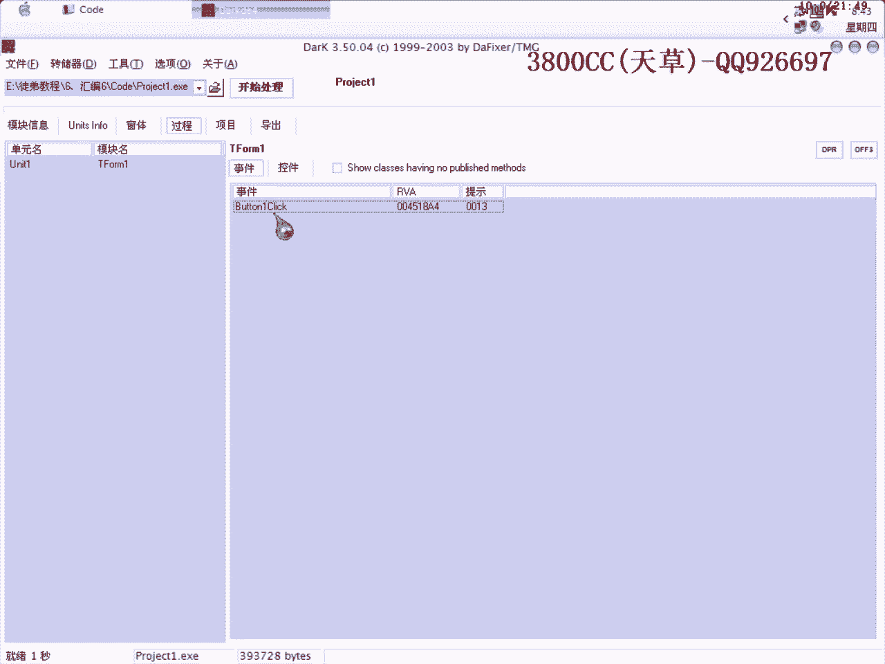
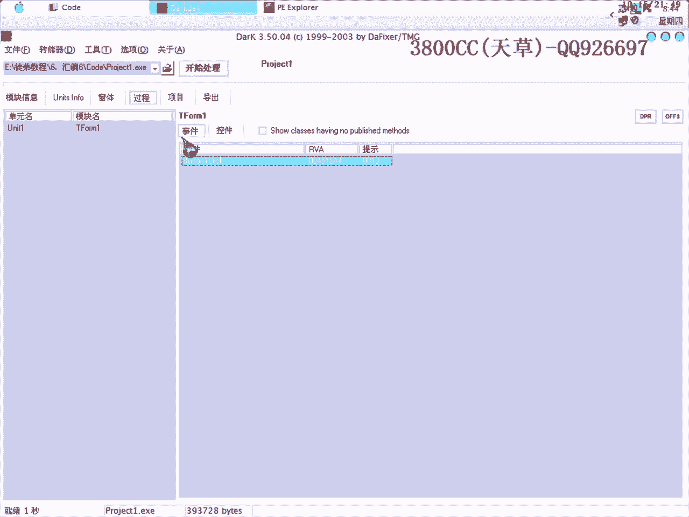
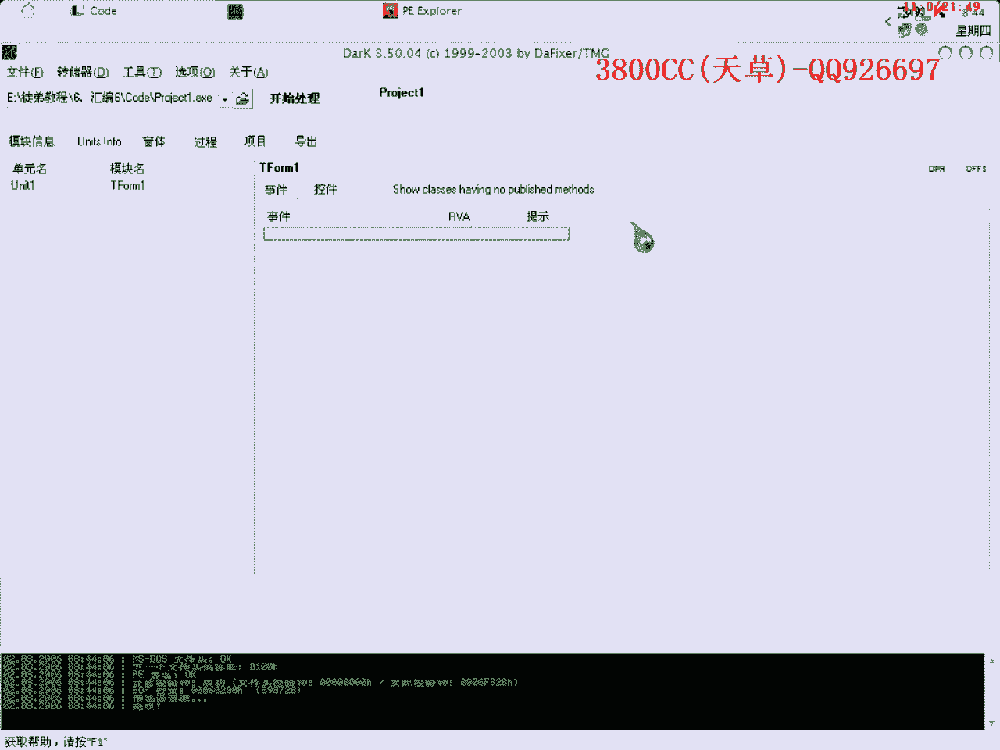
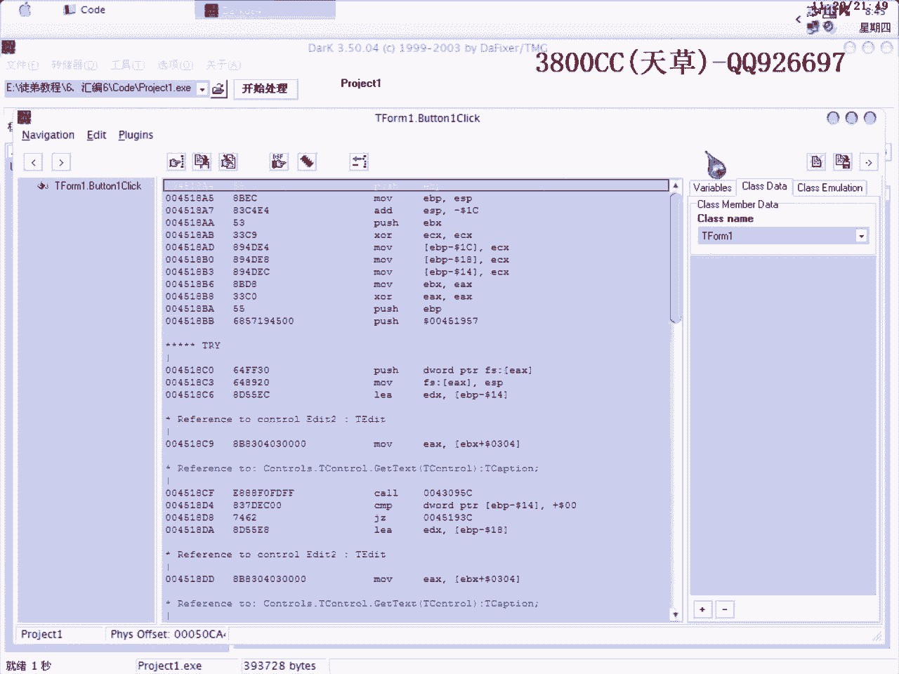

# 天草流初级汇编课程 - P6：子程序调用与返回 🧩

在本节课中，我们将学习汇编语言中一个非常重要的概念：子程序的调用与返回。我们将通过一个简单的实例程序，来理解`call`和`ret`指令的工作原理，并学习如何在逆向分析中识别和跟踪它们。

---

## 概述：什么是子程序调用？

上一节我们介绍了基本的程序流程控制。本节中，我们来看看一种特殊的流程转移操作——子程序调用。

子程序的调用和返回是一对互逆的操作。调用指令`call`会改变程序的执行顺序，跳转到子程序的入口地址。与普通的转移指令不同，子程序执行完毕后，CPU需要能够返回到调用指令之后的那条指令继续执行，这个“返回”操作就是通过`ret`指令完成的。

## 理论：CALL与RET指令详解

### 调用指令 (CALL)

`call`指令的格式根据子程序的属性（近或远）而有所不同。

*   **近调用 (Near Call)**：如果被调用的子程序属性是“近”的，`call`指令执行一个近调用。它会将该指令**之后地址的偏移量**压入堆栈。这样，返回时就能知道该回到哪里。
    *   公式表示：`push EIP` (下一条指令地址) -> `jmp near 子程序地址`

*   **远调用 (Far Call)**：如果被调用的子程序属性是“远”的，`call`指令执行一个远调用。此时，它不仅要把下一条指令的**偏移量**压栈，还要把当前**代码段寄存器CS的值**也压入堆栈。
    *   公式表示：`push CS` -> `push EIP` -> `jmp far 子程序地址`

### 返回指令 (RET)

返回指令`ret`（在调试器OD中常显示为`retn`）的功能与`call`相反。它从堆栈中弹出返回地址（对于远调用还要弹出CS），并跳转到该地址，从而恢复`call`之前的执行流程。

其核心原理是：
1.  `call`指令将返回地址压入堆栈。
2.  子程序执行。
3.  `ret`指令从堆栈中弹出返回地址，并跳转回去。

用代码可以简单模拟这个过程：
```assembly
; 假设调用 call sub_proc
call sub_proc    ; 1. 将下一行地址（00401005）压栈，然后跳转到sub_proc
next_instruction: ; 2. 这是要返回的地址
...




sub_proc:
    ... ; 3. 子程序代码
    ret ; 4. 从堆栈弹出00401005，并跳转回去
```


---

## 实践：分析一个简单的注册验证程序



理论部分我们介绍了子程序调用的机制，现在让我们通过一个实际例子来加深理解。我将使用一个用Delphi编写的简单程序作为实例。


这个程序的功能是：输入正确的注册码，一个灰色的窗口控件会变为可用（变色）；输入错误的注册码，程序会直接退出。



以下是程序的核心算法逻辑（伪代码）：
```pascal
// 读取输入
reg = StrToFloat(Edit2.Text); // 注册码转换为浮点数
temp = StrToFloat(Edit1.Text); // 机器码转换为浮点数


// 验证算法
if (reg * temp == 823729842936.0) {
    Memo1.Enabled := True; // 控件启用，变色
} else {
    Application.Terminate; // 程序退出
}
```
可以看到，算法很简单：**注册码 × 机器码**需要等于一个固定的常数。



### 第一步：定位关键代码



由于程序是Delphi编写，我们使用辅助工具**Dede**来快速定位按钮点击事件的代码起始地址。

以下是使用Dede的步骤：
1.  加载目标程序。
2.  在窗口列表中，找到主窗体。
3.  在“过程”页面，找到`Button1Click`事件（即注册按钮）。
4.  双击获取其内存地址。

> **提示**：如果程序有多个按钮，可以使用`ResScope`等资源工具查看窗体资源，通过按钮的标题文本来确认哪个是我们要找的`Button1`。

获得地址后，用OD载入程序，`Ctrl+G`跳转到该地址，并在此处下断点。

### 第二步：动态跟踪与分析

运行程序（F9），输入一个错误的注册码（例如`123456789`），点击注册按钮。程序会断在我们下的断点处。

现在开始单步跟踪（F8/F7），我们的重点是观察`call`指令。

1.  **第一个call**：跟随F7进入。观察堆栈和寄存器变化。这个call通常用于**获取我们输入的注册码字符串**。
2.  **后续call**：继续单步，会遇到多个call。其中一些call负责将字符串转换为浮点数（对应源码的`StrToFloat`）。
    *   在OD中，浮点转换指令通常是`FLD`、`FSTP`等。
    *   `FLD`指令：将源操作数压入浮点寄存器栈。
    *   `FSTP`指令：将浮点寄存器栈顶的值弹出并存储到目标内存地址。

3.  **关键比较**：在跟踪过程中，你会看到浮点乘法指令`FMUL`，这就是算法中“注册码 × 机器码”的步骤。之后会有一个浮点比较指令`FCOMP`，将相乘的结果与一个固定常数（`823729842936.0`）进行比较。

### 第三步：修改流程与验证

在比较指令之后，会根据结果进行条件跳转（如`jnz`）。如果结果不相等（注册码错误），就会跳转到退出流程。

*   **错误路径**：让程序自然执行，它会走向退出。
*   **正确路径**：我们可以在OD中修改标志位（例如，将零标志ZF改为1），或者直接修改跳转指令，让程序“认为”比较通过。此时继续运行，你会发现那个灰色的控件被启用了，这证明了我们的分析是正确的。

根据算法 **注册码 = 固定常数 / 机器码**，我们可以计算出正确的注册码。在本例中，如果机器码是`111111`，那么正确的注册码就是`888888`（六个8）。输入这个正确的注册码，程序将不会跳转，直接走向成功的分支。

---

## 总结与要点

本节课中，我们一起学习了汇编语言中**子程序调用与返回**的核心机制。

*   **核心指令**：`call`用于调用子程序，`ret`用于从子程序返回。它们通过堆栈传递返回地址，实现“有去有回”的流程控制。
*   **分析技巧**：在逆向分析时，遇到`call`指令不要盲目跳过。按F7跟进，理解其功能（如获取输入、转换数据、进行计算等），是理解程序逻辑的关键。
*   **养成习惯**：在动态调试时，对重要的`call`和关键跳转做好注释，并记录分析结果，这能极大提升后续的分析效率。
*   **实际应用**：真实的程序可能包含多层嵌套调用，逻辑更为复杂。掌握本节课的基础，是应对更复杂逆向分析的必经之路。


记住，子程序调用是构建复杂程序的基石，理解它，你就向逆向分析的世界又迈进了一大步。