# 天草流初级破解教程 - P7：破解实战1 - 白嫖无双 🛡️

在本节课中，我们将学习如何对一个VC++程序进行破解实战。我们将通过两种方法定位关键代码，分析注册验证逻辑，并最终找到注册码的存放位置。课程将巩固之前学习的子群调用、字符串查找和关键跳转分析等知识。

---

## 课程概述 📋


本节课是“天草流初级破解教程”的第七课。我们将对一个使用VC++ 6.0编写的程序进行破解分析。主要内容包括：使用插件识别算法、通过字符串查找定位关键代码、利用调用堆栈快速定位按钮事件，以及分析验证逻辑并找到注册码的存储位置。

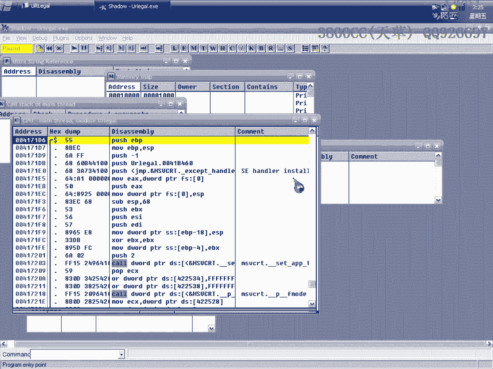

---

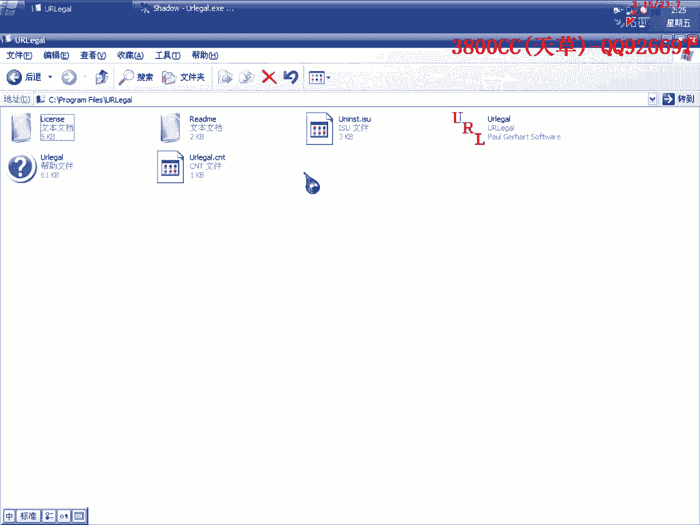

## 准备工作与程序载入

上一节我们介绍了子群调用的概念。本节中，我们来看看如何将其应用于实际的VC++程序破解。

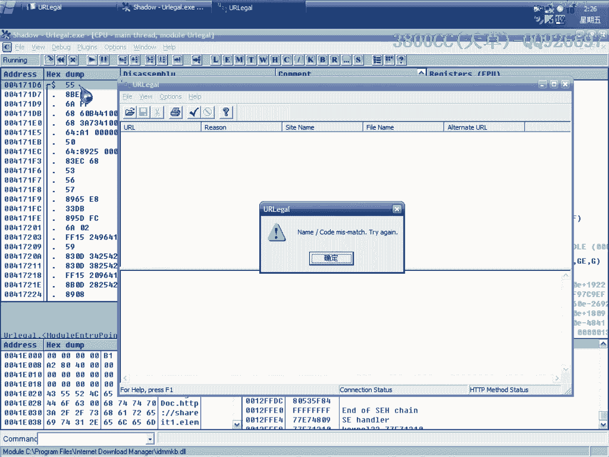

首先，我们需要使用OD（OllyDbg）载入目标程序。目标程序是一个VC++ 6.0编译的程序。


在载入前，可以使用一个插件来辅助识别程序可能使用的加密算法（例如Base64或MD5）。这个插件能帮助我们快速了解程序的验证机制。

```assembly
// 这是一个示例，表示OD载入程序后的入口点
00401000 > $  55            PUSH EBP
```

载入程序后，我们首先尝试运行程序。

---

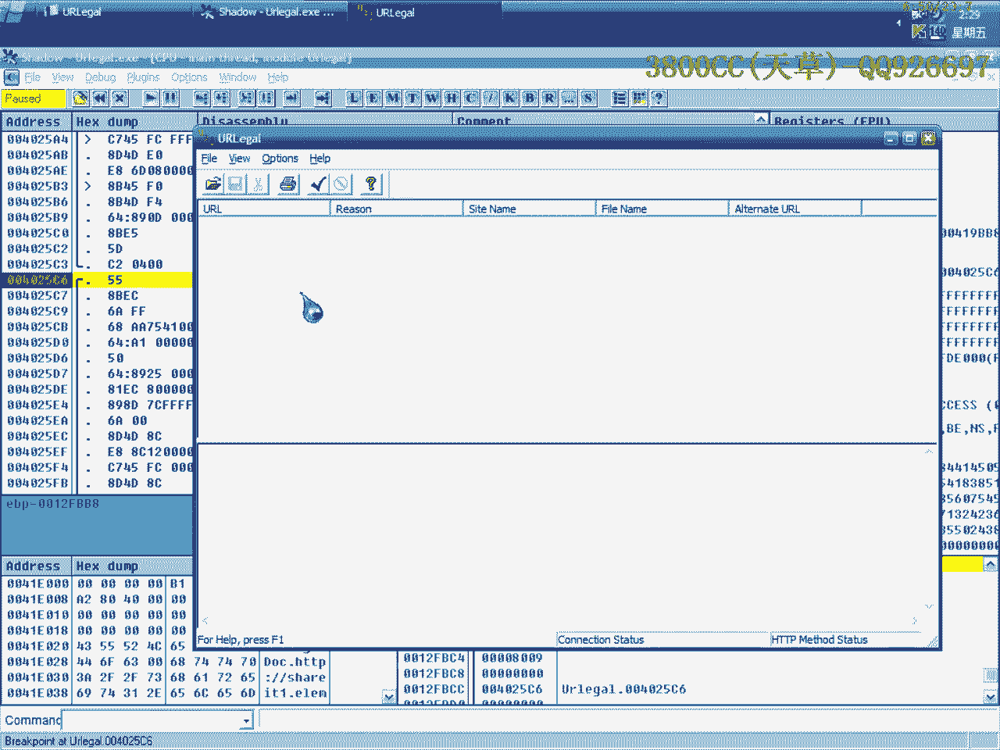

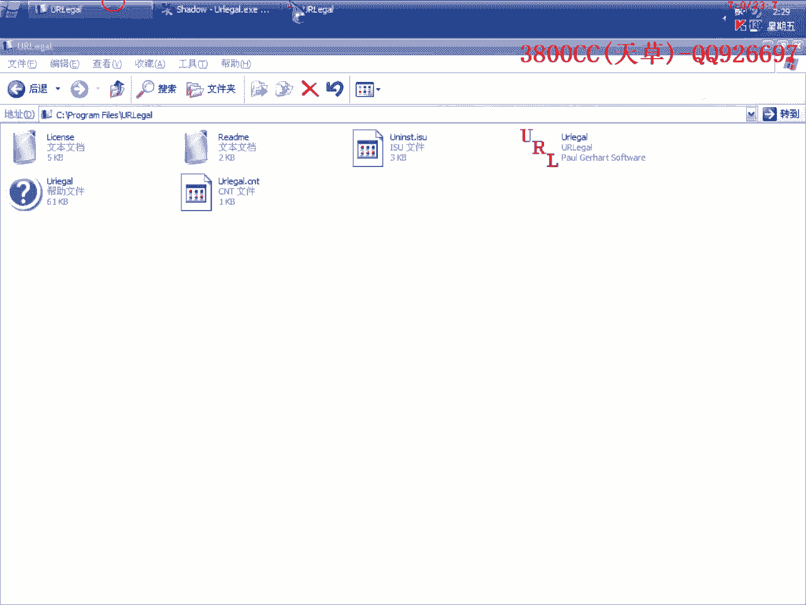

## 方法一：通过参考字符串定位

一种常见的破解思路是搜索程序中的字符串。以下是操作步骤：


1.  运行程序（F9）。
2.  在程序界面输入假用户名和假注册码（例如：`3800cc` / `123456789`），并点击注册按钮。
3.  程序会弹出错误提示，例如“用户名或注册码不匹配”。
4.  在OD中暂停程序，右键选择“查找” -> “所有参考文本字串”。
5.  在出现的字符串列表中，寻找与错误提示相关的字符串（例如“不匹配”或“错误”）。
6.  双击找到的字符串，OD会跳转到引用该字符串的代码位置。

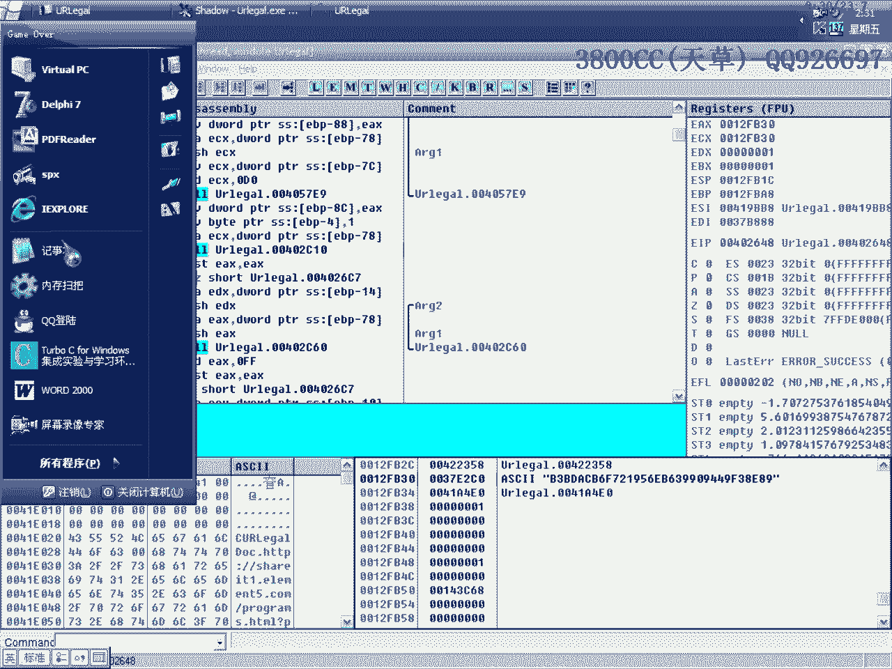

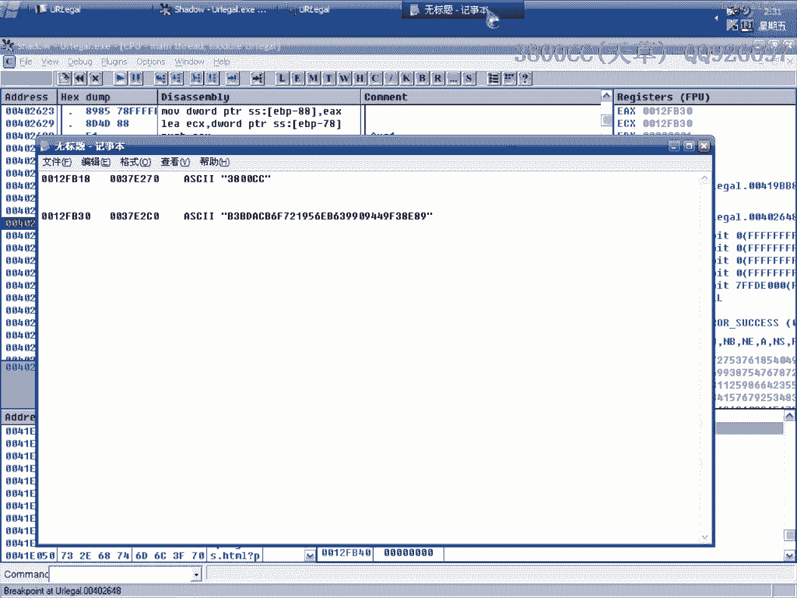

找到引用错误提示的代码后，我们就在其附近区域。通常，上方不远处会有一个条件跳转（`JE`、`JNE`等），这个跳转决定了程序是走向成功还是失败提示。这个跳转就是“关键跳转”，而它上方的`CALL`指令通常是进行注册码验证的“关键CALL”。

我们在关键CALL的地址处按F2下断点，然后重新运行程序并点击注册。程序会在此处中断，此时我们可以按F7键步入（`Step into`）这个CALL，进入验证函数内部进行分析。

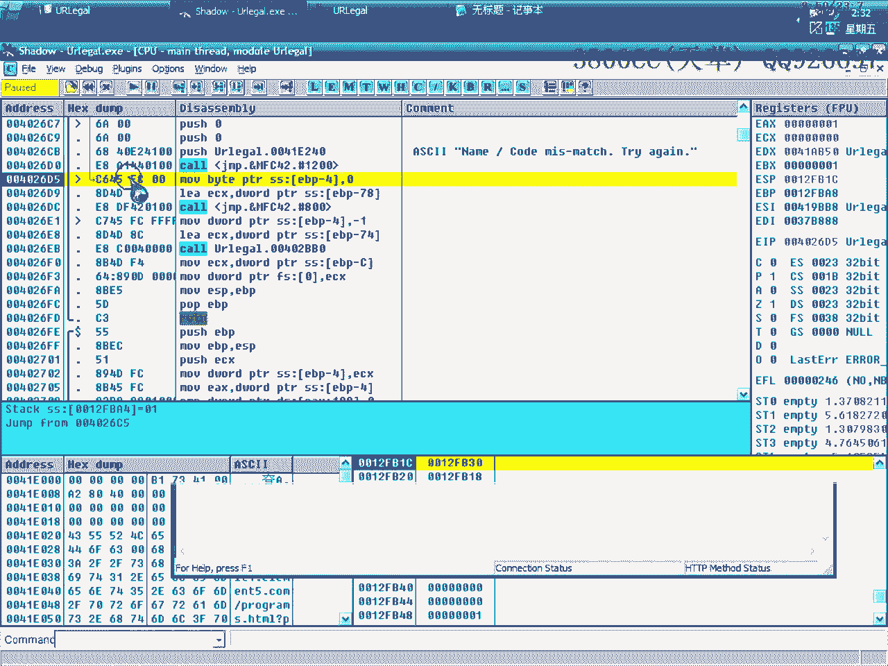

---

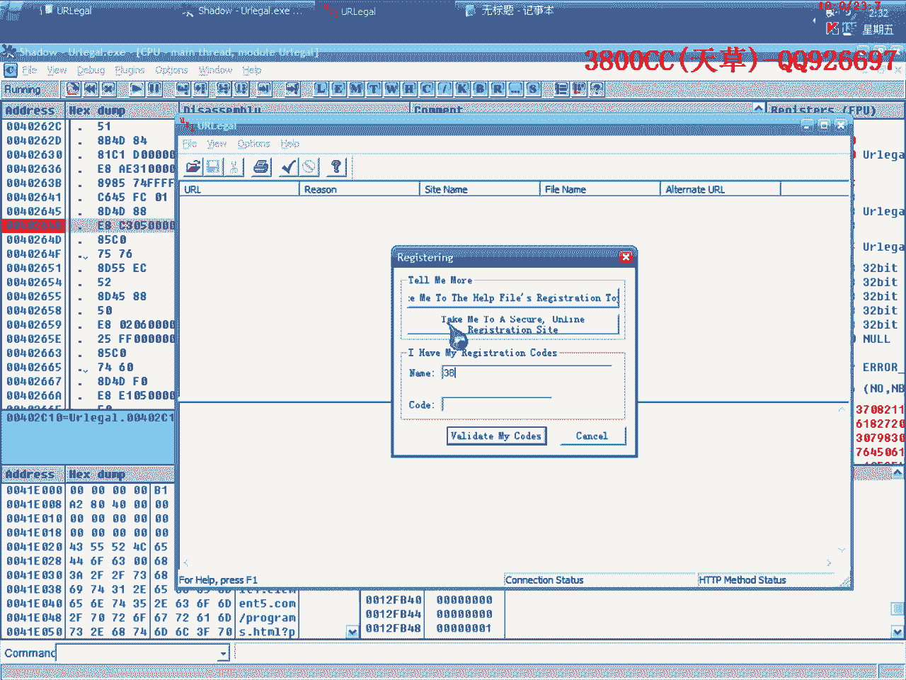

## 方法二：利用调用堆栈快速定位

在破解某些程序（特别是外挂或带有Nag窗口的程序）时，字符串可能被加密，此时方法一可能失效。我们可以利用OD的调用堆栈功能来快速定位。

以下是操作步骤：

1.  让程序运行起来，并弹出注册窗口（先不要点击确定）。
2.  在OD中按F12键暂停程序（`Debug` -> `Pause`）。
3.  点击OD的“K”按钮（或`View` -> `Call Stack`），查看调用堆栈窗口。
4.  在调用堆栈列表中，寻找最接近顶部的、属于目标程序模块的调用（通常不是系统DLL的调用）。
5.  在该行上右键，选择“显示调用”或类似选项。
6.  OD会跳转到对应的代码位置，这里很可能就是按钮事件处理函数的开始或附近。


这种方法能让我们快速从系统领空返回到程序领空，直达事件处理的核心代码区，效率非常高。


---

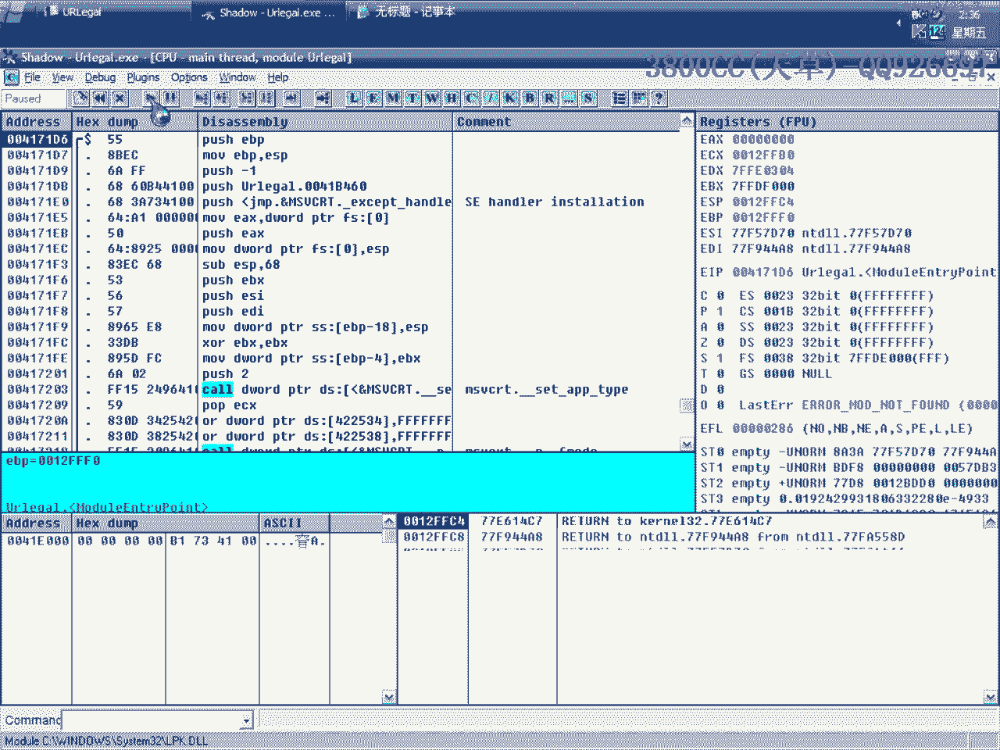


## 分析验证逻辑与修改

无论通过哪种方法，我们最终都定位到了验证代码附近。以下是一个典型的分析过程：


我们找到了一个关键跳转，例如：
```assembly
00401234    75 10           JNZ SHORT 00401246   ; 关键跳转，如果不等则跳向失败
00401236    68 00104000     PUSH 00401000        ; 成功提示字符串
...
00401246    68 0C104000     PUSH 0040100C        ; 失败提示字符串
```

分析发现，如果`JNZ`跳转实现，就会执行失败分支。我们的目标是让它不跳转。通常，这个跳转依赖于上方一个CALL的返回值（存储在`EAX`寄存器中）。

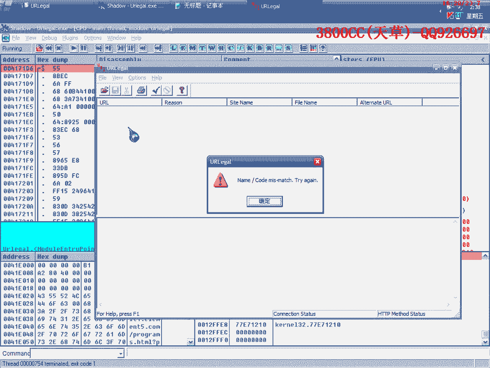

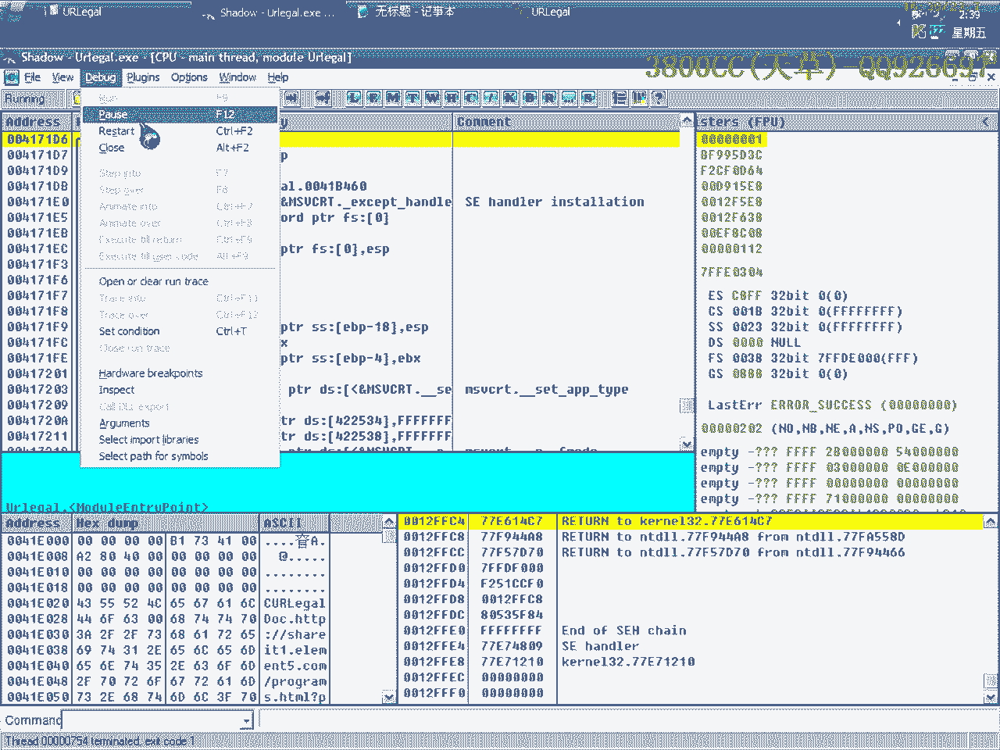

1.  我们在关键CALL处下断点，并`Step into`进入。
2.  单步执行（F8）观察代码逻辑，重点关注影响`EAX`值的指令。
3.  我们发现，验证函数最终通过比较计算，使`EAX`变为`0`（验证失败）或`1`（验证成功）。
4.  为了爆破，我们可以尝试在函数返回前（`RETN`指令处），直接将`EAX`的值修改为`1`。
    *   在OD的寄存器窗口，右键点击`EAX`，选择“修改”。
    *   将值改为`1`。
    *   继续运行程序，此时程序应该显示注册成功。

通过这种分析，我们不仅能够实现爆破，更能理解程序的验证流程。

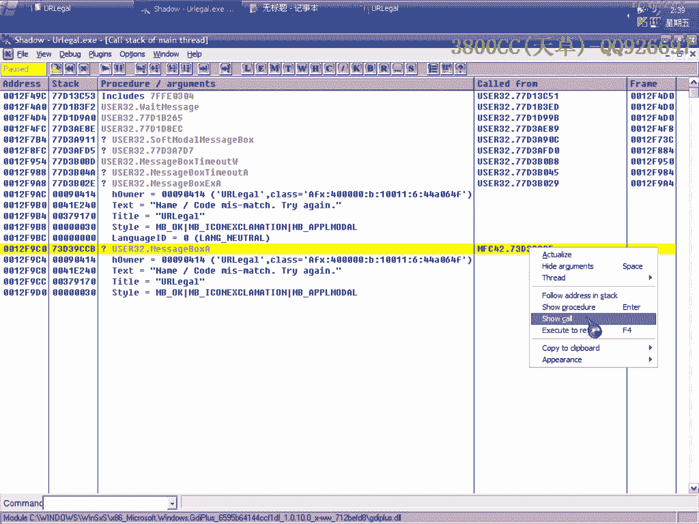

---

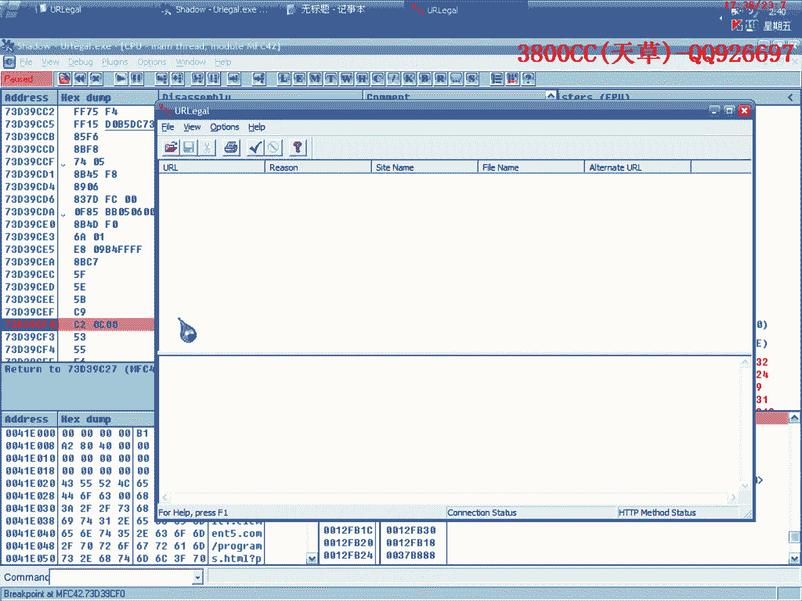

## 寻找注册码存储位置

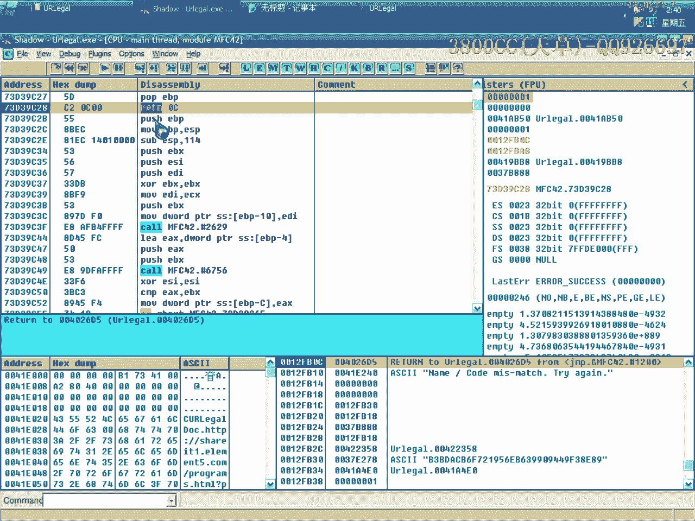

成功破解后，我们还可以进一步探索程序将注册信息存储在哪里。这有助于编写注册机或进行深度分析。

常见的存储位置包括：
*   程序的配置文件（`.ini`）。
*   系统注册表。
*   程序自身目录下的特定文件。

我们可以使用以下方法查找：
1.  在OD中，对`RegOpenKeyEx`、`RegSetValueEx`、`WriteFile`等API函数下断点，跟踪程序写入数据的位置。
2.  或者，在成功注册后，直接使用系统搜索工具，在注册表或程序目录中搜索用户名或注册码明文。

在本例中，我们发现注册信息被存放在程序目录下的一个特定文件中。删除该文件，程序又会恢复到未注册状态，这方便了我们进行多次测试。

---

## 课程总结 🎯

本节课中我们一起学习了针对VC++程序的两种破解定位方法：字符串查找法和调用堆栈法。我们分析了验证函数的关键跳转与关键CALL，并通过修改寄存器值实现了爆破。最后，我们还探索了注册信息的常见存储位置。


通过本课实践，希望大家能够巩固逆向分析的基本流程：定位、分析、修改与验证。这些是后续学习更复杂破解技术的重要基础。请务必花时间动手练习，加深理解。