# 天草流初级 - P8：8、破解2 - 白嫖无双 - BV1qx411k7qA

我在第七个软件的主页上，找到了这么一个软件，风格很一样，大家可以看到，风格是非常一样的，先用PID来查一下，大家可以看一下，也是用了这么一个轨算法，咱们这一刻稍微增加一个内容，大家可以看到。

我点关闭的时候，如果没有注册的话，点关闭，它就会出现这么一个垃圾窗口，这么一个鬼窗口，那我们就，还是先来破解它，然后再来教大家，怎么去掉这么一个鬼窗口，好，直接Od載入，来源是，4。9运行。

我就不用那种所谓的常规的方法，我就用我自己的方法，这个样子比较舒服一点，大家看到了。

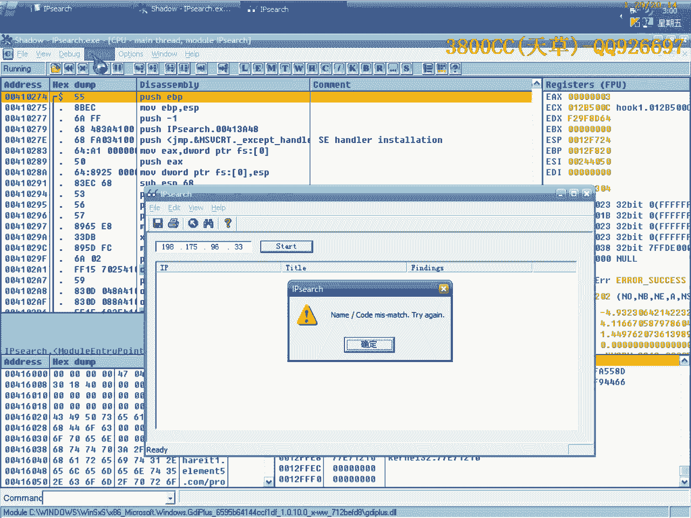

这里。

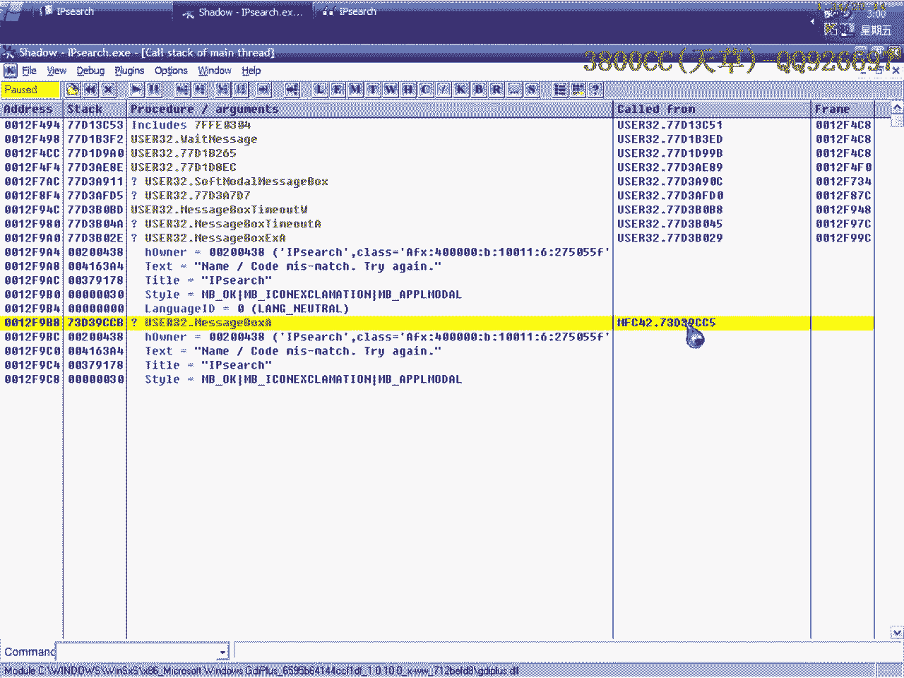

在这一行下断点，直接在F9运行一下，点确定，就断下来了。

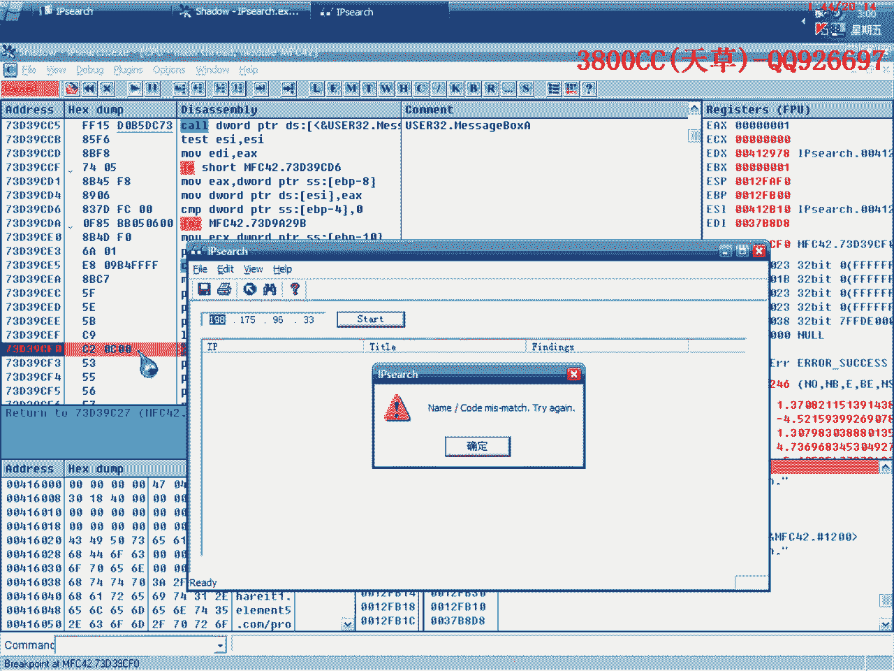

这里它又返回到了一个系统的领空，大家可以看到，这里它就直接出注册码了，非常怎么说呢，好玩，大家再可以看到，这里它有一个注册项。

大家看一下。

注册项，那就说明这个软件，它那个注册码应该是保存在这里了，这里就是我们的注册码，我们刚才说的用户名是多少来着，看一下，找不到我们刚才说的用户名，3800cc吧，不管了，返回到这里来了。

这个也是一样的，大家可以看到三法结构都是一样的，所以说出自于同一个注册的软件，好，是一样的，咱们在这里看一下是哪个跳跳过来的，这里，这里还有一些不一样，这里是mbscmp，这是一个比较函数。

咱们就直接在这个地方来下段吧，好。

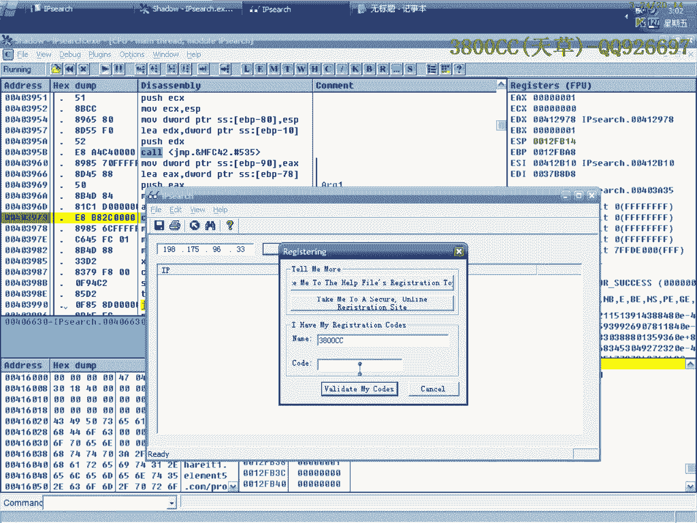

断下来了，咱们单步走吧，这里就是真正的注册码咯，放入ECS，这里面是对战里面的一个字，0012FB30，就是这里，这里所在的一个对战地址，已经放入集成器里面去了，这一行是EDX70，然后这里就比较20。

和临近比较，至于这个20是什么，肯定要从上面分析才能看得出来，20是什么，咱们先不管了，EDX，这里是没有跳转的，假注册码，0012FB90，看一下，大家看到了，咱们走真正的注册码，12FB30。

这里是对两个进行比较，大家看到了，现在时刻22编整，我们可以单步走进去看一下，这里到了一个系统的领空，大家也可以看一下，当然对系统的领空，咱们是不能修改的，不能修改是什么，那个跳不跳，这是不能修改的。

大家可以来试一下，比如说我们这里修改一下，EBP，比如说我把这里修改一下，大家再看一下，复制，大家看到了，是这么一个酷寒树，你无法修改。

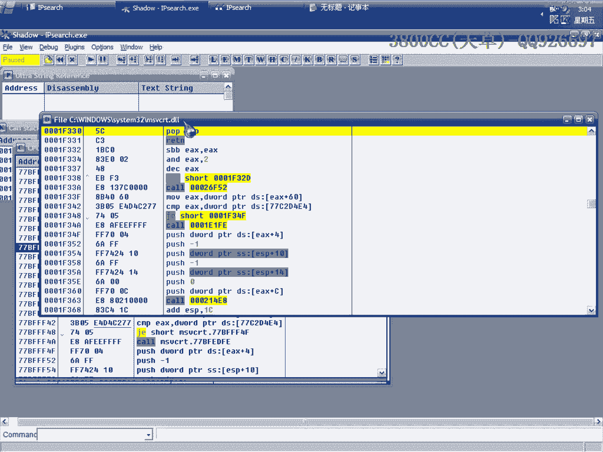

你没有办法，你没有办法去修改酷寒树，达到破解的目的，这个是没有办法的。

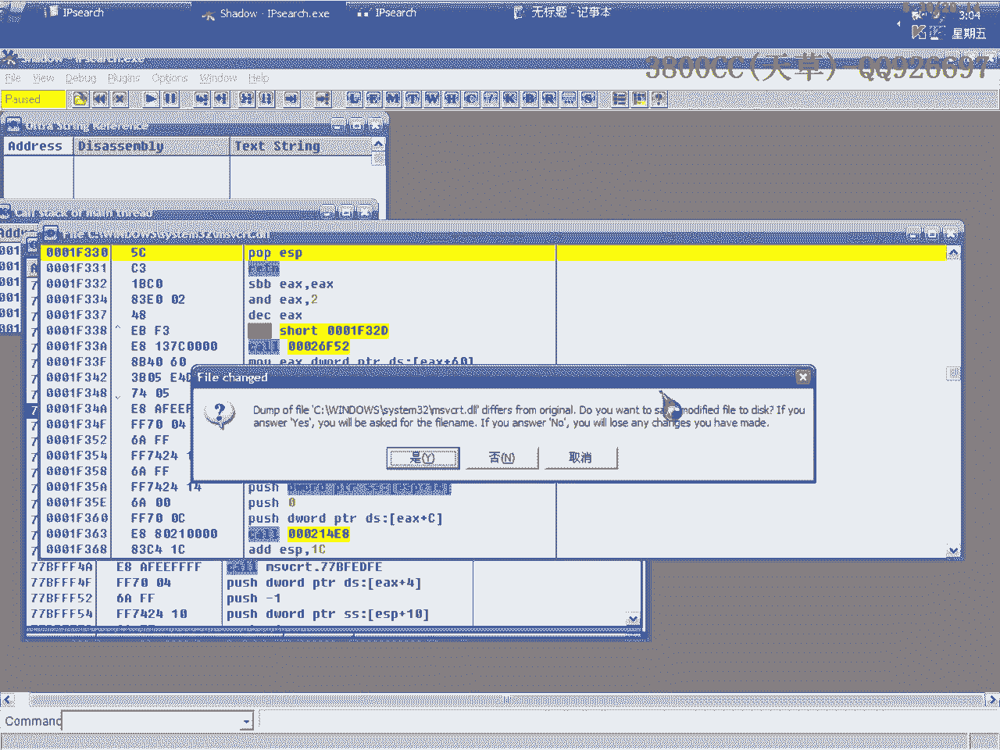

系统的酷寒树你是不能动的，动了之后搞不好系统崩溃，那就没办法，这里，大家可以看到这里，这里是非常相似的，跟我们刚才那里一样，非常非常的相似，他也就是说，把那个call里面的一些东西，给放进了。

直接放出来了，没有放到call里面去调用了，这样更加直观，也更好让我们破，好，咱们这里，咱们这里等一下，等一下再试一下，把这里弄糊掉就可以了，大家看到这里跳转了，直接跳转了，肯定不行的咯。

直接运行看一下，错了，错了，把这个给取消掉，重新来，好，把这里给取漏掉，好没有跳转了，没有跳转了，大家可以看到啊，就这么简单了，这里把那个注册成功的一个提示，放到这个词里面去，放到这个内存地址。

大家可以看一下，看一下，在转存窗口来看一下，004163C8，大家看到了啊，3Q，这样看比较直观一点，看到了，就是说我们现在这些所有的窗口都是非常有用的，大家对它进行协调操作，协调操作，成功了。

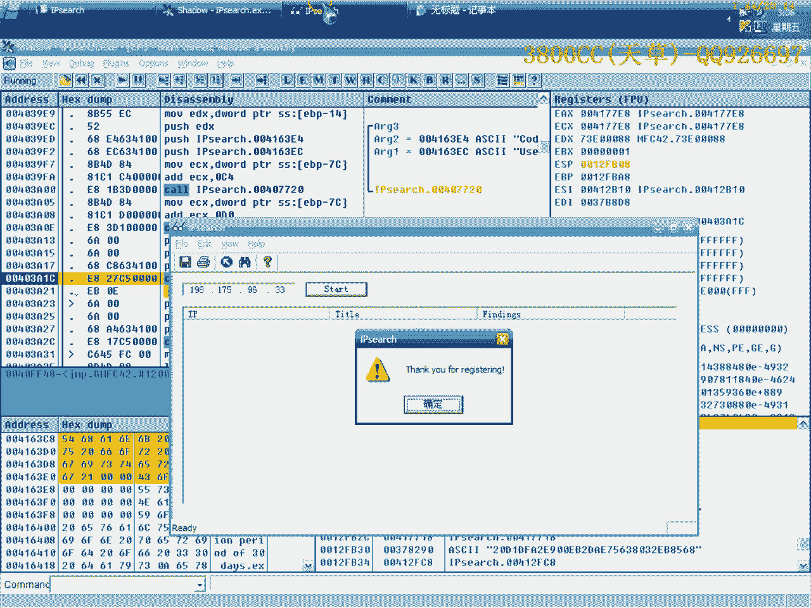

这个咱们就不用管了，破解方法是一样的，这个的，咱们现在把这个断点给取消掉吧，关于破解我就不再多说了。

现在给大家说一下怎么样去掉这个窗口，也是直接运行，点一下它出来了，出来了咱们就不要动了。

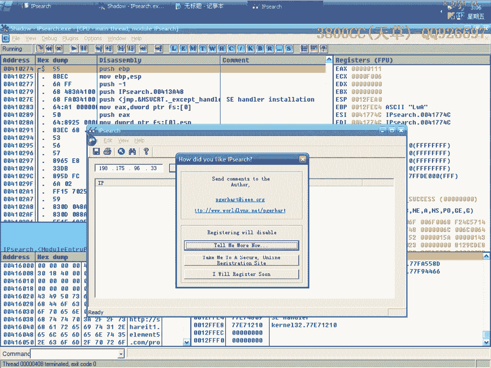

F12，暂停，大家可以看到这里有一堆，这个是user32DLL里面所在的一个模块，模块里面一个字，这里是MFC42，这个是，VC++程序，C类的，C类程序需要运行，需要运行，必须要依靠它，必须要依靠它。

大家可以看到这里有一个特殊的，就是这个，有什么特殊，大家可能还没看清楚，这里面所有的除了这个，所有的全部都是，全部都是，那个系统的领空，所在的系统的领空，唯独这一个是程序的领空，双击的时候。

不要在这一行双击，要在这个地方双击，就是在这两条线中间的，在这个值的上面双击，你要是在这里面双击的话，就双击到另外一个地方去了，双击到这里面去了，不对的，在这个里面双击，双击，或者是右键修靠。

都可以，大家可以看到，这里它肯定就是调用这个，调用这个刚才这个LAC窗口的，调用那个窗口的，那咱们现在怎么办呢，为什么，大家还可以从这个地方来看到，screen，就是屏幕的意思，屏幕的意思，画面的意思。

我们关闭它会调用这个屏幕，画面，我们在这里，这个跳，这里有一个跳转，这里有一个跳转，大家可以看到，如果这个跳转跳转的话，它肯定就不会了，肯定就不会出现那个窗口了，这里，要不要下载，运行。

点一下它就自动退出，重新来过，重新来过，源源是一样的，大家看到了，窗口没有出现，但是OD已经端下来了，这里呢，咱们就先按它的意思，让它不要跳，按它的意思来走一趟，就会出现这个窗口了，那咱们现在。

不要按它的意思来落，让它直接跳转，直接跳转过去，看会有什么结果。

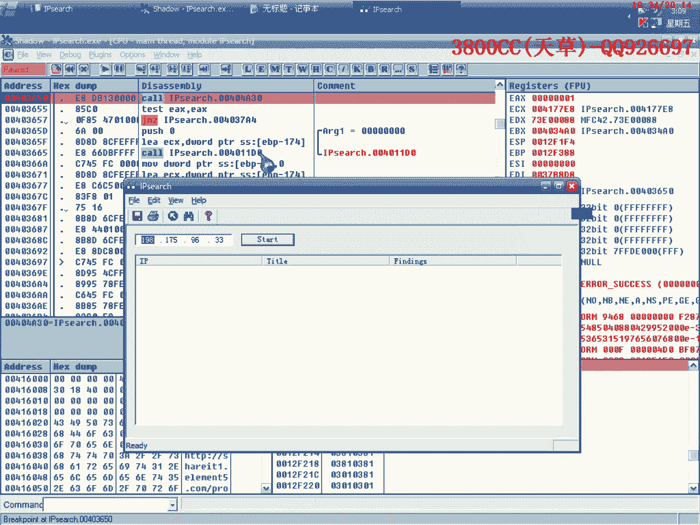

Tax EX EX，咱们直接让它跳转过去看一下，直接退出来了。

这里就是我们的关键跳了，大家等一下可以，更直观的方法，把这里改成jump，无条件跳转，不受任何标注位的影响，可以这样修改，也可以这样去修改，我们把它取消掉，9019，这样它变动了，大家可以看到。

它变动也就是两个字节，如果是我们这样，这样去修改的话，如果把它直接改jump，然后选中，用loop来填充，大家可以看到，变动了多少个字节了，1990这两个，4801，变动了五个字节，所以说，在这个方面。

大家也要注意，尽量改动最少的字节，达到破解的目的，这样程序比原先更加稳定一些，保存一份。

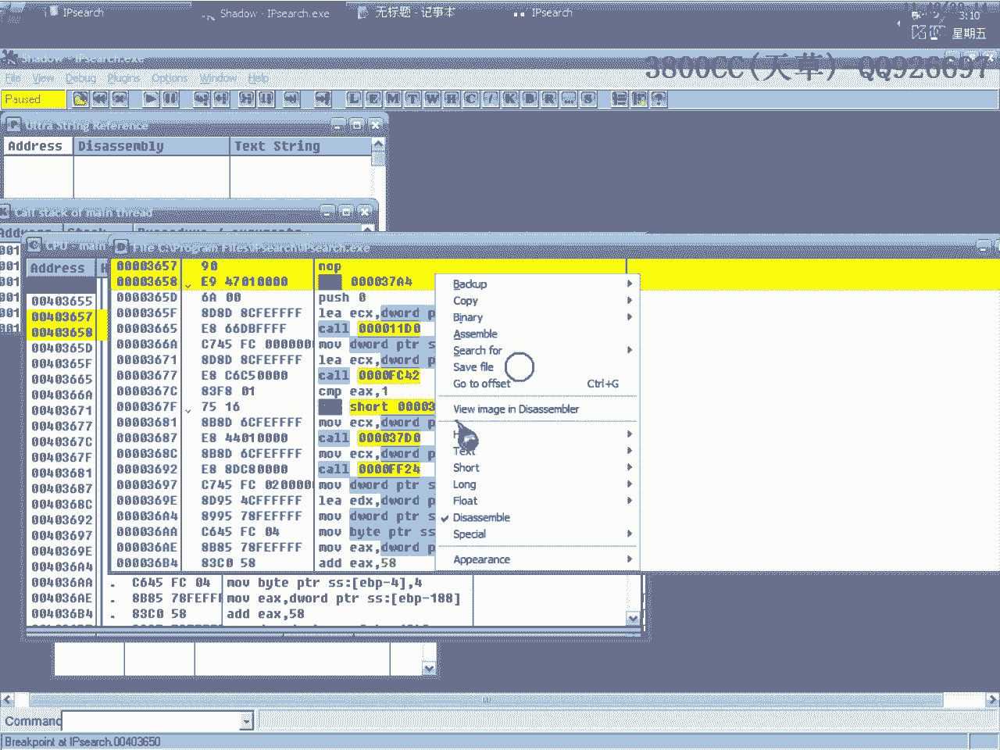

咱们来看一下吧，大家看到了，没有出现那个鬼跳转了，没有出现那个鬼，要我们注册的一个提示了，就是说我给大家讲。

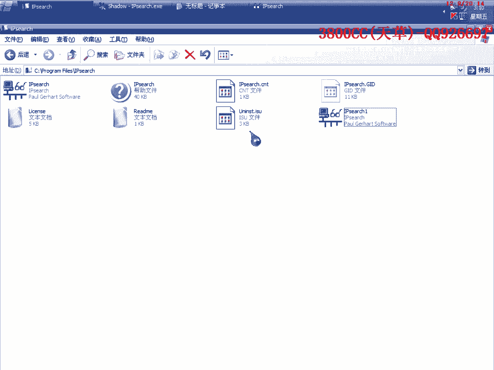

关键是讲思路。

所谓的师父邻居们，修行在个人，要是说，完完全全，所有的东西都要从头开始讲的话，这个样子，十节课，一百节课，一千节课，一万节课都不够，还是要大家自己下去多练习。

咱们现在这里，用靠近去看一下，让它返回为1，可以看到，这里，这里就返回为0，这个0是怎么来的，是这个1AX+21，这个地址给他的，咱们在这里，修改一下，它这个不对啊，看一下吧，看一下程序会不会有问题。

程序有问题，这样修改有问题，就是说他原先指令代码不够，如果下面的是路普或者是0000空数据的话，如果是路普或者0000空数据的话，那就不一样了。

就可以了，就可以再添加了，但现在是，现在是那个int3，int3是不行的，大家慢慢慢慢的注意AX的变化，AX开始填充值了，大家可以看到AX+21，+21就是00417810，它的值是0，它的值是0。

我们在这里来看一下，7814，这里呢，咱们在这里修改，01，不对，应该是相反的方向修改，应该是修改这个，这个才是最低位，在转乘窗口里面，这个才是最低位，这个是高位，大家要清楚。

就直接跳过去了，这里让它跳了，那咱们把这个copy，看会不会有什么效果。

修改这个地方，不行，修改这个地方不行，也就是说，大家可能会说为什么。

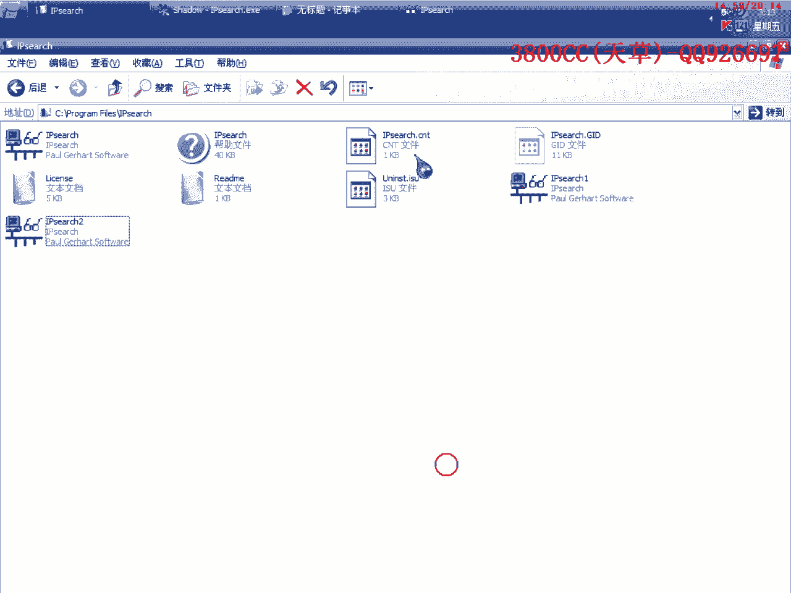

这里的原因，大家可以看到，现在这个地址是00417814，咱们来等一下看一下，等一下来看一下，等一下来看一下，看一下是不是我们复制出现错误。

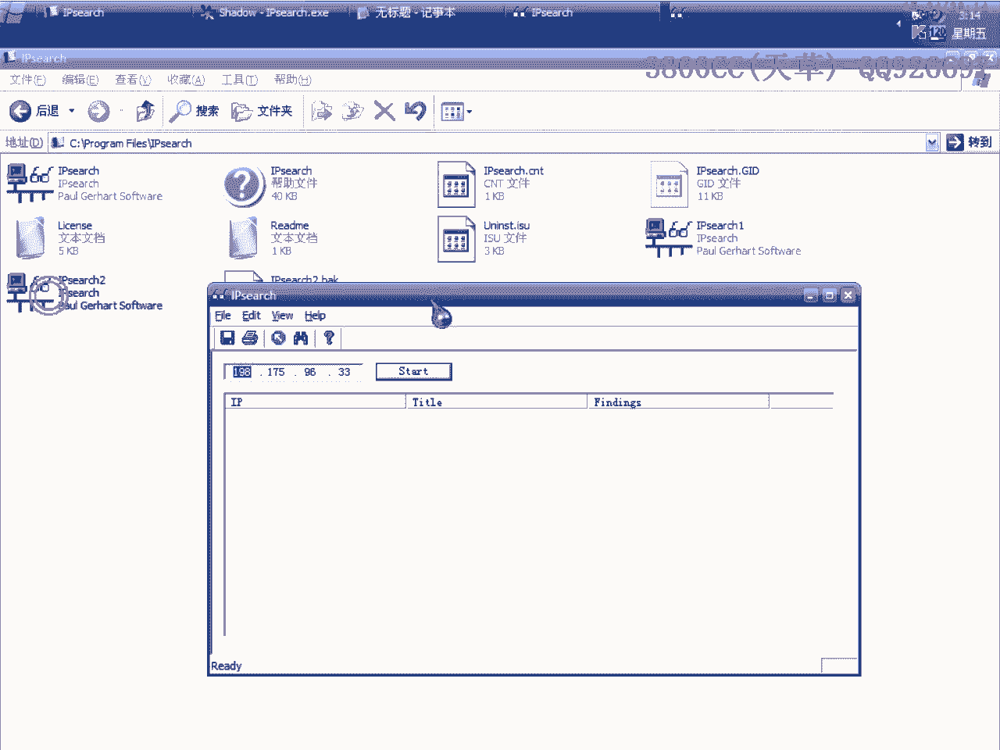

复制是没有错误的，那就是内存的问题了，因为它所在这个值是动态的。

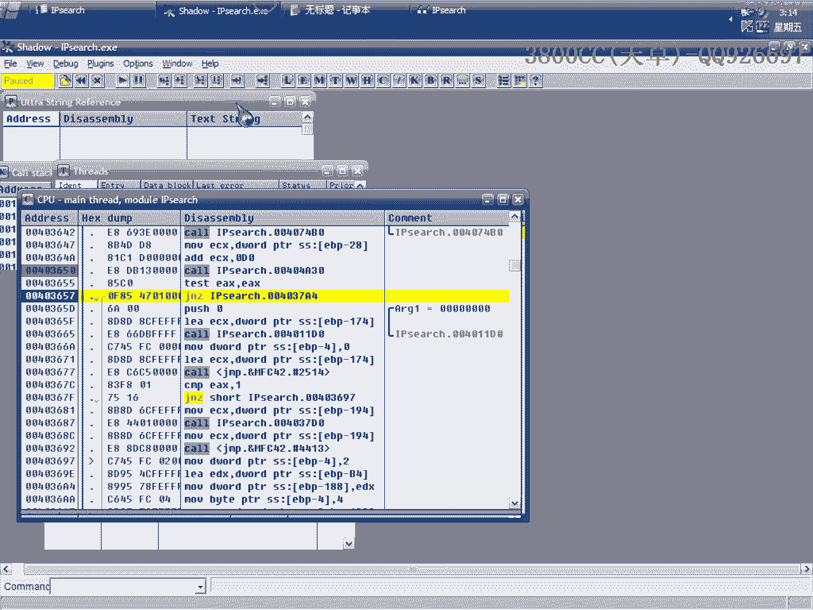

我们来修改它里面内存，也就是说，在下一次运行的时候，可能就不是这个地址了，可能就不是这个地址了，咱们来重新来验证一下，记清楚是00417814，看一下，进去看一下，看一下，这里人员是这个地址。

人员是这个地址，为什么，为什么，怎么靠下家居，到灰边窗口里面去看一下。

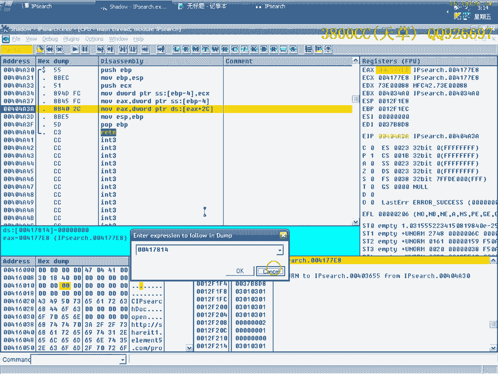

大家可以看到是这里，00417814，为什么，因为这里是程序段，看一下这里是哪一个段的，00417814。

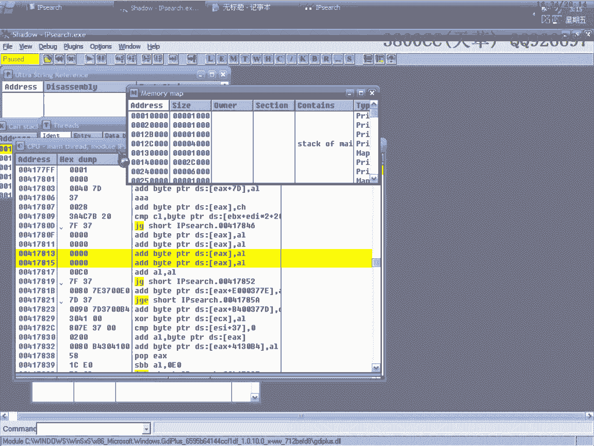

在这一个段，data段，也就是这个段里面，因为这个段里面，存的是数据，存的数据。

它是动态的，动态变化的，程序运行的时候。

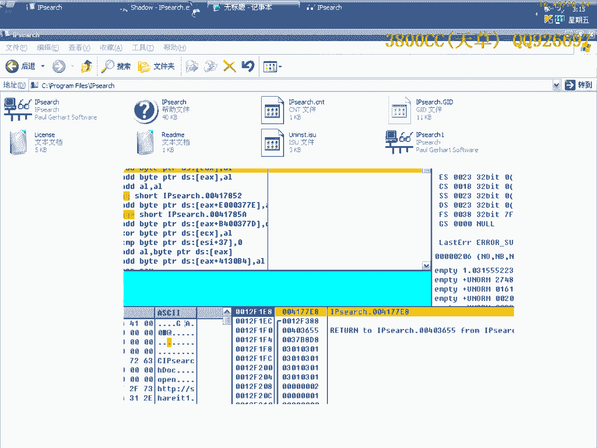

程序运行了之后，它会随动态而改变，比如说我们刚才写入的，那个地址，写入的改成01，因为程序运行之后，会对它进行多次清零，清多少次，这个说不清楚，每个程序都不一样，看它这个地址，要被用多少次，所以说。

它在用第一次的时候，就已经被清零了，后面自然就是没办法了，所以不能改这个地方，这里，咱们看一下，把这个改一下，WARP，1，WARP，打错了，不对，这里不能改，所以说要爆破的话，只有改这个跳转。

其他的地方改不了，其他地方改不了，或者是把这个给落后掉，看一下效果，等一下啊，重新来过，看一下把这个这一行，落后掉看一下效果吧，这一行落不掉，好可以，落不掉这一行也可以，也就是说拒绝。

拒绝它说它给EAX0，不要它给EAX0也可以的。

这个呢，今天方法就是这么多，方法就是这么多，这个是RemoveLag，就是去掉了，已经去掉这个鬼窗口的了，现在来看一下，我们的注册码对不对，是对的，那咱们现在来找一下，在这个里面，建址啊。

这是后面那个语相，看一下建址，建址一般是这两个，一般是这两个，这个或者是这个，大家可以看到，可以看到在这里面，在这里面，在这个里面，咱们导出来，IP被告，把这个删掉，删掉之后，删掉之后就可以了。

大家可以多次玩，玩多次啊，今天这个思路啊。

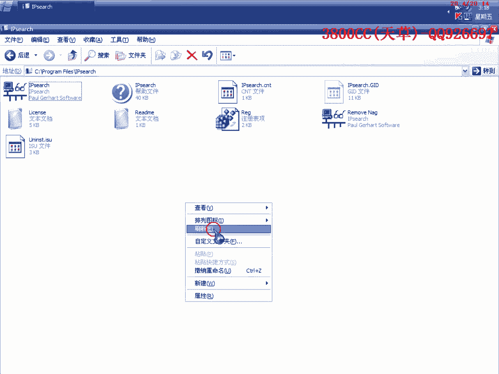

就是这么多，就是这么多，思路都是这样的啊，大家好好掌握，好 再见，『可惜沒有降落到老天爺穗』 張碧晨。

