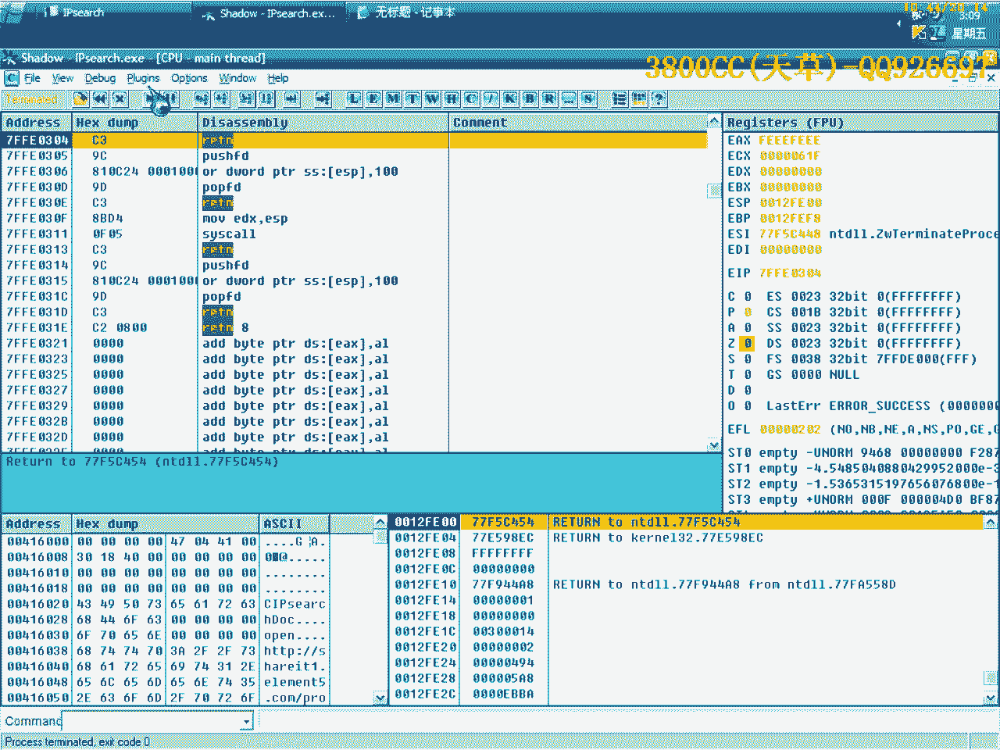

# 天草流初级破解教程 - P8：破解实战与弹窗去除 🛠️

在本节课中，我们将学习一个具体的软件破解实战案例。我们将首先分析并找到软件的注册码，然后学习如何去除软件在关闭时弹出的未注册提示窗口。整个过程将使用OllyDbg（OD）工具进行。

---

## 软件分析与破解

上一节我们介绍了基本的破解思路。本节中，我们来看看一个风格相似的软件。首先，在软件主页上找到目标软件。

使用PID查看软件信息，确认其使用了类似的加密算法。点击关闭按钮时，如果软件未注册，会弹出一个提示窗口。我们的目标是先破解注册验证，再去除这个弹窗。

使用OllyDbg载入软件，来源选择4.9版本并运行。

不使用常规方法，而是采用一种更直观的方式。在关键代码行下断点，然后按F9运行程序，点击确定后程序会中断。

程序中断后，返回到系统领空。此时，可以观察到注册码已经显示出来。软件有一个注册项，说明注册码可能保存在此处。

返回分析代码，发现其结构与之前分析的软件类似，可能出自同一开发者。代码中存在一个`mbscmp`比较函数，这是关键点。

在比较函数处下断点，程序中断后单步执行。可以看到真正的注册码被放入ECX寄存器，地址为`0012FB30`。假注册码地址为`0012FB90`。

代码对两者进行比较。此时可以单步进入查看，但会进入系统领空。系统领空的代码无法修改，尝试修改会导致错误。

代码结构与之前非常相似，但将部分调用内容直接展示出来，没有放入CALL中调用，这使分析更直观。

观察跳转指令，如果跳转实现，则注册失败。取消跳转，使程序继续执行。注册成功的提示信息被存放在内存地址`004163C8`中，内容为“3Q”。

至此，软件破解完成。破解方法相同，不再赘述。

---

## 去除关闭弹窗

破解完成后，现在处理关闭软件时弹出的未注册提示窗口。

直接运行程序，点击关闭触发弹窗。弹出窗口后不要操作，在OllyDbg中按F12暂停程序。

在调用堆栈中，可以看到一系列模块调用。除了一个属于程序本身的领空，其他都是系统领空。找到属于程序领空的调用行。

该调用负责弹出提示窗口。可以从字符串“screen”推断其与屏幕画面相关。在此处找到一个关键跳转指令。

如果这个跳转执行，就不会出现弹窗。运行程序并点击关闭，OD会中断。按照程序原意执行，会出现弹窗；如果强制跳转，则程序直接退出。

这个跳转就是关键跳。可以将其修改为无条件跳转（jmp）。修改时，应尽量改动最少的字节，以保持程序稳定性。例如，将条件跳转改为两个字节的`NOP`指令，比改为五个字节的`jmp`指令更优。

保存修改后的程序。再次运行，关闭时不再出现注册提示窗口。

---

## 关键思路与注意事项

本节的关键在于讲解思路。俗话说“师父领进门，修行在个人”，完全从头讲解所有内容是不现实的，需要大家课后多练习。

尝试修改内存值使函数返回1，但发现修改的地址`00417814`位于数据段（.data段）。数据段的内容在程序运行时是动态变化的，程序会多次对其清零，因此直接修改此处无效。

可行的爆破方法只有修改关键跳转指令，或者阻止程序为EAX寄存器赋值0。

最终，我们得到了去除了弹窗的软件版本。可以验证注册码是否正确，并在软件内查找相关注册键值。

---

## 总结

本节课中我们一起学习了针对一个具体软件的完整破解流程：
1.  分析软件并定位注册验证代码。
2.  通过修改关键跳转实现软件注册。
3.  分析并去除软件关闭时的未注册提示弹窗。
4.  理解了修改系统领空代码的局限性以及动态数据地址的特性。

核心思路是定位关键判断点并修改其逻辑。掌握思路后，需要大量练习来巩固技能。