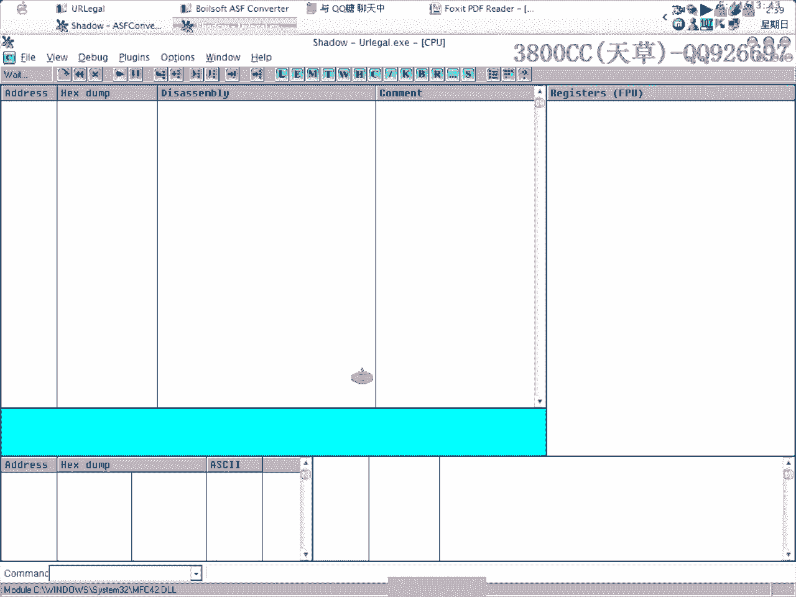
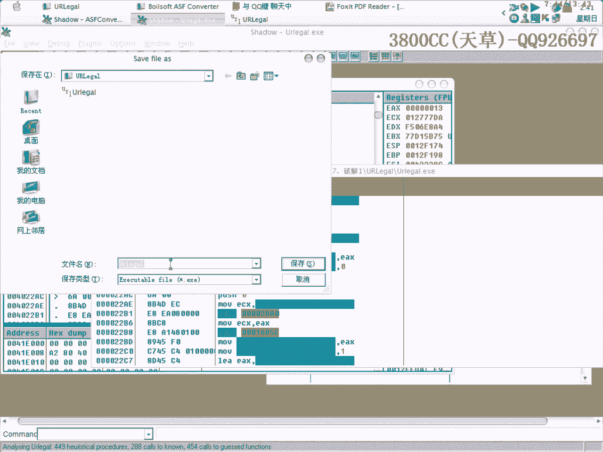
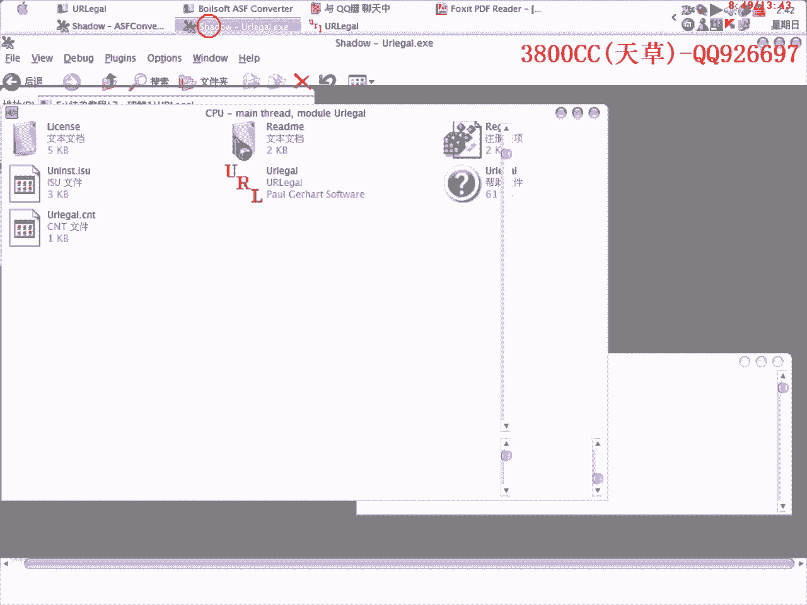
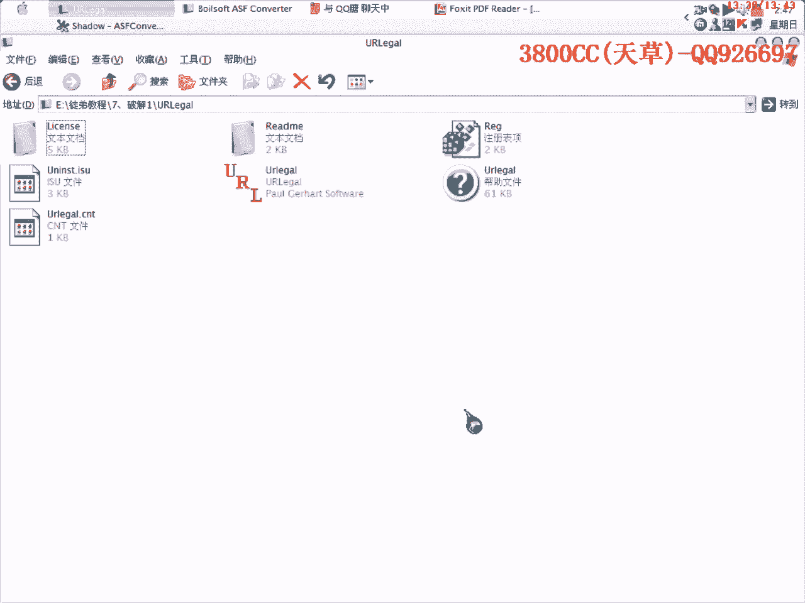

# 天草流初级逆向教程 - P9：第7-8课补充 - 绕过对话框分析 🧠

在本节课中，我们将学习如何通过逆向工程分析一个程序，定位并绕过其弹出的对话框。核心思路是找到调用对话框的代码，并向上回溯，修改关键跳转指令，使程序执行流程跳过该调用。

---

## 分析流程与下断点 🔍

首先直接运行目标程序，当对话框出现时，按下 `F12` 暂停程序。在调用堆栈中，可以看到一个名为 `GetMessageBoxA` 的系统函数调用。这表明程序正在调用系统API来显示对话框。

我们的目标是进入程序自身的代码逻辑（即“程序的领空”），而非系统代码。在调用堆栈中双击或右键选择“显示调用”，即可跳转到程序中调用 `MessageBox` 的具体位置。

```assembly
; 示例：调用 MessageBox 的汇编代码
CALL <JMP.&user32.MessageBoxA>
```

找到此处后，我们就定位了对话框调用的起点。

---

## 回溯与跳转分析 ⬆️



上一节我们定位了对话框的调用点。本节中，我们来看看如何通过分析其上方代码来绕过它。


程序从入口点开始执行，经过一系列指令后，最终会执行到我们刚才找到的 `CALL MessageBoxA` 指令。我们的目的是让程序在执行过程中“跳过”这个调用。


因此，需要向上查看代码，寻找可以跳过此 `CALL` 指令的跳转（`JMP` 或条件跳转）。逆向思考：既然对话框出现了，说明所有本该跳过此处的跳转指令都“没有生效”。那么，使这些跳转生效，就能阻止对话框弹出。

以下是分析的关键步骤：

1.  **在调用对话框的指令处下断点**：这样可以在程序调用对话框前中断，方便观察。
2.  **单步执行（F8）**：从断点处向上回溯，观察每个跳转指令的执行情况。
3.  **识别关键跳转**：找到那些本应跳过对话框调用但实际未跳转的指令。




例如，我们可能发现类似下面的代码结构：
```assembly
TEST EAX, EAX
JZ SHORT 跳过对话框    ; 如果EAX为0则跳转
CALL <MessageBoxA>     ; 显示对话框
跳过对话框:
...                    ; 后续代码
```
如果对话框出现了，说明 `JZ` 跳转条件未满足（即EAX不为0）。我们的目标就是修改逻辑，让这个跳转发生。


---


## 修改指令与验证 ✏️


通过回溯分析，我们找到了影响对话框显示的关键跳转指令。现在，我们来看看如何修改它。



一种常见方法是修改条件跳转，或者将其上方的某个赋值指令改为确保跳转发生。例如，如果跳转依赖于 `EAX` 寄存器的值，我们可以找到给 `EAX` 赋值的代码。

```assembly
MOV EAX, DWORD PTR [EBP-4]  ; 假设这里给EAX赋值
TEST EAX, EAX
JZ SHORT 跳过对话框
```
我们可以将 `MOV EAX, DWORD PTR [EBP-4]` 修改为 `MOV EAX, 0`，以确保 `JZ`（为零则跳转）条件成立。

修改后，重新运行程序。单步执行观察，确认程序流程跳过了 `CALL MessageBoxA` 指令，并且对话框不再弹出。

**注意**：修改时需谨慎。有时跳过对话框调用可能会影响后续流程（例如，跳过必要的退出调用会导致程序无法关闭）。如果遇到问题，需要继续分析跳转后的代码，确保程序功能完整。

---

## 总结与要点 📝

本节课中，我们一起学习了逆向工程中分析并绕过对话框的基本方法。

1.  **定位**：通过调试器在对话框出现时中断，找到程序调用 `MessageBox` 的代码位置。
2.  **回溯**：从调用点向上分析代码逻辑，寻找控制流程跳转到此处的关键跳转指令。
3.  **分析与修改**：判断哪些跳转未生效导致了对话框弹出，通过修改指令（如修改寄存器值或跳转条件）使跳转生效。
4.  **验证与调整**：修改后运行程序，验证对话框是否被绕过，并检查程序其他功能是否正常。



核心目的是**控制程序执行流程，使其跳过不必要的对话框调用**。实现方法多样，但分析思路是相通的：即理解代码逻辑，找到关键点，并进行精准修改。