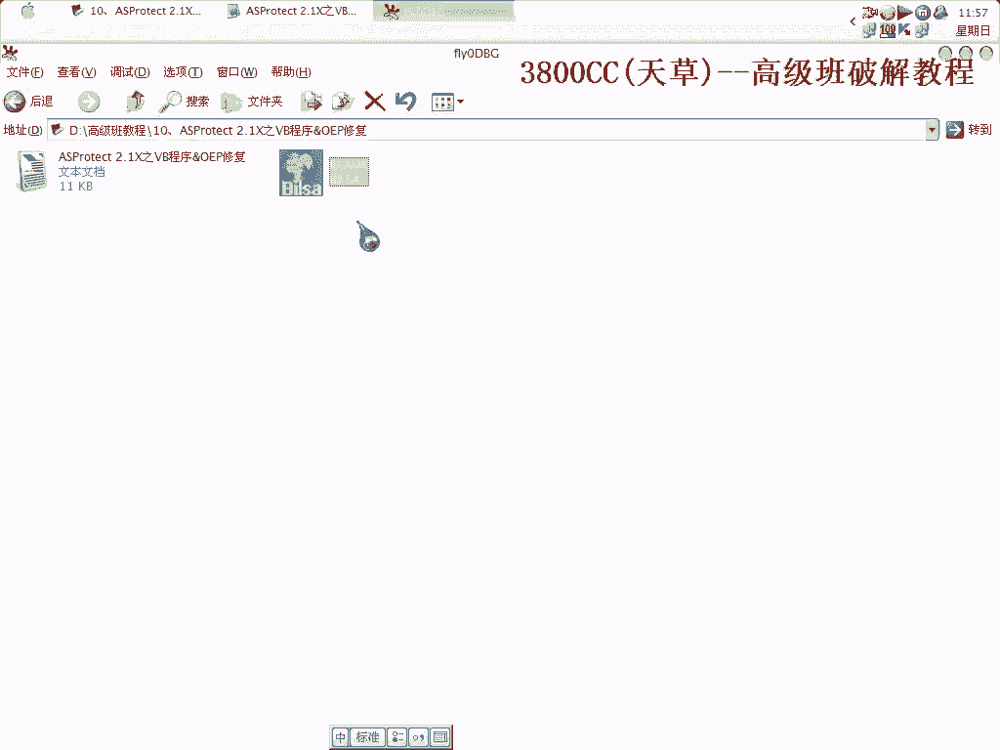
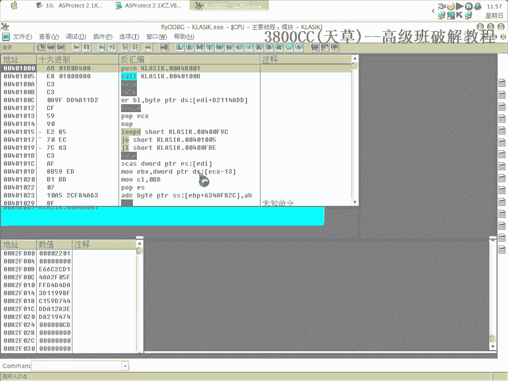
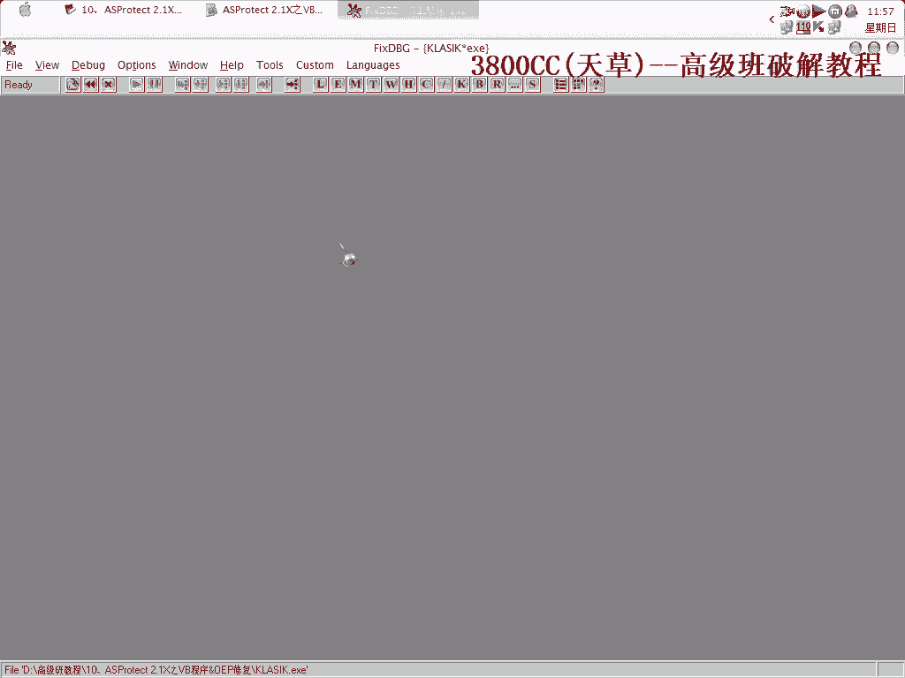
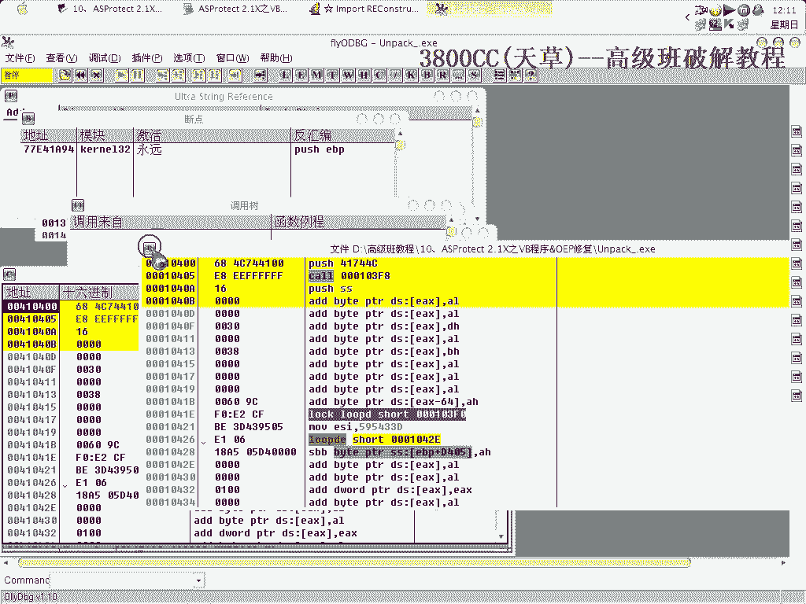
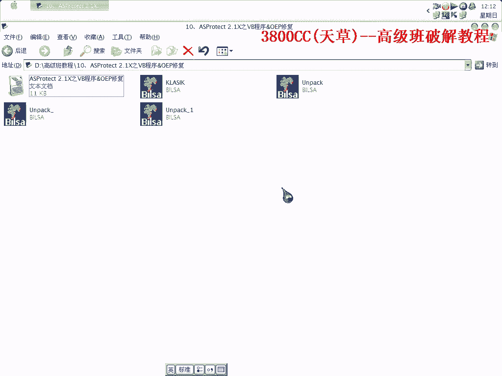

# 天草高级班 - P10：10、ASProtect 2.1X之VB程序&OEP修复 - 白嫖无双 - BV1qx411k7kJ

这几个来教大家拖那个SplitTag2。1X的，这几个就讲一个关于VB程序的，因为VB程序的这个，它这个破解稍微简单一些，它这个拖稿稍微简单一点，后面再给大家讲其他程序的，这是2。1X。

这两个是已经拖好口了的，拖好了，删掉，我这里就是有一些记录，等一下我有一些我需要用到，需要用到，用这个吧。

因为英文的习惯用英文的。

首先呢，忽略除了Index3之外的，就这两个勾勾去掉，然后就运行一下，中断下来了，中断下来了，这个时候我们要进去找，因为我们首先需要找一些探听一些东西，找些东西找到85，上机进去在下面85中间。

把两个85中间有一个有两个靠，这下一个下一个断点，然后修的加速9，取下断点，F7进去，拿到下面来，找到断尾，断尾断尾，在往上面看，两个靠一个靠两个接接接接，这里就是他对IT的一个处理的一个地方。

处理一个地方，在这个地方下好F2断点，修的加F9，这个时候呢，我们抗锡加G来到004010，这个地方啊，然后在抗锡加G，那我们现在要看一下IIT是否是否展开了，可以看得到啊，这里IT没有展开。

放到这个地方去，方便我们等一下，看啊，现在L9运行，看到了啊，这里出现第一个，在EAX，EAX4F，然后ESI是98，98这里他跳了，EAX里面的4F，咱们不要管了，咱们不要管，注意看ESI里面。

ESI里面的值，98，98按9，在ESI在498的时候，我们按F9出现啊，有IT出现，说明98的时候，IT并没有加密，好，继续看，眼睛看一直都是98，好现在变成71了，我们现在要看一下71的时候。

那个他是否加密了，71的时候也没有加密，71的时候也出现了，71，也有啊，说是在98的时候，这都没有，说明这个没有IT加密啊，没有IT加密，因为VV程序的加可是非常非常非常麻烦的一件事。

不管再强的可加到他头上去，总是会减几分的强度，我们这个时候探听到了，就是说他这个IT没有加密，IT没有加密，那我们就继续，续舍加F9，刚刚要把那个，刚刚把这个换换过来了，异常设置换过来了。

换成内存访问的，三步走，修的加F9，好，这里就是最后一次异常，FAA5是最后一次异常，这个是，前面的几个啊，121 0 1 2 1，这个这几个是可能会变，但是FAA5不会变啊，不会变。

当然也有版本是另外的一个固定的字，大家这个自己去看，自己去搜索一下，在这个地方消耗端倪，F7进去啊，F7进去，Auto-JF，这个Auto-JF9，这个地方可以看一下，到这个地方来，这个地方可以看一下。

这里破一下，这里也是这里就是StoneCone的一个歧视位置啊，我这篇文章写的非常详细了，写的非常详细了，大家回去自己看一下，因为这个是VB程序，我们有很多工作都不需要做，都不需要做，在这个段下。

修的加F9，好来到这里，这里就是OEP了，这里就是OEP了，这里这里是OEP，刚刚这里这样，就是我们刚刚看到的一个StoneCone的一个OEP的开始，看到了是一样的，一样的，可以来看一下，大家看一下。

IAT虽然有些被解开了，但是有一些被这个给弄掉了，就是这里是代码变形，代码变形，也是用到了SDK啊，用到了SDK，我们现在需要做的就是把这个给把这些可以啊，可以来看一下有多少个啊，很多个啊。

就是说你IAT越多的话，它弄的越多这样，有很多啊，看到了啊，有很多被都都被IAT都被改成这个了，所以我们需要把它给变过来，再另外啊，他这里有StoneCone的，因为VB程序的，我这里写有，写有了。

看一下，VB程序的入口一般都是这样的，都是这样的，都是这样的，Porsche，然后这一个值，它这个只是这么一个值，然后呢，Cone呢，Cone哪一个地址呢，Cone就是Cone这个地址。

那我们现在就可以知道了啊，Porsche大家看一下对照，Porsche就是Porsche004174411了啊，然后Cone呢，就是Cone004103F8了啊，F8，我们需要探听的内容啊，就探听到了。

现在啊，现在，咱们不走，C4加F9来到最后一次异常啊，看清楚啊，是F8，F8F5，到了这里之后，到了这里之后，我们需要查找了，需要查找，放下家屁啊，查到这个，查这个，然后呢，我们需要申请一个内存地址。

需要申请一个内存地址，我这里呢，就按教程上面一个地址来吧，申请他看到了啊，OD，OD下方提示申请到了，然后这里我们要改成，37啊，你的那个地址啊，就是说你申请的起始地址加上37，改成他。

然后看着家居来到这里，把这行代码给复制上去，这行代码给复制上去，我这里已经写了啊，已经写了变形的IAT，这个呢，1550的这个是会变的，我们来看一下现在的是多少，看着家屁，现在是158，现在是158。

所以我们要把刚才那个15改成158，还有另外还有另外这些值，如果你的那个申请的这个地址是另外的值，这个1640100就是你申请的这个地址加上100，你是什么都要把它改成回来啊，你的是多少就把它改回来。

这个呢，是IAT的起始位置啊，040100起始位置，这个呢，是结束的位置啊，结束的位置，然后这里需要注意的就是刚才是jump类型的，jump，jump一个看一下吧，这个有点说不太清楚的感觉。

这是jump类型的，所以就是FF25嘛，反过来是25FF，这一个呢，82F00是就是0040100这个区段下的下面一个区段的起始位置，就需要这么一个地方，那个，我的这篇文章呢，这篇文章大家要仔细看。

要仔细看，写好代码之后注意检查第一个，第二个这一种第一个第二个，标一下，第二种类型，第三种，这里呢，是起始位置，第四种，这这是第三种一样的，这两个地址要一样，这第三种，这里呢，第五种。

注意要注意这这这六种，所以这要注意这六种地方，在另外的就是，写完之后一定要新建EIP，不然前功尽弃，新建好之后F9，此时OD提示RUN，机器开始有点卡了，卡是非常正常的，不卡就代表不成功了。

现在选择这个进程托克，现在来修复，修复IIT，我们在前面找到了，前面找到了是这样一些地址，这样一些地址，为了我们方便查到IT，我们先用任意一个，103F8也可以，103F1都可以，这里啊。

这中间有一个发个线，DLL发给，把它改一下，这是另外后面三个剪掉，这个时候我们需要把OEP改过来，大家看到了啊，真正的程序OEP应该是这里了，应用是这里，因为它这里是跳向SystemCore的OEP。

我们就以这里为OEP了，改过来，抓去，有点卡了，信息蛮卡的，Standard Core就是这几个，所以改过来了，换一下，这里这个OD就没用了，没用了，免得开着机器卡，这里修复完之后。

获取了这个IIT之后，那个就没什么用了，打开我们修复后的。

VC，单独打开吧，可以啊可以啊，等一下，他都不知道这个程序是干嘛用的，这另外一个原程序是这样的，原程序是这样的，原程序一样吗，原程序不一样的，不一样，他开始会有一个灯笼框的，现在这个灯笼框好像被。

就脱壳之后的去掉了之后脱壳去掉了，然后他也去掉了，好了看一下，这样脱壳完成脱壳完成，文章写的非常详细，文章写的非常的非常详细，这个我已经发到看雪上面去了，发到看雪上面去了，后面还会给大家讲其他的。

其他其他就其他类型的语言，那今天这期课程到此了。

