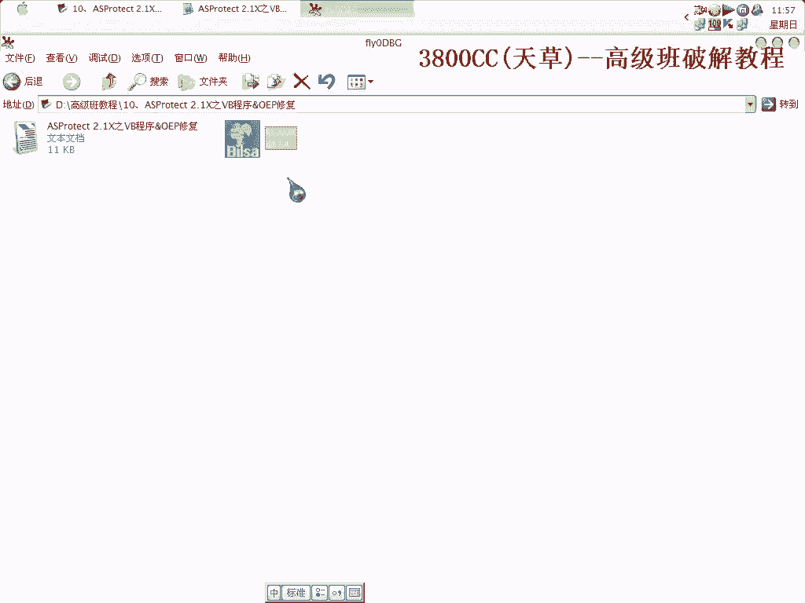
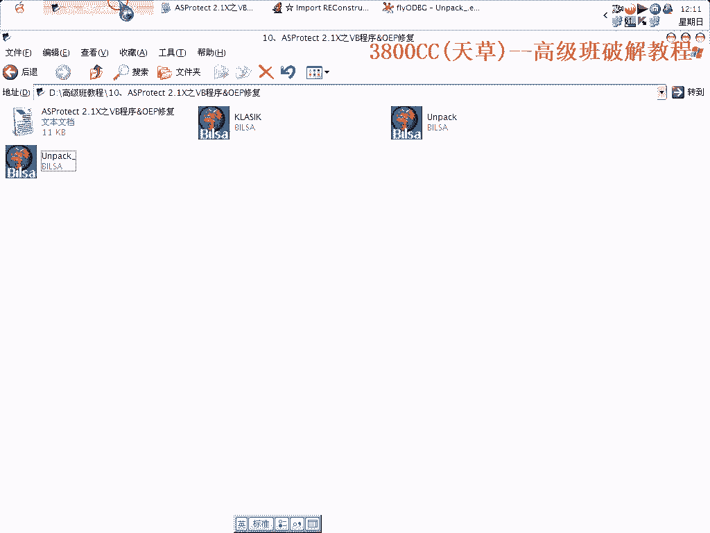

# 天草高级班 - P10：ASProtect 2.1X之VB程序脱壳与OEP修复 🛡️➡️🔓

在本节课中，我们将学习如何对使用ASProtect 2.1X加壳的VB程序进行脱壳，并修复其原始入口点。VB程序的脱壳过程相对简单，是学习此类技术的一个良好起点。




## 概述与准备


首先，我们需要准备好目标程序与工具。本次教程将使用一个已经预先分析过的VB程序作为示例。


建议使用英文界面的调试器，以符合普遍的操作习惯。


## 第一步：设置异常并定位关键代码

上一节我们介绍了准备工作，本节中我们来看看如何设置调试器以捕捉壳的执行流程。

在调试器的异常设置中，忽略除“内存访问异常”之外的所有其他异常选项。然后运行程序，程序会中断在异常处。

此时，我们需要在代码中寻找关键点。通过搜索十六进制值“85”，并在其附近设置断点，可以定位到壳对导入表进行处理的相关代码区域。

在该区域下好断点后，使用快捷键运行程序到此断点。

## 第二步：探查导入表加密情况

在找到处理导入表的关键位置后，我们需要探查导入表是否被加密。

使用调试器的跳转功能，来到程序的原始入口点地址附近（例如 `00401000`）。观察该区域的代码，如果导入表函数名称清晰可见，则说明导入表可能未被加密或已被部分解密。

通过单步执行并观察寄存器（如ESI）值的变化，可以判断在特定时刻导入表是否已完全呈现。对于VB程序，其加壳强度通常会对导入表处理有所简化。

## 第三步：定位最后一次异常并找到OEP

确认导入表状态后，我们继续执行程序，寻找壳的“最后一次异常”。这是脱壳过程中的一个关键里程碑。

将异常设置改回“内存访问异常”，然后运行程序。程序会多次中断，直到出现一个固定的地址值（例如 `FAA5`），这通常就是最后一次异常的位置。

在该地址处按`F7`键步入，即可进入壳的解码循环内部。继续执行，不久后就会到达程序的原始入口点。VB程序的OEP通常具有固定的特征，例如包含 `PUSH` 和 `CALL` 指令的特定模式。

## 第四步：修复被破坏的导入表

到达OEP后，我们常常发现导入表的地址被替换成了无意义的代码或跳转指令。这是因为壳使用了代码变形技术。

我们需要编写一段脚本或手动操作，将这些被篡改的导入表地址恢复为正确的函数地址。这涉及到：
1.  申请一块内存用于存放修复代码。
2.  计算并替换脚本中的关键地址值，包括IAT的起始地址、结束地址以及申请的内存地址。
3.  特别注意修复代码中的几种关键指令类型（如 `JMP` 类型的 `FF25`）。

以下是修复过程中可能用到的代码结构示例（地址为示意）：
```assembly
MOV EAX, [IAT_Start]
CMP EAX, [IAT_End]
JGE Finish
MOV DWORD [EAX], Correct_Function_Address
ADD EAX, 4
JMP Repair_Loop
Finish:
RET
```
执行修复脚本后，必须设置新的EIP到修复代码的起始处并运行，直到导入表修复完成。

## 第五步：使用工具修复最终文件

修复完内存中的导入表后，就可以将程序从内存中转储到文件了。

使用调试器的进程转储功能，将当前进程保存为一个新的可执行文件。然后，使用专门的导入表修复工具（如`ImpREC`）加载这个转储后的文件。

在修复工具中，填入我们之前找到的正确的OEP地址，并让工具自动获取修复后的导入表信息。最后，修复工具会生成一个可以独立运行的、已脱壳的程序。




运行脱壳后的程序，验证其功能是否正常。与原版加壳程序相比，脱壳版通常不再显示壳的启动画面。


## 总结


本节课中我们一起学习了针对ASProtect 2.1X加壳的VB程序的完整脱壳流程。关键步骤包括：通过异常定位壳代码、探查导入表状态、找到最后一次异常并抵达OEP、修复被变形处理的导入表，最后使用工具完成文件修复。掌握这个流程为分析其他语言编写的、或更强版本的加壳程序奠定了基础。