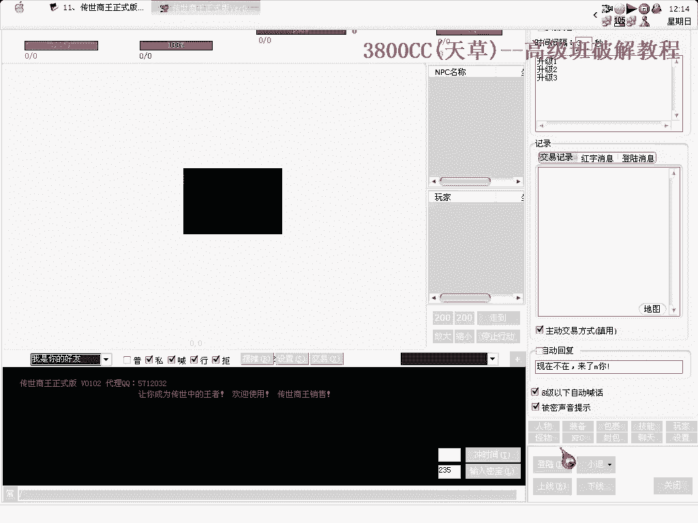
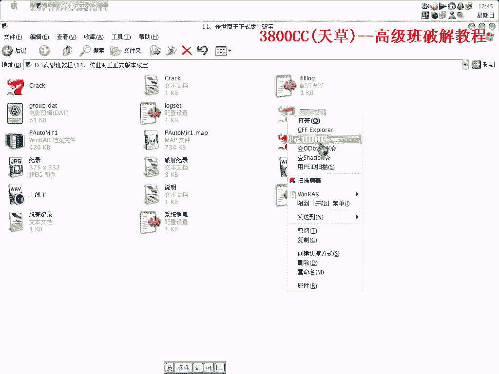
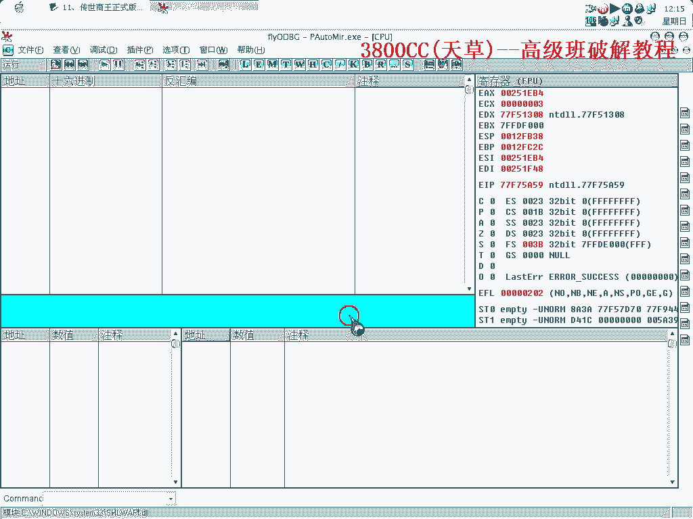
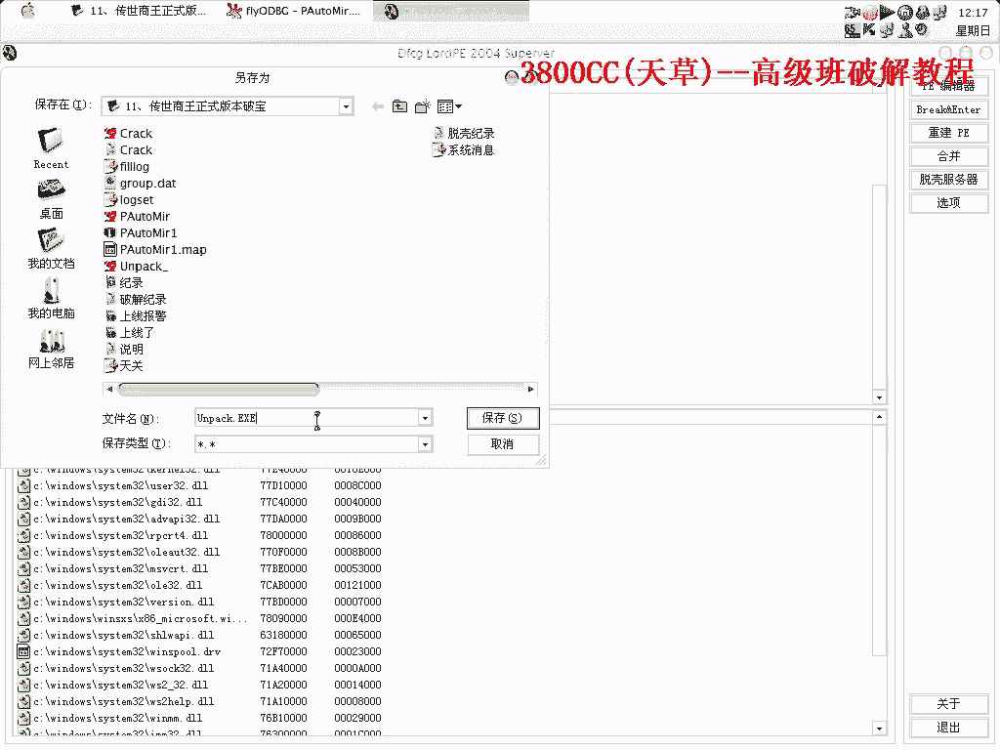
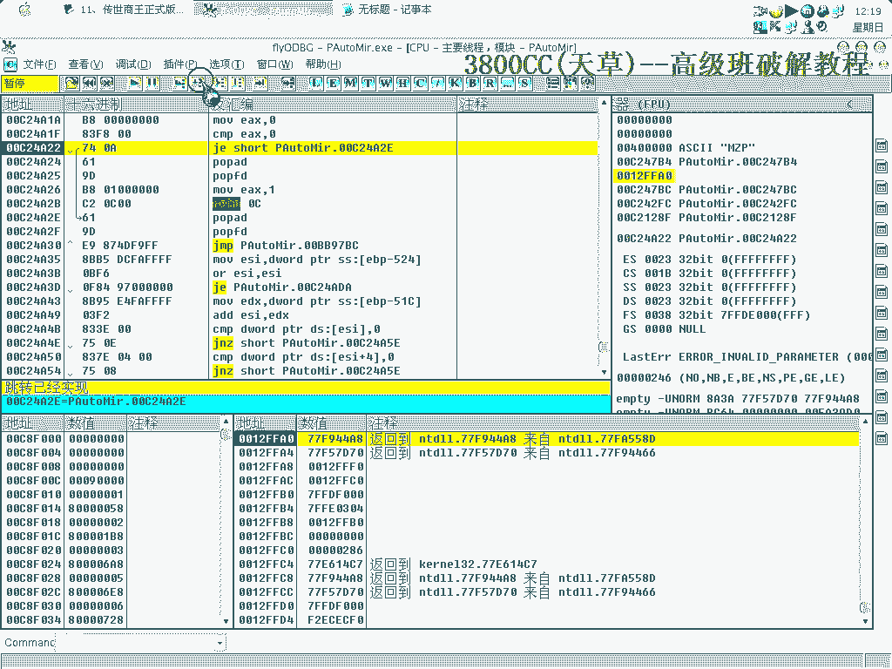
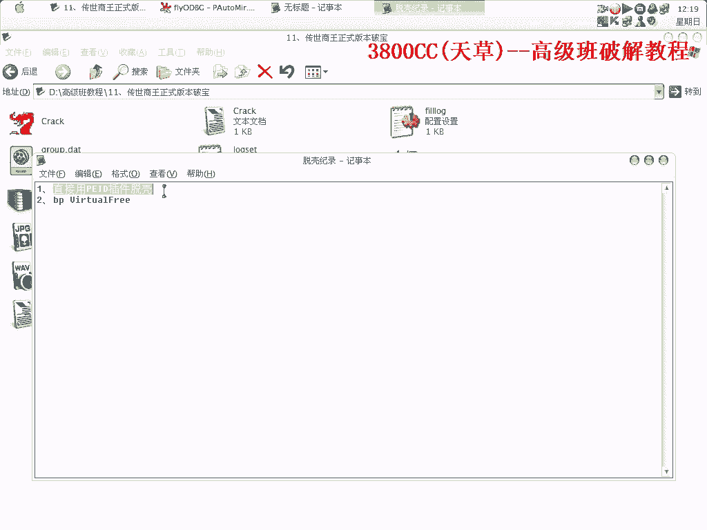
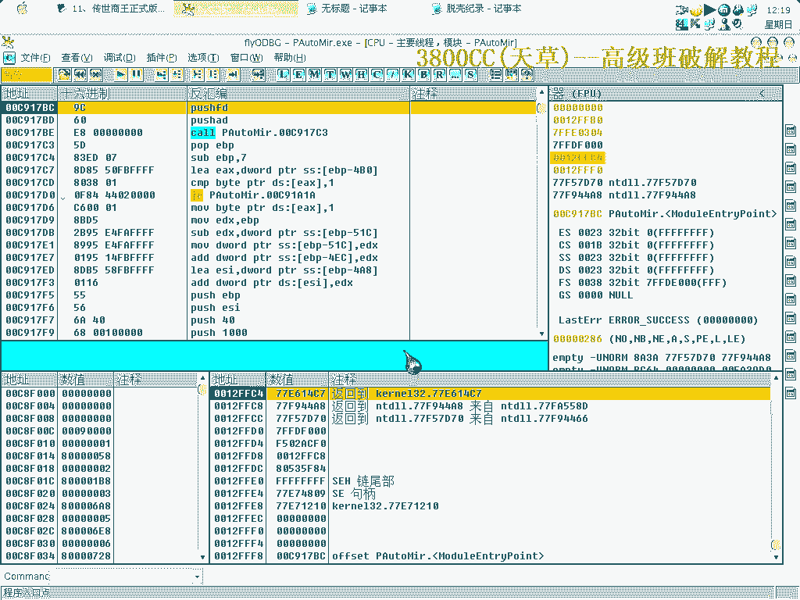
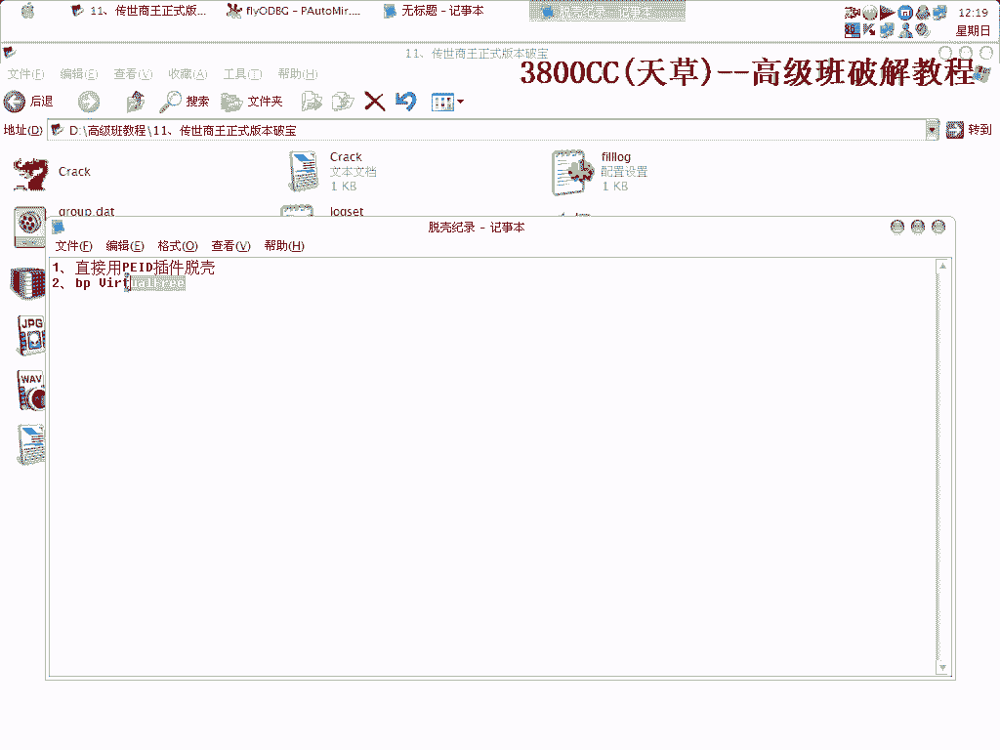
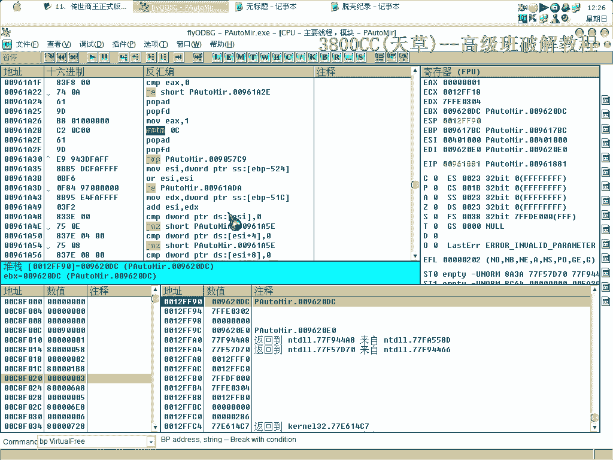

# 天草高级班 - P11：11、传世商王正式版本破宝 - 白嫖无双 - BV1qx411k7kJ

好大家好，这期课程呢，我们来破解这个传世伤亡，这是版，讨厌是一个最新的版本，最新的版本，原程序是这样的，最新的，112版本，这里呢破解了的。

这里登录，就直接登录进去，原程序不是这样的，原程序来看一下，这里有一个登录框。

同时呢它有脱壳了的，这个是脱壳了的，它原先是这么一个壳，这里呢这是一个变形的，3。4 3。5的一个变形的壳，机器好像有点卡，我们来，讲一下怎么样来脱。

怎么样来脱，同时也讲脱壳的一些思路吧。

这里啊，大家可能就想到用，ESP定律，ESP定律，FFA0，这里又有一层，也是FFA0，上面去F95，这里又有了，还有，其实这个是，它在循环解码，循环解码，F9，继续走，它这个地址都在变啊，在循环解码。

先看一下，ODP的一个设置，就设置成这样的，这个算是北等，解码机器好卡，ODP里面反应也非常慢，这就是ODP了，怎么来脱壳，因为你要是没有发现，它这个是循环解码的话，可能你还不会脱呢，哎。

什么都有小，这另外我们来看一下，关于脱壳的，关于脱壳，这里呢我们，F9，到了第二层之后，我们换用F8走啊，反应也慢，也删掉啊，弹幕走，删掉，删掉，删掉，删掉，删掉啊，弹幕走，这里用F7，啊。

这里也有一个这个，这里，像刚才那样，每次循环的话，但是它还是会经过，还是会经过同样的，这么一个内存地址，所以我们把那个API给记住，记住有用。

这里有点循环，有点循环，那怎么脱壳进入呢，我这里有，第一种方法。

直接用PID插件脱，这个壳还算是比较麻烦的一个壳，它循环了N多次，就是说你要是对壳不了解的话，你还不知道它是在那里循环呢。

但是它万万没想到，可以用PID插件，直接脱壳啊，我们可以下这个断电。

因为这个，这个的很新，算了，算了，算了，没事吧，应该开始了，应该开始了，诶 差这个地方，OK 返回看一下，哦，哦，估计我们返回的时候返回过了，过了，已经过了，已经过了 重新来过吧，返回过了。

这个时候我们返回看一下，下面来，下面来，下面来，就是这里了，这个地址还是这样，还是这样，它这里还没有解码完，还没有解码，开始卡 好卡哦，还没有解码完，大家看到了 它这个地址还是这样跑，到这里。

我们继续F9一下，再返回，再来看一下，这个地址还是不行啊，再次返回，还是这个地址不行，还是这个地址不行，这里就应该对了，返回了吃素啊，返回了吃素啊，再F9看一下，装弹下来了。

这个至于返回多少次我倒是没有做好记录，返回多少次没有做好记录，但下这个断点是绝对可以到的，但下这个断点是绝对可以到的，重新来，我忘记好，中断一次就返回一次，看一下，不行的啊，这里是不行的。

我们在这个地方呢，可以在这个地方下好断点，这是第二次，第二次啊，这是第三次，第二次，这是第三次，第四次，第五次，这个地址不行啊，第六次，这个地址还是没有解码完，第七次，这没有解码完第八次。

这里更没有解码完，第九次，还没解码完，第十次，没有解码啊，没有解码完，第十一次，第十一次，十二次，没有解码，第十三次，还没有，十四次，还没有，第十五次，这里开始它这个地址开始慢慢解，慢慢解，十六次。

十七次，还没有啊，第十八次，还没有啊，第十八次，还没有啊。

第十八次，[音乐]。