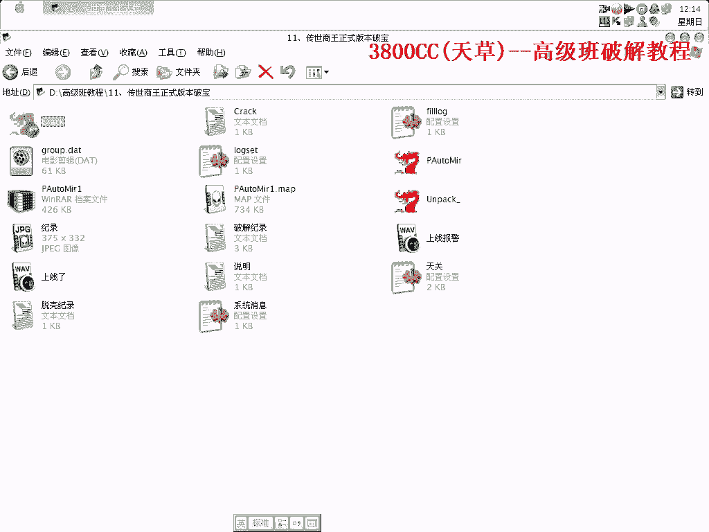
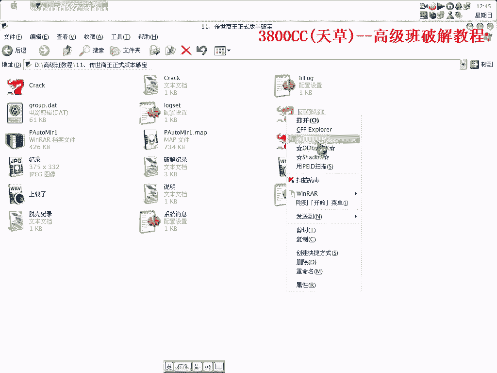
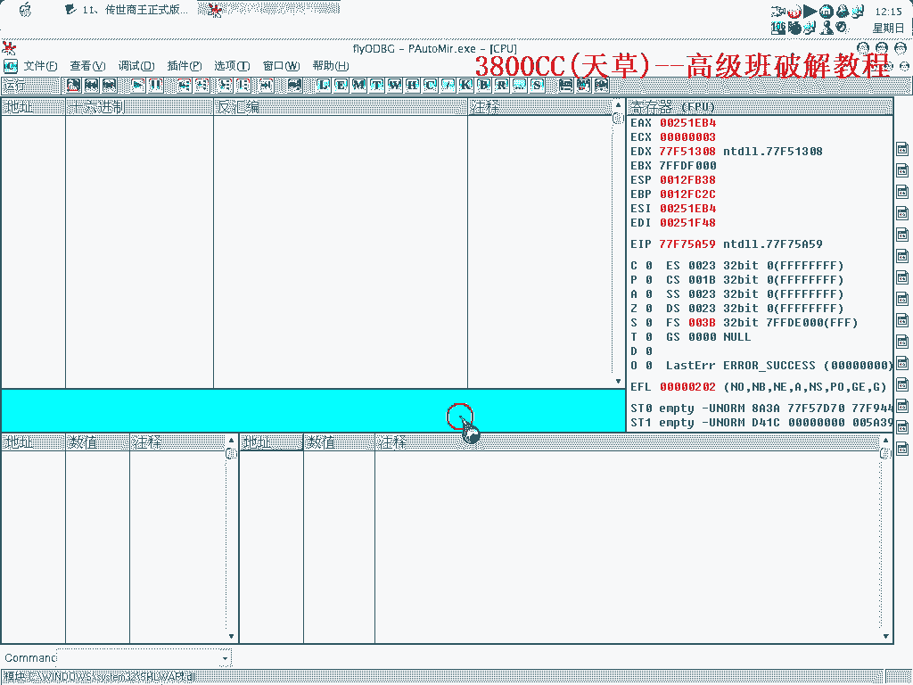
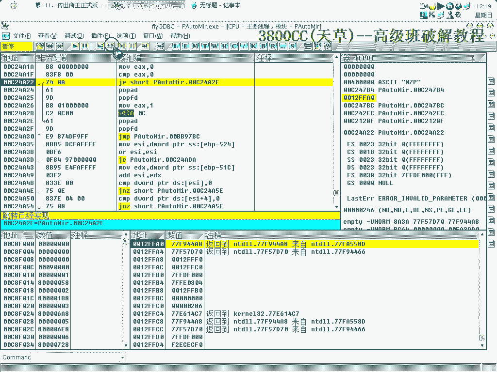
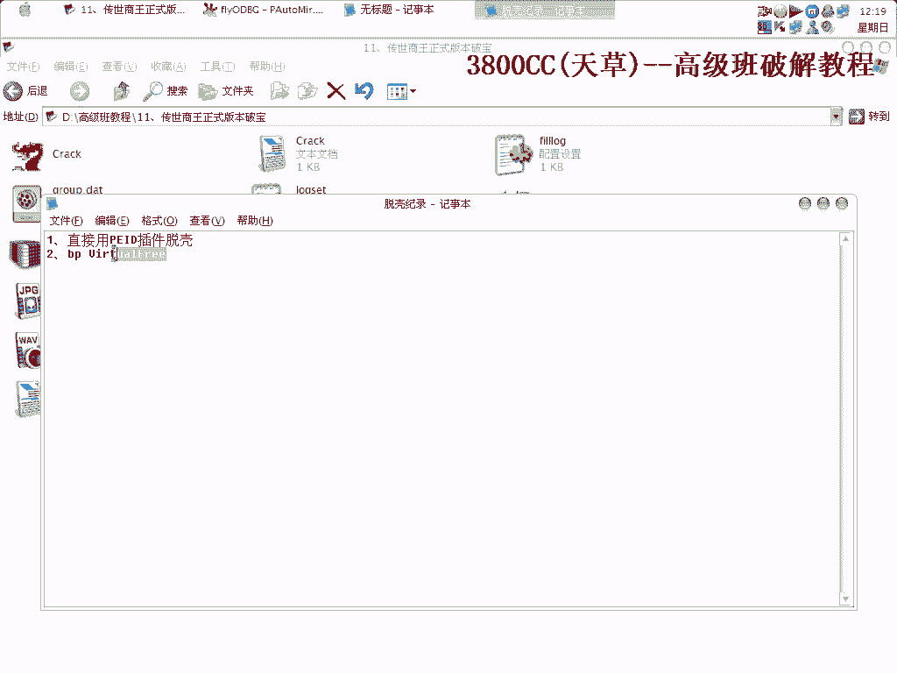
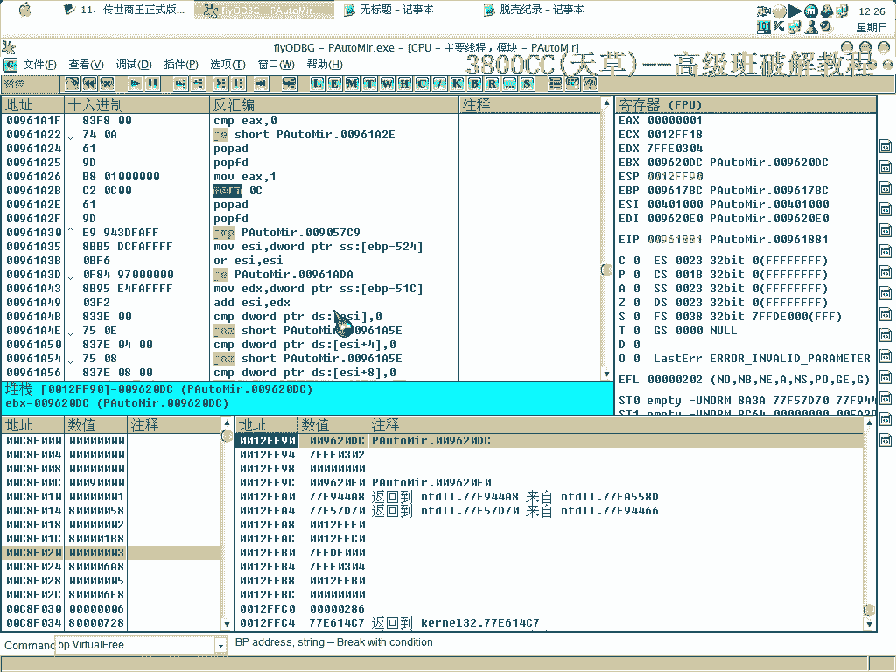

# 天草高级班 - P11：传世商王正式版本破宝 - 白嫖无双 🛡️💎

在本节课中，我们将学习如何破解“传世商王”游戏的最新正式版本。我们将从分析原程序的保护机制开始，逐步讲解脱壳的思路与具体操作方法，最终实现无需登录即可进入游戏的目标。

---

## 课程概述 📋

原版程序存在一个登录验证界面，用户需要输入账号密码才能进入。我们的目标是绕过这个验证，实现直接登录。程序本身带有壳保护，这增加了分析的难度。本节课将重点讲解如何识别并脱去这个复杂的壳。

上图展示了破解后的程序界面，可以直接登录。而原程序则存在一个登录框。

---

## 脱壳思路分析 🧠

程序原先带有一个变形的壳，版本号约为3.4到3.5。这个壳的特点在于它会进行循环解码，这意味着代码在运行时会被多次解密，给静态分析带来了很大困难。

在动态调试时，如果使用常规的ESP定律等方法，会发现程序会多次执行类似 `FFA0`、`F95` 这样的指令，地址也在不断变化。这正是循环解码的表现。

---

## 动态调试与脱壳实战 ⚙️

首先，我们需要配置好调试器（这里以OD为例）。由于壳的复杂性，调试过程中反应可能会比较慢。

在调试时，如果发现程序在循环解码，单纯使用F9（运行）可能无法直接到达程序的原始入口点（OEP）。这时，我们需要结合F8（单步跳过）和F7（单步进入）来跟踪程序的执行流程。

虽然每次循环的地址在变，但程序总会经过某些特定的内存地址或API调用。记住这些关键点对脱壳有帮助。

---

### 方法一：使用插件辅助脱壳

对于这种循环多次的复杂壳，手动跟踪非常耗时。一个更高效的方法是使用专门的脱壳插件。

以下是使用PID插件进行脱壳的关键步骤：

1.  在调试器中加载目标程序。
2.  在插件菜单中选择PID脱壳工具。
3.  在关键的内存地址上下断点。这个地址通常是壳完成解码、准备跳转到原始程序代码的位置。
4.  运行程序，当断点触发时，使用插件的“脱壳”功能。

这个壳的循环解码次数很多，如果对壳的原理不了解，很难判断解码何时结束。但使用插件可以自动化这个过程。

---

### 断点设置与跟踪

在实际操作中，找到正确的断点位置可能需要多次尝试。我们需要在一个稳定的、解码完成后必然经过的地址下断点。

有时可能会因为返回（操作）过头而错过正确时机，这时需要重新开始。关键在于观察：当程序运行到断点处时，相关内存区域的数据是否已经解码完成（例如，是否变成了可读的汇编代码）。

通过反复运行（F9）和返回查看，我们可以验证断点是否有效。这个过程可能需要十几次甚至更多次的循环。

---

## 课程总结 🎯

本节课我们一起学习了针对“传世商王”游戏复杂壳的破解方法。

我们首先分析了该壳**循环解码**的特性，然后探讨了手动跟踪与使用**PID插件**辅助脱壳两种思路。核心在于通过动态调试，在壳完成解码工作的关键时刻下断点，并抓取完整的程序代码。

通过本课的学习，你应该掌握了对类似多层循环壳的基本分析方法和脱壳流程。记住，耐心观察和利用工具是破解过程中的关键。