# 天草高级班 - P12：12、手脱ASPr 2.X-1 - 白嫖无双 - BV1qx411k7kJ

大家好，这节课呢，我给大家讲首托这个SplitTag2。x的，这么一个壳，这个壳好像应该是一个Derpy程序，首托，我在这个地方，这个地方借助这么一个脚本，这么一个脚本来帮我们来处理IT和这个代码编辑。

后面的其他的几个部分，都需要我们来自己来手动了，非常非常麻烦，这是我拖了的，先是我用LangSync放的，大家可以看到，我这个里面，补了，32个区段，补得好累啊，真的好累啊，我快累死了，删掉，这里呢。

记录，我这做了一个，做了一些记录啊，就是说我完完全全的手动，没有借助脚本的一些小记录啊。

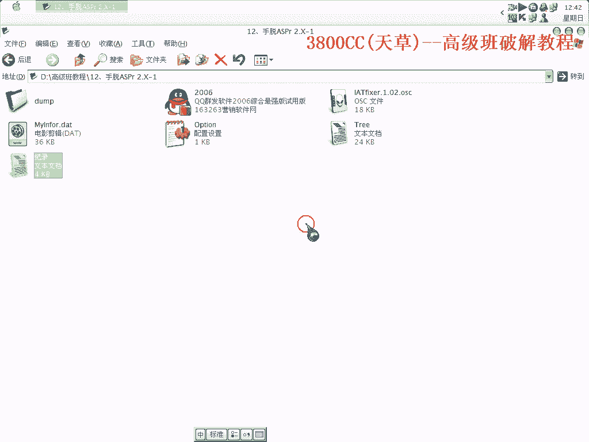

要是完完全全自己手动真的好累。

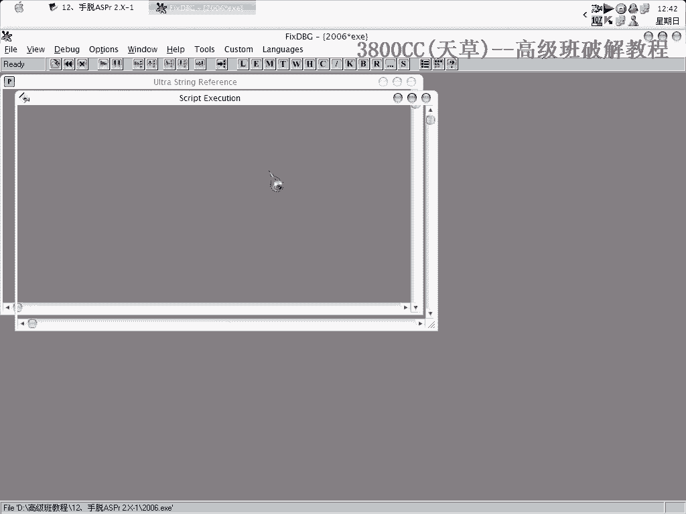

嗯，我得，咋进不进来啊，再用它吧，好，忽略所有异常吧，然后呢，直接就运行，用这个脚本工具，用这么一个脚本工具，插件这个插件，我会最后拷给大家，大家打包自己放到Odm，我会把插件的插件，我会最后拷给大家。

大家打包自己放到Odm，目录下面去，那个插件目录里面，处理完了处理完了，看一下logo里面，这个时候我们就可以来当盘了，大家不要太高兴了啊，后面还有更烦的，好，PID不要关，PID不要关了。

我们现在再看另外一个，忽略热存访问和指定，狂按F9，输入加F9，到最后一次异常，我会把这个软件，适用期过滤100次，变态，没办法了，我们得找到啊，这个是我在之前找到了一个。

找到了一个StunCounter的一个，起始位置，起始位置，就这么一个地址，我们现在先来修复它，现在修复，首先呢填1000，就填1000，获取IIT，获取IIT，计算一下，计算一下，把这个OEP换过来。

换成我们StunCounter的OEP，换成我们StunCounter的OEP，现在就需要我们的补区段了，补区段，这一个，刷新一下，选择这么一个进程，右键，区域托克，从147开始，这个开始，再打开一个。

这个是用来补的，那个是用来拖的，打开这一个文件，点区段，OK，我们拖，我们来拖一个，拖一个来，这个来就来补一个，免得出现错误，把这个地址记着，147开始的，然后它呢，这里右键，磁盘载入，记得要改。

编辑一下，00，用147来减去机子，把这个改成107，好，接着，来拖，14C的，这个呢，错了，按错了，按错了，磁盘载入，14C，大小，10C，我们补完之后，然后就放到，其他目录里面去，免得因为我们。

到时候当破的太多了，我们当破，就是当破有R或者RW的，其他都当破不了的，从147开始，这是1F4的，好，补，补完就扔进去，大家可能会问，补到多少呢，补到够为止，最起码的，因为我们石头控的位置。

不是161，最起码我们要补到161去，但是按常规而言的话，要补到161下面去，10，13，这个开始补，我们在前面的那个，SVKPA的那个，高级的那个，那节课里面，讲的也是不续段，但是，没有这个这么麻烦。

这个补N多，前区那个就是1111了，好，154，编辑一下，要，这个可要看清楚，不错一个就全攻进去，那得说，一补两次就要当破60多次了，两个两个NP一来操作的话，那就是100多次了，100多次，重复操作。

你要是再不烦的话，那我真的太服了，这个拖一个拖一个补，1，一起，好，好，好，好，好，好，好，111，那就是F了，是吧，没搞错吧，要C要E，要F，要F，08，大家这个名称随便你定啊，随便你定。

我这个排序排序的好，就用，数字不然我下面排啊，09，那这个呢，那就是12，1200了，减去四几减去4000，那就120，这个是11，121，嗯，10，121，眼睛可以亮一点，122，123，到1。

122，123，123，你们在看动看这个录像的时候，可能看的有点困了啊，但是我现在是给精神摆位，不然的话就，先攻进去了，因为现在来回，现在恢复这个，Sprotek这个壳的，这个。

Stonecone完美的方法的话，现在还没有，还没有完美的方法，只要通过这种方法来，我，25，6，嗯，哦，啊，嗯，嗯，127，好，那这个就是128，17，17，128，129，18，129，12A，嗯。

嗯，牙皮，嗯，121，123，嗯，啊，啊，啊，124，121，这里开始补到补到了我们那个Stonecone的OEP的一个位置，这，3，121，继续往下面补两个，看一下行不行啊，F，嗯，啊，好累死了。

24，然后F，再补一个，看一下行不行啊，因为补哪补哪些区段啊就知道但是要补多少区段，还没有一个明确的方法可以找得到，就是说从这个你这个这个位置开始啊，这个位置开始，从这个位置开始补就可以了。

我们来看一下，设置一下，只是验证PE而已啊，然后，把这个呢拷贝一下啊，免得待会儿验证错误了啊，验证坏掉了，这个大家也就是说在操作的时候一定要清楚了啊，有些东西还是要非常小心的，就是像这么庞大的工程啊。

好这里有个161啊，好我们可以了，没有其他的一个错误，就是说他提示错误如果在我们补的区段之内的话，就没有多大问题了啊，啊，161晕了，哎呀他过期了过期了，我现在，这个是他控的这个oep不对，oep不对。

不对，因为他这个过期了，删掉，这些客人怎么办呢，现在过期了，看下能不能想办法把这个，这嘟嘟的去掉，去掉，没办法，没办法，选这个oep不对了，oep，我们看一下，看一下原先的那个oep。

我们换用他这个oep吧，因为现在没办法了，现在没办法就是说，他现在过期了，我们没办法看得到看得到他这个oep了，看一下，175，我们先看一下oep的位置。

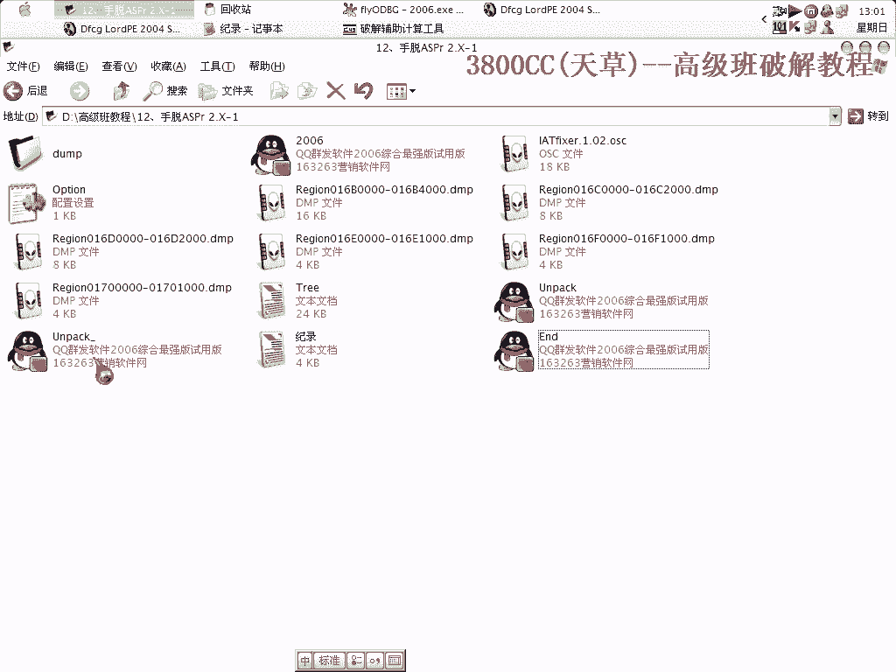

对不对，对了。

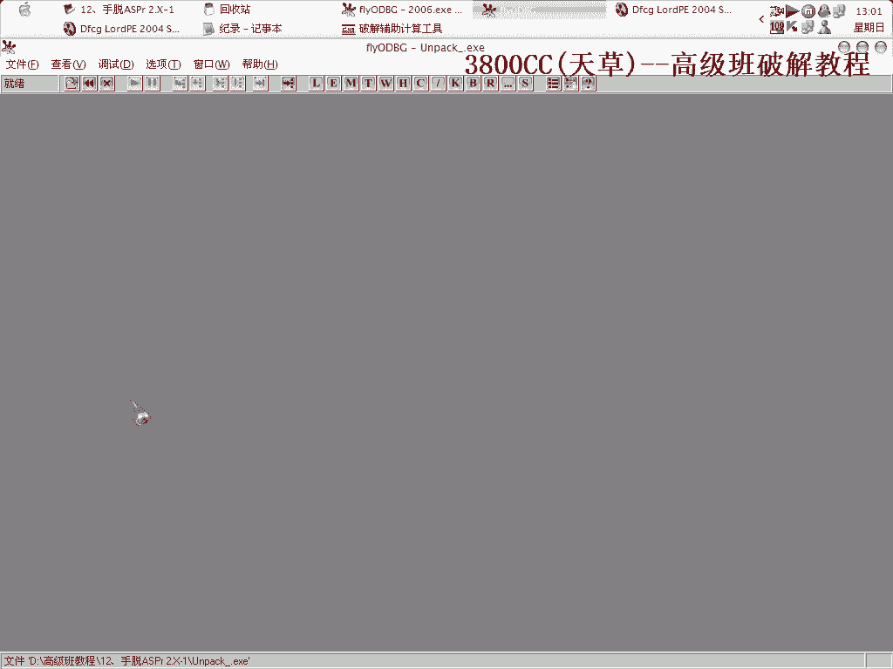

对了，终于对了，oep应该是这个，他提示175错误啊，175错误也就是说我们这个175还是要还继续还继续，还继续，继续当吧，这个继续，171，嗯，嗯，嗯，嗯，嗯，嗯，嗯，172，把这些都移进去。

等一下我再找另外一个程序告诉大家怎么找他的那个Stone Cold的oep，没想到这么快就过期了，这个不太好意思，28，3，嗯，嗯，嗯，好，要求不太要求为了保险，我们再往下面补一个。

我看这个看他这个内存景象啊，我们是从141417开始补的，从这一段开始补的，这里到了这里，因为这些都是属于这个成可的啊，这个可的一些地址，这下面属于一些基地，其他这个系统组件的地址。

176补的176就OK了，31，3，好，电报存记得点保存重建一下吧，要是其他这提示有错误啊，好，嗯，因为后面还需要处理其他的，好，我们弹幕走，好，进去啊，因为我们现在把他的一个OEP给换掉了。

OEP给换掉了，用的是补区段的一个OEP，所以他就是会对他进行检测啊，这也弹幕走，这里靠近去啊，就是这里了啊，大家记清楚这些位置特征是一样的，特征是一样的，就是把，这三行，换成这种，特征是一样的，好。

这些退出啊。

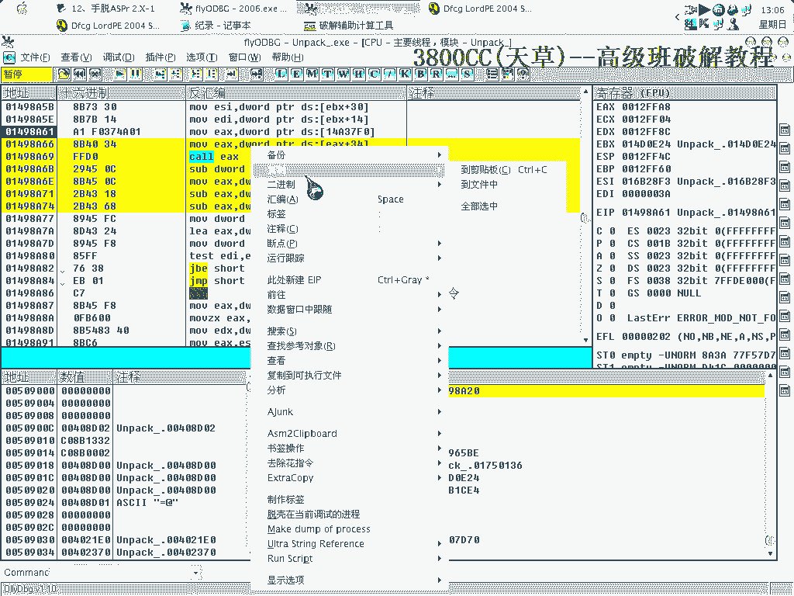

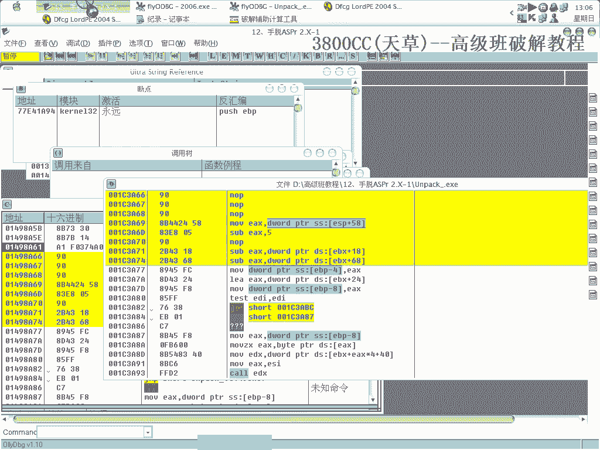

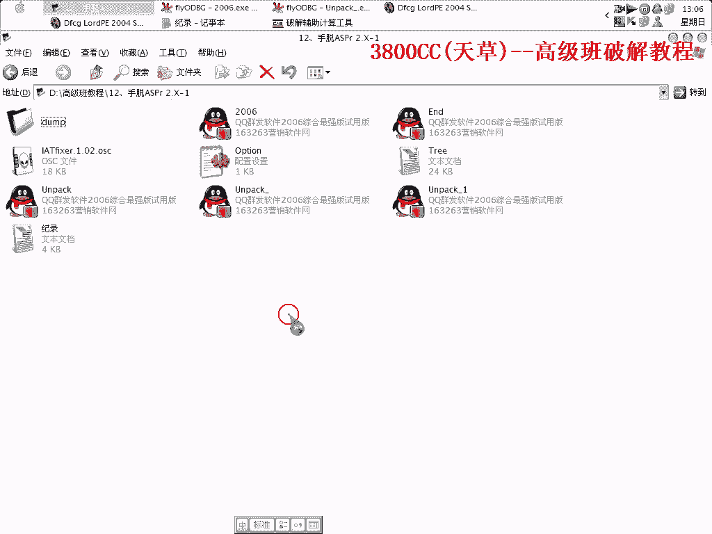

这个有支交业啊，同样有支交业，刚才这一步啊。

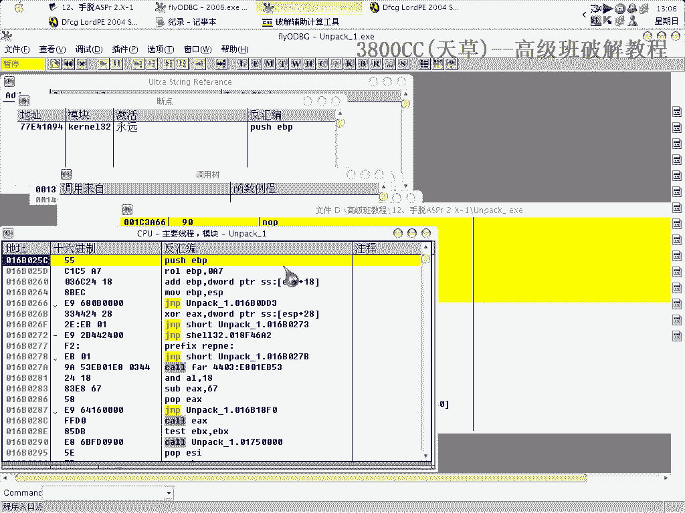

刚才处理这一步叫做，这个，嗯，load the chunk，load the chunk，好，这一步啊，在这一步，退出啊，这里退出，好，这一步啊，在这一步，退出啊，这里退出，好，这一步啊，在这一步。

退出啊，这里退出，好，这一步啊，在这一步，退出啊，这里退出，好，这里退出，刚才这个我们把它改成跳，看一下，或者说我们在这个地方消耗断电，等一下重新，重新来运行看一下，重新来运行看一下，还是退出。

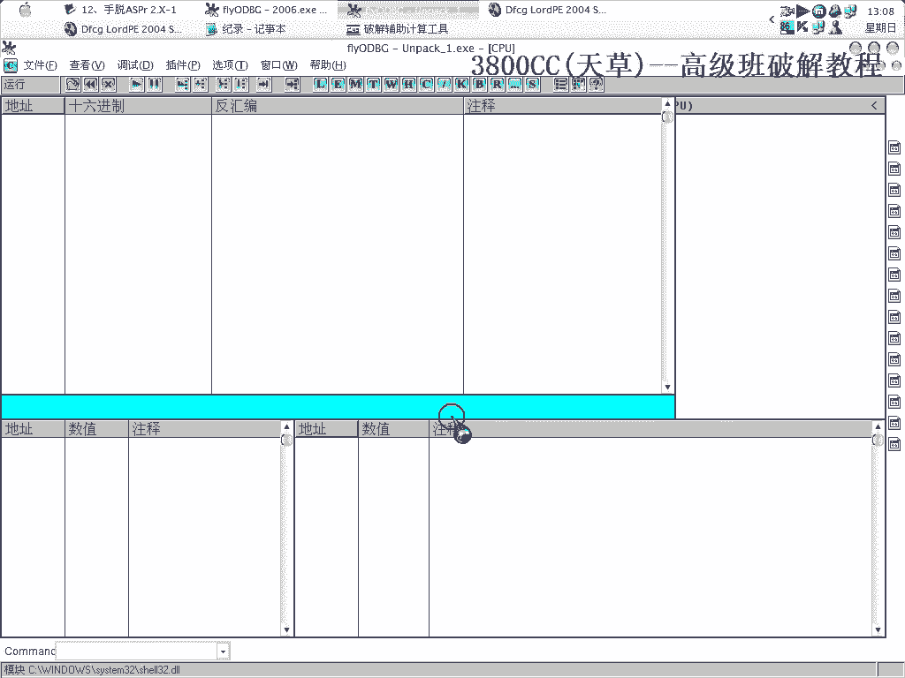

这里啊。

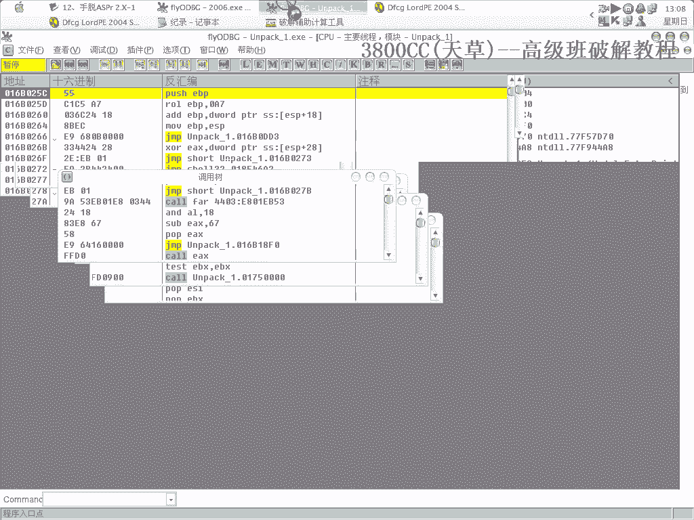

我们在这个地方，这个时候程序出来了啊，可以，就是改这个地方。

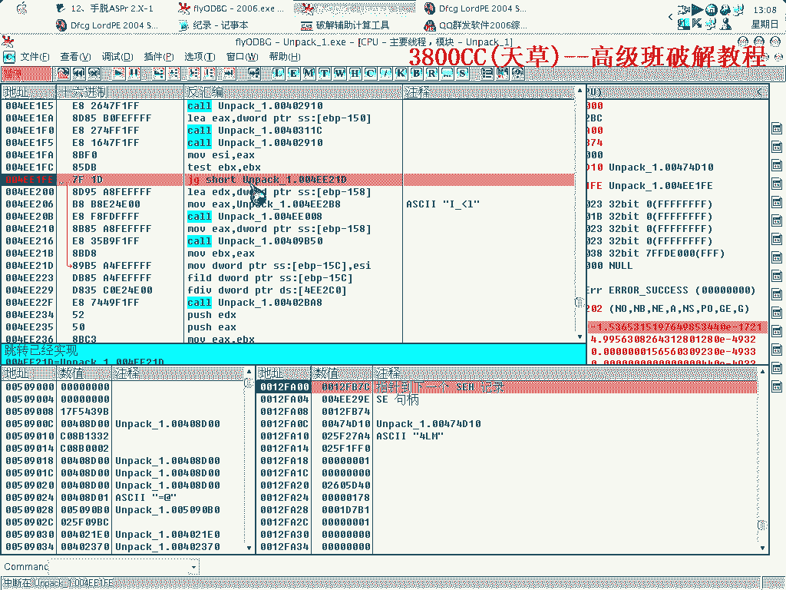

跳过去就可以了啊，但家科程序因为它有那个试用，它有那个试用，试用期到了，现在家科程序运行不了，好。

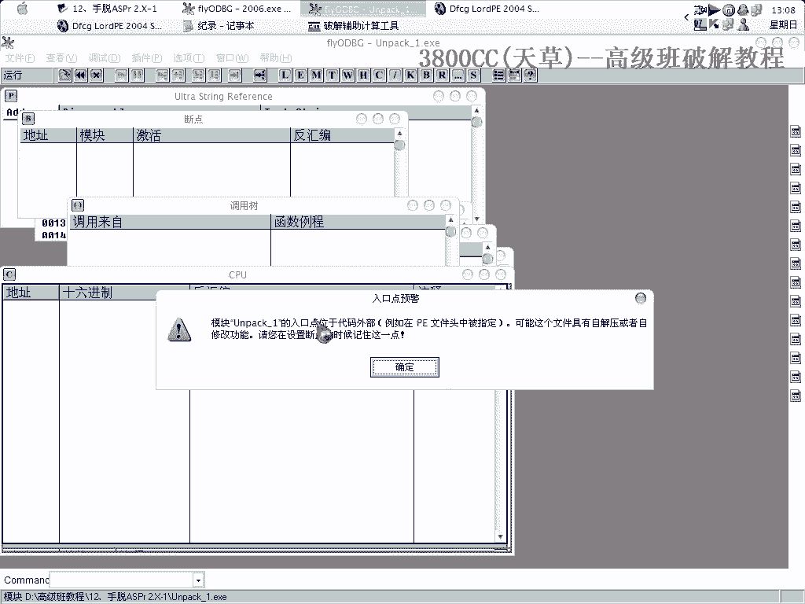

这个是没有用的，破解破解不了，是一个down版的啊，可以试一下就是了，不管怎么他提示这么有鬼错误，一个蛋板的，那刚才我们经历了啊，经历了，这么几个步骤，这么几个步骤，挺累的，第一步啊，接着第二步。

第二步接着第二步，不去断，第三步，不复而然靠的，第四步，去校验，刚才在，不靠，不这个去断的时候啊，这个是同靠的，是同靠的，怎么样找啊，这个我在，其实这个我在前面一节那个VB程序的一节课里没有介绍吧。

这就是因为他这个过期了啊，过期了，没有办法了，没有办法，那我再重新找一个小程序，找个小程序来演示一下吧，要处理的，这个是已经做好可了，已经做好可了，这个呢，我就来演示一下怎么样来找那个。

是能靠的一个起始地址，忽略啊。

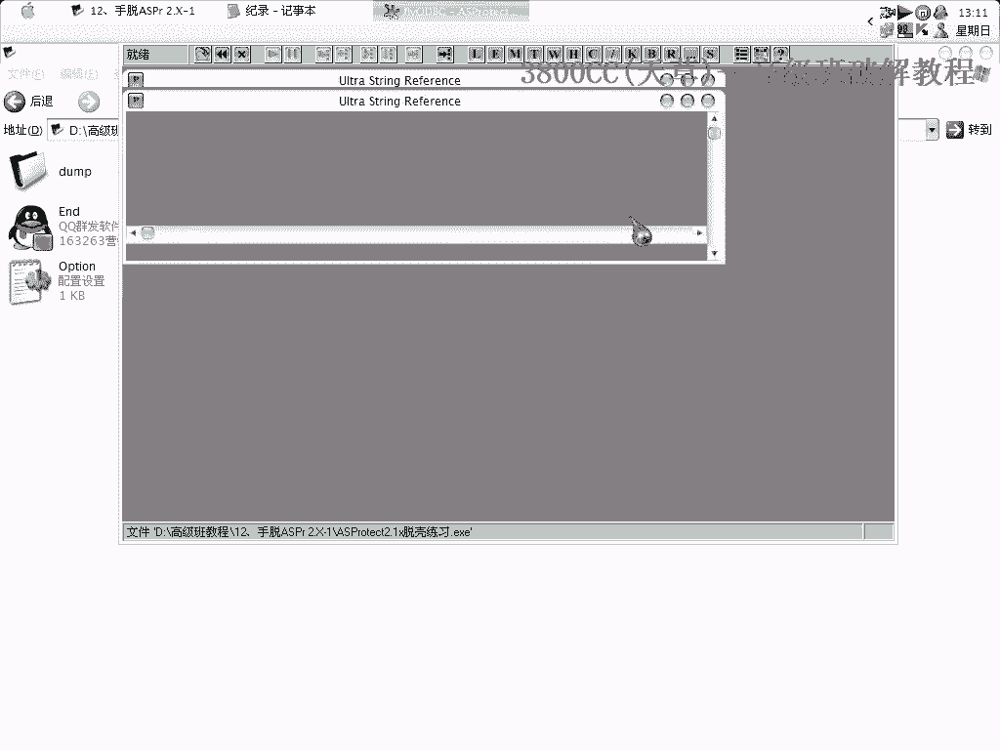

除了内存访问之外的和那个指定。

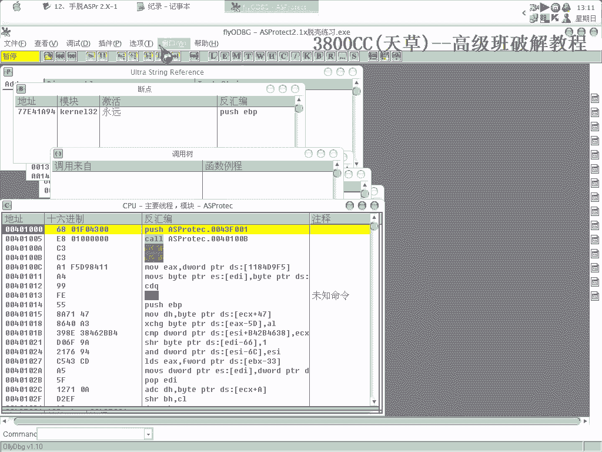

异常啊，其他都不忽略，都忽略掉了，到最后一次以上，这是最后一次以上了，F7，加F9，这里，这里就是这个地址，就是这个程序的，就这个程序的StormCoder。

关于这个程序的StormCoder也是这样找啊，就从找到159这么一个地址，我们刚才这个程序的这个地址呢，是这么一个地址吗，16啊，16B025C，好像每个OD来载入它，这个地址都不都不一样。

因为它是一个动态的，动态的，动态的，好了，今天这期课程就到这，就到这，非常非常麻烦啊，看到了啊，四个步骤，四个步骤，而且前面两个步骤呢，是最烦的，最烦的，但是这个第一个步骤，我们是使用脚本的啊。

使用脚本，还算是减轻了一点负担，然后后面的这个StormCoder，这个补去弹呢，这个是补得累死，补得累死，好，那这期课就到这，再见，由 Amara。org 社群提供的字幕。

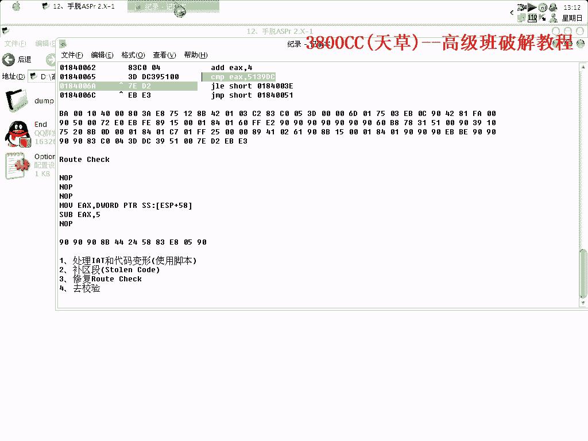