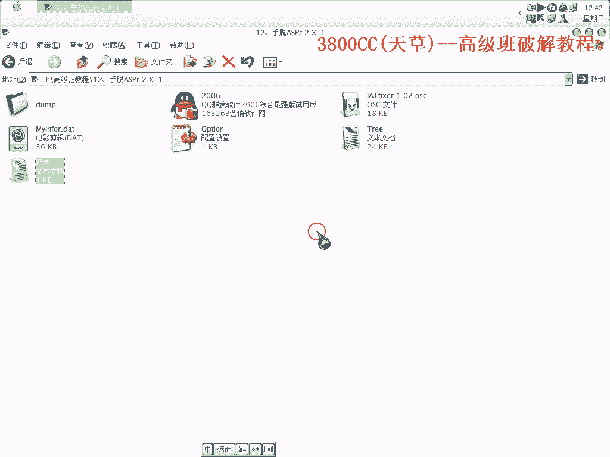
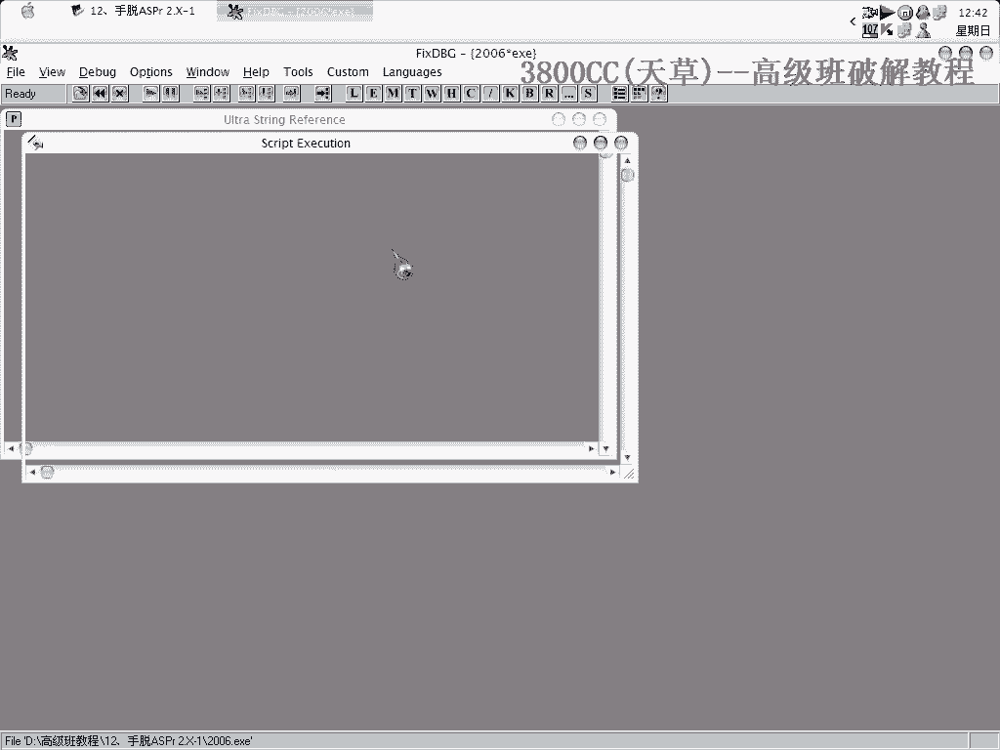
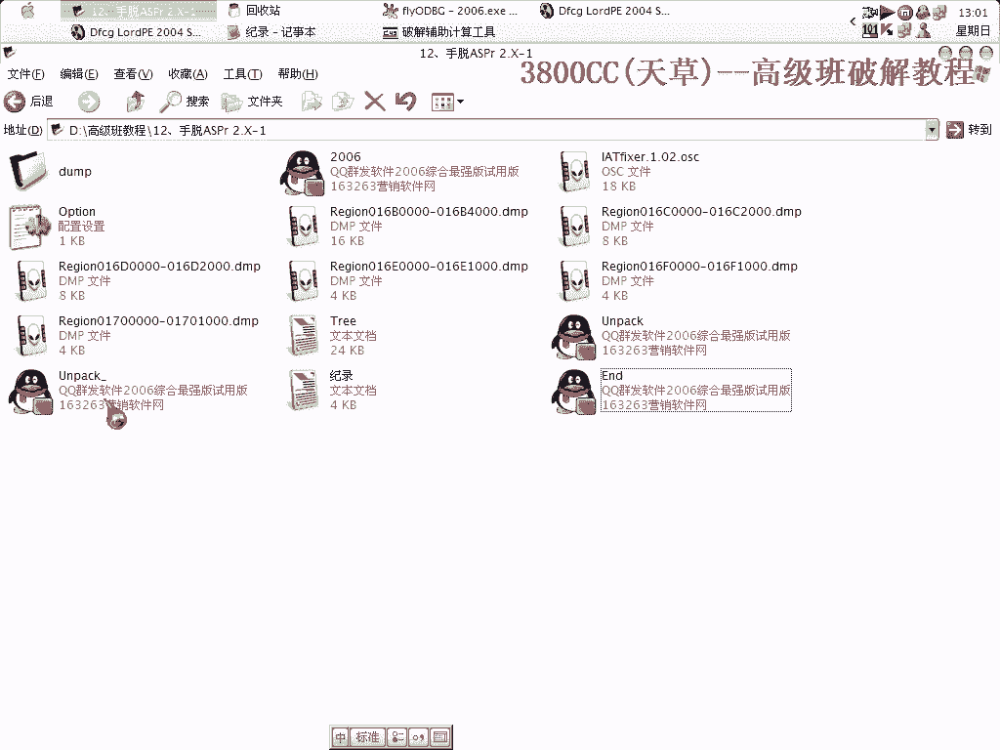
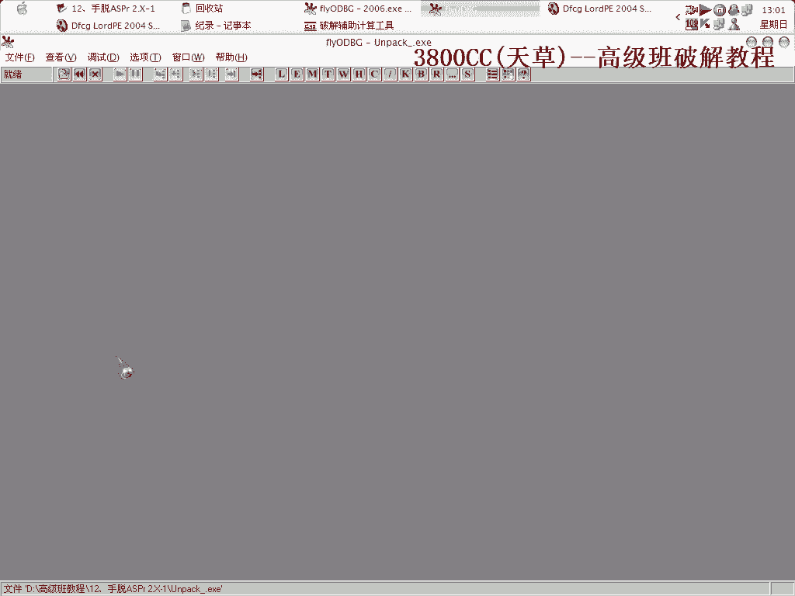
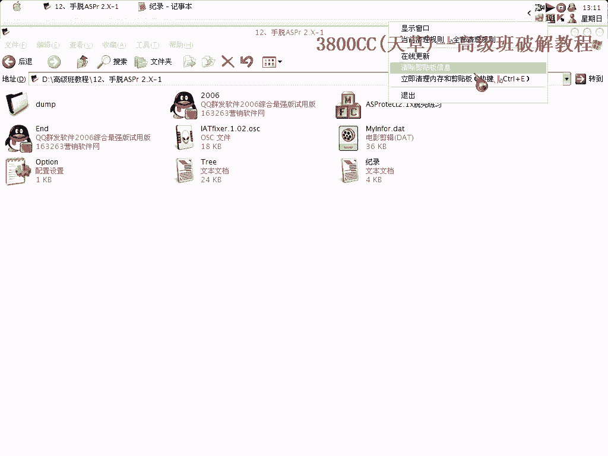
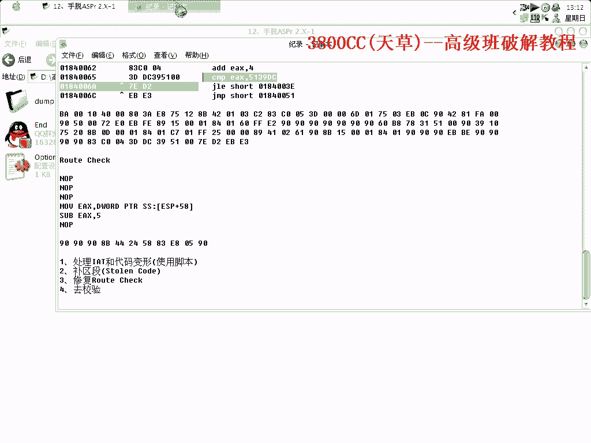

# 天草高级班 - P12：手脱ASPr 2.X-1 🛡️➡️📦

在本节课中，我们将学习手动脱去ASProtect 2.X壳的完整流程。这个过程涉及使用脚本辅助、手动修复导入表、大量补区段以及处理程序校验。虽然步骤繁琐，但我们将一步步拆解，力求清晰明了。

---

## 概述与准备工作

首先，我们需要明确目标：手动脱掉一个被ASProtect 2.X加壳的程序。为了减轻部分工作量，我们会借助一个脚本来处理初始的导入表（IAT）和代码修复。

准备工作如下：
*   使用OD（OllyDbg）载入目标程序。
*   准备好辅助脱壳的脚本插件，并将其放入OD的插件目录。
*   在OD中设置忽略所有异常，以便顺利运行。

---

## 第一步：使用脚本辅助处理

上一节我们介绍了准备工作，本节中我们来看看如何使用脚本进行初步脱壳。

运行脚本工具后，程序会进行初步的修复。此时不要关闭进程（PID），因为后续步骤还需要用到它。

以下是关键操作点：
*   在OD中运行脚本插件。
*   处理完成后，在日志中查看结果。
*   保持程序进程处于运行状态。

---

## 第二步：定位并修复Stolen Code

初步处理后，我们面临更复杂的步骤：定位并修复被壳偷走的代码（Stolen Code）。

我们需要找到`StolenCode`的起始地址。方法是忽略除内存访问和指定异常外的所有异常，然后反复按`Shift+F9`，直到程序跑飞前的最后一次异常。记录下此时的地址，这就是`StolenCode`的OEP（原始入口点）。

找到地址后，开始修复：
1.  在脱壳工具中填入`1000`（大小）。
2.  点击“获取IAT”。
3.  计算IAT，并将OEP替换为我们找到的`StolenCode`的OEP。

---

## 第三步：手动补区段 🧩

修复入口点后，最繁琐的部分来了：手动补充大量被壳混淆或移除的区段。

我们需要打开两个OD实例：一个用于脱壳的主程序，另一个用于提供区段数据。从特定的内存地址（例如`0x0147`开始）逐个补入区段。

以下是补区段的核心步骤：
1.  在提供区段的OD中，右键选择“区域脱壳”，从起始地址（如`0x0147`）开始。
2.  在脱壳OD中，点击“区段”，右键选择“磁盘载入”。
3.  关键：编辑载入的区段，将其起始地址（RVA）减去基址（例如`0x4000`）得到正确的值。
4.  将补好的区段保存到新文件，避免混乱。
5.  重复此过程，一直补到超过我们找到的`StolenCode`的OEP地址（例如`0x0161`）之后。通常需要补充十几个甚至更多区段。

**注意**：补区段是个重复性很高的体力活，必须仔细核对每一个地址，一旦出错可能导致前功尽弃。

---

## 第四步：处理程序校验与修复

补完区段后，程序可能仍有校验保护，导致无法运行或弹出错误。

我们需要对修复后的程序进行验证。使用PE工具检查是否有无效的区段。如果错误出现在我们补充的区段范围内，通常问题不大。

有时，程序会因为试用期过期或OEP不正确而无法运行。此时，需要重新核对或寻找正确的OEP。可以通过在内存镜像中查看代码段来确认。

找到正确的OEP后，在脱壳工具中替换它。程序运行后，可能会在特定代码处退出，这是壳的退出校验。特征通常是将连续的三行代码改为跳转指令（`JMP`）。找到这个位置，修改代码使其跳过退出流程。

---

## 总结与回顾

本节课中，我们一起学习了手动脱ASProtect 2.X壳的四个核心步骤：

1.  **脚本辅助**：利用脚本处理初步的IAT和代码修复，减轻负担。
2.  **定位修复**：找到被偷走的代码（Stolen Code）的起始地址，并修复OEP。
3.  **补全区段**：手动、大量地补充被壳处理过的区段，这是最耗时的一步。
4.  **处理校验**：修复程序自身的校验机制，确保脱壳后的程序能正常运行。

整个过程非常繁琐，尤其是手动补区段，需要极大的耐心和细心。目前对于此壳的脱壳还没有完美的自动化方法，这种手动结合脚本的方式是较为可行的方案。希望本教程能帮助你理解其中的原理和操作流程。