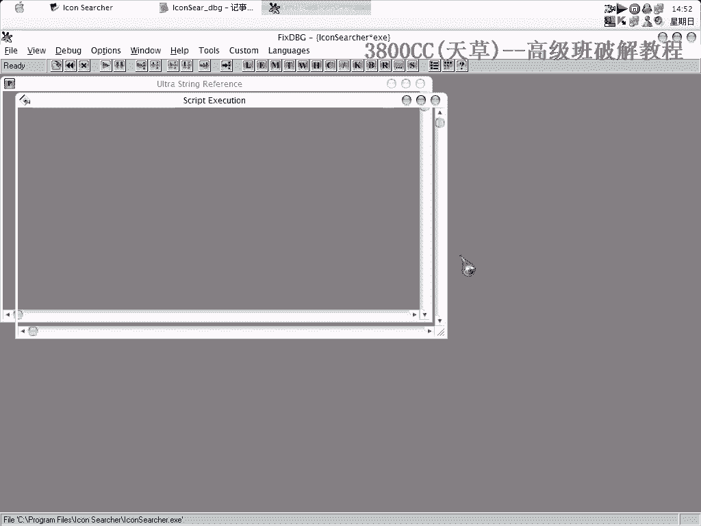
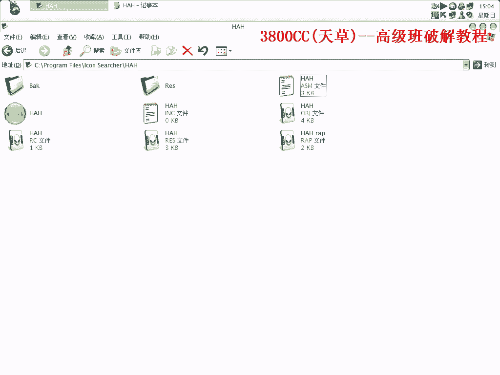
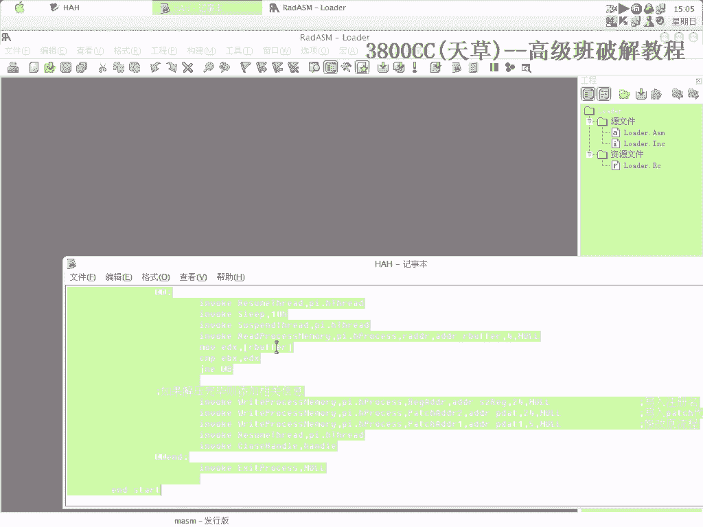
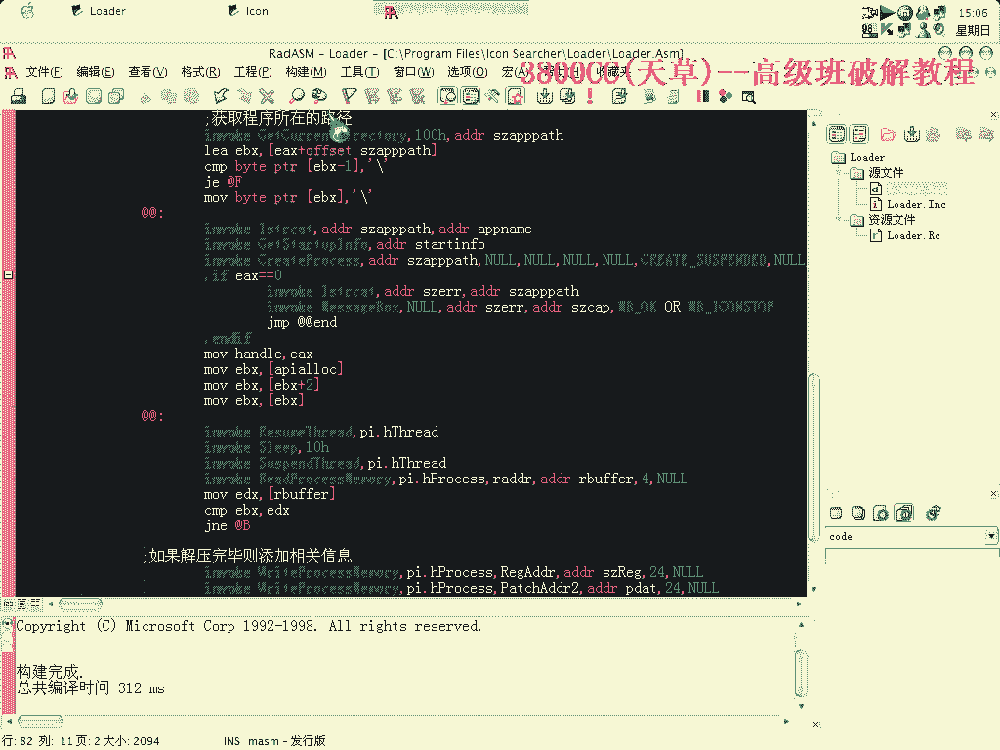
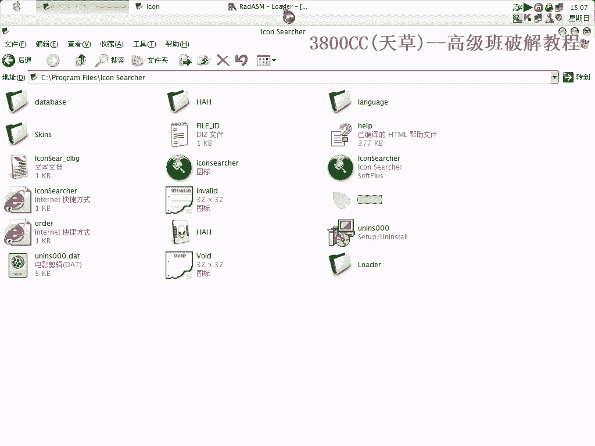
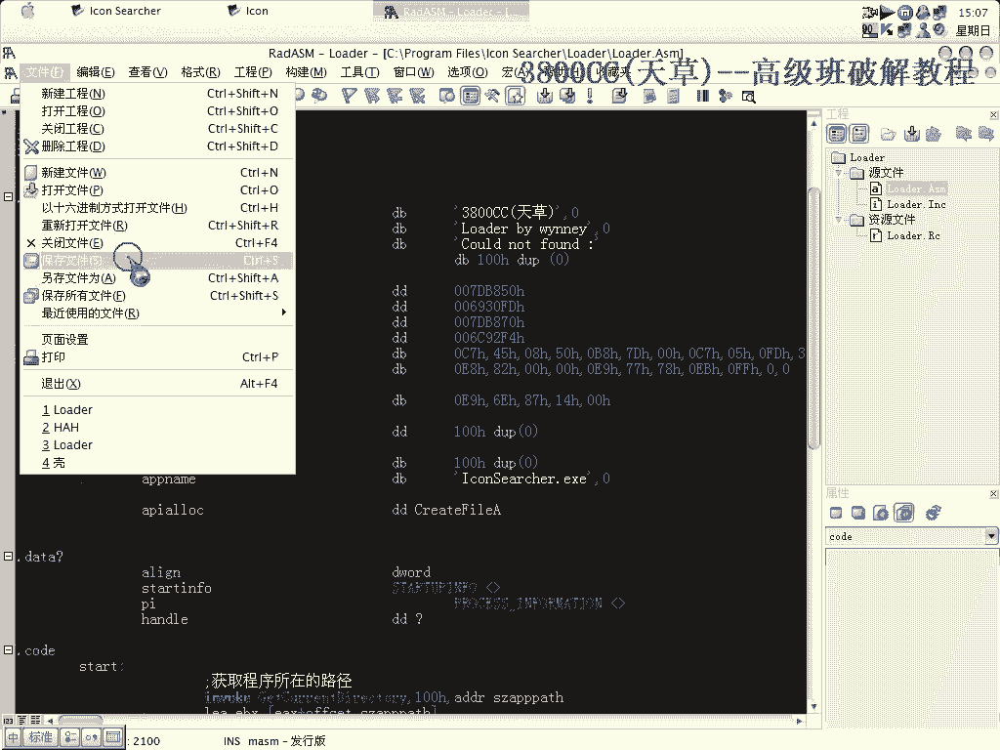

# 天草高级班 - P14：为ASProtect 2.X制作内存补丁 🛠️


在本节课中，我们将学习如何为使用ASProtect 2.X壳保护的程序制作一个内存补丁。这种方法的核心思路是：通过调试器定位关键校验代码，在程序运行时动态修改内存中的特定数据（如硬件指纹和注册码），从而实现“破解”或“白嫖”的目的。我们将一步步分析并构建一个可用的补丁程序。



---

## 概述与思路

首先，我们需要理解核心思路。目标程序在运行时，会从特定内存地址读取硬件指纹信息并与注册信息进行比对。我们的补丁目标是在程序运行时，将内存中的硬件指纹替换为我们指定的注册名，并将一段关键的校验代码替换为我们的“派系代码”（即绕过校验的指令），从而让程序认为注册是合法的。

以下是实现此目标的主要步骤：
1.  定位程序中存放硬件指纹的内存地址。
2.  定位程序中进行关键校验（派系）的代码位置。
3.  在程序内存中找到可用的空白区域，用于存放我们的补丁代码（注册名和派系代码）。
4.  修改原程序指令，使其跳转到我们的补丁代码执行，执行完毕后再跳转回原程序。
5.  处理壳的CRC校验，确保补丁能被正确加载。
6.  将上述所有信息整合，编写并编译一个Loader（加载器/补丁程序）。

---

## 第一步：定位硬件指纹地址

上一节我们介绍了整体思路，本节中我们来看看如何定位关键的硬件指纹地址。

1.  使用调试器（如OD）附加目标程序。
2.  在调试器中设置异常选项：忽略除“内存访问”之外的所有异常。
3.  按 `Shift+F9` 运行程序，直到硬件指纹信息第二次出现在调试器中。记录下此时 `EBP` 寄存器指向的地址，例如 `F0137884`。这个地址存放的就是程序的硬件指纹。
4.  分析代码发现，程序会从 `[EBP+8]` 的位置读取数据作为用户名进行校验。因此，我们的目标就是将 `[EBP+8]` 地址处的内容替换为我们想要的注册名。

**核心概念**：关键内存地址的定位。
`目标地址 = EBP + 8`

---

## 第二步：定位派系代码位置

找到了硬件指纹，接下来我们需要定位程序中进行核心校验的代码段，我们称之为“派系代码”的位置。

1.  继续按 `Shift+F9` 运行程序，这是硬件指纹第三次出现。
2.  观察堆栈指针 `ESP` 的值，例如 `0012FF20`。
3.  在内存窗口中查找地址 `0012FF1C`（即 `ESP-4`）附近的内容。找到其下方的一个 `CALL` 指令，这个 `CALL` 指令所在的区域就是需要进行“派系”校验的关键代码位置。

---

## 第三步：寻找可用的代码存放空间

我们已经知道了要修改哪里，以及要放入什么代码。现在需要找到程序内存中未被使用的“空白”区域来存放我们的补丁代码。

1.  在调试器中，让调试器捕获所有异常。
2.  转到程序的最后一个区段（Section）。
3.  选中该区段的所有代码，右键选择用 `FF` 填充。
4.  按 `Shift+F9` 继续运行程序。你会发现，部分被填充的 `FF` 被程序运行时清零了。
5.  那些被清零的地址是程序运行时会用到的。而**未被清零的、仍为 `FF` 的地址空间，就是我们可以安全写入补丁代码的地方**。
6.  选择两个连续的空白地址，一个用于存放我们的注册名，另一个用于存放派系代码。

---

## 第四步：编写并植入补丁代码

现在，我们将把理论付诸实践，在找到的空白地址处写入我们的补丁指令。

1.  在第一个选定的空白地址处，写入我们的注册名。
2.  在第二个选定的空白地址处，开始写入派系代码。这通常是一段汇编指令，例如：
    ```
    MOV DWORD PTR [EBP+8], 我们的注册名地址
    ```
    这条指令的作用是将我们指定的注册名地址移动到 `[EBP+8]` 位置，覆盖原来的硬件指纹。
3.  修改原“派系代码”位置的指令。通常，我们将原指令的第一个字节改为 `JMP` 指令（操作码 `E9`），跳转到我们刚才写入派系代码的地址。
4.  在我们的派系代码末尾，需要补上被我们覆盖的原指令，然后再用一条 `JMP` 指令跳回原程序流的下一条指令，保证程序能继续正常运行。

**核心概念**：代码跳转与还原。
```
原程序: [原校验代码]
修改为: JMP 到我们的补丁地址

我们的补丁:
    MOV DWORD PTR [EBP+8], 注册名地址  ; 替换指纹
    ... (其他必要操作) ...
    [被覆盖的原指令]                   ; 还原被修改的原指令
    JMP 回原程序下一条指令地址          ; 跳转回去
```

---

## 第五步：处理CRC校验

ASProtect等加壳程序通常带有CRC（循环冗余校验）或内存校验机制，会检测代码段是否被修改。如果直接加载修改后的程序，可能会报错。


1.  我们需要找到一个合适的API函数调用时机，在壳完成自解密、但CRC校验尚未开始的时刻注入我们的补丁。
2.  通过调试，在程序解密自身代码的过程中，在 `00401000` 等代码区段设置内存访问断点。
3.  找到像 `CreateFile` 这样的API函数被调用的时刻，这个时刻往往标志着主要解密完成。记录下这个API函数的地址。
4.  在我们的Loader中，将补丁注入的时机设定在这个API被调用之后。这样，补丁就能在CRC校验开始前成功植入。


---




## 第六步：构建Loader程序



所有关键信息都已找到，现在需要将它们整合到一个独立的Loader程序中。这个Loader将负责启动目标程序并注入我们的内存补丁。


以下是Loader代码中需要配置的关键部分：


1.  **用户名字符串**：即我们想要显示的注册名。
2.  **用户名写入地址**：即第一步找到的 `[EBP+8]` 对应的实际地址。
3.  **派系代码跳转地址**：即原程序中被我们修改为 `JMP` 指令的地址。
4.  **派系代码内容**：即我们在第四步中编写的那一串汇编指令对应的机器码。
5.  **注入时机API地址**：即第五步找到的 `CreateFile` 等API的地址，用于确定补丁注入时机。
6.  **长度信息**：需要准确指定注册名字符串的长度和派系代码机器码的长度，以便Loader进行精确的内存写入。


**核心概念**：Loader的配置数据结构（示例）。
```c
// 伪代码结构
struct PatchConfig {
    char username[24];        // 注册名
    DWORD username_addr;      // 用户名写入地址
    DWORD jump_patch_addr;    // 需要打JMP补丁的地址
    BYTE patch_code[50];      // 派系代码机器码
    DWORD api_hook_addr;      // 注入时机API地址
    int username_len;         // 注册名长度
    int patch_code_len;       // 派系代码长度
};
```



使用汇编编译器（如RadASM）创建一个新工程，将编写好的Loader源码粘贴进去，添加图标资源，然后进行编译和连接，最终生成一个可执行的 `.exe` 文件。运行这个Loader，它便会自动启动目标程序并完成内存补丁的注入。

---



## 总结



本节课中，我们一起学习了为ASProtect 2.X加壳程序制作内存补丁的完整流程。

我们首先通过调试定位了**硬件指纹**和**关键校验代码**的内存地址。接着，找到了内存中可用的**空白区域**来存放自定义代码。然后，我们设计了补丁逻辑：**重定向程序执行流**到我们的代码，**替换校验数据**，并**还原现场**以保证程序稳定运行。我们还探讨了如何绕过壳的**CRC校验**，选择合适的注入时机。最后，我们将所有偏移地址、机器码和配置信息整合，构建了一个能够自动完成上述所有步骤的**Loader程序**。


这个过程融合了逆向分析、调试技巧和简单的编程，是理解软件保护与破解原理的经典实践。请务必在合法授权的范围内进行技术学习和研究。