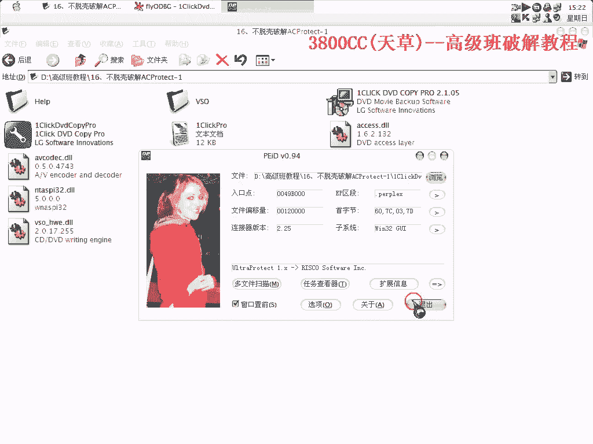
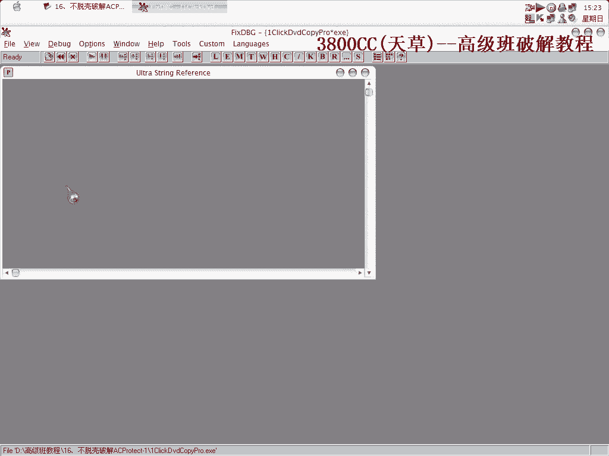
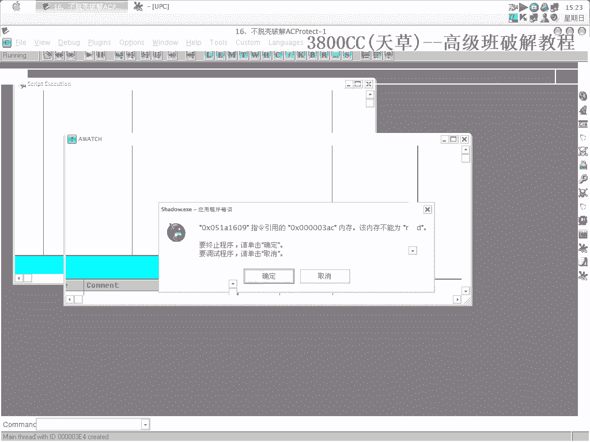
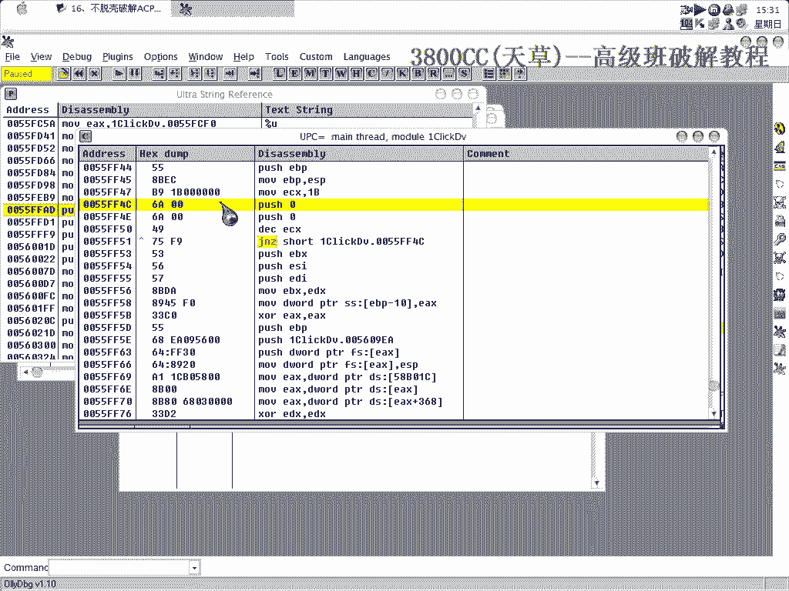
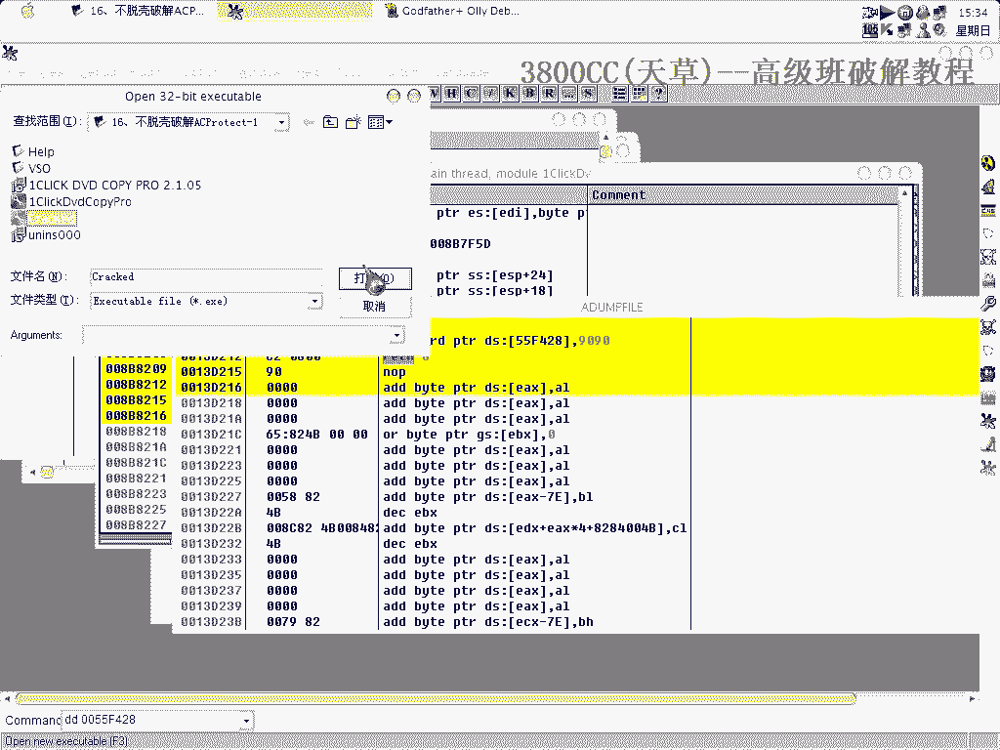
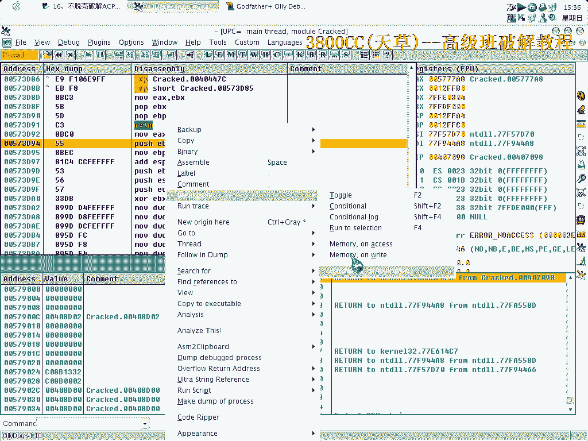
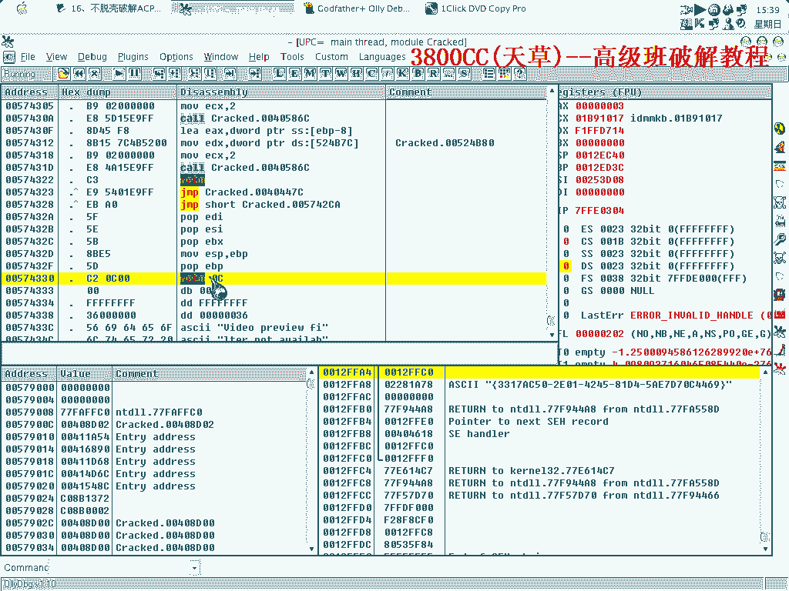
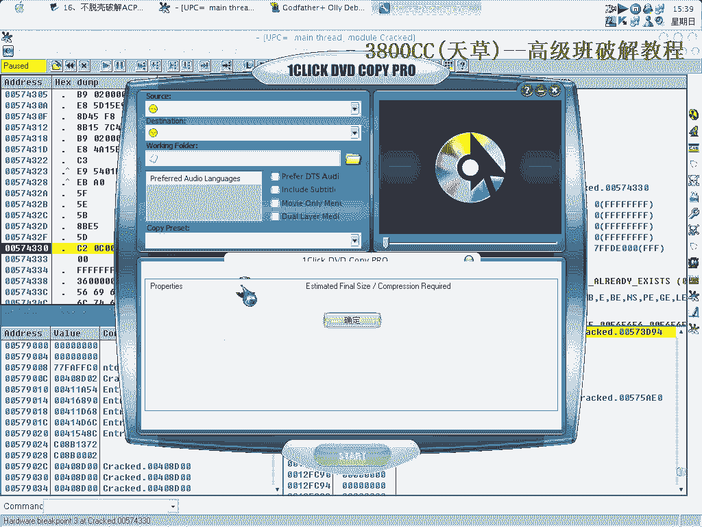
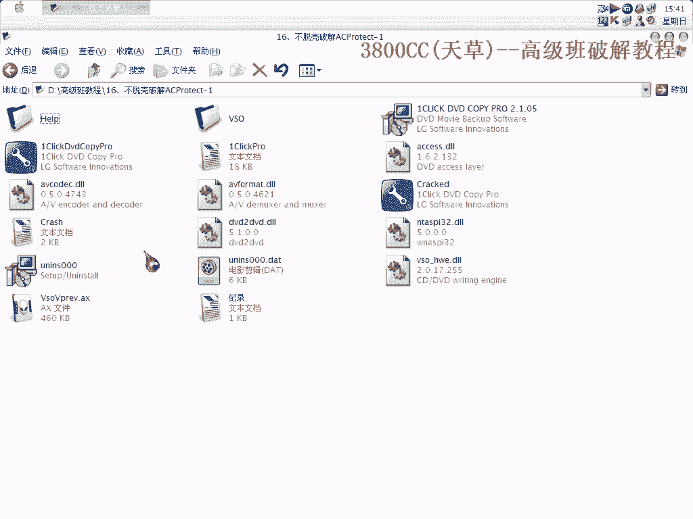

# 天草高级班 - P16：不脱壳破解ACProtect 🛡️➡️🔓



在本节课中，我们将学习如何在不脱壳的情况下，破解一个受ACProtect保护的软件。我们将通过动态调试技术，定位并绕过其保护机制，最终实现破解。


## 初始分析与环境准备




首先运行目标程序。由于未安装，程序启动后会弹出一个提示框。我们需要去除这个法人信息框。



接下来，我们使用OllyDbg（OD）加载程序进行初步分析。清除所有现有断点后，使用“运行到用户代码”功能。很明显，这里并非原始入口点（OEP），OEP已被保护壳偷取。

使用进程查看器确认目标进程，并用查壳工具FI确认其ACProtect版本为1.32，这是一个相对较高的版本。

在调试过程中，程序可能无法正常运行或导致调试器被检测。此时需要更换OD版本或调试系统环境以绕过反调试。

## 设置断点与初步追踪

在OD中忽略所有异常，并在代码段（.text）设置内存写入断点，在数据段设置内存访问断点。随后删除这些断点，采用“暂停法”进行追踪。


当程序中断后，我们寻找函数头部。记住一个常识：在代码段下断应使用“硬件执行断点”。程序中断在获取用户名的代码处，我们在此处做标记并下断。



调试软件的技术手段同样适用于分析外挂等程序。我们可以利用堆栈回溯查看调用链。


## 关键跳转分析与修改

在关键判断点，程序有一个条件跳转。我们尝试将其NOP掉（即改为空操作），然后继续运行。程序提示“连接服务器”后直接退出，说明此处并非真正的验证关键点。


重新开始调试，单步跟踪程序为何退出。在跟踪过程中，程序运行变得缓慢，这可能是触发了某些延时或反调试陷阱。




以下是需要关注的核心代码逻辑，通常验证会包含一个条件判断：


```
CMP EAX, EBX    ; 比较两个值
JNZ LABEL_EXIT  ; 如果不相等，则跳转到退出流程
```


我们需要找到正确的比较和跳转指令，并进行修改。




## 定位与绕过保护

通过反复跟踪和尝试，在程序多次循环或解码后的某个稳定位置，我们找到了真正的验证代码段。此处的跳转决定了程序是否进入付费功能或弹出注册框。

修改此关键跳转（例如，将`JNZ`改为`JZ`，或直接NOP掉），使程序流程走向已验证的分支。



最终，程序成功运行，不再弹出注册提示框，实现了不脱壳状态下的破解。



## 总结



本节课我们一起学习了针对ACProtect加壳软件的“不脱壳破解”方法。核心步骤包括：准备调试环境、动态追踪程序流程、定位关键验证代码、以及修改关键跳转指令。这种方法的核心思想是**在内存中直接修改运行时的程序逻辑**，绕过保护壳的验证，而无需完全脱去外壳。掌握此技术需要对程序运行流程有清晰的跟踪和分析能力。