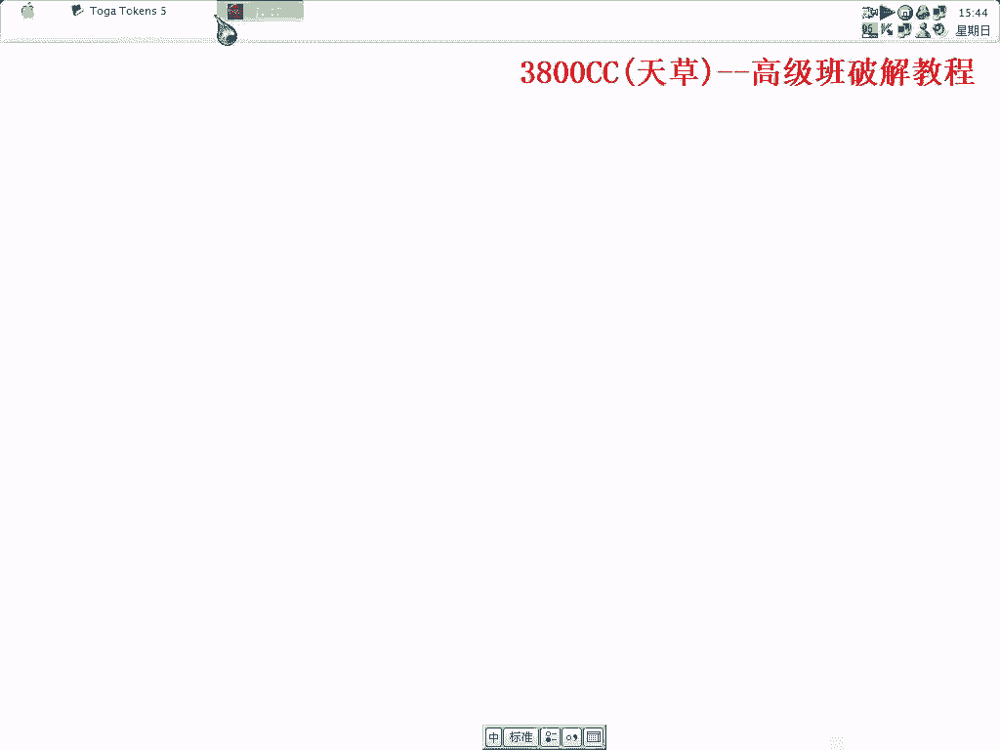
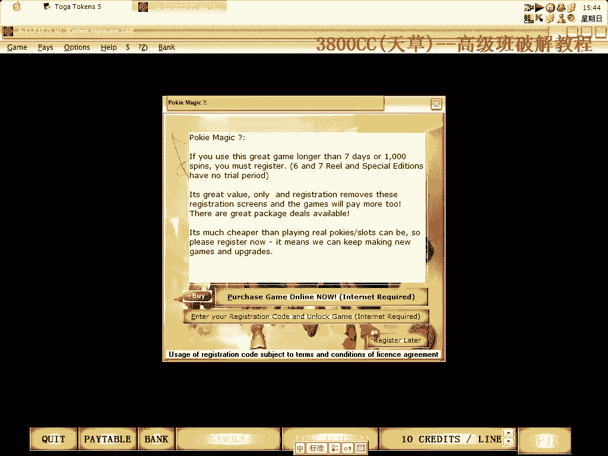

# 天草高级班 - P17：使用脚本脱壳ASProtect 2.X 🛡️➡️📜

在本节课中，我们将学习如何使用脚本对使用ASProtect 2.X加壳的程序进行脱壳。我们将介绍两个不同的脚本，并演示其操作流程。

## 概述

ASProtect是一种常见的软件保护壳。手动脱壳过程繁琐，而使用脚本可以自动化关键步骤，提高效率。本节课将演示两个脚本的使用，一个由国内开发者编写，另一个是与国外开发者合作修改的。

## 脚本准备与程序载入

首先，我们有两个脚本。一个脚本是与国外开发者合作修改的，但存在一些问题。另一个脚本由国内开发者编写，非常完美，于今年3月份修改完成。

演示使用的程序是一个未安装的游戏，运行可能会报错，但这不影响我们的演示目的。

程序载入后，可能会检测到调试器。我们忽略相关提示，通过两次`F9`让程序运行起来。

## 定位关键信息

程序运行后，我们需要定位几个关键地址，这是运行脱壳脚本的前提。

以下是需要查找的关键信息：
1.  **OEP（原始入口点）**：在本例中，OEP的地址是`0x0041****`。
2.  **IAT（导入地址表）起始地址**：通过右键搜索命令序列，我们找到IAT起始于`0x0050F0C0`。
3.  **特定指令序列**：我们需要找到`FF25`（远跳转）指令的位置，这通常与获取API地址有关。

## 使用第一个脚本（国内版）

在记录下OEP、IAT起始地址和`FF25`指令地址后，我们开始运行第一个脚本。

该脚本的使用步骤如下：
1.  运行脚本，在弹出的对话框中输入之前记录的 **IAT起始地址**。
2.  点击确定后，脚本会要求输入 **`FF25`指令的地址**。
3.  最后，脚本会自动处理并完成脱壳。

运行后，程序可能会退出，这可能与程序本身的兼容性有关。我们转而尝试第二个脚本。

## 使用第二个脚本（修改版）

第二个脚本适应性更强。对于没有`Stolen Code`的程序，这个脚本可以完美运行。

操作流程如下：
1.  载入脚本并运行。
2.  脚本会自动搜索并修复IAT。
3.  修复过程会显示在日志中，可以看到它逐个修复导入函数。
4.  修复完成后，手动将OEP设置为之前记录的地址（例如`0x0041****`）。
5.  最后，将脱壳后的程序转储并保存。

这个脚本的修复过程虽然稍慢，但非常彻底。

## 脚本对比与总结

本节课中我们一起学习了两个脱壳脚本的应用。

两个脚本的主要区别在于修复时机：
*   **第一个脚本**：倾向于在到达OEP**之后**进行修复。
*   **第二个脚本**：在到达OEP**之前**就开始修复，通常更完善。

第二个脚本经过了更多测试和修正，因此更推荐使用。对于ASProtect 2.X的壳，当程序没有`Stolen Code`时，使用第二个脚本可以高效、完整地完成脱壳工作。

通过脚本自动化，我们避免了繁琐的手工查找和修复IAT的过程，大大提升了脱壳效率。