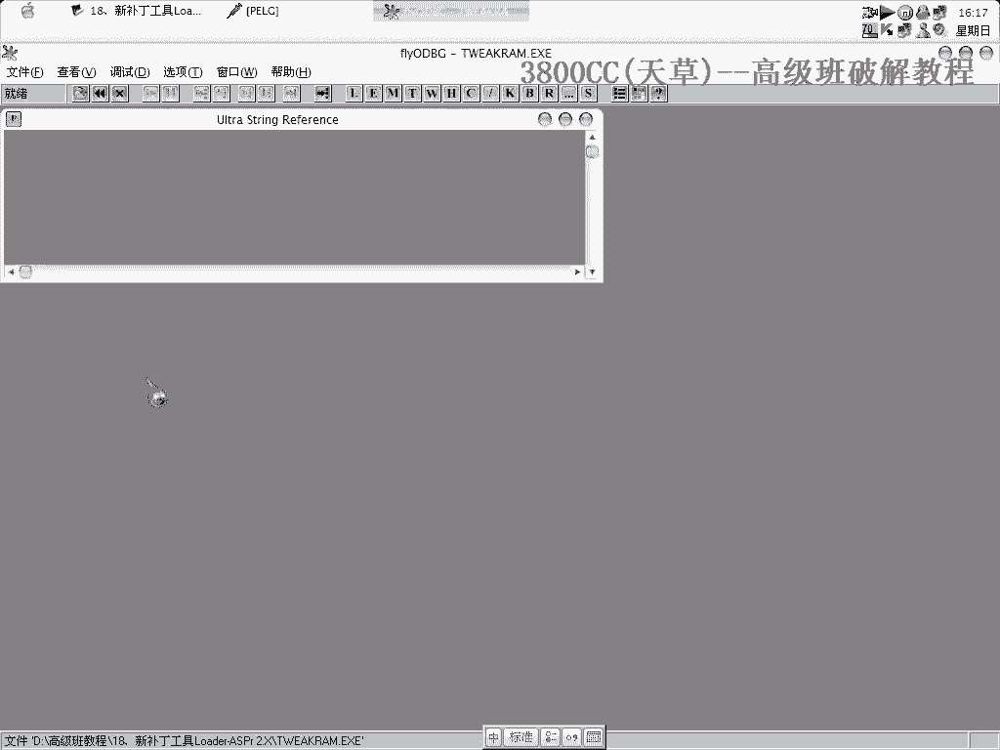
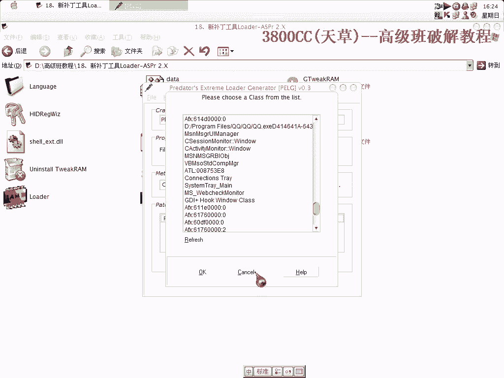

# 天草高级班 - P18：新补丁工具Loader-ASPr 2.X 🛠️

在本节课中，我们将学习如何使用一款名为Loader-ASPr 2.X的新补丁工具。这款工具主要用于对抗“Split Attack 2.0”等保护机制，其核心功能是通过创建补丁来修改目标程序的执行流程，从而绕过某些限制或窗口。

## 工具加载与初步分析 🚀

首先，我们启动Loader-ASPr 2.X工具。工具界面会显示一个由“雷神”整理的操作窗口。

我们载入目标程序，或者直接运行程序。

程序运行后，我们按下`F2`键暂停其执行。这是一个非常常规的调试操作。接下来，我们需要找到程序中的关键断点（此处视频中称为“断手”），通常我们会使用硬件执行断点。

如果中断失败，可能是因为录屏软件（如屏幕录像专家）的干扰。关闭录屏软件后，我们成功在目标`CALL`指令处下断点。删除之前的硬件断点，重新运行程序，断点成功命中。

## 分析跳转与修改方案 🔍

断下后，我们观察程序的跳转指令。为了让程序按我们的意图执行，我们需要修改此处的代码。如果直接将其改为`JMP`指令，会改动4个字节，并且在写补丁时，会连带影响相邻的2个字节，总共需要处理6个字节。

因此，我们采用另一种更高效的方法，只需修改2个字节即可达到目的。修改完成后，我们记录下这个地址。

## 配置Loader-ASPr补丁 ⚙️

现在，我们打开Loader-ASPr工具来创建补丁。运行工具，使其界面出现。

以下是配置补丁的关键步骤：
1.  在工具中选择目标窗口。通过`WordTitle`（窗口标题）来定位。
2.  在众多窗口标题中，找到我们的目标程序窗口和OD调试器的窗口标题。
3.  工具中有一个选项是`Lag`（提示框），其描述为“Let the loader... kill it”，意思是让加载器关闭该窗口。
4.  我们将之前记录下的修改地址（例如`9019`）填入对应位置。

配置完成后，关闭配置窗口。工具提示开始安装补丁。我们选择原始程序文件，补丁安装成功。

## 测试补丁与问题排查 🐛

安装后，会生成一个新的已打补丁的程序文件。双击运行这个新文件。然而，测试发现程序在关闭目标窗口后，自身也立即退出了，这不是我们想要的结果。

这说明我们的修改或配置可能存在问题。我们需要重新分析。

我们重新尝试中断程序。有时需要多按几次`F2`才能成功中断。中断后，我们发现除了之前修改的跳转，还有另一个地方也需要修改，因为正是这里导致了程序的直接退出。

我们让目标窗口再次出现，并尝试在另一个地址（例如`20F2`）下断点进行分析。发现程序依然直接退出，未能有效处理窗口。

检查后发现，是在Loader-ASPr工具中配置时，可能选错了窗口标题。我们重新安装并配置补丁。

## 工具的高级功能 💡

重新生成补丁后，问题得到解决。Loader-ASPr 2.X是一个非常强大的工具。

它除了我们刚才使用的功能外，还有其他模式：
*   `Standard`：标准模式，用于创建常规的补丁。
*   `Class Name`：可以分析当前计算机上运行的所有程序的窗口组件信息。

这些功能为分析和修改程序提供了更多便利。

## 总结 📝

本节课我们一起学习了Loader-ASPr 2.X补丁工具的基本使用方法。我们经历了从加载程序、分析关键跳转、配置补丁到测试和排查问题的完整流程。关键在于定位正确的修改点，并在工具中准确配置目标窗口和补丁地址。这款工具功能丰富，是进行软件分析和修改的有效助手。